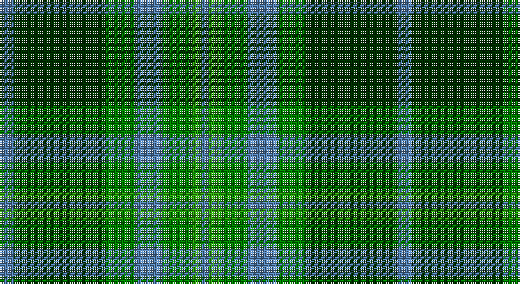

This page is one **sett** — a single exact thread-count. It belongs to the [tartan](/setts/t4dg26g8t8g8gi3t2/)
(the same proportion at any scale), whose colour order is pattern [BGGBGGB](/stripes/bggbggb/).

Part of the [Valley of the](/tartans/valley-of-the/) tartan — the named design grouping this sett with its other cloths.

Sourced from weddslist.  It is a [7 stripe tartan](/stripes/stripes7/).

Original link http://www.weddslist.com/cgi-bin/tartans/pg.pl?source=sts

## Also known as

This cloth is also recorded under:

- Valley of the Green
- Valley of the Green #2
- Valley, of the Green.

## Thread count
B/8 DG52 Ga16 B16 Ga16 G6 B/4

One full sett is **224 threads**.

## Palette

Palette: <strong>custom</strong>
<table><thead><tr><th>Colour</th><th>Threads</th><th>Shade</th><th>Base</th><th>OKLCh</th></tr></thead><tbody><tr><td>B/</td><td style="text-align:right;font-variant-numeric:tabular-nums">8</td><td><code style="background-color:#5480B0;">#5480B0</code> <small style="color:#888">#5480B0</small></td><td>B <code style="background-color:#2A418A;">#2A418A</code></td><td><small style="color:#888">oklch(58.8% 0.089 251.5)</small></td></tr><tr><td>DG</td><td style="text-align:right;font-variant-numeric:tabular-nums">52</td><td><code style="background-color:#003000;">#003000</code> <small style="color:#888">#003000</small></td><td>G <code style="background-color:#006100;">#006100</code></td><td><small style="color:#888">oklch(26.8% 0.091 142.5)</small></td></tr><tr><td>Ga</td><td style="text-align:right;font-variant-numeric:tabular-nums">16</td><td><code style="background-color:#008000;">#008000</code> <small style="color:#888">#008000</small></td><td>G <code style="background-color:#006100;">#006100</code></td><td><small style="color:#888">oklch(52.0% 0.177 142.5)</small></td></tr><tr><td>B</td><td style="text-align:right;font-variant-numeric:tabular-nums">16</td><td><code style="background-color:#5480B0;">#5480B0</code> <small style="color:#888">#5480B0</small></td><td>B <code style="background-color:#2A418A;">#2A418A</code></td><td><small style="color:#888">oklch(58.8% 0.089 251.5)</small></td></tr><tr><td>Ga</td><td style="text-align:right;font-variant-numeric:tabular-nums">16</td><td><code style="background-color:#008000;">#008000</code> <small style="color:#888">#008000</small></td><td>G <code style="background-color:#006100;">#006100</code></td><td><small style="color:#888">oklch(52.0% 0.177 142.5)</small></td></tr><tr><td>G</td><td style="text-align:right;font-variant-numeric:tabular-nums">6</td><td><code style="background-color:#30A010;">#30A010</code> <small style="color:#888">#30A010</small></td><td>G <code style="background-color:#006100;">#006100</code></td><td><small style="color:#888">oklch(61.9% 0.195 140.5)</small></td></tr><tr><td>B/</td><td style="text-align:right;font-variant-numeric:tabular-nums">4</td><td><code style="background-color:#5480B0;">#5480B0</code> <small style="color:#888">#5480B0</small></td><td>B <code style="background-color:#2A418A;">#2A418A</code></td><td><small style="color:#888">oklch(58.8% 0.089 251.5)</small></td></tr></tbody></table>

# Sample pattern

## Nearest tartans

The nearest existing variants by ΔTartan distance, with this tartan at the top so the swatches line up against it.

ΔTartan

Tartan

Sett

—

<a href="/ttd/edit/#slug=t4dg26g8t8g8gi3t2~x2">Valley, of the Green. (The )</a> <a class="nn-out" href="/variants/s7/t4dg26g8t8g8gi3t2~x2/" title="open its dictionary page">↗</a>

0.84

<a href="/ttd/edit/#slug=g14db1g1db1g3db6gi12r2~x2&amp;base=t4dg26g8t8g8gi3t2~x2">Cranstoun Clan Tartan</a> <a class="nn-out" href="/variants/s8/g14db1g1db1g3db6gi12r2~x2/" title="open its dictionary page">↗</a>

1.00

<a href="/ttd/edit/#slug=t4dg26gi8t8gi8g3t2~x2&amp;base=t4dg26g8t8g8gi3t2~x2">Valley of the Green (The ) Canadian Tartan</a> <a class="nn-out" href="/variants/s7/t4dg26gi8t8gi8g3t2~x2/" title="open its dictionary page">↗</a>

1.09

<a href="/ttd/edit/#slug=b5k1g3k1b3k1g10r3~x2&amp;base=t4dg26g8t8g8gi3t2~x2">Ayrton 1979 No. 2 (Personal)</a> <a class="nn-out" href="/variants/s8/b5k1g3k1b3k1g10r3~x2/" title="open its dictionary page">↗</a>

1.18

<a href="/ttd/edit/#slug=g6ly3g26dg10dt30lb3~x2&amp;base=t4dg26g8t8g8gi3t2~x2">Wcwm 1716</a> <a class="nn-out" href="/variants/s6/g6ly3g26dg10dt30lb3~x2/" title="open its dictionary page">↗</a>

1.20

<a href="/ttd/edit/#slug=g5k2g28k10o26db4g4~x2&amp;base=t4dg26g8t8g8gi3t2~x2">John Telfar, Dunbar hunting</a> <a class="nn-out" href="/variants/s7/g5k2g28k10o26db4g4~x2/" title="open its dictionary page">↗</a>

1.26

<a href="/ttd/edit/#slug=g10db42r5dg42g42ly5g10&amp;base=t4dg26g8t8g8gi3t2~x2">New Mexico</a> <a class="nn-out" href="/variants/s7/g10db42r5dg42g42ly5g10/" title="open its dictionary page">↗</a>

1.27

<a href="/ttd/edit/#slug=g3r3g31dg18g4k22ly3&amp;base=t4dg26g8t8g8gi3t2~x2">MacSween Hunting (Lochs, Isle of Lew</a> <a class="nn-out" href="/variants/s7/g3r3g31dg18g4k22ly3/" title="open its dictionary page">↗</a>

1.30

<a href="/ttd/edit/#slug=oi28g2oi4db18g23db2g3o4~x2&amp;base=t4dg26g8t8g8gi3t2~x2">Dalbraith-Eastern Western Motor Group</a> <a class="nn-out" href="/variants/s8/oi28g2oi4db18g23db2g3o4~x2/" title="open its dictionary page">↗</a>

1.30

<a href="/ttd/edit/#slug=t39g3t3g20k3g20k3g3k20r3~x2&amp;base=t4dg26g8t8g8gi3t2~x2">Dunedin Chapter (Corporate)</a> <a class="nn-out" href="/variants/s10/t39g3t3g20k3g20k3g3k20r3~x2/" title="open its dictionary page">↗</a>

1.31

<a href="/ttd/edit/#slug=dg14k1dg2k1dg2k10g14lp2&amp;base=t4dg26g8t8g8gi3t2~x2">Manor (Corporate)</a> <a class="nn-out" href="/variants/s8/dg14k1dg2k1dg2k10g14lp2/" title="open its dictionary page">↗</a>

## Neighbour map

Every grey dot is one of 14360 variants placed by the first two principal components of the ΔTartan feature space (44% of its variance). Red is this tartan; blue dots are its nearest — click one to open its page.

<svg viewBox="0 0 640 380" role="img" style="max-width:100%;height:auto;border:1px solid #e0e0e0;border-radius:4px;display:block" xmlns="http://www.w3.org/2000/svg"><image href="/nn/cloud.v1.png" width="640" height="380"/><a href="/variants/s8/g14db1g1db1g3db6gi12r2~x2/"><circle cx="265.8" cy="195.1" r="4" fill="#3465a4"><title>Cranstoun Clan Tartan</title></circle></a><a href="/variants/s7/t4dg26gi8t8gi8g3t2~x2/"><circle cx="278.7" cy="224.7" r="4" fill="#3465a4"><title>Valley of the Green (The ) Canadian Tartan</title></circle></a><a href="/variants/s8/b5k1g3k1b3k1g10r3~x2/"><circle cx="258.4" cy="215.7" r="4" fill="#3465a4"><title>Ayrton 1979 No. 2 (Personal)</title></circle></a><a href="/variants/s6/g6ly3g26dg10dt30lb3~x2/"><circle cx="216.2" cy="212.7" r="4" fill="#3465a4"><title>Wcwm 1716</title></circle></a><a href="/variants/s7/g5k2g28k10o26db4g4~x2/"><circle cx="253.1" cy="191.6" r="4" fill="#3465a4"><title>John Telfar, Dunbar hunting</title></circle></a><a href="/variants/s7/g10db42r5dg42g42ly5g10/"><circle cx="187.8" cy="219.0" r="4" fill="#3465a4"><title>New Mexico</title></circle></a><a href="/variants/s7/g3r3g31dg18g4k22ly3/"><circle cx="240.0" cy="208.5" r="4" fill="#3465a4"><title>MacSween Hunting (Lochs, Isle of Lew</title></circle></a><a href="/variants/s8/oi28g2oi4db18g23db2g3o4~x2/"><circle cx="231.4" cy="188.8" r="4" fill="#3465a4"><title>Dalbraith-Eastern Western Motor Group</title></circle></a><a href="/variants/s10/t39g3t3g20k3g20k3g3k20r3~x2/"><circle cx="231.2" cy="177.5" r="4" fill="#3465a4"><title>Dunedin Chapter (Corporate)</title></circle></a><a href="/variants/s8/dg14k1dg2k1dg2k10g14lp2/"><circle cx="257.7" cy="209.9" r="4" fill="#3465a4"><title>Manor (Corporate)</title></circle></a><circle cx="252.7" cy="211.3" r="5" fill="#c00000"/></svg>

ID: /variants/s7/t4dg26g8t8g8gi3t2~x2/
