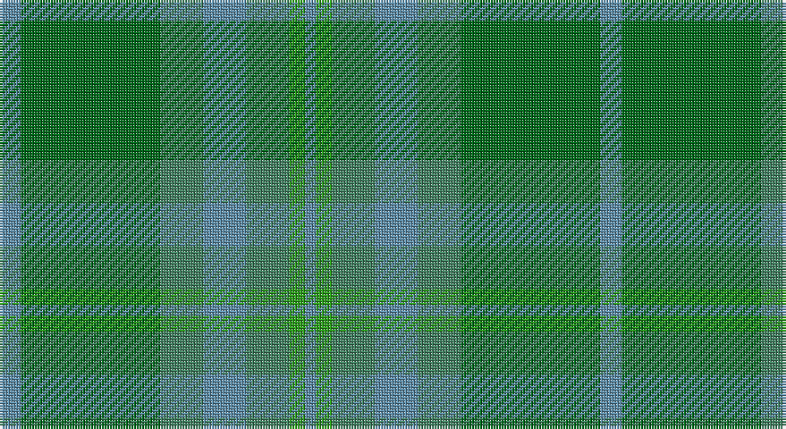

This page is one **sett** — a single exact thread-count. It belongs to the [tartan](/setts/t4gii26gi8t8gi8g3t2/)
(the same proportion at any scale), whose colour order is pattern [BGGBGGB](/stripes/bggbggb/).

Sourced from register-of-tartans.  It is a [7 stripe tartan](/stripes/stripes7/).

Original link https://www.tartanregister.gov.uk/tartanDetails.aspx?ref=4438

## Register references

External register numbers recorded for this tartan.

- Scottish Register of Tartans: [4438](https://www.tartanregister.gov.uk/tartanDetails.aspx?ref=4438)
- Scottish Tartans Authority (ITI): 148
- Scottish Tartans World Register: 148

## Thread count
B/8 G52 Gb16 B16 Gb16 Ga6 B/4

One full sett is **224 threads**.

## Palette

Palette: <strong>Tartan Register</strong>
<table><thead><tr><th>Colour</th><th>Threads</th><th>Shade</th><th>Base</th><th>OKLCh</th></tr></thead><tbody><tr><td>B/</td><td style="text-align:right;font-variant-numeric:tabular-nums">8</td><td><code style="background-color:#5C8CA8;">#5C8CA8</code> <small style="color:#888">#5C8CA8</small></td><td>B <code style="background-color:#2A418A;">#2A418A</code></td><td><small style="color:#888">oklch(61.7% 0.067 235.0)</small></td></tr><tr><td>G</td><td style="text-align:right;font-variant-numeric:tabular-nums">52</td><td><code style="background-color:#006818;">#006818</code> <small style="color:#888">#006818</small></td><td>G <code style="background-color:#006100;">#006100</code></td><td><small style="color:#888">oklch(45.0% 0.142 145.0)</small></td></tr><tr><td>Gb</td><td style="text-align:right;font-variant-numeric:tabular-nums">16</td><td><code style="background-color:#408060;">#408060</code> <small style="color:#888">#408060</small></td><td>G <code style="background-color:#006100;">#006100</code></td><td><small style="color:#888">oklch(54.8% 0.084 160.1)</small></td></tr><tr><td>B</td><td style="text-align:right;font-variant-numeric:tabular-nums">16</td><td><code style="background-color:#5C8CA8;">#5C8CA8</code> <small style="color:#888">#5C8CA8</small></td><td>B <code style="background-color:#2A418A;">#2A418A</code></td><td><small style="color:#888">oklch(61.7% 0.067 235.0)</small></td></tr><tr><td>Gb</td><td style="text-align:right;font-variant-numeric:tabular-nums">16</td><td><code style="background-color:#408060;">#408060</code> <small style="color:#888">#408060</small></td><td>G <code style="background-color:#006100;">#006100</code></td><td><small style="color:#888">oklch(54.8% 0.084 160.1)</small></td></tr><tr><td>Ga</td><td style="text-align:right;font-variant-numeric:tabular-nums">6</td><td><code style="background-color:#289C18;">#289C18</code> <small style="color:#888">#289C18</small></td><td>G <code style="background-color:#006100;">#006100</code></td><td><small style="color:#888">oklch(60.6% 0.191 141.6)</small></td></tr><tr><td>B/</td><td style="text-align:right;font-variant-numeric:tabular-nums">4</td><td><code style="background-color:#5C8CA8;">#5C8CA8</code> <small style="color:#888">#5C8CA8</small></td><td>B <code style="background-color:#2A418A;">#2A418A</code></td><td><small style="color:#888">oklch(61.7% 0.067 235.0)</small></td></tr></tbody></table>

# Sample pattern

## Nearest tartans

The nearest existing variants by ΔTartan distance, with this tartan at the top so the swatches line up against it.

ΔTartan

Tartan

Sett

—

<a href="/ttd/edit/#slug=t4gii26gi8t8gi8g3t2~x2">Valley of the Green</a> <a class="nn-out" href="/variants/s7/t4gii26gi8t8gi8g3t2~x2/" title="open its dictionary page">↗</a>

1.76

<a href="/ttd/edit/#slug=dg2g2gi7dg10gi1g1~x4&amp;base=t4gii26gi8t8gi8g3t2~x2">Emerald, The</a> <a class="nn-out" href="/variants/s6/dg2g2gi7dg10gi1g1~x4/" title="open its dictionary page">↗</a>

1.77

<a href="/ttd/edit/#slug=t22g3t3g3t3g9o28g3o6~x2&amp;base=t4gii26gi8t8gi8g3t2~x2">Manx Centenary</a> <a class="nn-out" href="/variants/s9/t22g3t3g3t3g9o28g3o6~x2/" title="open its dictionary page">↗</a>

1.83

<a href="/ttd/edit/#slug=y4dg18dgi6dg6dgi24ly3~x2&amp;base=t4gii26gi8t8gi8g3t2~x2">Park (Estate Check)</a> <a class="nn-out" href="/variants/s6/y4dg18dgi6dg6dgi24ly3~x2/" title="open its dictionary page">↗</a>

1.89

<a href="/ttd/edit/#slug=dg5k2dg28k10dy26db4dg4~x2&amp;base=t4gii26gi8t8gi8g3t2~x2">John Telfar Dunbar Hunting</a> <a class="nn-out" href="/variants/s7/dg5k2dg28k10dy26db4dg4~x2/" title="open its dictionary page">↗</a>

1.97

<a href="/ttd/edit/#slug=dg11n4dg6dy11n1k1dy4~x4&amp;base=t4gii26gi8t8gi8g3t2~x2">Calais (Fashion)</a> <a class="nn-out" href="/variants/s7/dg11n4dg6dy11n1k1dy4~x4/" title="open its dictionary page">↗</a>

2.07

<a href="/ttd/edit/#slug=y4dg18dgi6dg6dgi24k3~x2&amp;base=t4gii26gi8t8gi8g3t2~x2">Park Estate</a> <a class="nn-out" href="/variants/s6/y4dg18dgi6dg6dgi24k3~x2/" title="open its dictionary page">↗</a>

2.12

<a href="/ttd/edit/#slug=t12g2t2g2t2o8gi8o1~x2&amp;base=t4gii26gi8t8gi8g3t2~x2">Universal, Ancient</a> <a class="nn-out" href="/variants/s8/t12g2t2g2t2o8gi8o1~x2/" title="open its dictionary page">↗</a>

2.12

<a href="/ttd/edit/#slug=g4o25g6t12g12t3~x2&amp;base=t4gii26gi8t8gi8g3t2~x2">Canadian Fancy</a> <a class="nn-out" href="/variants/s6/g4o25g6t12g12t3~x2/" title="open its dictionary page">↗</a>

2.14

<a href="/ttd/edit/#slug=g6t8o2t2ly2t16g18t4g4t3~x2&amp;base=t4gii26gi8t8gi8g3t2~x2">Blue Ridge</a> <a class="nn-out" href="/variants/s10/g6t8o2t2ly2t16g18t4g4t3~x2/" title="open its dictionary page">↗</a>

2.14

<a href="/ttd/edit/#slug=g6t8o2t2ly2t16g18t4g4t3~x4&amp;base=t4gii26gi8t8gi8g3t2~x2">Blue Ridge (District)</a> <a class="nn-out" href="/variants/s10/g6t8o2t2ly2t16g18t4g4t3~x4/" title="open its dictionary page">↗</a>

## Neighbour map

Every grey dot is one of 14360 variants placed by the first two principal components of the ΔTartan feature space (44% of its variance). Red is this tartan; blue dots are its nearest — click one to open its page.

<svg viewBox="0 0 640 380" role="img" style="max-width:100%;height:auto;border:1px solid #e0e0e0;border-radius:4px;display:block" xmlns="http://www.w3.org/2000/svg"><image href="/nn/cloud.v1.png" width="640" height="380"/><a href="/variants/s6/dg2g2gi7dg10gi1g1~x4/"><circle cx="447.4" cy="317.8" r="4" fill="#3465a4"><title>Emerald, The</title></circle></a><a href="/variants/s9/t22g3t3g3t3g9o28g3o6~x2/"><circle cx="370.9" cy="267.5" r="4" fill="#3465a4"><title>Manx Centenary</title></circle></a><a href="/variants/s6/y4dg18dgi6dg6dgi24ly3~x2/"><circle cx="377.6" cy="303.8" r="4" fill="#3465a4"><title>Park (Estate Check)</title></circle></a><a href="/variants/s7/dg5k2dg28k10dy26db4dg4~x2/"><circle cx="392.5" cy="269.3" r="4" fill="#3465a4"><title>John Telfar Dunbar Hunting</title></circle></a><a href="/variants/s7/dg11n4dg6dy11n1k1dy4~x4/"><circle cx="370.0" cy="292.8" r="4" fill="#3465a4"><title>Calais (Fashion)</title></circle></a><a href="/variants/s6/y4dg18dgi6dg6dgi24k3~x2/"><circle cx="370.3" cy="301.5" r="4" fill="#3465a4"><title>Park Estate</title></circle></a><a href="/variants/s8/t12g2t2g2t2o8gi8o1~x2/"><circle cx="290.1" cy="235.2" r="4" fill="#3465a4"><title>Universal, Ancient</title></circle></a><a href="/variants/s6/g4o25g6t12g12t3~x2/"><circle cx="315.4" cy="295.0" r="4" fill="#3465a4"><title>Canadian Fancy</title></circle></a><a href="/variants/s10/g6t8o2t2ly2t16g18t4g4t3~x2/"><circle cx="417.0" cy="273.4" r="4" fill="#3465a4"><title>Blue Ridge</title></circle></a><a href="/variants/s10/g6t8o2t2ly2t16g18t4g4t3~x4/"><circle cx="417.0" cy="273.4" r="4" fill="#3465a4"><title>Blue Ridge (District)</title></circle></a><circle cx="355.6" cy="266.0" r="5" fill="#c00000"/></svg>

ID: /variants/s7/t4gii26gi8t8gi8g3t2~x2/
