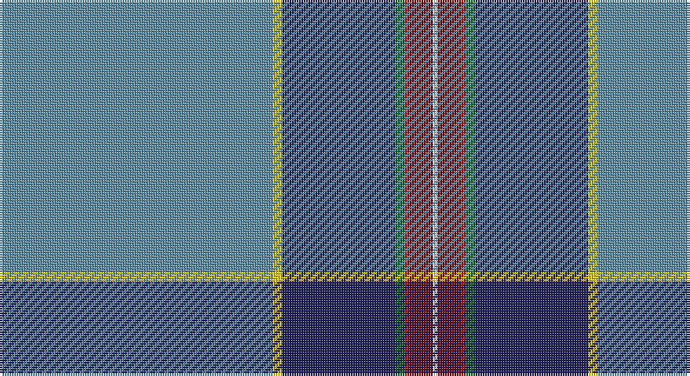

This page is one **sett** — a single exact thread-count. It belongs to the [tartan](/setts/t58ly2db24g2r1ri5w1/)
(the same proportion at any scale), whose colour order is pattern [BYBGRRW](/stripes/bybgrrw/).

Sourced from tartans-authority.  It is a [7 stripe tartan](/stripes/stripes7/).

Original link http://www.tartansauthority.com/tartan-ferret/display/10531/

## Register references

External register numbers recorded for this tartan.

- Scottish Register of Tartans: [10531](https://www.tartanregister.gov.uk/tartanDetails?ref=10531)
- Scottish Tartans Authority (ITI): 10531

## Thread count
B/116 Y4 DB48 G4 R2 DR10 W/2

One full sett is **254 threads**.

## Palette

Palette: <strong>Tartan Register</strong>
<table><thead><tr><th>Colour</th><th>Threads</th><th>Shade</th><th>Base</th><th>OKLCh</th></tr></thead><tbody><tr><td>B/</td><td style="text-align:right;font-variant-numeric:tabular-nums">116</td><td><code style="background-color:#5C8CA8;">#5C8CA8</code> <small style="color:#888">#5C8CA8</small></td><td>B <code style="background-color:#2A418A;">#2A418A</code></td><td><small style="color:#888">oklch(61.7% 0.067 235.0)</small></td></tr><tr><td>Y</td><td style="text-align:right;font-variant-numeric:tabular-nums">4</td><td><code style="background-color:#FCCC00;">#FCCC00</code> <small style="color:#888">#FCCC00</small></td><td>Y <code style="background-color:#F2BF00;">#F2BF00</code></td><td><small style="color:#888">oklch(86.2% 0.176 91.5)</small></td></tr><tr><td>DB</td><td style="text-align:right;font-variant-numeric:tabular-nums">48</td><td><code style="background-color:#202060;">#202060</code> <small style="color:#888">#202060</small></td><td>B <code style="background-color:#2A418A;">#2A418A</code></td><td><small style="color:#888">oklch(28.9% 0.111 276.9)</small></td></tr><tr><td>G</td><td style="text-align:right;font-variant-numeric:tabular-nums">4</td><td><code style="background-color:#006818;">#006818</code> <small style="color:#888">#006818</small></td><td>G <code style="background-color:#006100;">#006100</code></td><td><small style="color:#888">oklch(45.0% 0.142 145.0)</small></td></tr><tr><td>R</td><td style="text-align:right;font-variant-numeric:tabular-nums">2</td><td><code style="background-color:#C80000;">#C80000</code> <small style="color:#888">#C80000</small></td><td>R <code style="background-color:#CC0000;">#CC0000</code></td><td><small style="color:#888">oklch(52.3% 0.215 29.2)</small></td></tr><tr><td>DR</td><td style="text-align:right;font-variant-numeric:tabular-nums">10</td><td><code style="background-color:#880000;">#880000</code> <small style="color:#888">#880000</small></td><td>R <code style="background-color:#CC0000;">#CC0000</code></td><td><small style="color:#888">oklch(39.4% 0.162 29.2)</small></td></tr><tr><td>W/</td><td style="text-align:right;font-variant-numeric:tabular-nums">2</td><td><code style="background-color:#FCFCFC;">#FCFCFC</code> <small style="color:#888">#FCFCFC</small></td><td>W <code style="background-color:#F7F7F7;">#F7F7F7</code></td><td><small style="color:#888">oklch(99.1% 0.000 89.9)</small></td></tr></tbody></table>

# Sample pattern

## Nearest tartans

The nearest existing variants by ΔTartan distance, with this tartan at the top so the swatches line up against it.

ΔTartan

Tartan

Sett

—

<a href="/ttd/edit/#slug=t58ly2db24g2r1ri5w1~x2">Hier (Personal)</a> <a class="nn-out" href="/variants/s7/t58ly2db24g2r1ri5w1~x2/" title="open its dictionary page">↗</a>

1.25

<a href="/ttd/edit/#slug=t48r1db10r1t10n2db27w1m3~x2&amp;base=t58ly2db24g2r1ri5w1~x2">Glasgow Clyde College</a> <a class="nn-out" href="/variants/s9/t48r1db10r1t10n2db27w1m3~x2/" title="open its dictionary page">↗</a>

1.39

<a href="/ttd/edit/#slug=r4b60g35b4ly4b4y12b18k3w2&amp;base=t58ly2db24g2r1ri5w1~x2">Fogarty (Tipperary)</a> <a class="nn-out" href="/variants/s10/r4b60g35b4ly4b4y12b18k3w2/" title="open its dictionary page">↗</a>

1.40

<a href="/ttd/edit/#slug=r2w1r5g5lo1g10db40ly2~x2&amp;base=t58ly2db24g2r1ri5w1~x2">St. Andrew Quebec City (Corporate)</a> <a class="nn-out" href="/variants/s8/r2w1r5g5lo1g10db40ly2~x2/" title="open its dictionary page">↗</a>

1.50

<a href="/variants/s8/db45wi2t23db10dg2r1m5w1~x2/">Hier Family, Kilcreggan (Personal)</a>

1.58

<a href="/ttd/edit/#slug=b81k6ly1k2w2k2g12dy28w1dy4~x2&amp;base=t58ly2db24g2r1ri5w1~x2">MacLean of Kingairloch (Personal)</a> <a class="nn-out" href="/variants/s10/b81k6ly1k2w2k2g12dy28w1dy4~x2/" title="open its dictionary page">↗</a>

1.58

<a href="/ttd/edit/#slug=b81k6ly1k2w2k2g12y28w1y4~x2&amp;base=t58ly2db24g2r1ri5w1~x2">MacLean of Kingairloch (Personal)</a> <a class="nn-out" href="/variants/s10/b81k6ly1k2w2k2g12y28w1y4~x2/" title="open its dictionary page">↗</a>

1.60

<a href="/ttd/edit/#slug=t48r1db10r1t10lr2db27w1m3~x2&amp;base=t58ly2db24g2r1ri5w1~x2">Glasgow Clyde College</a> <a class="nn-out" href="/variants/s9/t48r1db10r1t10lr2db27w1m3~x2/" title="open its dictionary page">↗</a>

1.63

<a href="/ttd/edit/#slug=db52lo23g6dg5w1r1~x2&amp;base=t58ly2db24g2r1ri5w1~x2">College of New Caledonia</a> <a class="nn-out" href="/variants/s6/db52lo23g6dg5w1r1~x2/" title="open its dictionary page">↗</a>

1.64

<a href="/ttd/edit/#slug=r8t45w1o4k11g6r4~x2&amp;base=t58ly2db24g2r1ri5w1~x2">Ascension Island Heritage Trust</a> <a class="nn-out" href="/variants/s7/r8t45w1o4k11g6r4~x2/" title="open its dictionary page">↗</a>

1.65

<a href="/ttd/edit/#slug=n57lb3k9ly2k2w3k2g10n6k2n2r3~x2&amp;base=t58ly2db24g2r1ri5w1~x2">O'Shaughnessy Memorial</a> <a class="nn-out" href="/variants/s12/n57lb3k9ly2k2w3k2g10n6k2n2r3~x2/" title="open its dictionary page">↗</a>

## Neighbour map

Every grey dot is one of 14360 variants placed by the first two principal components of the ΔTartan feature space (44% of its variance). Red is this tartan; blue dots are its nearest — click one to open its page.

<svg viewBox="0 0 640 380" role="img" style="max-width:100%;height:auto;border:1px solid #e0e0e0;border-radius:4px;display:block" xmlns="http://www.w3.org/2000/svg"><image href="/nn/cloud.v1.png" width="640" height="380"/><a href="/variants/s9/t48r1db10r1t10n2db27w1m3~x2/"><circle cx="371.7" cy="88.5" r="4" fill="#3465a4"><title>Glasgow Clyde College</title></circle></a><a href="/variants/s10/r4b60g35b4ly4b4y12b18k3w2/"><circle cx="313.4" cy="83.5" r="4" fill="#3465a4"><title>Fogarty (Tipperary)</title></circle></a><a href="/variants/s8/r2w1r5g5lo1g10db40ly2~x2/"><circle cx="380.5" cy="89.1" r="4" fill="#3465a4"><title>St. Andrew Quebec City (Corporate)</title></circle></a><a href="/variants/s8/db45wi2t23db10dg2r1m5w1~x2/"><circle cx="362.5" cy="76.9" r="4" fill="#3465a4"><title>Hier Family, Kilcreggan (Personal)</title></circle></a><a href="/variants/s10/b81k6ly1k2w2k2g12dy28w1dy4~x2/"><circle cx="384.4" cy="72.0" r="4" fill="#3465a4"><title>MacLean of Kingairloch (Personal)</title></circle></a><a href="/variants/s10/b81k6ly1k2w2k2g12y28w1y4~x2/"><circle cx="386.1" cy="71.3" r="4" fill="#3465a4"><title>MacLean of Kingairloch (Personal)</title></circle></a><a href="/variants/s9/t48r1db10r1t10lr2db27w1m3~x2/"><circle cx="391.1" cy="96.1" r="4" fill="#3465a4"><title>Glasgow Clyde College</title></circle></a><a href="/variants/s6/db52lo23g6dg5w1r1~x2/"><circle cx="357.2" cy="90.2" r="4" fill="#3465a4"><title>College of New Caledonia</title></circle></a><a href="/variants/s7/r8t45w1o4k11g6r4~x2/"><circle cx="334.8" cy="92.0" r="4" fill="#3465a4"><title>Ascension Island Heritage Trust</title></circle></a><a href="/variants/s12/n57lb3k9ly2k2w3k2g10n6k2n2r3~x2/"><circle cx="368.9" cy="56.0" r="4" fill="#3465a4"><title>O'Shaughnessy Memorial</title></circle></a><circle cx="386.2" cy="69.5" r="5" fill="#c00000"/></svg>

ID: /variants/s7/t58ly2db24g2r1ri5w1~x2/
