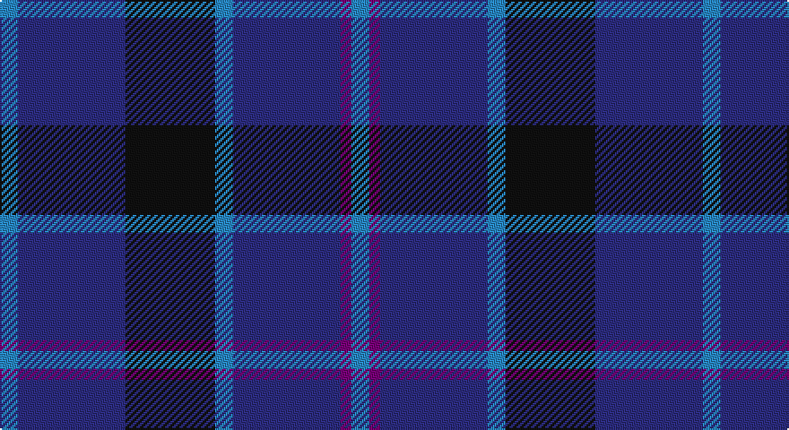

This page is one **sett** — a single exact thread-count. It belongs to the [tartan](/setts/t5db30k25t5db30dp3t5/)
(the same proportion at any scale), whose colour order is pattern [BBBBKBB](/stripes/bbbbkbb/).

Part of the [Van Loo](/tartans/van-loo/) tartan — the named design grouping this sett with its other cloths.

Sourced from house-of-tartan.  It is a [7 stripe tartan](/stripes/stripes7/).

Original link http://www.house-of-tartan.scotland.net/house/TartanViewjs.asp?colr=Def&tnam=6717

## Provenance

Earliest known date: pre 2005 Nothing

## Thread count
B/10 DB60 K50 B10 DB60 P6 B/10

One full sett is **392 threads**.

## Palette

Palette: <strong>Tartan Register</strong>
<table><thead><tr><th>Colour</th><th>Threads</th><th>Shade</th><th>Base</th><th>OKLCh</th></tr></thead><tbody><tr><td>B/</td><td style="text-align:right;font-variant-numeric:tabular-nums">10</td><td><code style="background-color:#2888C4;">#2888C4</code> <small style="color:#888">#2888C4</small></td><td>B <code style="background-color:#2A418A;">#2A418A</code></td><td><small style="color:#888">oklch(60.1% 0.125 241.5)</small></td></tr><tr><td>DB</td><td style="text-align:right;font-variant-numeric:tabular-nums">60</td><td><code style="background-color:#2C2C80;">#2C2C80</code> <small style="color:#888">#2C2C80</small></td><td>B <code style="background-color:#2A418A;">#2A418A</code></td><td><small style="color:#888">oklch(35.0% 0.138 276.6)</small></td></tr><tr><td>K</td><td style="text-align:right;font-variant-numeric:tabular-nums">50</td><td><code style="background-color:#101010;">#101010</code> <small style="color:#888">#101010</small></td><td>K <code style="background-color:#000000;">#000000</code></td><td><small style="color:#888">oklch(17.3% 0.000 89.9)</small></td></tr><tr><td>B</td><td style="text-align:right;font-variant-numeric:tabular-nums">10</td><td><code style="background-color:#2888C4;">#2888C4</code> <small style="color:#888">#2888C4</small></td><td>B <code style="background-color:#2A418A;">#2A418A</code></td><td><small style="color:#888">oklch(60.1% 0.125 241.5)</small></td></tr><tr><td>DB</td><td style="text-align:right;font-variant-numeric:tabular-nums">60</td><td><code style="background-color:#2C2C80;">#2C2C80</code> <small style="color:#888">#2C2C80</small></td><td>B <code style="background-color:#2A418A;">#2A418A</code></td><td><small style="color:#888">oklch(35.0% 0.138 276.6)</small></td></tr><tr><td>P</td><td style="text-align:right;font-variant-numeric:tabular-nums">6</td><td><code style="background-color:#780078;">#780078</code> <small style="color:#888">#780078</small></td><td>B <code style="background-color:#2A418A;">#2A418A</code></td><td><small style="color:#888">oklch(40.2% 0.185 328.4)</small></td></tr><tr><td>B/</td><td style="text-align:right;font-variant-numeric:tabular-nums">10</td><td><code style="background-color:#2888C4;">#2888C4</code> <small style="color:#888">#2888C4</small></td><td>B <code style="background-color:#2A418A;">#2A418A</code></td><td><small style="color:#888">oklch(60.1% 0.125 241.5)</small></td></tr></tbody></table>

# Sample pattern

## Compared to the master

This cloth is one sett of its design; the master sett (the exemplar the design is anchored on) is below for comparison.

<figure style="margin:0"><figcaption style="color:#888;font-size:smaller">this sett</figcaption></figure>
<figure style="margin:0"><figcaption style="color:#888;font-size:smaller"><a href="/setts/t5db30k25t5db30dp2t5/">master sett →</a></figcaption></figure>

## Nearest tartans

The nearest existing variants by ΔTartan distance, with this tartan at the top so the swatches line up against it.

ΔTartan

Tartan

Sett

—

<a href="/ttd/edit/#slug=t5db30k25t5db30dp3t5~x2">Van Loo Tartan</a> <a class="nn-out" href="/variants/s7/t5db30k25t5db30dp3t5~x2/" title="open its dictionary page">↗</a>

0.62

<a href="/ttd/edit/#slug=t5db30k25t5db30dp2t5~x2&amp;base=t5db30k25t5db30dp3t5~x2">Van Loo (Personal)</a> <a class="nn-out" href="/variants/s7/t5db30k25t5db30dp2t5~x2/" title="open its dictionary page">↗</a>

1.10

<a href="/ttd/edit/#slug=oi5db12dbi4o4dbi22db3dbi4oi5&amp;base=t5db30k25t5db30dp3t5~x2">Daks, Muted blue</a> <a class="nn-out" href="/variants/s8/oi5db12dbi4o4dbi22db3dbi4oi5/" title="open its dictionary page">↗</a>

1.15

<a href="/ttd/edit/#slug=db9k4lb1k4db9r1~x4&amp;base=t5db30k25t5db30dp3t5~x2">Scottish Nuclear</a> <a class="nn-out" href="/variants/s6/db9k4lb1k4db9r1~x4/" title="open its dictionary page">↗</a>

1.32

<a href="/ttd/edit/#slug=k22db16r3db16k3db16g3db3b5~x2&amp;base=t5db30k25t5db30dp3t5~x2">Jethart</a> <a class="nn-out" href="/variants/s9/k22db16r3db16k3db16g3db3b5~x2/" title="open its dictionary page">↗</a>

1.37

<a href="/ttd/edit/#slug=db1k3db1k3db8r1~x4&amp;base=t5db30k25t5db30dp3t5~x2">Morgan (MacKay Blue) Clan Tartan</a> <a class="nn-out" href="/variants/s6/db1k3db1k3db8r1~x4/" title="open its dictionary page">↗</a>

1.38

<a href="/ttd/edit/#slug=db5k2db14k14db2lr2~x2&amp;base=t5db30k25t5db30dp3t5~x2">Royal Scotsman Train (Corporate)</a> <a class="nn-out" href="/variants/s6/db5k2db14k14db2lr2~x2/" title="open its dictionary page">↗</a>

1.41

<a href="/ttd/edit/#slug=k6db10k10b1k1b1k10b6~x4&amp;base=t5db30k25t5db30dp3t5~x2">Oban</a> <a class="nn-out" href="/variants/s8/k6db10k10b1k1b1k10b6~x4/" title="open its dictionary page">↗</a>

1.44

<a href="/ttd/edit/#slug=dg3k3db2k16db2k2db24lb2~x2&amp;base=t5db30k25t5db30dp3t5~x2">Auckland (Fashion)</a> <a class="nn-out" href="/variants/s8/dg3k3db2k16db2k2db24lb2~x2/" title="open its dictionary page">↗</a>

1.45

<a href="/ttd/edit/#slug=dg1db2dbi5db11ly1~x4&amp;base=t5db30k25t5db30dp3t5~x2">Open Championship, The</a> <a class="nn-out" href="/variants/s5/dg1db2dbi5db11ly1~x4/" title="open its dictionary page">↗</a>

1.46

<a href="/ttd/edit/#slug=db9b2db2ly1b7db2r1b4~x4&amp;base=t5db30k25t5db30dp3t5~x2">Mercer, Charles</a> <a class="nn-out" href="/variants/s8/db9b2db2ly1b7db2r1b4~x4/" title="open its dictionary page">↗</a>

## Neighbour map

Every grey dot is one of 14360 variants placed by the first two principal components of the ΔTartan feature space (44% of its variance). Red is this tartan; blue dots are its nearest — click one to open its page.

<svg viewBox="0 0 640 380" role="img" style="max-width:100%;height:auto;border:1px solid #e0e0e0;border-radius:4px;display:block" xmlns="http://www.w3.org/2000/svg"><image href="/nn/cloud.v1.png" width="640" height="380"/><a href="/variants/s7/t5db30k25t5db30dp2t5~x2/"><circle cx="369.8" cy="225.8" r="4" fill="#3465a4"><title>Van Loo (Personal)</title></circle></a><a href="/variants/s8/oi5db12dbi4o4dbi22db3dbi4oi5/"><circle cx="281.0" cy="240.0" r="4" fill="#3465a4"><title>Daks, Muted blue</title></circle></a><a href="/variants/s6/db9k4lb1k4db9r1~x4/"><circle cx="382.0" cy="258.2" r="4" fill="#3465a4"><title>Scottish Nuclear</title></circle></a><a href="/variants/s9/k22db16r3db16k3db16g3db3b5~x2/"><circle cx="297.0" cy="222.6" r="4" fill="#3465a4"><title>Jethart</title></circle></a><a href="/variants/s6/db1k3db1k3db8r1~x4/"><circle cx="404.2" cy="272.9" r="4" fill="#3465a4"><title>Morgan (MacKay Blue) Clan Tartan</title></circle></a><a href="/variants/s6/db5k2db14k14db2lr2~x2/"><circle cx="353.0" cy="271.7" r="4" fill="#3465a4"><title>Royal Scotsman Train (Corporate)</title></circle></a><a href="/variants/s8/k6db10k10b1k1b1k10b6~x4/"><circle cx="367.6" cy="264.7" r="4" fill="#3465a4"><title>Oban</title></circle></a><a href="/variants/s8/dg3k3db2k16db2k2db24lb2~x2/"><circle cx="362.0" cy="205.8" r="4" fill="#3465a4"><title>Auckland (Fashion)</title></circle></a><a href="/variants/s5/dg1db2dbi5db11ly1~x4/"><circle cx="424.2" cy="249.5" r="4" fill="#3465a4"><title>Open Championship, The</title></circle></a><a href="/variants/s8/db9b2db2ly1b7db2r1b4~x4/"><circle cx="305.7" cy="238.7" r="4" fill="#3465a4"><title>Mercer, Charles</title></circle></a><circle cx="349.0" cy="241.2" r="5" fill="#c00000"/></svg>

ID: /variants/s7/t5db30k25t5db30dp3t5~x2/
