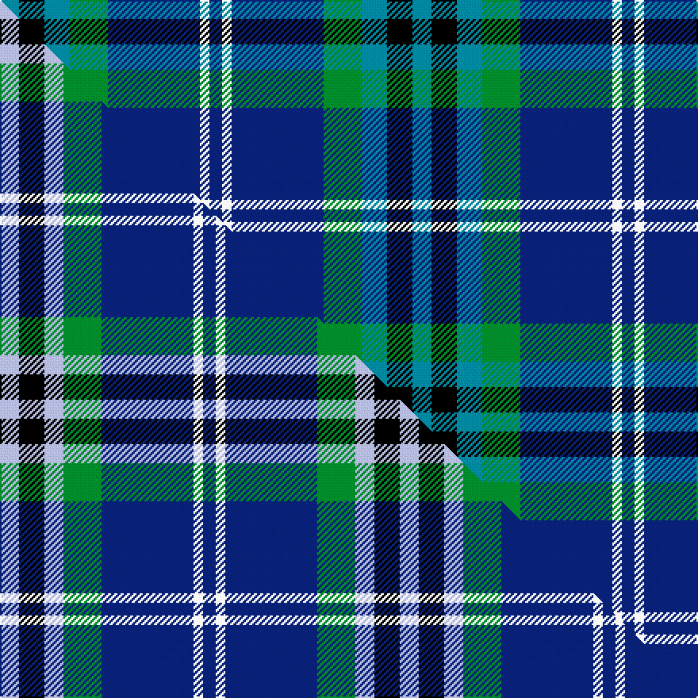

This page is one **sett** — a single exact thread-count. It belongs to the [tartan](/setts/t6k8t8g12db29w3db4/)
(the same proportion at any scale), whose colour order is pattern [BKBGBWB](/stripes/bkbgbwb/).

Part of the [Dickson](/tartans/dickson/) tartan — the named design grouping this sett with its other cloths.

Sourced from tartans-authority.  It is a [7 stripe tartan](/stripes/stripes7/).

Original link [https://www.tartanregister.gov.uk/tartanDetails.aspx?ref=10140](https://www.tartanregister.gov.uk/tartanDetails.aspx?ref=10140)

Dataset <small>— provenance for this record, inherited from the source manifest</small>

<dl class="dataset-prov">
<dt>source</dt><dd><a href="/sources/tartans-authority/">Scottish Tartans Authority</a></dd>
<dt>data captured from</dt><dd><a href="https://github.com/thetartan/tartan-database/blob/master/data/tartans-authority/data.csv">https://github.com/thetartan/tartan-database/blob/master/data/tartans-authority/data.csv</a></dd>
<dt>data date</dt><dd>July 2009 <small>(this record)</small></dd>
<dt>licence</dt><dd><a href="https://creativecommons.org/licenses/by-nc-nd/4.0/">CC BY-NC-ND 4.0</a></dd>
</dl>

Capture chain <small>— the hands this data passed through, oldest first; each capture carries its own licence</small>

<ol class="capture-chain">
<li><a href="https://www.tartansauthority.com/">Scottish Tartans Authority</a> <small>the heritage body's archive — its tartan-ferret record browser is retired (links repaired to the SRT, above)</small></li>
<li><a href="https://github.com/thetartan/tartan-database">thetartan/tartan-database</a> <small>2016-2017</small> · <a href="https://creativecommons.org/licenses/by-nc-nd/4.0/">CC BY-NC-ND 4.0</a> <small>Levko Kravets's frozen compilation — the capture we vendored, and where its CC licence text came from</small></li>
<li>this dictionary <small>captured 2026-06-10 · commit 5bf86c7566</small> <small>each re-capture is a git commit to data/sources</small></li>
</ol>

## Register references

External register numbers recorded for this tartan.

- Scottish Register of Tartans: [10140](https://www.tartanregister.gov.uk/tartanDetails?ref=10140)
- Scottish Tartans Authority (ITI): 10140

## Thread count
T/12 K16 T16 G24 DB58 W6 DB/8

One full sett is **260 threads**.

## Palette
<table><thead><tr><th>Colour</th><th>Shade</th><th>OKLCh</th></tr></thead><tbody><tr><td>T</td><td><code style="background-color:#00879F;">#00879F</code> <small style="color:#888">#00879F</small></td><td><small style="color:#888">oklch(57.4% 0.102 216.1)</small></td></tr><tr><td>K</td><td><code style="background-color:#000000;">#000000</code> <small style="color:#888">#000000</small></td><td><small style="color:#888">oklch(0.0% 0.000 0.0)</small></td></tr><tr><td>DB</td><td><code style="background-color:#082077;">#082077</code> <small style="color:#888">#082077</small></td><td><small style="color:#888">oklch(30.0% 0.149 265.1)</small></td></tr><tr><td>G</td><td><code style="background-color:#008B2A;">#008B2A</code> <small style="color:#888">#008B2A</small></td><td><small style="color:#888">oklch(55.4% 0.170 145.9)</small></td></tr><tr><td>W</td><td><code style="background-color:#F7F7F7;">#F7F7F7</code> <small style="color:#888">#F7F7F7</small></td><td><small style="color:#888">oklch(97.6% 0.000 89.9)</small></td></tr></tbody></table>

# Sample pattern

## Compared to the master

This cloth is one sett of its design; the master sett (the exemplar the design is anchored on) is below for comparison.

Its **ΔTartan distance** from the master is **0.20** — the same measure the nearest-tartans table ranks by (0 is identical; a re-scale of the same cloth is near 0, a recolour or a different proportion further).

<figure class="master-compare" style="margin:0">

this sett
master sett ★

<figcaption style="color:#888;font-size:smaller">One weave of this sett against the <a href="/setts/lb6k8lb6g12db29w3db4/">master sett ★</a>, split on the diagonal: a shared proportion runs seamlessly across it with only the shades shifting; a different proportion breaks on it.</figcaption>
</figure>

## Nearest tartan variants

The nearest existing variants by ΔTartan distance, with this cloth at the top so the swatches line up against it.

ΔTartan

Threads

Variant

Sett

—

260

<a href="/variants/s7/t6k8t8g12db29w3db4~x2/">Dickson (Kirkcudbrightshire) (Name)</a>

<a href="/ttd/edit/#slug=lb6k8lb6g12db29w3db4~x2&amp;base=t6k8t8g12db29w3db4~x2" title="compare in the TTD">0.20</a>

252

<a href="/variants/s7/lb6k8lb6g12db29w3db4~x2/">Dickson (Kirkcudbrightshire)</a>

<a href="/ttd/edit/#slug=db10g42dbi8lb8dbi8k24dbi8db71r10~db1106275-dbi1406275&amp;base=t6k8t8g12db29w3db4~x2" title="compare in the TTD">1.65</a>

358

<a href="/variants/s9/db10g42dbi8lb8dbi8k24dbi8db71r10~db1106275-dbi1406275/">Robert Burns Legacy</a>

<a href="/ttd/edit/#slug=db12k4g4dp1g4k1w1~x4&amp;base=t6k8t8g12db29w3db4~x2" title="compare in the TTD">1.89</a>

164

<a href="/variants/s7/db12k4g4dp1g4k1w1~x4/">Alexander - 2000 (Name)</a>

<a href="/ttd/edit/#slug=db15w2g2k18db21k3g15~x2&amp;base=t6k8t8g12db29w3db4~x2" title="compare in the TTD">2.17</a>

244

<a href="/variants/s7/db15w2g2k18db21k3g15~x2/">Loyalhanna (District?)</a>

<a href="/ttd/edit/#slug=w2db16g16t4k4t4g16db16w1~x2&amp;base=t6k8t8g12db29w3db4~x2" title="compare in the TTD">2.20</a>

310

<a href="/variants/s9/w2db16g16t4k4t4g16db16w1~x2/">Douglas</a>

<a href="/ttd/edit/#slug=db12k4g4r1g4k1y1~x4&amp;base=t6k8t8g12db29w3db4~x2" title="compare in the TTD">2.20</a>

164

<a href="/variants/s7/db12k4g4r1g4k1y1~x4/">MacLaren</a>

<a href="/ttd/edit/#slug=db12k4g4r1g4k1lo1~x4&amp;base=t6k8t8g12db29w3db4~x2" title="compare in the TTD">2.25</a>

164

<a href="/variants/s7/db12k4g4r1g4k1lo1~x4/">MacLaren (Clan)</a>

<a href="/ttd/edit/#slug=db22w2k10g11r3g4~x2&amp;base=t6k8t8g12db29w3db4~x2" title="compare in the TTD">2.31</a>

156

<a href="/variants/s6/db22w2k10g11r3g4~x2/">Paterson Blue (Personal)</a>

<a href="/ttd/edit/#slug=k7db4g31db3y2db27lb4~x2&amp;base=t6k8t8g12db29w3db4~x2" title="compare in the TTD">2.32</a>

290

<a href="/variants/s7/k7db4g31db3y2db27lb4~x2/">Wishart Htg (Clan)</a>

<a href="/ttd/edit/#slug=k6g11w2db22r2k4~x2&amp;base=t6k8t8g12db29w3db4~x2" title="compare in the TTD">2.43</a>

168

<a href="/variants/s6/k6g11w2db22r2k4~x2/">Leslie Hebridean Artifact Tartan</a>

## Neighbour map

Every grey dot is one of 13621 variants placed by the first two principal components of the ΔTartan feature space (42% of its variance). Red is this tartan; blue dots are its nearest — click one to open its page.

<svg viewBox="0 0 640 380" role="img" style="max-width:100%;height:auto;border:1px solid #e0e0e0;border-radius:4px;display:block" xmlns="http://www.w3.org/2000/svg"><image href="/nn/cloud.v1.png" width="640" height="380"/><a href="/variants/s7/lb6k8lb6g12db29w3db4~x2/"><circle cx="185.1" cy="180.3" r="4" fill="#3465a4"><title>Dickson (Kirkcudbrightshire)</title></circle></a><a href="/variants/s9/db10g42dbi8lb8dbi8k24dbi8db71r10~db1106275-dbi1406275/"><circle cx="152.7" cy="151.4" r="4" fill="#3465a4"><title>Robert Burns Legacy</title></circle></a><a href="/variants/s7/db12k4g4dp1g4k1w1~x4/"><circle cx="187.1" cy="164.4" r="4" fill="#3465a4"><title>Alexander - 2000 (Name)</title></circle></a><a href="/variants/s7/db15w2g2k18db21k3g15~x2/"><circle cx="181.7" cy="188.8" r="4" fill="#3465a4"><title>Loyalhanna (District?)</title></circle></a><a href="/variants/s9/w2db16g16t4k4t4g16db16w1~x2/"><circle cx="187.8" cy="171.9" r="4" fill="#3465a4"><title>Douglas</title></circle></a><a href="/variants/s7/db12k4g4r1g4k1y1~x4/"><circle cx="194.0" cy="165.6" r="4" fill="#3465a4"><title>MacLaren</title></circle></a><a href="/variants/s7/db12k4g4r1g4k1lo1~x4/"><circle cx="188.1" cy="163.4" r="4" fill="#3465a4"><title>MacLaren (Clan)</title></circle></a><a href="/variants/s6/db22w2k10g11r3g4~x2/"><circle cx="160.7" cy="182.7" r="4" fill="#3465a4"><title>Paterson Blue (Personal)</title></circle></a><a href="/variants/s7/k7db4g31db3y2db27lb4~x2/"><circle cx="222.6" cy="155.9" r="4" fill="#3465a4"><title>Wishart Htg (Clan)</title></circle></a><a href="/variants/s6/k6g11w2db22r2k4~x2/"><circle cx="181.9" cy="167.9" r="4" fill="#3465a4"><title>Leslie Hebridean Artifact Tartan</title></circle></a><circle cx="186.9" cy="186.6" r="5" fill="#c00000"/><text x="320" y="376" text-anchor="middle" font-size="11" fill="#999">ground</text><text x="11" y="190" text-anchor="middle" font-size="11" fill="#999" transform="rotate(-90 11 190)">complexity</text></svg>

ID: /variants/s7/t6k8t8g12db29w3db4~x2/
