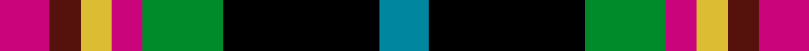

This is one **variant** — a specific cloth: this exact thread count and colourway, with its own
provenance below. It is one weaving of the [sett](/setts/t8k25g13m5ly5dr5m8/) (the scale-free proportion — the
same cloth at any scale or shade), whose colour order is pattern [BKGRYBR](/stripes/bkgrybr/).

Part of the [Bro-Menez Are](/tartans/b/br/bro-menez-are/) tartan — the named design grouping this sett with its other cloths.

Sourced from tartans-authority.  It is a [7 stripe tartan](/stripes/stripes7/).

Original link [https://www.tartanregister.gov.uk/tartanDetails.aspx?ref=7905](https://www.tartanregister.gov.uk/tartanDetails.aspx?ref=7905)

Dataset <small>— provenance for this record, inherited from the source manifest</small>

<dl class="dataset-prov">
<dt>source</dt><dd><a href="/sources/tartans-authority/">Scottish Tartans Authority</a></dd>
<dt>data captured from</dt><dd><a href="https://github.com/thetartan/tartan-database/blob/master/data/tartans-authority/data.csv">https://github.com/thetartan/tartan-database/blob/master/data/tartans-authority/data.csv</a></dd>
<dt>data date</dt><dd>Jan. 2009 <small>(this record)</small></dd>
<dt>licence</dt><dd><a href="https://creativecommons.org/licenses/by-nc-nd/4.0/">CC BY-NC-ND 4.0</a></dd>
</dl>

Capture chain <small>— the hands this data passed through, oldest first; each capture carries its own licence</small>

<ol class="capture-chain">
<li><a href="https://www.tartansauthority.com/">Scottish Tartans Authority</a> <small>the heritage body's archive — its tartan-ferret record browser is retired (links repaired to the SRT, above)</small></li>
<li><a href="https://github.com/thetartan/tartan-database">thetartan/tartan-database</a> <small>2016-2017</small> · <a href="https://creativecommons.org/licenses/by-nc-nd/4.0/">CC BY-NC-ND 4.0</a> <small>Levko Kravets's frozen compilation — the capture we vendored, and where its CC licence text came from</small></li>
<li>this dictionary <small>captured 2026-06-10 · commit 5bf86c7566</small> <small>each re-capture is a git commit to data/sources</small></li>
</ol>

## Register references

External register numbers recorded for this tartan.

- Scottish Register of Tartans: [7905](https://www.tartanregister.gov.uk/tartanDetails?ref=7905)
- Scottish Tartans Authority (ITI): 7905

## Thread count
M/16 DR10 LY10 M10 G26 K50 T/16

One full sett is **244 threads**.

## Palette
<table><thead><tr><th>Colour</th><th>Shade</th><th>OKLCh</th></tr></thead><tbody><tr><td>T</td><td><code style="background-color:#00879F;">#00879F</code> <small style="color:#888">#00879F</small></td><td><small style="color:#888">oklch(57.4% 0.102 216.1)</small></td></tr><tr><td>M</td><td><code style="background-color:#CA047B;">#CA047B</code> <small style="color:#888">#CA047B</small></td><td><small style="color:#888">oklch(55.0% 0.225 353.8)</small></td></tr><tr><td>DR</td><td><code style="background-color:#55120C;">#55120C</code> <small style="color:#888">#55120C</small></td><td><small style="color:#888">oklch(30.0% 0.099 29.3)</small></td></tr><tr><td>LY</td><td><code style="background-color:#DCBC32;">#DCBC32</code> <small style="color:#888">#DCBC32</small></td><td><small style="color:#888">oklch(80.0% 0.150 95.2)</small></td></tr><tr><td>G</td><td><code style="background-color:#008B2A;">#008B2A</code> <small style="color:#888">#008B2A</small></td><td><small style="color:#888">oklch(55.4% 0.170 145.9)</small></td></tr><tr><td>K</td><td><code style="background-color:#000000;">#000000</code> <small style="color:#888">#000000</small></td><td><small style="color:#888">oklch(0.0% 0.000 0.0)</small></td></tr></tbody></table>

# Sample pattern

## Nearest tartan variants

The nearest existing variants by ΔTartan distance, with this cloth at the top so the swatches line up against it.

ΔTartan

Threads

Variant

Sett

—

244

<a href="/variants/s7/t8k25g13m5ly5dr5m8~x2/">Bro-Menez Are (Corporate)</a>

<a href="/ttd/edit/#slug=k10r3y4db12g4r4w2~x4&amp;base=t8k25g13m5ly5dr5m8~x2" title="compare in the TTD">1.77</a>

264

<a href="/variants/s7/k10r3y4db12g4r4w2~x4/">Eichelberger Family, Jörg (Personal)</a>

<a href="/ttd/edit/#slug=dr3dg2n2dg3k6b2ly10b2~x2&amp;base=t8k25g13m5ly5dr5m8~x2" title="compare in the TTD">2.24</a>

110

<a href="/variants/s8/dr3dg2n2dg3k6b2ly10b2~x2/">Burnfoot Check</a>

<a href="/ttd/edit/#slug=k20y4db13w4g30w4r13~x2&amp;base=t8k25g13m5ly5dr5m8~x2" title="compare in the TTD">2.30</a>

286

<a href="/variants/s7/k20y4db13w4g30w4r13~x2/">South Africa 1994 (Fashion)</a>

<a href="/ttd/edit/#slug=dp21lg4dy5lg4dp5k21dg21y5~x2~lg3105139-dg1804158&amp;base=t8k25g13m5ly5dr5m8~x2" title="compare in the TTD">2.31</a>

292

<a href="/variants/s8/dp21lg4dy5lg4dp5k21dg21y5~x2~lg3105139-dg1804158/">Caledonian Labrador Retrievers</a>

<a href="/ttd/edit/#slug=o21db4dr5db4o5k21g21ly5~x2&amp;base=t8k25g13m5ly5dr5m8~x2" title="compare in the TTD">2.37</a>

292

<a href="/variants/s8/o21db4dr5db4o5k21g21ly5~x2/">Caledonian Labrador Retrievers</a>

<a href="/ttd/edit/#slug=n6w2k4dy12k4w2n6r3~x2&amp;base=t8k25g13m5ly5dr5m8~x2" title="compare in the TTD">2.45</a>

138

<a href="/variants/s8/n6w2k4dy12k4w2n6r3~x2/">Strathblane</a>

<a href="/ttd/edit/#slug=k8r12w8g15db30y5~x2&amp;base=t8k25g13m5ly5dr5m8~x2" title="compare in the TTD">2.48</a>

286

<a href="/variants/s6/k8r12w8g15db30y5~x2/">Reekie (Edmonton)</a>

<a href="/ttd/edit/#slug=k11db3o5k2g15dp11~x2&amp;base=t8k25g13m5ly5dr5m8~x2" title="compare in the TTD">2.48</a>

144

<a href="/variants/s6/k11db3o5k2g15dp11~x2/">Saorsa Corporate Tartan</a>

<a href="/ttd/edit/#slug=g7w4k21n16db16r5~x2&amp;base=t8k25g13m5ly5dr5m8~x2" title="compare in the TTD">2.53</a>

252

<a href="/variants/s6/g7w4k21n16db16r5~x2/">Hawkes, Norman (Personal)</a>

<a href="/ttd/edit/#slug=r3db16o2db2o12k8g12k12w3~x2&amp;base=t8k25g13m5ly5dr5m8~x2" title="compare in the TTD">2.55</a>

268

<a href="/variants/s9/r3db16o2db2o12k8g12k12w3~x2/">Celtic Women International</a>

## Neighbour map

Every grey dot is one of 13621 variants placed by the first two principal components of the ΔTartan feature space (42% of its variance). Red is this tartan; blue dots are its nearest — click one to open its page.

<svg viewBox="0 0 640 380" role="img" style="max-width:100%;height:auto;border:1px solid #e0e0e0;border-radius:4px;display:block" xmlns="http://www.w3.org/2000/svg"><image href="/nn/cloud.v1.png" width="640" height="380"/><a href="/variants/s7/k10r3y4db12g4r4w2~x4/"><circle cx="39.7" cy="194.7" r="4" fill="#3465a4"><title>Eichelberger Family, Jörg (Personal)</title></circle></a><a href="/variants/s8/dr3dg2n2dg3k6b2ly10b2~x2/"><circle cx="39.1" cy="191.4" r="4" fill="#3465a4"><title>Burnfoot Check</title></circle></a><a href="/variants/s7/k20y4db13w4g30w4r13~x2/"><circle cx="57.8" cy="179.8" r="4" fill="#3465a4"><title>South Africa 1994 (Fashion)</title></circle></a><a href="/variants/s8/dp21lg4dy5lg4dp5k21dg21y5~x2~lg3105139-dg1804158/"><circle cx="65.9" cy="194.8" r="4" fill="#3465a4"><title>Caledonian Labrador Retrievers</title></circle></a><a href="/variants/s8/o21db4dr5db4o5k21g21ly5~x2/"><circle cx="47.9" cy="189.6" r="4" fill="#3465a4"><title>Caledonian Labrador Retrievers</title></circle></a><a href="/variants/s8/n6w2k4dy12k4w2n6r3~x2/"><circle cx="72.0" cy="208.1" r="4" fill="#3465a4"><title>Strathblane</title></circle></a><a href="/variants/s6/k8r12w8g15db30y5~x2/"><circle cx="73.0" cy="203.0" r="4" fill="#3465a4"><title>Reekie (Edmonton)</title></circle></a><a href="/variants/s6/k11db3o5k2g15dp11~x2/"><circle cx="66.8" cy="202.5" r="4" fill="#3465a4"><title>Saorsa Corporate Tartan</title></circle></a><a href="/variants/s6/g7w4k21n16db16r5~x2/"><circle cx="40.3" cy="221.6" r="4" fill="#3465a4"><title>Hawkes, Norman (Personal)</title></circle></a><a href="/variants/s9/r3db16o2db2o12k8g12k12w3~x2/"><circle cx="38.9" cy="175.6" r="4" fill="#3465a4"><title>Celtic Women International</title></circle></a><circle cx="54.6" cy="195.7" r="5" fill="#c00000"/><text x="320" y="376" text-anchor="middle" font-size="11" fill="#999">ground</text><text x="11" y="190" text-anchor="middle" font-size="11" fill="#999" transform="rotate(-90 11 190)">complexity</text></svg>

ID: /variants/s7/t8k25g13m5ly5dr5m8~x2/
