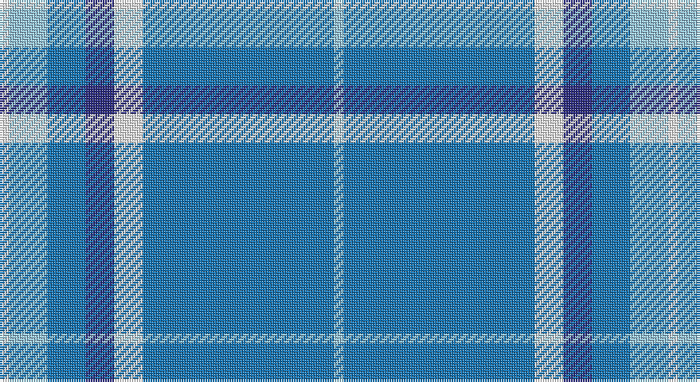

This page is one **sett** — a single exact thread-count. It belongs to the [tartan](/setts/w1lb4b4db3w3b20lb1/)
(the same proportion at any scale), whose colour order is pattern [WBWBBWW](/stripes/wbwbbww/).

Part of the [Starr](/tartans/starr/) tartan — the named design grouping this sett with its other cloths.

Sourced from register-of-tartans.  It is a [7 stripe tartan](/stripes/stripes7/).

Original link https://www.tartanregister.gov.uk/tartanDetails.aspx?ref=3909

2 attestations — the source records this cloth was collapsed from (oldest owns this page)

<ul>
<li>01/01/2004 — Starr (register-of-tartans, <a href="https://www.tartanregister.gov.uk/tartanDetails.aspx?ref=3909">record</a>)</li>
<li>pre 2004 — Starr (Name) (tartans-authority, <a href="http://www.tartansauthority.com/tartan-ferret/display/6373/">record</a>)</li>
</ul>

## Register references

External register numbers recorded for this tartan.

- Scottish Register of Tartans: [3909](https://www.tartanregister.gov.uk/tartanDetails.aspx?ref=3909)
- Scottish Tartans Authority (ITI): 6373

## Thread count
W/4 LB16 B16 DB12 W12 B80 LB/4

One full sett is **280 threads**.

## Palette

Palette: <strong>Tartan Register</strong>
<table><thead><tr><th>Colour</th><th>Threads</th><th>Shade</th><th>Base</th><th>OKLCh</th></tr></thead><tbody><tr><td>W/</td><td style="text-align:right;font-variant-numeric:tabular-nums">4</td><td><code style="background-color:#F8F8F8;">#F8F8F8</code> <small style="color:#888">#F8F8F8</small></td><td>W <code style="background-color:#F7F7F7;">#F7F7F7</code></td><td><small style="color:#888">oklch(97.9% 0.000 89.9)</small></td></tr><tr><td>LB</td><td style="text-align:right;font-variant-numeric:tabular-nums">16</td><td><code style="background-color:#98C8E8;">#98C8E8</code> <small style="color:#888">#98C8E8</small></td><td>W <code style="background-color:#F7F7F7;">#F7F7F7</code></td><td><small style="color:#888">oklch(81.0% 0.068 237.9)</small></td></tr><tr><td>B</td><td style="text-align:right;font-variant-numeric:tabular-nums">16</td><td><code style="background-color:#1474B4;">#1474B4</code> <small style="color:#888">#1474B4</small></td><td>B <code style="background-color:#2A418A;">#2A418A</code></td><td><small style="color:#888">oklch(54.0% 0.129 245.1)</small></td></tr><tr><td>DB</td><td style="text-align:right;font-variant-numeric:tabular-nums">12</td><td><code style="background-color:#2C2C80;">#2C2C80</code> <small style="color:#888">#2C2C80</small></td><td>B <code style="background-color:#2A418A;">#2A418A</code></td><td><small style="color:#888">oklch(35.0% 0.138 276.6)</small></td></tr><tr><td>W</td><td style="text-align:right;font-variant-numeric:tabular-nums">12</td><td><code style="background-color:#F8F8F8;">#F8F8F8</code> <small style="color:#888">#F8F8F8</small></td><td>W <code style="background-color:#F7F7F7;">#F7F7F7</code></td><td><small style="color:#888">oklch(97.9% 0.000 89.9)</small></td></tr><tr><td>B</td><td style="text-align:right;font-variant-numeric:tabular-nums">80</td><td><code style="background-color:#1474B4;">#1474B4</code> <small style="color:#888">#1474B4</small></td><td>B <code style="background-color:#2A418A;">#2A418A</code></td><td><small style="color:#888">oklch(54.0% 0.129 245.1)</small></td></tr><tr><td>LB/</td><td style="text-align:right;font-variant-numeric:tabular-nums">4</td><td><code style="background-color:#98C8E8;">#98C8E8</code> <small style="color:#888">#98C8E8</small></td><td>W <code style="background-color:#F7F7F7;">#F7F7F7</code></td><td><small style="color:#888">oklch(81.0% 0.068 237.9)</small></td></tr></tbody></table>

# Sample pattern

## Nearest tartans

The nearest existing variants by ΔTartan distance, with this tartan at the top so the swatches line up against it.

ΔTartan

Tartan

Sett

—

<a href="/ttd/edit/#slug=w1lb4b4db3w3b20lb1~x4">Starr</a> <a class="nn-out" href="/variants/s7/w1lb4b4db3w3b20lb1~x4/" title="open its dictionary page">↗</a>

1.17

<a href="/ttd/edit/#slug=r2t21r2db6ly1r1~x4&amp;base=w1lb4b4db3w3b20lb1~x4">Lauder Primary School (Corporate)</a> <a class="nn-out" href="/variants/s6/r2t21r2db6ly1r1~x4/" title="open its dictionary page">↗</a>

1.42

<a href="/ttd/edit/#slug=n3b2w10b2n6b26k2~x2&amp;base=w1lb4b4db3w3b20lb1~x4">MacLintock #2</a> <a class="nn-out" href="/variants/s7/n3b2w10b2n6b26k2~x2/" title="open its dictionary page">↗</a>

1.44

<a href="/ttd/edit/#slug=lb5dy6w2g7w2b44w2~x2&amp;base=w1lb4b4db3w3b20lb1~x4">Leblant-Macqueron (Personal)</a> <a class="nn-out" href="/variants/s7/lb5dy6w2g7w2b44w2~x2/" title="open its dictionary page">↗</a>

1.50

<a href="/ttd/edit/#slug=t142db12dbi24w7dbi5w5dbi5r10&amp;base=w1lb4b4db3w3b20lb1~x4">Glen Innes (Australia)</a> <a class="nn-out" href="/variants/s8/t142db12dbi24w7dbi5w5dbi5r10/" title="open its dictionary page">↗</a>

1.51

<a href="/ttd/edit/#slug=b64k3g14k4b4k12lo4~x2&amp;base=w1lb4b4db3w3b20lb1~x4">Murray of Elibank</a> <a class="nn-out" href="/variants/s7/b64k3g14k4b4k12lo4~x2/" title="open its dictionary page">↗</a>

1.52

<a href="/ttd/edit/#slug=t42db10lo2db2lb2db2t10lb6db2lb3t2~x2&amp;base=w1lb4b4db3w3b20lb1~x4">Goil Dress</a> <a class="nn-out" href="/variants/s11/t42db10lo2db2lb2db2t10lb6db2lb3t2~x2/" title="open its dictionary page">↗</a>

1.56

<a href="/ttd/edit/#slug=b120g9r7ly12g33ly33b26&amp;base=w1lb4b4db3w3b20lb1~x4">Supporter.com</a> <a class="nn-out" href="/variants/s7/b120g9r7ly12g33ly33b26/" title="open its dictionary page">↗</a>

1.63

<a href="/ttd/edit/#slug=b33lo6r3lo6k3lo15b32~x4&amp;base=w1lb4b4db3w3b20lb1~x4">Carlisle Family (Name)</a> <a class="nn-out" href="/variants/s7/b33lo6r3lo6k3lo15b32~x4/" title="open its dictionary page">↗</a>

1.65

<a href="/ttd/edit/#slug=lg6r1lg17db3lg3db8lg1~x2&amp;base=w1lb4b4db3w3b20lb1~x4">Dominion (Fashion)</a> <a class="nn-out" href="/variants/s7/lg6r1lg17db3lg3db8lg1~x2/" title="open its dictionary page">↗</a>

1.66

<a href="/ttd/edit/#slug=db10b6lb6w4lb3b6db20b46db2lb2~x2&amp;base=w1lb4b4db3w3b20lb1~x4">Saltire (Fashion)</a> <a class="nn-out" href="/variants/s10/db10b6lb6w4lb3b6db20b46db2lb2~x2/" title="open its dictionary page">↗</a>

## Neighbour map

Every grey dot is one of 14360 variants placed by the first two principal components of the ΔTartan feature space (44% of its variance). Red is this tartan; blue dots are its nearest — click one to open its page.

<svg viewBox="0 0 640 380" role="img" style="max-width:100%;height:auto;border:1px solid #e0e0e0;border-radius:4px;display:block" xmlns="http://www.w3.org/2000/svg"><image href="/nn/cloud.v1.png" width="640" height="380"/><a href="/variants/s6/r2t21r2db6ly1r1~x4/"><circle cx="413.5" cy="165.4" r="4" fill="#3465a4"><title>Lauder Primary School (Corporate)</title></circle></a><a href="/variants/s7/n3b2w10b2n6b26k2~x2/"><circle cx="315.1" cy="170.1" r="4" fill="#3465a4"><title>MacLintock #2</title></circle></a><a href="/variants/s7/lb5dy6w2g7w2b44w2~x2/"><circle cx="398.8" cy="138.3" r="4" fill="#3465a4"><title>Leblant-Macqueron (Personal)</title></circle></a><a href="/variants/s8/t142db12dbi24w7dbi5w5dbi5r10/"><circle cx="416.9" cy="106.2" r="4" fill="#3465a4"><title>Glen Innes (Australia)</title></circle></a><a href="/variants/s7/b64k3g14k4b4k12lo4~x2/"><circle cx="413.1" cy="162.1" r="4" fill="#3465a4"><title>Murray of Elibank</title></circle></a><a href="/variants/s11/t42db10lo2db2lb2db2t10lb6db2lb3t2~x2/"><circle cx="409.6" cy="124.1" r="4" fill="#3465a4"><title>Goil Dress</title></circle></a><a href="/variants/s7/b120g9r7ly12g33ly33b26/"><circle cx="340.2" cy="166.3" r="4" fill="#3465a4"><title>Supporter.com</title></circle></a><a href="/variants/s7/b33lo6r3lo6k3lo15b32~x4/"><circle cx="359.9" cy="195.2" r="4" fill="#3465a4"><title>Carlisle Family (Name)</title></circle></a><a href="/variants/s7/lg6r1lg17db3lg3db8lg1~x2/"><circle cx="452.9" cy="208.3" r="4" fill="#3465a4"><title>Dominion (Fashion)</title></circle></a><a href="/variants/s10/db10b6lb6w4lb3b6db20b46db2lb2~x2/"><circle cx="355.8" cy="150.9" r="4" fill="#3465a4"><title>Saltire (Fashion)</title></circle></a><circle cx="403.0" cy="162.8" r="5" fill="#c00000"/></svg>

ID: /variants/s7/w1lb4b4db3w3b20lb1~x4/
