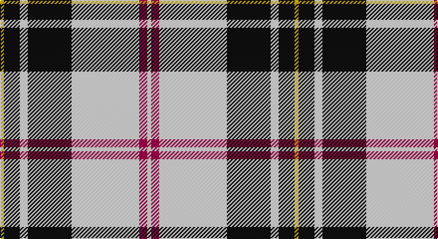

This page is one **sett** — a single exact thread-count. It belongs to the [tartan](/setts/w1m2w17k11w2k4ly1/)
(the same proportion at any scale), whose colour order is pattern [WRWKWKY](/stripes/wrwkwky/).

Part of the [MacPherson](/tartans/macpherson/) tartan — the named design grouping this sett with its other cloths.

Sourced from tartans-authority.  It is a [7 stripe tartan](/stripes/stripes7/).

Original link http://www.tartansauthority.com/tartan-ferret/display/1872/

## Also known as

This cloth is also recorded under:

- Kidd Wilson's No 43 or..
- Kidd, Wilson's No 43
- MacPherson #2
- MacPherson #3
- MacPherson #5
- MacPherson #6
- MacPherson #7
- MacPherson #8
- MacPherson #9
- MacPherson, Wilson's No 43

## Register references

External register numbers recorded for this tartan.

- Scottish Tartans Authority (ITI): 1872

## Thread count
Y/4 K16 LN8 K44 LN68 R8 LN/4

One full sett is **296 threads**.

## Palette

Palette: <strong>Tartan Register</strong>
<table><thead><tr><th>Colour</th><th>Threads</th><th>Shade</th><th>Base</th><th>OKLCh</th></tr></thead><tbody><tr><td>Y/</td><td style="text-align:right;font-variant-numeric:tabular-nums">4</td><td><code style="background-color:#D8B000;">#D8B000</code> <small style="color:#888">#D8B000</small></td><td>Y <code style="background-color:#F2BF00;">#F2BF00</code></td><td><small style="color:#888">oklch(77.1% 0.158 92.3)</small></td></tr><tr><td>K</td><td style="text-align:right;font-variant-numeric:tabular-nums">16</td><td><code style="background-color:#101010;">#101010</code> <small style="color:#888">#101010</small></td><td>K <code style="background-color:#000000;">#000000</code></td><td><small style="color:#888">oklch(17.3% 0.000 89.9)</small></td></tr><tr><td>LN</td><td style="text-align:right;font-variant-numeric:tabular-nums">8</td><td><code style="background-color:#E0E0E0;">#E0E0E0</code> <small style="color:#888">#E0E0E0</small></td><td>W <code style="background-color:#F7F7F7;">#F7F7F7</code></td><td><small style="color:#888">oklch(90.7% 0.000 89.9)</small></td></tr><tr><td>K</td><td style="text-align:right;font-variant-numeric:tabular-nums">44</td><td><code style="background-color:#101010;">#101010</code> <small style="color:#888">#101010</small></td><td>K <code style="background-color:#000000;">#000000</code></td><td><small style="color:#888">oklch(17.3% 0.000 89.9)</small></td></tr><tr><td>LN</td><td style="text-align:right;font-variant-numeric:tabular-nums">68</td><td><code style="background-color:#E0E0E0;">#E0E0E0</code> <small style="color:#888">#E0E0E0</small></td><td>W <code style="background-color:#F7F7F7;">#F7F7F7</code></td><td><small style="color:#888">oklch(90.7% 0.000 89.9)</small></td></tr><tr><td>R</td><td style="text-align:right;font-variant-numeric:tabular-nums">8</td><td><code style="background-color:#A00048;">#A00048</code> <small style="color:#888">#A00048</small></td><td>R <code style="background-color:#CC0000;">#CC0000</code></td><td><small style="color:#888">oklch(45.4% 0.182 5.3)</small></td></tr><tr><td>LN/</td><td style="text-align:right;font-variant-numeric:tabular-nums">4</td><td><code style="background-color:#E0E0E0;">#E0E0E0</code> <small style="color:#888">#E0E0E0</small></td><td>W <code style="background-color:#F7F7F7;">#F7F7F7</code></td><td><small style="color:#888">oklch(90.7% 0.000 89.9)</small></td></tr></tbody></table>

# Sample pattern

## Compared to the master

This cloth is one sett of its design; the master sett (the exemplar the design is anchored on) is below for comparison.

<figure style="margin:0"><figcaption style="color:#888;font-size:smaller">this sett</figcaption></figure>
<figure style="margin:0"><figcaption style="color:#888;font-size:smaller"><a href="/setts/db1ly3r3k2db8ly3r2k1r2ly3dg8w1k1r12w1/">master sett →</a></figcaption></figure>

## Nearest tartans

The nearest existing variants by ΔTartan distance, with this tartan at the top so the swatches line up against it.

ΔTartan

Tartan

Sett

—

<a href="/ttd/edit/#slug=w1m2w17k11w2k4ly1~x4">MacPherson - 1842 (VS) Dress</a> <a class="nn-out" href="/variants/s7/w1m2w17k11w2k4ly1~x4/" title="open its dictionary page">↗</a>

0.74

<a href="/ttd/edit/#slug=r1w14k6w1k3ly1~x4&amp;base=w1m2w17k11w2k4ly1~x4">MacPherson #10</a> <a class="nn-out" href="/variants/s6/r1w14k6w1k3ly1~x4/" title="open its dictionary page">↗</a>

0.80

<a href="/ttd/edit/#slug=r1lb12k1w2k5r1~x4&amp;base=w1m2w17k11w2k4ly1~x4">Rui (Personal)</a> <a class="nn-out" href="/variants/s6/r1lb12k1w2k5r1~x4/" title="open its dictionary page">↗</a>

0.82

<a href="/ttd/edit/#slug=r4w19dg2w8dg2w8k38w4~x2&amp;base=w1m2w17k11w2k4ly1~x4">St. Piran Dress</a> <a class="nn-out" href="/variants/s8/r4w19dg2w8dg2w8k38w4~x2/" title="open its dictionary page">↗</a>

0.84

<a href="/ttd/edit/#slug=w3p3w30k20w3k9ly3~x2&amp;base=w1m2w17k11w2k4ly1~x4">MacPherson Dress (1951)</a> <a class="nn-out" href="/variants/s7/w3p3w30k20w3k9ly3~x2/" title="open its dictionary page">↗</a>

0.91

<a href="/ttd/edit/#slug=r2w30k15lo2k15r2~x2&amp;base=w1m2w17k11w2k4ly1~x4">Brodie (WCWM)</a> <a class="nn-out" href="/variants/s6/r2w30k15lo2k15r2~x2/" title="open its dictionary page">↗</a>

0.95

<a href="/ttd/edit/#slug=w3r1w30k20w3k9ly1~x2&amp;base=w1m2w17k11w2k4ly1~x4">MacPherson Dress (1842)</a> <a class="nn-out" href="/variants/s7/w3r1w30k20w3k9ly1~x2/" title="open its dictionary page">↗</a>

0.96

<a href="/ttd/edit/#slug=w5r3w35k28w4k11w2~x2&amp;base=w1m2w17k11w2k4ly1~x4">MacPherson of Cluny (Black and White)</a> <a class="nn-out" href="/variants/s7/w5r3w35k28w4k11w2~x2/" title="open its dictionary page">↗</a>

0.99

<a href="/ttd/edit/#slug=k9lb4k2lb4k2lb30k9lb4b14lo2~x2&amp;base=w1m2w17k11w2k4ly1~x4">Hannay (Clan)</a> <a class="nn-out" href="/variants/s10/k9lb4k2lb4k2lb30k9lb4b14lo2~x2/" title="open its dictionary page">↗</a>

1.04

<a href="/ttd/edit/#slug=k9w4k2w4k2w30k9w4db14ly2~x2&amp;base=w1m2w17k11w2k4ly1~x4">Hannay</a> <a class="nn-out" href="/variants/s10/k9w4k2w4k2w30k9w4db14ly2~x2/" title="open its dictionary page">↗</a>

1.08

<a href="/ttd/edit/#slug=w6b3w20k2w3k25w3~x2&amp;base=w1m2w17k11w2k4ly1~x4">Forbes Dress (Clans Originaux)</a> <a class="nn-out" href="/variants/s7/w6b3w20k2w3k25w3~x2/" title="open its dictionary page">↗</a>

## Neighbour map

Every grey dot is one of 14360 variants placed by the first two principal components of the ΔTartan feature space (44% of its variance). Red is this tartan; blue dots are its nearest — click one to open its page.

<svg viewBox="0 0 640 380" role="img" style="max-width:100%;height:auto;border:1px solid #e0e0e0;border-radius:4px;display:block" xmlns="http://www.w3.org/2000/svg"><image href="/nn/cloud.v1.png" width="640" height="380"/><a href="/variants/s6/r1w14k6w1k3ly1~x4/"><circle cx="300.1" cy="150.2" r="4" fill="#3465a4"><title>MacPherson #10</title></circle></a><a href="/variants/s6/r1lb12k1w2k5r1~x4/"><circle cx="259.6" cy="153.0" r="4" fill="#3465a4"><title>Rui (Personal)</title></circle></a><a href="/variants/s8/r4w19dg2w8dg2w8k38w4~x2/"><circle cx="256.8" cy="132.4" r="4" fill="#3465a4"><title>St. Piran Dress</title></circle></a><a href="/variants/s7/w3p3w30k20w3k9ly3~x2/"><circle cx="246.6" cy="164.5" r="4" fill="#3465a4"><title>MacPherson Dress (1951)</title></circle></a><a href="/variants/s6/r2w30k15lo2k15r2~x2/"><circle cx="241.9" cy="160.0" r="4" fill="#3465a4"><title>Brodie (WCWM)</title></circle></a><a href="/variants/s7/w3r1w30k20w3k9ly1~x2/"><circle cx="321.3" cy="121.2" r="4" fill="#3465a4"><title>MacPherson Dress (1842)</title></circle></a><a href="/variants/s7/w5r3w35k28w4k11w2~x2/"><circle cx="300.9" cy="158.2" r="4" fill="#3465a4"><title>MacPherson of Cluny (Black and White)</title></circle></a><a href="/variants/s10/k9lb4k2lb4k2lb30k9lb4b14lo2~x2/"><circle cx="251.5" cy="131.9" r="4" fill="#3465a4"><title>Hannay (Clan)</title></circle></a><a href="/variants/s10/k9w4k2w4k2w30k9w4db14ly2~x2/"><circle cx="242.1" cy="131.7" r="4" fill="#3465a4"><title>Hannay</title></circle></a><a href="/variants/s7/w6b3w20k2w3k25w3~x2/"><circle cx="281.1" cy="170.5" r="4" fill="#3465a4"><title>Forbes Dress (Clans Originaux)</title></circle></a><circle cx="280.8" cy="140.6" r="5" fill="#c00000"/></svg>

ID: /variants/s7/w1m2w17k11w2k4ly1~x4/
