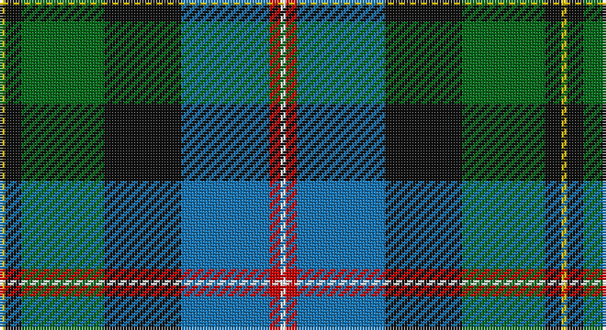

This page is one **sett** — a single exact thread-count. It belongs to the [tartan](/setts/w1r2b16k14g15k3ly1/)
(the same proportion at any scale), whose colour order is pattern [WRBKGKY](/stripes/wrbkgky/).

Part of the [Macneil of Barra](/tartans/macneil-of-barra/) tartan — the named design grouping this sett with its other cloths.

Sourced from register-of-tartans.  It is a [7 stripe tartan](/stripes/stripes7/).

Original link https://www.tartanregister.gov.uk/tartanDetails.aspx?ref=2679

## Also known as

This cloth is also recorded under:

- MacNeil of Barra

## Register references

External register numbers recorded for this tartan.

- Scottish Register of Tartans: [2679](https://www.tartanregister.gov.uk/tartanDetails.aspx?ref=2679)
- Scottish Tartans Authority (ITI): 1839
- Scottish Tartans World Register: 1839

## Thread count
Y/2 K6 G30 K28 B32 R4 W/2

One full sett is **204 threads**.

## Palette

Palette: <strong>Tartan Register</strong>
<table><thead><tr><th>Colour</th><th>Threads</th><th>Shade</th><th>Base</th><th>OKLCh</th></tr></thead><tbody><tr><td>Y/</td><td style="text-align:right;font-variant-numeric:tabular-nums">2</td><td><code style="background-color:#E8C000;">#E8C000</code> <small style="color:#888">#E8C000</small></td><td>Y <code style="background-color:#F2BF00;">#F2BF00</code></td><td><small style="color:#888">oklch(81.9% 0.168 93.7)</small></td></tr><tr><td>K</td><td style="text-align:right;font-variant-numeric:tabular-nums">6</td><td><code style="background-color:#101010;">#101010</code> <small style="color:#888">#101010</small></td><td>K <code style="background-color:#000000;">#000000</code></td><td><small style="color:#888">oklch(17.3% 0.000 89.9)</small></td></tr><tr><td>G</td><td style="text-align:right;font-variant-numeric:tabular-nums">30</td><td><code style="background-color:#006818;">#006818</code> <small style="color:#888">#006818</small></td><td>G <code style="background-color:#006100;">#006100</code></td><td><small style="color:#888">oklch(45.0% 0.142 145.0)</small></td></tr><tr><td>K</td><td style="text-align:right;font-variant-numeric:tabular-nums">28</td><td><code style="background-color:#101010;">#101010</code> <small style="color:#888">#101010</small></td><td>K <code style="background-color:#000000;">#000000</code></td><td><small style="color:#888">oklch(17.3% 0.000 89.9)</small></td></tr><tr><td>B</td><td style="text-align:right;font-variant-numeric:tabular-nums">32</td><td><code style="background-color:#1474B4;">#1474B4</code> <small style="color:#888">#1474B4</small></td><td>B <code style="background-color:#2A418A;">#2A418A</code></td><td><small style="color:#888">oklch(54.0% 0.129 245.1)</small></td></tr><tr><td>R</td><td style="text-align:right;font-variant-numeric:tabular-nums">4</td><td><code style="background-color:#C80000;">#C80000</code> <small style="color:#888">#C80000</small></td><td>R <code style="background-color:#CC0000;">#CC0000</code></td><td><small style="color:#888">oklch(52.3% 0.215 29.2)</small></td></tr><tr><td>W/</td><td style="text-align:right;font-variant-numeric:tabular-nums">2</td><td><code style="background-color:#FCFCFC;">#FCFCFC</code> <small style="color:#888">#FCFCFC</small></td><td>W <code style="background-color:#F7F7F7;">#F7F7F7</code></td><td><small style="color:#888">oklch(99.1% 0.000 89.9)</small></td></tr></tbody></table>

# Sample pattern

## Nearest tartans

The nearest existing variants by ΔTartan distance, with this tartan at the top so the swatches line up against it.

ΔTartan

Tartan

Sett

—

<a href="/ttd/edit/#slug=w1r2b16k14g15k3ly1~x2">Macneil of Barra - Chief (Personal)</a> <a class="nn-out" href="/variants/s7/w1r2b16k14g15k3ly1~x2/" title="open its dictionary page">↗</a>

0.82

<a href="/ttd/edit/#slug=w2r3db33k33g33k6ly2~x2&amp;base=w1r2b16k14g15k3ly1~x2">MacNeil - 1840 (Chief's sett)</a> <a class="nn-out" href="/variants/s7/w2r3db33k33g33k6ly2~x2/" title="open its dictionary page">↗</a>

0.83

<a href="/ttd/edit/#slug=r3g2db27k19g27dp2ly3~x2&amp;base=w1r2b16k14g15k3ly1~x2">Christian Hunting (Personal)</a> <a class="nn-out" href="/variants/s7/r3g2db27k19g27dp2ly3~x2/" title="open its dictionary page">↗</a>

0.90

<a href="/ttd/edit/#slug=g3dp4g23k10r2k10t18k1w3~x2&amp;base=w1r2b16k14g15k3ly1~x2">Birch Family Tartan</a> <a class="nn-out" href="/variants/s9/g3dp4g23k10r2k10t18k1w3~x2/" title="open its dictionary page">↗</a>

0.95

<a href="/ttd/edit/#slug=t34r3t8db4t8k24g34k2w6&amp;base=w1r2b16k14g15k3ly1~x2">Hogg Dress (Name)</a> <a class="nn-out" href="/variants/s9/t34r3t8db4t8k24g34k2w6/" title="open its dictionary page">↗</a>

0.97

<a href="/ttd/edit/#slug=dbi5w3r12g37k12db21w2~x2&amp;base=w1r2b16k14g15k3ly1~x2">Bergen Scottish</a> <a class="nn-out" href="/variants/s7/dbi5w3r12g37k12db21w2~x2/" title="open its dictionary page">↗</a>

0.99

<a href="/ttd/edit/#slug=w3k1g20k16db20k1ly3~x2&amp;base=w1r2b16k14g15k3ly1~x2">MacCormick</a> <a class="nn-out" href="/variants/s7/w3k1g20k16db20k1ly3~x2/" title="open its dictionary page">↗</a>

1.00

<a href="/ttd/edit/#slug=g20dg14db9ly2db9k1w2~x4&amp;base=w1r2b16k14g15k3ly1~x2">Hughes</a> <a class="nn-out" href="/variants/s7/g20dg14db9ly2db9k1w2~x4/" title="open its dictionary page">↗</a>

1.00

<a href="/ttd/edit/#slug=k6r3g30ly10db30w3~x2&amp;base=w1r2b16k14g15k3ly1~x2">Turnbull of Thornton (Personal)</a> <a class="nn-out" href="/variants/s6/k6r3g30ly10db30w3~x2/" title="open its dictionary page">↗</a>

1.03

<a href="/ttd/edit/#slug=w2db20r3k10g20lo2~x2&amp;base=w1r2b16k14g15k3ly1~x2">Morris of Eddergoll (Personal)</a> <a class="nn-out" href="/variants/s6/w2db20r3k10g20lo2~x2/" title="open its dictionary page">↗</a>

1.03

<a href="/ttd/edit/#slug=k10ly3k2b20k10g15k2r3w3~x2&amp;base=w1r2b16k14g15k3ly1~x2">McCuaig (2010) (Name)</a> <a class="nn-out" href="/variants/s9/k10ly3k2b20k10g15k2r3w3~x2/" title="open its dictionary page">↗</a>

## Neighbour map

Every grey dot is one of 14360 variants placed by the first two principal components of the ΔTartan feature space (44% of its variance). Red is this tartan; blue dots are its nearest — click one to open its page.

<svg viewBox="0 0 640 380" role="img" style="max-width:100%;height:auto;border:1px solid #e0e0e0;border-radius:4px;display:block" xmlns="http://www.w3.org/2000/svg"><image href="/nn/cloud.v1.png" width="640" height="380"/><a href="/variants/s7/w2r3db33k33g33k6ly2~x2/"><circle cx="182.3" cy="161.3" r="4" fill="#3465a4"><title>MacNeil - 1840 (Chief's sett)</title></circle></a><a href="/variants/s7/r3g2db27k19g27dp2ly3~x2/"><circle cx="174.9" cy="167.6" r="4" fill="#3465a4"><title>Christian Hunting (Personal)</title></circle></a><a href="/variants/s9/g3dp4g23k10r2k10t18k1w3~x2/"><circle cx="160.6" cy="129.1" r="4" fill="#3465a4"><title>Birch Family Tartan</title></circle></a><a href="/variants/s9/t34r3t8db4t8k24g34k2w6/"><circle cx="181.2" cy="142.3" r="4" fill="#3465a4"><title>Hogg Dress (Name)</title></circle></a><a href="/variants/s7/dbi5w3r12g37k12db21w2~x2/"><circle cx="169.7" cy="146.9" r="4" fill="#3465a4"><title>Bergen Scottish</title></circle></a><a href="/variants/s7/w3k1g20k16db20k1ly3~x2/"><circle cx="172.1" cy="161.5" r="4" fill="#3465a4"><title>MacCormick</title></circle></a><a href="/variants/s7/g20dg14db9ly2db9k1w2~x4/"><circle cx="166.8" cy="160.8" r="4" fill="#3465a4"><title>Hughes</title></circle></a><a href="/variants/s6/k6r3g30ly10db30w3~x2/"><circle cx="143.5" cy="174.0" r="4" fill="#3465a4"><title>Turnbull of Thornton (Personal)</title></circle></a><a href="/variants/s6/w2db20r3k10g20lo2~x2/"><circle cx="138.7" cy="182.4" r="4" fill="#3465a4"><title>Morris of Eddergoll (Personal)</title></circle></a><a href="/variants/s9/k10ly3k2b20k10g15k2r3w3~x2/"><circle cx="115.1" cy="160.5" r="4" fill="#3465a4"><title>McCuaig (2010) (Name)</title></circle></a><circle cx="152.1" cy="156.6" r="5" fill="#c00000"/></svg>

ID: /variants/s7/w1r2b16k14g15k3ly1~x2/
