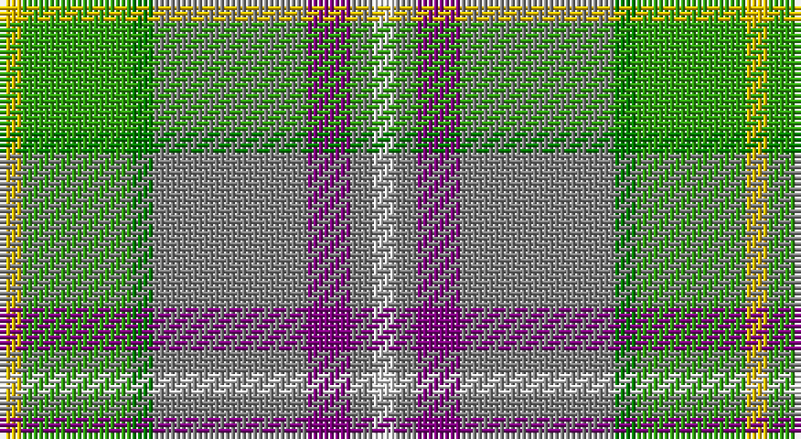

This page is one **sett** — a single exact thread-count. It belongs to the [tartan](/setts/w1y1p2y7g1gi5ly1/)
(the same proportion at any scale), whose colour order is pattern [WGBGGGY](/stripes/wgbgggy/).

Part of the [Deeside](/tartans/deeside/) tartan — the named design grouping this sett with its other cloths.

Sourced from weddslist.  It is a [7 stripe tartan](/stripes/stripes7/).

Original link http://www.weddslist.com/cgi-bin/tartans/pg.pl?source=sts

## Also known as

This cloth is also recorded under:

- Deeside Plaid

## Thread count
Y/4 G20 Ga4 N28 P8 N4 LN/4

One full sett is **136 threads**.

## Palette

Palette: <strong>Tartan Register</strong> <small style="color:#888">(2 of 6 colours)</small>
<table><thead><tr><th>Colour</th><th>Threads</th><th>Shade</th><th>Base</th><th>OKLCh</th></tr></thead><tbody><tr><td>Y/</td><td style="text-align:right;font-variant-numeric:tabular-nums">4</td><td><code style="background-color:#F0C000;">#F0C000</code> <small style="color:#888">#F0C000</small></td><td>Y <code style="background-color:#F2BF00;">#F2BF00</code></td><td><small style="color:#888">oklch(82.7% 0.169 90.5)</small></td></tr><tr><td>G</td><td style="text-align:right;font-variant-numeric:tabular-nums">20</td><td><code style="background-color:#30A010;">#30A010</code> <small style="color:#888">#30A010</small></td><td>G <code style="background-color:#006100;">#006100</code></td><td><small style="color:#888">oklch(61.9% 0.195 140.5)</small></td></tr><tr><td>Ga</td><td style="text-align:right;font-variant-numeric:tabular-nums">4</td><td><code style="background-color:#008000;">#008000</code> <small style="color:#888">#008000</small></td><td>G <code style="background-color:#006100;">#006100</code></td><td><small style="color:#888">oklch(52.0% 0.177 142.5)</small></td></tr><tr><td>N</td><td style="text-align:right;font-variant-numeric:tabular-nums">28</td><td><code style="background-color:#808080;">#808080</code> <small style="color:#888">#808080</small></td><td>G <code style="background-color:#006100;">#006100</code></td><td><small style="color:#888">oklch(60.0% 0.000 89.9)</small></td></tr><tr><td>P</td><td style="text-align:right;font-variant-numeric:tabular-nums">8</td><td><code style="background-color:#800080;">#800080</code> <small style="color:#888">#800080</small></td><td>B <code style="background-color:#2A418A;">#2A418A</code></td><td><small style="color:#888">oklch(42.1% 0.193 328.4)</small></td></tr><tr><td>N</td><td style="text-align:right;font-variant-numeric:tabular-nums">4</td><td><code style="background-color:#808080;">#808080</code> <small style="color:#888">#808080</small></td><td>G <code style="background-color:#006100;">#006100</code></td><td><small style="color:#888">oklch(60.0% 0.000 89.9)</small></td></tr><tr><td>LN/</td><td style="text-align:right;font-variant-numeric:tabular-nums">4</td><td><code style="background-color:#E0E0E0;">#E0E0E0</code> <small style="color:#888">#E0E0E0</small></td><td>W <code style="background-color:#F7F7F7;">#F7F7F7</code></td><td><small style="color:#888">oklch(90.7% 0.000 89.9)</small></td></tr></tbody></table>

# Sample pattern

## Compared to the master

This cloth is one sett of its design; the master sett (the exemplar the design is anchored on) is below for comparison.

<figure style="margin:0"><figcaption style="color:#888;font-size:smaller">this sett</figcaption></figure>
<figure style="margin:0"><figcaption style="color:#888;font-size:smaller"><a href="/setts/b22g4o24dp6o4w3o4dp6o24g4b22ly4/">master sett →</a></figcaption></figure>

## Nearest tartans

The nearest existing variants by ΔTartan distance, with this tartan at the top so the swatches line up against it.

ΔTartan

Tartan

Sett

—

<a href="/ttd/edit/#slug=w1y1p2y7g1gi5ly1~x4">Deeside</a> <a class="nn-out" href="/variants/s7/w1y1p2y7g1gi5ly1~x4/" title="open its dictionary page">↗</a>

0.76

<a href="/ttd/edit/#slug=g25r9t3ly7w3n11~x3&amp;base=w1y1p2y7g1gi5ly1~x4">Montessori School of Denver (School)</a> <a class="nn-out" href="/variants/s6/g25r9t3ly7w3n11~x3/" title="open its dictionary page">↗</a>

1.07

<a href="/ttd/edit/#slug=o3lb2g19lb6g2lb6oi14m4w2~x2&amp;base=w1y1p2y7g1gi5ly1~x4">Royal Pharmaceutical, Society</a> <a class="nn-out" href="/variants/s9/o3lb2g19lb6g2lb6oi14m4w2~x2/" title="open its dictionary page">↗</a>

1.09

<a href="/ttd/edit/#slug=lo5g23b21loi30k10loi4g4loi16lb3~x2&amp;base=w1y1p2y7g1gi5ly1~x4">State Seal of Kansas (Fashion)</a> <a class="nn-out" href="/variants/s9/lo5g23b21loi30k10loi4g4loi16lb3~x2/" title="open its dictionary page">↗</a>

1.29

<a href="/ttd/edit/#slug=lo6t16lb3y3o3g3w2~x4&amp;base=w1y1p2y7g1gi5ly1~x4">Atikokan (District)</a> <a class="nn-out" href="/variants/s7/lo6t16lb3y3o3g3w2~x4/" title="open its dictionary page">↗</a>

1.38

<a href="/ttd/edit/#slug=db4dg41lo4g4lo4g9o18lo4w4~x2&amp;base=w1y1p2y7g1gi5ly1~x4">Gallagher Irish Fashion Tartan</a> <a class="nn-out" href="/variants/s9/db4dg41lo4g4lo4g9o18lo4w4~x2/" title="open its dictionary page">↗</a>

1.41

<a href="/ttd/edit/#slug=db4dg41lo4g4lo4g9r18lo4w4~x2&amp;base=w1y1p2y7g1gi5ly1~x4">Gallagher Ancient</a> <a class="nn-out" href="/variants/s9/db4dg41lo4g4lo4g9r18lo4w4~x2/" title="open its dictionary page">↗</a>

1.42

<a href="/ttd/edit/#slug=lo29ly3b19lb3b3r3g17b3g4lb3~x2&amp;base=w1y1p2y7g1gi5ly1~x4">State Seal of California (Fashion)</a> <a class="nn-out" href="/variants/s10/lo29ly3b19lb3b3r3g17b3g4lb3~x2/" title="open its dictionary page">↗</a>

1.45

<a href="/ttd/edit/#slug=lb2k2g8gi8r1gi1w1~x4&amp;base=w1y1p2y7g1gi5ly1~x4">Lundy (Personal)</a> <a class="nn-out" href="/variants/s7/lb2k2g8gi8r1gi1w1~x4/" title="open its dictionary page">↗</a>

1.45

<a href="/ttd/edit/#slug=db2r1db10w1o4g8ly1g2~x4&amp;base=w1y1p2y7g1gi5ly1~x4">Ayrshire</a> <a class="nn-out" href="/variants/s8/db2r1db10w1o4g8ly1g2~x4/" title="open its dictionary page">↗</a>

1.46

<a href="/ttd/edit/#slug=r4g3o8w3o4g18ly3~x2&amp;base=w1y1p2y7g1gi5ly1~x4">Newfoundland</a> <a class="nn-out" href="/variants/s7/r4g3o8w3o4g18ly3~x2/" title="open its dictionary page">↗</a>

## Neighbour map

Every grey dot is one of 14360 variants placed by the first two principal components of the ΔTartan feature space (44% of its variance). Red is this tartan; blue dots are its nearest — click one to open its page.

<svg viewBox="0 0 640 380" role="img" style="max-width:100%;height:auto;border:1px solid #e0e0e0;border-radius:4px;display:block" xmlns="http://www.w3.org/2000/svg"><image href="/nn/cloud.v1.png" width="640" height="380"/><a href="/variants/s6/g25r9t3ly7w3n11~x3/"><circle cx="182.3" cy="200.9" r="4" fill="#3465a4"><title>Montessori School of Denver (School)</title></circle></a><a href="/variants/s9/o3lb2g19lb6g2lb6oi14m4w2~x2/"><circle cx="154.6" cy="164.9" r="4" fill="#3465a4"><title>Royal Pharmaceutical, Society</title></circle></a><a href="/variants/s9/lo5g23b21loi30k10loi4g4loi16lb3~x2/"><circle cx="174.3" cy="180.7" r="4" fill="#3465a4"><title>State Seal of Kansas (Fashion)</title></circle></a><a href="/variants/s7/lo6t16lb3y3o3g3w2~x4/"><circle cx="167.6" cy="168.1" r="4" fill="#3465a4"><title>Atikokan (District)</title></circle></a><a href="/variants/s9/db4dg41lo4g4lo4g9o18lo4w4~x2/"><circle cx="209.3" cy="147.4" r="4" fill="#3465a4"><title>Gallagher Irish Fashion Tartan</title></circle></a><a href="/variants/s9/db4dg41lo4g4lo4g9r18lo4w4~x2/"><circle cx="203.0" cy="143.9" r="4" fill="#3465a4"><title>Gallagher Ancient</title></circle></a><a href="/variants/s10/lo29ly3b19lb3b3r3g17b3g4lb3~x2/"><circle cx="159.6" cy="154.1" r="4" fill="#3465a4"><title>State Seal of California (Fashion)</title></circle></a><a href="/variants/s7/lb2k2g8gi8r1gi1w1~x4/"><circle cx="157.6" cy="181.9" r="4" fill="#3465a4"><title>Lundy (Personal)</title></circle></a><a href="/variants/s8/db2r1db10w1o4g8ly1g2~x4/"><circle cx="191.7" cy="173.1" r="4" fill="#3465a4"><title>Ayrshire</title></circle></a><a href="/variants/s7/r4g3o8w3o4g18ly3~x2/"><circle cx="224.5" cy="215.2" r="4" fill="#3465a4"><title>Newfoundland</title></circle></a><circle cx="189.6" cy="188.6" r="5" fill="#c00000"/></svg>

ID: /variants/s7/w1y1p2y7g1gi5ly1~x4/
