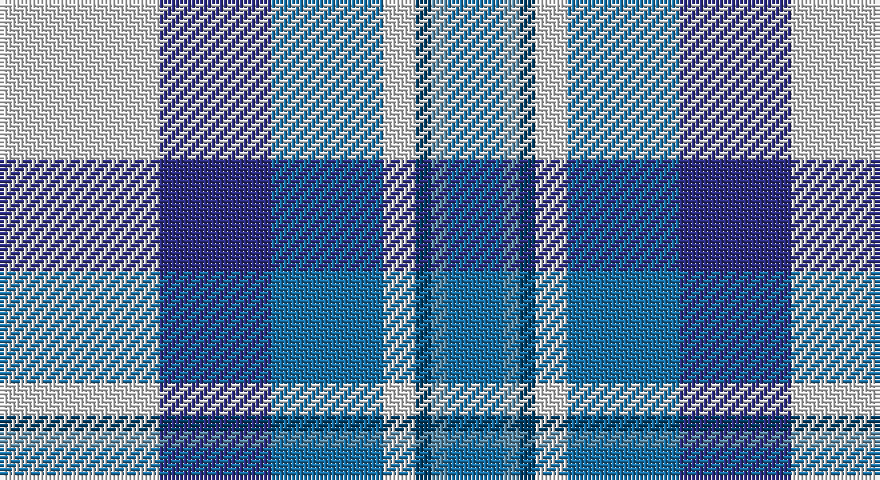

This page is one **sett** — a single exact thread-count. It belongs to the [tartan](/setts/w20db14b14w4dt2t2b7/)
(the same proportion at any scale), whose colour order is pattern [BBBWBBW](/stripes/bbbwbbw/).

Part of the [Earl of St. Andrews Dress](/tartans/earl-of-st-andrews-dress/) tartan — the named design grouping this sett with its other cloths.

Sourced from tartans-authority.  It is a [7 stripe tartan](/stripes/stripes7/).

Original link http://www.tartansauthority.com/tartan-ferret/display/4778/

## Register references

External register numbers recorded for this tartan.

- Scottish Tartans Authority (ITI): 4778

## Thread count
LN/40 DBa28 Ba28 LN8 DB4 B4 Ba/14

One full sett is **198 threads**.

## Palette

Palette: <strong>Tartan Register</strong>
<table><thead><tr><th>Colour</th><th>Threads</th><th>Shade</th><th>Base</th><th>OKLCh</th></tr></thead><tbody><tr><td>LN/</td><td style="text-align:right;font-variant-numeric:tabular-nums">40</td><td><code style="background-color:#E0E0E0;">#E0E0E0</code> <small style="color:#888">#E0E0E0</small></td><td>W <code style="background-color:#F7F7F7;">#F7F7F7</code></td><td><small style="color:#888">oklch(90.7% 0.000 89.9)</small></td></tr><tr><td>DBa</td><td style="text-align:right;font-variant-numeric:tabular-nums">28</td><td><code style="background-color:#2C2C80;">#2C2C80</code> <small style="color:#888">#2C2C80</small></td><td>B <code style="background-color:#2A418A;">#2A418A</code></td><td><small style="color:#888">oklch(35.0% 0.138 276.6)</small></td></tr><tr><td>Ba</td><td style="text-align:right;font-variant-numeric:tabular-nums">28</td><td><code style="background-color:#1870A4;">#1870A4</code> <small style="color:#888">#1870A4</small></td><td>B <code style="background-color:#2A418A;">#2A418A</code></td><td><small style="color:#888">oklch(52.2% 0.113 241.2)</small></td></tr><tr><td>LN</td><td style="text-align:right;font-variant-numeric:tabular-nums">8</td><td><code style="background-color:#E0E0E0;">#E0E0E0</code> <small style="color:#888">#E0E0E0</small></td><td>W <code style="background-color:#F7F7F7;">#F7F7F7</code></td><td><small style="color:#888">oklch(90.7% 0.000 89.9)</small></td></tr><tr><td>DB</td><td style="text-align:right;font-variant-numeric:tabular-nums">4</td><td><code style="background-color:#003C64;">#003C64</code> <small style="color:#888">#003C64</small></td><td>B <code style="background-color:#2A418A;">#2A418A</code></td><td><small style="color:#888">oklch(34.5% 0.089 246.0)</small></td></tr><tr><td>B</td><td style="text-align:right;font-variant-numeric:tabular-nums">4</td><td><code style="background-color:#5C8CA8;">#5C8CA8</code> <small style="color:#888">#5C8CA8</small></td><td>B <code style="background-color:#2A418A;">#2A418A</code></td><td><small style="color:#888">oklch(61.7% 0.067 235.0)</small></td></tr><tr><td>Ba/</td><td style="text-align:right;font-variant-numeric:tabular-nums">14</td><td><code style="background-color:#1870A4;">#1870A4</code> <small style="color:#888">#1870A4</small></td><td>B <code style="background-color:#2A418A;">#2A418A</code></td><td><small style="color:#888">oklch(52.2% 0.113 241.2)</small></td></tr></tbody></table>

# Sample pattern

## Compared to the master

This cloth is one sett of its design; the master sett (the exemplar the design is anchored on) is below for comparison.

<figure style="margin:0"><figcaption style="color:#888;font-size:smaller">this sett</figcaption></figure>
<figure style="margin:0"><figcaption style="color:#888;font-size:smaller"><a href="/setts/w20db14dt14w4dbi2b2dt7/">master sett →</a></figcaption></figure>

## Nearest tartans

The nearest existing variants by ΔTartan distance, with this tartan at the top so the swatches line up against it.

ΔTartan

Tartan

Sett

—

<a href="/ttd/edit/#slug=w20db14b14w4dt2t2b7~x2">Earl of St. Andrews Dress (Dance)</a> <a class="nn-out" href="/variants/s7/w20db14b14w4dt2t2b7~x2/" title="open its dictionary page">↗</a>

0.72

<a href="/ttd/edit/#slug=w28t19db19w4dbi2lp2db7~x2&amp;base=w20db14b14w4dt2t2b7~x2">St Andrews, Earl of, dress</a> <a class="nn-out" href="/variants/s7/w28t19db19w4dbi2lp2db7~x2/" title="open its dictionary page">↗</a>

0.76

<a href="/ttd/edit/#slug=w28t19dbi19w4db2p2dbi7~x2&amp;base=w20db14b14w4dt2t2b7~x2">St. Andrews Dress, Earl of (Danc</a> <a class="nn-out" href="/variants/s7/w28t19dbi19w4db2p2dbi7~x2/" title="open its dictionary page">↗</a>

0.76

<a href="/ttd/edit/#slug=w28t19dbi19w4db2lp2dbi7~x2&amp;base=w20db14b14w4dt2t2b7~x2">St Andrews Dress, Earl of.. District Tartan</a> <a class="nn-out" href="/variants/s7/w28t19dbi19w4db2lp2dbi7~x2/" title="open its dictionary page">↗</a>

0.78

<a href="/ttd/edit/#slug=w20db14dt14w4dbi2b2dt7~x2&amp;base=w20db14b14w4dt2t2b7~x2">Earl of St. Andrews Dress</a> <a class="nn-out" href="/variants/s7/w20db14dt14w4dbi2b2dt7~x2/" title="open its dictionary page">↗</a>

1.03

<a href="/ttd/edit/#slug=t34db24w18r3w18g2w3~x2&amp;base=w20db14b14w4dt2t2b7~x2">Ferguson, dress</a> <a class="nn-out" href="/variants/s7/t34db24w18r3w18g2w3~x2/" title="open its dictionary page">↗</a>

1.11

<a href="/ttd/edit/#slug=t12k1t1k1t1db8w9o2~x4&amp;base=w20db14b14w4dt2t2b7~x2">Arran - 1989 (Fashion)</a> <a class="nn-out" href="/variants/s8/t12k1t1k1t1db8w9o2~x4/" title="open its dictionary page">↗</a>

1.16

<a href="/ttd/edit/#slug=g4w28db14ly2t17g4~x2&amp;base=w20db14b14w4dt2t2b7~x2">Allanton Dress (Fashion)</a> <a class="nn-out" href="/variants/s6/g4w28db14ly2t17g4~x2/" title="open its dictionary page">↗</a>

1.18

<a href="/ttd/edit/#slug=t12k1t1k1t1db8w9y2~x4&amp;base=w20db14b14w4dt2t2b7~x2">Arran (Pendleton)</a> <a class="nn-out" href="/variants/s8/t12k1t1k1t1db8w9y2~x4/" title="open its dictionary page">↗</a>

1.20

<a href="/ttd/edit/#slug=w15lg98dt72b25dt8ly15&amp;base=w20db14b14w4dt2t2b7~x2">Afternoon Tea / Mint Tea</a> <a class="nn-out" href="/variants/s6/w15lg98dt72b25dt8ly15/" title="open its dictionary page">↗</a>

1.23

<a href="/ttd/edit/#slug=k2lb16w2dt16w15k2w2~x2&amp;base=w20db14b14w4dt2t2b7~x2">Strathclyde District Tartan</a> <a class="nn-out" href="/variants/s7/k2lb16w2dt16w15k2w2~x2/" title="open its dictionary page">↗</a>

## Neighbour map

Every grey dot is one of 14360 variants placed by the first two principal components of the ΔTartan feature space (44% of its variance). Red is this tartan; blue dots are its nearest — click one to open its page.

<svg viewBox="0 0 640 380" role="img" style="max-width:100%;height:auto;border:1px solid #e0e0e0;border-radius:4px;display:block" xmlns="http://www.w3.org/2000/svg"><image href="/nn/cloud.v1.png" width="640" height="380"/><a href="/variants/s7/w28t19db19w4dbi2lp2db7~x2/"><circle cx="173.4" cy="158.9" r="4" fill="#3465a4"><title>St Andrews, Earl of, dress</title></circle></a><a href="/variants/s7/w28t19dbi19w4db2p2dbi7~x2/"><circle cx="169.1" cy="156.4" r="4" fill="#3465a4"><title>St. Andrews Dress, Earl of (Danc</title></circle></a><a href="/variants/s7/w28t19dbi19w4db2lp2dbi7~x2/"><circle cx="169.1" cy="156.3" r="4" fill="#3465a4"><title>St Andrews Dress, Earl of.. District Tartan</title></circle></a><a href="/variants/s7/w20db14dt14w4dbi2b2dt7~x2/"><circle cx="128.5" cy="172.8" r="4" fill="#3465a4"><title>Earl of St. Andrews Dress</title></circle></a><a href="/variants/s7/t34db24w18r3w18g2w3~x2/"><circle cx="158.4" cy="150.7" r="4" fill="#3465a4"><title>Ferguson, dress</title></circle></a><a href="/variants/s8/t12k1t1k1t1db8w9o2~x4/"><circle cx="155.4" cy="143.3" r="4" fill="#3465a4"><title>Arran - 1989 (Fashion)</title></circle></a><a href="/variants/s6/g4w28db14ly2t17g4~x2/"><circle cx="161.8" cy="164.8" r="4" fill="#3465a4"><title>Allanton Dress (Fashion)</title></circle></a><a href="/variants/s8/t12k1t1k1t1db8w9y2~x4/"><circle cx="157.8" cy="148.9" r="4" fill="#3465a4"><title>Arran (Pendleton)</title></circle></a><a href="/variants/s6/w15lg98dt72b25dt8ly15/"><circle cx="192.8" cy="182.3" r="4" fill="#3465a4"><title>Afternoon Tea / Mint Tea</title></circle></a><a href="/variants/s7/k2lb16w2dt16w15k2w2~x2/"><circle cx="138.8" cy="184.6" r="4" fill="#3465a4"><title>Strathclyde District Tartan</title></circle></a><circle cx="143.4" cy="182.4" r="5" fill="#c00000"/></svg>

ID: /variants/s7/w20db14b14w4dt2t2b7~x2/
