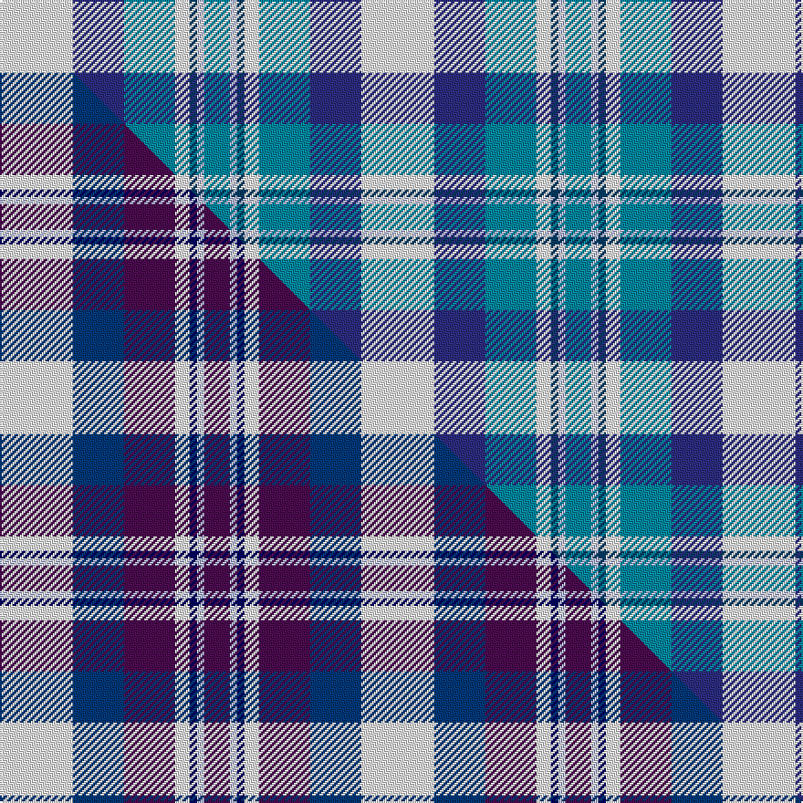

This page is one **sett** — a single exact thread-count. It belongs to the [tartan](/setts/w20dbi14t14w4db2lb2t7/)
(the same proportion at any scale), whose colour order is pattern [BWBWBBW](/stripes/bwbwbbw/).

Part of the [Earl of St. Andrews Dress](/tartans/earl-of-st-andrews-dress/) tartan — the named design grouping this sett with its other cloths.

Sourced from tartans-authority.  It is a [7 stripe tartan](/stripes/stripes7/).

Original link http://www.tartansauthority.com/tartan-ferret/display/4778/

## Register references

External register numbers recorded for this tartan.

- Scottish Tartans Authority (ITI): 4778

## Thread count
W/40 DBi28 T28 W8 DB4 LB4 T/14

One full sett is **198 threads**.

## Palette
<table><thead><tr><th>Colour</th><th>Shade</th><th>OKLCh</th></tr></thead><tbody><tr><td>LB</td><td><code style="background-color:#B5BBDE;">#B5BBDE</code> <small style="color:#888">#B5BBDE</small></td><td><small style="color:#888">oklch(79.9% 0.050 277.6)</small></td></tr><tr><td>T</td><td><code style="background-color:#00879F;">#00879F</code> <small style="color:#888">#00879F</small></td><td><small style="color:#888">oklch(57.4% 0.102 216.1)</small></td></tr><tr><td>DB</td><td><code style="background-color:#003C64;">#003C64</code> <small style="color:#888">#003C64</small></td><td><small style="color:#888">oklch(34.5% 0.089 246.0)</small></td></tr><tr><td>DB</td><td><code style="background-color:#2C2C80;">#2C2C80</code> <small style="color:#888">#2C2C80</small></td><td><small style="color:#888">oklch(35.0% 0.138 276.6)</small></td></tr><tr><td>W</td><td><code style="background-color:#F7F7F7;">#F7F7F7</code> <small style="color:#888">#F7F7F7</small></td><td><small style="color:#888">oklch(97.6% 0.000 89.9)</small></td></tr></tbody></table>

# Sample pattern

## Compared to the master

This cloth is one sett of its design; the master sett (the exemplar the design is anchored on) is below for comparison.

Its **ΔTartan distance** from the master is **1.39** — the same measure the nearest-tartans table ranks by (0 is identical; a re-scale of the same cloth is near 0, a recolour or a different proportion further).

<figure class="master-compare" style="margin:0">

this sett
master sett ★

<figcaption style="color:#888;font-size:smaller">One weave of this sett against the <a href="/setts/w20dbi14dp14w4db2lb2dp7/">master sett ★</a>, split on the diagonal: a shared proportion runs seamlessly across it with only the shades shifting; a different proportion breaks on it.</figcaption>
</figure>

## Nearest variants

The nearest existing variants by ΔTartan distance, with this cloth at the top so the swatches line up against it.

ΔTartan

Threads

Variant

Sett

—

198

<a href="/variants/s7/w20dbi14t14w4db2lb2t7~x2~dbi1406275-db1404245/">Earl of St. Andrews Dress (Dance)</a>

<a href="/ttd/edit/#slug=w20dbi14dp14w4db2lb2dp7~x2~dbi1405255-db0906265&amp;base=w20dbi14t14w4db2lb2t7~x2~dbi1406275-db1404245" title="compare in the TTD">2.70</a>

198

<a href="/variants/s7/w20dbi14dp14w4db2lb2dp7~x2~dbi1405255-db0906265/">Earl of St. Andrews Dress</a>

2.94

—

<a href="/variants/s7/w28lb19dbi19w4db2lp2dbi7~x2~dbi1406275-db1204274/">St Andrews Dress, Earl of.. District Tartan</a>

## Neighbour map

Every grey dot is one of 13620 variants placed by the first two principal components of the ΔTartan feature space (42% of its variance). Red is this tartan; blue dots are its nearest — click one to open its page.

<svg viewBox="0 0 640 380" role="img" style="max-width:100%;height:auto;border:1px solid #e0e0e0;border-radius:4px;display:block" xmlns="http://www.w3.org/2000/svg"><image href="/nn/cloud.v1.png" width="640" height="380"/><a href="/variants/s7/w20dbi14dp14w4db2lb2dp7~x2~dbi1405255-db0906265/"><circle cx="194.1" cy="223.1" r="4" fill="#3465a4"><title>Earl of St. Andrews Dress</title></circle></a><a href="/variants/s7/w28lb19dbi19w4db2lp2dbi7~x2~dbi1406275-db1204274/"><circle cx="235.1" cy="212.0" r="4" fill="#3465a4"><title>St Andrews Dress, Earl of.. District Tartan</title></circle></a><circle cx="207.6" cy="234.9" r="5" fill="#c00000"/><text x="320" y="376" text-anchor="middle" font-size="11" fill="#999">ground</text><text x="11" y="190" text-anchor="middle" font-size="11" fill="#999" transform="rotate(-90 11 190)">complexity</text></svg>

ID: /variants/s7/w20dbi14t14w4db2lb2t7~x2~dbi1406275-db1404245/
