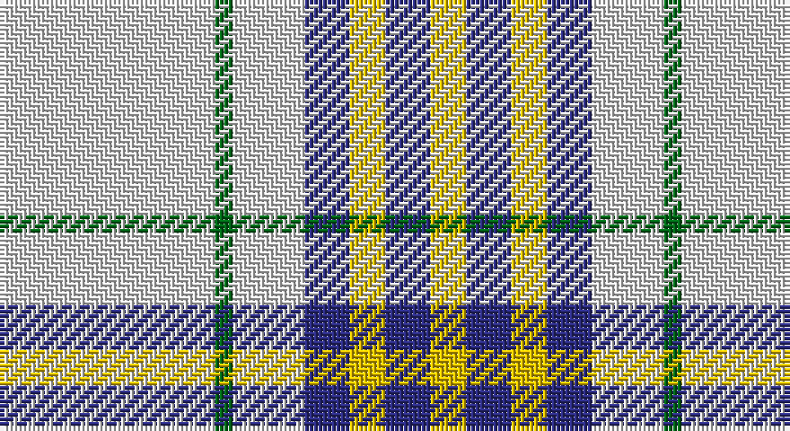

This page is one **sett** — a single exact thread-count. It belongs to the [tartan](/setts/w24g2w8db5ly4db5ly4/)
(the same proportion at any scale), whose colour order is pattern [WGWBYBY](/stripes/wgwbyby/).

Sourced from tartans-authority.  It is a [7 stripe tartan](/stripes/stripes7/).

Original link http://www.tartansauthority.com/tartan-ferret/display/6002/

## Register references

External register numbers recorded for this tartan.

- Scottish Tartans Authority (ITI): 6002

## Thread count
LN/48 G4 LN16 DB10 Y8 DB10 Y/8

One full sett is **152 threads**.

## Palette

Palette: <strong>Tartan Register</strong>
<table><thead><tr><th>Colour</th><th>Threads</th><th>Shade</th><th>Base</th><th>OKLCh</th></tr></thead><tbody><tr><td>LN/</td><td style="text-align:right;font-variant-numeric:tabular-nums">48</td><td><code style="background-color:#E0E0E0;">#E0E0E0</code> <small style="color:#888">#E0E0E0</small></td><td>W <code style="background-color:#F7F7F7;">#F7F7F7</code></td><td><small style="color:#888">oklch(90.7% 0.000 89.9)</small></td></tr><tr><td>G</td><td style="text-align:right;font-variant-numeric:tabular-nums">4</td><td><code style="background-color:#006818;">#006818</code> <small style="color:#888">#006818</small></td><td>G <code style="background-color:#006100;">#006100</code></td><td><small style="color:#888">oklch(45.0% 0.142 145.0)</small></td></tr><tr><td>LN</td><td style="text-align:right;font-variant-numeric:tabular-nums">16</td><td><code style="background-color:#E0E0E0;">#E0E0E0</code> <small style="color:#888">#E0E0E0</small></td><td>W <code style="background-color:#F7F7F7;">#F7F7F7</code></td><td><small style="color:#888">oklch(90.7% 0.000 89.9)</small></td></tr><tr><td>DB</td><td style="text-align:right;font-variant-numeric:tabular-nums">10</td><td><code style="background-color:#2C2C80;">#2C2C80</code> <small style="color:#888">#2C2C80</small></td><td>B <code style="background-color:#2A418A;">#2A418A</code></td><td><small style="color:#888">oklch(35.0% 0.138 276.6)</small></td></tr><tr><td>Y</td><td style="text-align:right;font-variant-numeric:tabular-nums">8</td><td><code style="background-color:#E8C000;">#E8C000</code> <small style="color:#888">#E8C000</small></td><td>Y <code style="background-color:#F2BF00;">#F2BF00</code></td><td><small style="color:#888">oklch(81.9% 0.168 93.7)</small></td></tr><tr><td>DB</td><td style="text-align:right;font-variant-numeric:tabular-nums">10</td><td><code style="background-color:#2C2C80;">#2C2C80</code> <small style="color:#888">#2C2C80</small></td><td>B <code style="background-color:#2A418A;">#2A418A</code></td><td><small style="color:#888">oklch(35.0% 0.138 276.6)</small></td></tr><tr><td>Y/</td><td style="text-align:right;font-variant-numeric:tabular-nums">8</td><td><code style="background-color:#E8C000;">#E8C000</code> <small style="color:#888">#E8C000</small></td><td>Y <code style="background-color:#F2BF00;">#F2BF00</code></td><td><small style="color:#888">oklch(81.9% 0.168 93.7)</small></td></tr></tbody></table>

# Sample pattern

## Nearest tartans

The nearest existing variants by ΔTartan distance, with this tartan at the top so the swatches line up against it.

ΔTartan

Tartan

Sett

—

<a href="/ttd/edit/#slug=w24g2w8db5ly4db5ly4~x2">Clackson Arisaid (Name?)</a> <a class="nn-out" href="/variants/s7/w24g2w8db5ly4db5ly4~x2/" title="open its dictionary page">↗</a>

1.27

<a href="/ttd/edit/#slug=w8ly3w22o22dr3r2w4~x2&amp;base=w24g2w8db5ly4db5ly4~x2">Banff, White (Fashion)</a> <a class="nn-out" href="/variants/s7/w8ly3w22o22dr3r2w4~x2/" title="open its dictionary page">↗</a>

1.34

<a href="/ttd/edit/#slug=w15do6w1do3o3w1~x4&amp;base=w24g2w8db5ly4db5ly4~x2">Burns (Fashion)</a> <a class="nn-out" href="/variants/s6/w15do6w1do3o3w1~x4/" title="open its dictionary page">↗</a>

1.37

<a href="/ttd/edit/#slug=w12r2w12g17w12r2w5p2~x4&amp;base=w24g2w8db5ly4db5ly4~x2">Milne, Green (Dance)</a> <a class="nn-out" href="/variants/s8/w12r2w12g17w12r2w5p2~x4/" title="open its dictionary page">↗</a>

1.47

<a href="/ttd/edit/#slug=w2db1w15t12w1ly3db1~x6&amp;base=w24g2w8db5ly4db5ly4~x2">St. John's (Corporate)</a> <a class="nn-out" href="/variants/s7/w2db1w15t12w1ly3db1~x6/" title="open its dictionary page">↗</a>

1.47

<a href="/ttd/edit/#slug=w5r3w26g21w3g8ly3~x2&amp;base=w24g2w8db5ly4db5ly4~x2">MacPherson Dress Blue (Dance) #2</a> <a class="nn-out" href="/variants/s7/w5r3w26g21w3g8ly3~x2/" title="open its dictionary page">↗</a>

1.50

<a href="/ttd/edit/#slug=w12k3w28g6k4w2k2w14r11g3r4w4~x2&amp;base=w24g2w8db5ly4db5ly4~x2">Grant of Acharrow</a> <a class="nn-out" href="/variants/s12/w12k3w28g6k4w2k2w14r11g3r4w4~x2/" title="open its dictionary page">↗</a>

1.52

<a href="/ttd/edit/#slug=w2o1w2g6w10o6w2g1w2~x2&amp;base=w24g2w8db5ly4db5ly4~x2">O'Neill</a> <a class="nn-out" href="/variants/s9/w2o1w2g6w10o6w2g1w2~x2/" title="open its dictionary page">↗</a>

1.53

<a href="/ttd/edit/#slug=r1w14k6w1k3ly1~x4&amp;base=w24g2w8db5ly4db5ly4~x2">MacPherson #10</a> <a class="nn-out" href="/variants/s6/r1w14k6w1k3ly1~x4/" title="open its dictionary page">↗</a>

1.54

<a href="/ttd/edit/#slug=db9lb27db2ly4db2lb10db2w3~x2&amp;base=w24g2w8db5ly4db5ly4~x2">Alaska Highlanders P &amp; D (Corporate)</a> <a class="nn-out" href="/variants/s8/db9lb27db2ly4db2lb10db2w3~x2/" title="open its dictionary page">↗</a>

1.55

<a href="/ttd/edit/#slug=w14t3w14ly1g20w15t3w7dp3~x2&amp;base=w24g2w8db5ly4db5ly4~x2">Milne dress green</a> <a class="nn-out" href="/variants/s9/w14t3w14ly1g20w15t3w7dp3~x2/" title="open its dictionary page">↗</a>

## Neighbour map

Every grey dot is one of 14360 variants placed by the first two principal components of the ΔTartan feature space (44% of its variance). Red is this tartan; blue dots are its nearest — click one to open its page.

<svg viewBox="0 0 640 380" role="img" style="max-width:100%;height:auto;border:1px solid #e0e0e0;border-radius:4px;display:block" xmlns="http://www.w3.org/2000/svg"><image href="/nn/cloud.v1.png" width="640" height="380"/><a href="/variants/s7/w8ly3w22o22dr3r2w4~x2/"><circle cx="249.2" cy="150.3" r="4" fill="#3465a4"><title>Banff, White (Fashion)</title></circle></a><a href="/variants/s6/w15do6w1do3o3w1~x4/"><circle cx="321.6" cy="166.6" r="4" fill="#3465a4"><title>Burns (Fashion)</title></circle></a><a href="/variants/s8/w12r2w12g17w12r2w5p2~x4/"><circle cx="297.8" cy="193.0" r="4" fill="#3465a4"><title>Milne, Green (Dance)</title></circle></a><a href="/variants/s7/w2db1w15t12w1ly3db1~x6/"><circle cx="286.3" cy="154.5" r="4" fill="#3465a4"><title>St. John's (Corporate)</title></circle></a><a href="/variants/s7/w5r3w26g21w3g8ly3~x2/"><circle cx="262.0" cy="190.3" r="4" fill="#3465a4"><title>MacPherson Dress Blue (Dance) #2</title></circle></a><a href="/variants/s12/w12k3w28g6k4w2k2w14r11g3r4w4~x2/"><circle cx="303.9" cy="127.1" r="4" fill="#3465a4"><title>Grant of Acharrow</title></circle></a><a href="/variants/s9/w2o1w2g6w10o6w2g1w2~x2/"><circle cx="285.4" cy="192.4" r="4" fill="#3465a4"><title>O'Neill</title></circle></a><a href="/variants/s6/r1w14k6w1k3ly1~x4/"><circle cx="300.1" cy="150.2" r="4" fill="#3465a4"><title>MacPherson #10</title></circle></a><a href="/variants/s8/db9lb27db2ly4db2lb10db2w3~x2/"><circle cx="332.5" cy="153.9" r="4" fill="#3465a4"><title>Alaska Highlanders P &amp; D (Corporate)</title></circle></a><a href="/variants/s9/w14t3w14ly1g20w15t3w7dp3~x2/"><circle cx="295.3" cy="142.2" r="4" fill="#3465a4"><title>Milne dress green</title></circle></a><circle cx="303.2" cy="162.2" r="5" fill="#c00000"/></svg>

ID: /variants/s7/w24g2w8db5ly4db5ly4~x2/
