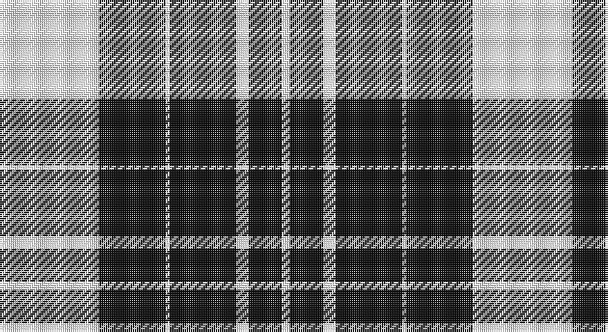

This page is one **sett** — a single exact thread-count. It belongs to the [tartan](/setts/w24k16w1k16w3k8w2/)
(the same proportion at any scale), whose colour order is pattern [WKWKWKW](/stripes/wkwkwkw/).

Sourced from tartans-authority.  It is a [7 stripe tartan](/stripes/stripes7/).

Original link http://www.tartansauthority.com/tartan-ferret/display/8525/

## Register references

External register numbers recorded for this tartan.

- Scottish Register of Tartans: [8525](https://www.tartanregister.gov.uk/tartanDetails?ref=8525)
- Scottish Tartans Authority (ITI): 8525

## Thread count
W/48 K32 W2 K32 W6 K16 W/4

One full sett is **228 threads**.

## Palette

Palette: <strong>Logan (The Scottish Gael, 1831)</strong>
<table><thead><tr><th>Colour</th><th>Threads</th><th>Shade</th><th>Base</th><th>OKLCh</th></tr></thead><tbody><tr><td>W/</td><td style="text-align:right;font-variant-numeric:tabular-nums">48</td><td><code style="background-color:#FCFCFC;">#FCFCFC</code> <small style="color:#888">#FCFCFC</small></td><td>W <code style="background-color:#F7F7F7;">#F7F7F7</code></td><td><small style="color:#888">oklch(99.1% 0.000 89.9)</small></td></tr><tr><td>K</td><td style="text-align:right;font-variant-numeric:tabular-nums">32</td><td><code style="background-color:#101010;">#101010</code> <small style="color:#888">#101010</small></td><td>K <code style="background-color:#000000;">#000000</code></td><td><small style="color:#888">oklch(17.3% 0.000 89.9)</small></td></tr><tr><td>W</td><td style="text-align:right;font-variant-numeric:tabular-nums">2</td><td><code style="background-color:#FCFCFC;">#FCFCFC</code> <small style="color:#888">#FCFCFC</small></td><td>W <code style="background-color:#F7F7F7;">#F7F7F7</code></td><td><small style="color:#888">oklch(99.1% 0.000 89.9)</small></td></tr><tr><td>K</td><td style="text-align:right;font-variant-numeric:tabular-nums">32</td><td><code style="background-color:#101010;">#101010</code> <small style="color:#888">#101010</small></td><td>K <code style="background-color:#000000;">#000000</code></td><td><small style="color:#888">oklch(17.3% 0.000 89.9)</small></td></tr><tr><td>W</td><td style="text-align:right;font-variant-numeric:tabular-nums">6</td><td><code style="background-color:#FCFCFC;">#FCFCFC</code> <small style="color:#888">#FCFCFC</small></td><td>W <code style="background-color:#F7F7F7;">#F7F7F7</code></td><td><small style="color:#888">oklch(99.1% 0.000 89.9)</small></td></tr><tr><td>K</td><td style="text-align:right;font-variant-numeric:tabular-nums">16</td><td><code style="background-color:#101010;">#101010</code> <small style="color:#888">#101010</small></td><td>K <code style="background-color:#000000;">#000000</code></td><td><small style="color:#888">oklch(17.3% 0.000 89.9)</small></td></tr><tr><td>W/</td><td style="text-align:right;font-variant-numeric:tabular-nums">4</td><td><code style="background-color:#FCFCFC;">#FCFCFC</code> <small style="color:#888">#FCFCFC</small></td><td>W <code style="background-color:#F7F7F7;">#F7F7F7</code></td><td><small style="color:#888">oklch(99.1% 0.000 89.9)</small></td></tr></tbody></table>

# Sample pattern

## Nearest tartans

The nearest existing variants by ΔTartan distance, with this tartan at the top so the swatches line up against it.

ΔTartan

Tartan

Sett

—

<a href="/ttd/edit/#slug=w24k16w1k16w3k8w2~x2">Saks Fifth Avenue (Corp)</a> <a class="nn-out" href="/variants/s7/w24k16w1k16w3k8w2~x2/" title="open its dictionary page">↗</a>

1.18

<a href="/variants/s8/w5k20w10k1r2~x2/">St. Piran Cornish Flag</a>

1.30

<a href="/ttd/edit/#slug=w8k1w8k12w1~x2&amp;base=w24k16w1k16w3k8w2~x2">MacLeod, Black &amp; White</a> <a class="nn-out" href="/variants/s5/w8k1w8k12w1~x2/" title="open its dictionary page">↗</a>

1.33

<a href="/ttd/edit/#slug=w5k20w10k1r2~x2&amp;base=w24k16w1k16w3k8w2~x2">Cornish Flag (District)</a> <a class="nn-out" href="/variants/s5/w5k20w10k1r2~x2/" title="open its dictionary page">↗</a>

1.35

<a href="/ttd/edit/#slug=w6k1w2k4w4k2w4k15r1~x2&amp;base=w24k16w1k16w3k8w2~x2">Menzies Dress Tartan</a> <a class="nn-out" href="/variants/s9/w6k1w2k4w4k2w4k15r1~x2/" title="open its dictionary page">↗</a>

1.37

<a href="/ttd/edit/#slug=w36k8w36k95w4k4r6&amp;base=w24k16w1k16w3k8w2~x2">Gretna Football Club (Corporate)</a> <a class="nn-out" href="/variants/s7/w36k8w36k95w4k4r6/" title="open its dictionary page">↗</a>

1.37

<a href="/ttd/edit/#slug=k22w3k3w11k1~x2&amp;base=w24k16w1k16w3k8w2~x2">MacPhee MacFee or MacIver</a> <a class="nn-out" href="/variants/s5/k22w3k3w11k1~x2/" title="open its dictionary page">↗</a>

1.45

<a href="/ttd/edit/#slug=w5r3w35k28w4k11w2~x2&amp;base=w24k16w1k16w3k8w2~x2">MacPherson of Cluny (Black and White)</a> <a class="nn-out" href="/variants/s7/w5r3w35k28w4k11w2~x2/" title="open its dictionary page">↗</a>

1.51

<a href="/ttd/edit/#slug=k12lr1k2lr6k4lr3k4lr21r4~x2&amp;base=w24k16w1k16w3k8w2~x2">MacKnight (Name)</a> <a class="nn-out" href="/variants/s9/k12lr1k2lr6k4lr3k4lr21r4~x2/" title="open its dictionary page">↗</a>

1.58

<a href="/ttd/edit/#slug=lr3k24lr6k8w4k8lr35k2~x2&amp;base=w24k16w1k16w3k8w2~x2">Nowell/Noel 1951 (Name)</a> <a class="nn-out" href="/variants/s8/lr3k24lr6k8w4k8lr35k2~x2/" title="open its dictionary page">↗</a>

1.63

<a href="/ttd/edit/#slug=k27w29k5w14r2~x2&amp;base=w24k16w1k16w3k8w2~x2">McPartlin (Personal)</a> <a class="nn-out" href="/variants/s5/k27w29k5w14r2~x2/" title="open its dictionary page">↗</a>

## Neighbour map

Every grey dot is one of 14360 variants placed by the first two principal components of the ΔTartan feature space (44% of its variance). Red is this tartan; blue dots are its nearest — click one to open its page.

<svg viewBox="0 0 640 380" role="img" style="max-width:100%;height:auto;border:1px solid #e0e0e0;border-radius:4px;display:block" xmlns="http://www.w3.org/2000/svg"><image href="/nn/cloud.v1.png" width="640" height="380"/><a href="/variants/s8/w5k20w10k1r2~x2/"><circle cx="343.7" cy="171.7" r="4" fill="#3465a4"><title>St. Piran Cornish Flag</title></circle></a><a href="/variants/s5/w8k1w8k12w1~x2/"><circle cx="319.2" cy="230.5" r="4" fill="#3465a4"><title>MacLeod, Black &amp; White</title></circle></a><a href="/variants/s5/w5k20w10k1r2~x2/"><circle cx="324.2" cy="182.4" r="4" fill="#3465a4"><title>Cornish Flag (District)</title></circle></a><a href="/variants/s9/w6k1w2k4w4k2w4k15r1~x2/"><circle cx="315.1" cy="167.1" r="4" fill="#3465a4"><title>Menzies Dress Tartan</title></circle></a><a href="/variants/s7/w36k8w36k95w4k4r6/"><circle cx="345.3" cy="144.6" r="4" fill="#3465a4"><title>Gretna Football Club (Corporate)</title></circle></a><a href="/variants/s5/k22w3k3w11k1~x2/"><circle cx="412.0" cy="197.7" r="4" fill="#3465a4"><title>MacPhee MacFee or MacIver</title></circle></a><a href="/variants/s7/w5r3w35k28w4k11w2~x2/"><circle cx="300.9" cy="158.2" r="4" fill="#3465a4"><title>MacPherson of Cluny (Black and White)</title></circle></a><a href="/variants/s9/k12lr1k2lr6k4lr3k4lr21r4~x2/"><circle cx="325.1" cy="160.1" r="4" fill="#3465a4"><title>MacKnight (Name)</title></circle></a><a href="/variants/s8/lr3k24lr6k8w4k8lr35k2~x2/"><circle cx="304.2" cy="170.0" r="4" fill="#3465a4"><title>Nowell/Noel 1951 (Name)</title></circle></a><a href="/variants/s5/k27w29k5w14r2~x2/"><circle cx="298.6" cy="201.7" r="4" fill="#3465a4"><title>McPartlin (Personal)</title></circle></a><circle cx="349.7" cy="184.0" r="5" fill="#c00000"/></svg>

ID: /variants/s7/w24k16w1k16w3k8w2~x2/
