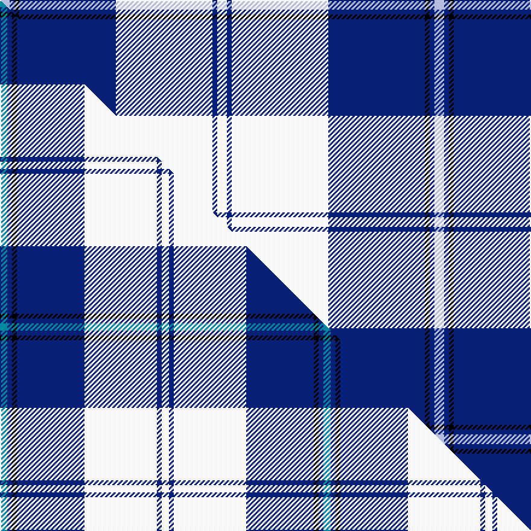

This is one **variant** — a specific cloth: this exact thread count and colourway, with its own
provenance below. It is one weaving of the [sett](/setts/w2db1w20db20k1db1lb2/) (the scale-free proportion — the
same cloth at any scale or shade), whose colour order is pattern [WBKBWBW](/stripes/wbkbwbw/).

Part of the [Cunningham Dress](/tartans/c/cu/cunningham-dress-3/) tartan — the named design grouping this sett with its other cloths.

Sourced from house-of-tartan.  It is a [7 stripe tartan](/stripes/stripes7/).

Original link [http://www.house-of-tartan.scotland.net/house/TartanViewjs.asp?colr=Def&tnam=4642](http://www.house-of-tartan.scotland.net/house/TartanViewjs.asp?colr=Def&tnam=4642)

## Provenance

Earliest known date: 01/01/2002 Like so many of the invented 'Dance' tartans this one is not known by the relevant Clan Cunningham Association (USA). /Threadcount and colours aren't 100% original. Generated manually./

Dataset <small>— provenance for this record, inherited from the source manifest</small>

<dl class="dataset-prov">
<dt>source</dt><dd><a href="/sources/house-of-tartan/">House of Tartan</a></dd>
<dt>data captured from</dt><dd><a href="https://github.com/thetartan/tartan-database/blob/master/data/house-of-tartan/data.csv">https://github.com/thetartan/tartan-database/blob/master/data/house-of-tartan/data.csv</a></dd>
<dt>data date</dt><dd>01/01/2002 <small>(this record)</small></dd>
<dt>licence</dt><dd><a href="https://creativecommons.org/licenses/by-nc-nd/4.0/">CC BY-NC-ND 4.0</a></dd>
</dl>

Capture chain <small>— the hands this data passed through, oldest first; each capture carries its own licence</small>

<ol class="capture-chain">
<li><a href="http://www.house-of-tartan.scotland.net/">House of Tartan</a> <small>the weaver/retailer's database — the site is now offline; the URL is kept as the ultimate source's identity</small></li>
<li><a href="https://github.com/thetartan/tartan-database">thetartan/tartan-database</a> <small>2016-2017</small> · <a href="https://creativecommons.org/licenses/by-nc-nd/4.0/">CC BY-NC-ND 4.0</a> <small>Levko Kravets's frozen compilation — the capture we vendored, and where its CC licence text came from</small></li>
<li>this dictionary <small>captured 2026-06-10 · commit 5bf86c7566</small> <small>each re-capture is a git commit to data/sources</small></li>
</ol>

## Thread count
LB/8 DB4 K4 DB80 W80 DB4 W/8

One full sett is **360 threads**.

## Palette
<table><thead><tr><th>Colour</th><th>Shade</th><th>OKLCh</th></tr></thead><tbody><tr><td>LB</td><td><code style="background-color:#B5BBDE;">#B5BBDE</code> <small style="color:#888">#B5BBDE</small></td><td><small style="color:#888">oklch(79.9% 0.050 277.6)</small></td></tr><tr><td>DB</td><td><code style="background-color:#082077;">#082077</code> <small style="color:#888">#082077</small></td><td><small style="color:#888">oklch(30.0% 0.149 265.1)</small></td></tr><tr><td>K</td><td><code style="background-color:#000000;">#000000</code> <small style="color:#888">#000000</small></td><td><small style="color:#888">oklch(0.0% 0.000 0.0)</small></td></tr><tr><td>W</td><td><code style="background-color:#F7F7F7;">#F7F7F7</code> <small style="color:#888">#F7F7F7</small></td><td><small style="color:#888">oklch(97.6% 0.000 89.9)</small></td></tr></tbody></table>

# Sample pattern

## Compared to the master

This cloth is one sett of its design; the master sett (the exemplar the design is anchored on) is below for comparison.

Its **ΔTartan distance** from the master is **0.34** — the same measure the nearest-tartans table ranks by (0 is identical; a re-scale of the same cloth is near 0, a recolour or a different proportion further).

<figure class="master-compare" style="margin:0">

this sett
master sett ★

<figcaption style="color:#888;font-size:smaller">One weave of this sett against the <a href="/setts/t3db2k2db28w30db2w3/">master sett ★</a>, split on the diagonal: a shared proportion runs seamlessly across it with only the shades shifting; a different proportion breaks on it.</figcaption>
</figure>

## Nearest tartan variants

The nearest existing variants by ΔTartan distance, with this cloth at the top so the swatches line up against it.

ΔTartan

Threads

Variant

Sett

—

360

<a href="/variants/s7/w2db1w20db20k1db1lb2~x4/">Cunningham, Dress Blue (Dance) Fashion Tartan</a>

<a href="/ttd/edit/#slug=t3db2k2db28w30db2w3~x2&amp;base=w2db1w20db20k1db1lb2~x4" title="compare in the TTD">0.34</a>

268

<a href="/variants/s7/t3db2k2db28w30db2w3~x2/">Cunningham, Dress Blue (Dance)</a>

<a href="/ttd/edit/#slug=w52db22w6db8k1g3~x2~g2408144&amp;base=w2db1w20db20k1db1lb2~x4" title="compare in the TTD">2.24</a>

258

<a href="/variants/s6/w52db22w6db8k1g3~x2~g2408144/">MacGregor Dress Blue Fancy Tartan</a>

<a href="/ttd/edit/#slug=w5db32g12db2w30k4~x2&amp;base=w2db1w20db20k1db1lb2~x4" title="compare in the TTD">2.24</a>

322

<a href="/variants/s6/w5db32g12db2w30k4~x2/">Bonnie Royal</a>

<a href="/ttd/edit/#slug=y3db2k2db30w30dbi2w3~x2~db1208274-k0601240-dbi1406275&amp;base=w2db1w20db20k1db1lb2~x4" title="compare in the TTD">2.27</a>

276

<a href="/variants/s7/y3db2k2db30w30dbi2w3~x2~db1208274-k0601240-dbi1406275/">Torridon, Saphire (Dance)</a>

<a href="/ttd/edit/#slug=db8w3db28w32k3w4~x2&amp;base=w2db1w20db20k1db1lb2~x4" title="compare in the TTD">2.28</a>

288

<a href="/variants/s6/db8w3db28w32k3w4~x2/">Ailsa, Navy (Dance)</a>

<a href="/ttd/edit/#slug=w5k3w26db21w3db8y3~x2&amp;base=w2db1w20db20k1db1lb2~x4" title="compare in the TTD">2.34</a>

260

<a href="/variants/s7/w5k3w26db21w3db8y3~x2/">MacPherson Dress Blue (Dance)</a>

<a href="/ttd/edit/#slug=w3db2k4db2w2db26r4w30r2w3~x2&amp;base=w2db1w20db20k1db1lb2~x4" title="compare in the TTD">2.63</a>

300

<a href="/variants/s10/w3db2k4db2w2db26r4w30r2w3~x2/">Harris, Royal Blue (Dance)</a>

<a href="/ttd/edit/#slug=db26w28db14y3k1y2k1~x2&amp;base=w2db1w20db20k1db1lb2~x4" title="compare in the TTD">2.66</a>

246

<a href="/variants/s7/db26w28db14y3k1y2k1~x2/">Gothenburg/Goteborg</a>

<a href="/ttd/edit/#slug=b26w28b14y3k1y2k1~x2&amp;base=w2db1w20db20k1db1lb2~x4" title="compare in the TTD">2.86</a>

246

<a href="/variants/s7/b26w28b14y3k1y2k1~x2/">Gothenburg</a>

<a href="/ttd/edit/#slug=w5dp2w34dp34k2dp2lb4~x2&amp;base=w2db1w20db20k1db1lb2~x4" title="compare in the TTD">2.88</a>

314

<a href="/variants/s7/w5dp2w34dp34k2dp2lb4~x2/">Cunningham Dress Purple (Dance)</a>

## Neighbour map

Every grey dot is one of 13656 variants placed by the first two principal components of the ΔTartan feature space (42% of its variance). Red is this tartan; blue dots are its nearest — click one to open its page. The map is a flat projection of a many-dimensional space — [how to read it](/posts/neighbourhood-maps/).

<svg viewBox="0 0 640 380" role="img" style="max-width:100%;height:auto;border:1px solid #e0e0e0;border-radius:4px;display:block" xmlns="http://www.w3.org/2000/svg"><image href="/nn/cloud.v1.png" width="640" height="380"/><a href="/variants/s7/t3db2k2db28w30db2w3~x2/"><circle cx="252.9" cy="144.6" r="4" fill="#3465a4"><title>Cunningham, Dress Blue (Dance)</title></circle></a><a href="/variants/s6/w52db22w6db8k1g3~x2~g2408144/"><circle cx="291.3" cy="86.0" r="4" fill="#3465a4"><title>MacGregor Dress Blue Fancy Tartan</title></circle></a><a href="/variants/s6/w5db32g12db2w30k4~x2/"><circle cx="198.8" cy="178.4" r="4" fill="#3465a4"><title>Bonnie Royal</title></circle></a><a href="/variants/s7/y3db2k2db30w30dbi2w3~x2~db1208274-k0601240-dbi1406275/"><circle cx="226.5" cy="129.3" r="4" fill="#3465a4"><title>Torridon, Saphire (Dance)</title></circle></a><a href="/variants/s6/db8w3db28w32k3w4~x2/"><circle cx="273.0" cy="197.5" r="4" fill="#3465a4"><title>Ailsa, Navy (Dance)</title></circle></a><a href="/variants/s7/w5k3w26db21w3db8y3~x2/"><circle cx="227.3" cy="188.2" r="4" fill="#3465a4"><title>MacPherson Dress Blue (Dance)</title></circle></a><a href="/variants/s10/w3db2k4db2w2db26r4w30r2w3~x2/"><circle cx="240.7" cy="122.7" r="4" fill="#3465a4"><title>Harris, Royal Blue (Dance)</title></circle></a><a href="/variants/s7/db26w28db14y3k1y2k1~x2/"><circle cx="276.4" cy="126.8" r="4" fill="#3465a4"><title>Gothenburg/Goteborg</title></circle></a><a href="/variants/s7/b26w28b14y3k1y2k1~x2/"><circle cx="300.7" cy="135.8" r="4" fill="#3465a4"><title>Gothenburg</title></circle></a><a href="/variants/s7/w5dp2w34dp34k2dp2lb4~x2/"><circle cx="261.8" cy="136.5" r="4" fill="#3465a4"><title>Cunningham Dress Purple (Dance)</title></circle></a><circle cx="266.9" cy="131.8" r="5" fill="#c00000"/><text x="320" y="376" text-anchor="middle" font-size="11" fill="#999">ground</text><text x="11" y="190" text-anchor="middle" font-size="11" fill="#999" transform="rotate(-90 11 190)">complexity</text></svg>

ID: /variants/s7/w2db1w20db20k1db1lb2~x4/
