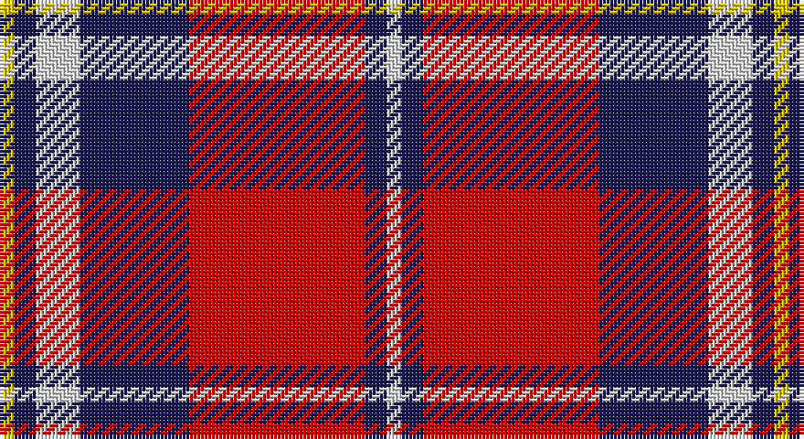

This page is one **sett** — a single exact thread-count. It belongs to the [tartan](/setts/w2db3r24db15w6db3ly2/)
(the same proportion at any scale), whose colour order is pattern [WBRBWBY](/stripes/wbrbwby/).

Sourced from tartans-authority.  It is a [7 stripe tartan](/stripes/stripes7/).

Original link http://www.tartansauthority.com/tartan-ferret/display/7689/

2 attestations — the source records this cloth was collapsed from (oldest owns this page)

<ul>
<li>pre 2008 — Fazzolettone (Fashion?) (tartans-authority, <a href="http://www.tartansauthority.com/tartan-ferret/display/7689/">record</a>)</li>
<li>undated — Fazzolettone (register-of-tartans, <a href="https://www.tartanregister.gov.uk/tartanDetails.aspx?ref=5688">record</a>)</li>
</ul>

## Register references

External register numbers recorded for this tartan.

- Scottish Register of Tartans: [5688](https://www.tartanregister.gov.uk/tartanDetails.aspx?ref=5688)
- Scottish Tartans Authority (ITI): 7689

## Thread count
Y/4 DB6 LN12 DB30 R48 DB6 LN/4

One full sett is **212 threads**.

## Palette

Palette: <strong>Tartan Register</strong>
<table><thead><tr><th>Colour</th><th>Threads</th><th>Shade</th><th>Base</th><th>OKLCh</th></tr></thead><tbody><tr><td>Y/</td><td style="text-align:right;font-variant-numeric:tabular-nums">4</td><td><code style="background-color:#E8C000;">#E8C000</code> <small style="color:#888">#E8C000</small></td><td>Y <code style="background-color:#F2BF00;">#F2BF00</code></td><td><small style="color:#888">oklch(81.9% 0.168 93.7)</small></td></tr><tr><td>DB</td><td style="text-align:right;font-variant-numeric:tabular-nums">6</td><td><code style="background-color:#1C1C50;">#1C1C50</code> <small style="color:#888">#1C1C50</small></td><td>B <code style="background-color:#2A418A;">#2A418A</code></td><td><small style="color:#888">oklch(26.2% 0.093 277.9)</small></td></tr><tr><td>LN</td><td style="text-align:right;font-variant-numeric:tabular-nums">12</td><td><code style="background-color:#E0E0E0;">#E0E0E0</code> <small style="color:#888">#E0E0E0</small></td><td>W <code style="background-color:#F7F7F7;">#F7F7F7</code></td><td><small style="color:#888">oklch(90.7% 0.000 89.9)</small></td></tr><tr><td>DB</td><td style="text-align:right;font-variant-numeric:tabular-nums">30</td><td><code style="background-color:#1C1C50;">#1C1C50</code> <small style="color:#888">#1C1C50</small></td><td>B <code style="background-color:#2A418A;">#2A418A</code></td><td><small style="color:#888">oklch(26.2% 0.093 277.9)</small></td></tr><tr><td>R</td><td style="text-align:right;font-variant-numeric:tabular-nums">48</td><td><code style="background-color:#C80000;">#C80000</code> <small style="color:#888">#C80000</small></td><td>R <code style="background-color:#CC0000;">#CC0000</code></td><td><small style="color:#888">oklch(52.3% 0.215 29.2)</small></td></tr><tr><td>DB</td><td style="text-align:right;font-variant-numeric:tabular-nums">6</td><td><code style="background-color:#1C1C50;">#1C1C50</code> <small style="color:#888">#1C1C50</small></td><td>B <code style="background-color:#2A418A;">#2A418A</code></td><td><small style="color:#888">oklch(26.2% 0.093 277.9)</small></td></tr><tr><td>LN/</td><td style="text-align:right;font-variant-numeric:tabular-nums">4</td><td><code style="background-color:#E0E0E0;">#E0E0E0</code> <small style="color:#888">#E0E0E0</small></td><td>W <code style="background-color:#F7F7F7;">#F7F7F7</code></td><td><small style="color:#888">oklch(90.7% 0.000 89.9)</small></td></tr></tbody></table>

# Sample pattern

## Nearest tartans

The nearest existing variants by ΔTartan distance, with this tartan at the top so the swatches line up against it.

ΔTartan

Tartan

Sett

—

<a href="/ttd/edit/#slug=w2db3r24db15w6db3ly2~x2">Fazzolettone (Fashion?)</a> <a class="nn-out" href="/variants/s7/w2db3r24db15w6db3ly2~x2/" title="open its dictionary page">↗</a>

0.80

<a href="/ttd/edit/#slug=k3r11db3w1db3w1~x4&amp;base=w2db3r24db15w6db3ly2~x2">Suntan (Masai Shuka) (District?)</a> <a class="nn-out" href="/variants/s6/k3r11db3w1db3w1~x4/" title="open its dictionary page">↗</a>

0.86

<a href="/ttd/edit/#slug=db1r16db6ly4db6w1~x4&amp;base=w2db3r24db15w6db3ly2~x2">Superfast Ferries (Corporate)</a> <a class="nn-out" href="/variants/s6/db1r16db6ly4db6w1~x4/" title="open its dictionary page">↗</a>

0.90

<a href="/ttd/edit/#slug=w4k6r3k15r3k6r27db9w2~x2&amp;base=w2db3r24db15w6db3ly2~x2">Memery (Reston, USA)</a> <a class="nn-out" href="/variants/s9/w4k6r3k15r3k6r27db9w2~x2/" title="open its dictionary page">↗</a>

0.97

<a href="/ttd/edit/#slug=g3r2db22r22db2w3~x2&amp;base=w2db3r24db15w6db3ly2~x2">Galloway Red</a> <a class="nn-out" href="/variants/s6/g3r2db22r22db2w3~x2/" title="open its dictionary page">↗</a>

0.99

<a href="/ttd/edit/#slug=db12k3db2r2db2r12w2k1w2~x4&amp;base=w2db3r24db15w6db3ly2~x2">Ainslie</a> <a class="nn-out" href="/variants/s9/db12k3db2r2db2r12w2k1w2~x4/" title="open its dictionary page">↗</a>

1.09

<a href="/ttd/edit/#slug=k3y28k3r22k8w3~x2&amp;base=w2db3r24db15w6db3ly2~x2">Henkel (Corporate)</a> <a class="nn-out" href="/variants/s6/k3y28k3r22k8w3~x2/" title="open its dictionary page">↗</a>

1.12

<a href="/ttd/edit/#slug=lb2r12db2lb6k6lb1&amp;base=w2db3r24db15w6db3ly2~x2">MacTavish</a> <a class="nn-out" href="/variants/s6/lb2r12db2lb6k6lb1/" title="open its dictionary page">↗</a>

1.14

<a href="/ttd/edit/#slug=t2r12db2t6k6t1~x4&amp;base=w2db3r24db15w6db3ly2~x2">Thompson/Thomson/MacTavish</a> <a class="nn-out" href="/variants/s6/t2r12db2t6k6t1~x4/" title="open its dictionary page">↗</a>

1.16

<a href="/ttd/edit/#slug=r1db6r1dg6r12lb1&amp;base=w2db3r24db15w6db3ly2~x2">Fraser VS</a> <a class="nn-out" href="/variants/s6/r1db6r1dg6r12lb1/" title="open its dictionary page">↗</a>

1.18

<a href="/ttd/edit/#slug=db3w12k11r4w2r2w2r24ly3~x2&amp;base=w2db3r24db15w6db3ly2~x2">Hearts Football Club (Corporate)</a> <a class="nn-out" href="/variants/s9/db3w12k11r4w2r2w2r24ly3~x2/" title="open its dictionary page">↗</a>

## Neighbour map

Every grey dot is one of 14360 variants placed by the first two principal components of the ΔTartan feature space (44% of its variance). Red is this tartan; blue dots are its nearest — click one to open its page.

<svg viewBox="0 0 640 380" role="img" style="max-width:100%;height:auto;border:1px solid #e0e0e0;border-radius:4px;display:block" xmlns="http://www.w3.org/2000/svg"><image href="/nn/cloud.v1.png" width="640" height="380"/><a href="/variants/s6/k3r11db3w1db3w1~x4/"><circle cx="264.9" cy="178.8" r="4" fill="#3465a4"><title>Suntan (Masai Shuka) (District?)</title></circle></a><a href="/variants/s6/db1r16db6ly4db6w1~x4/"><circle cx="278.6" cy="169.1" r="4" fill="#3465a4"><title>Superfast Ferries (Corporate)</title></circle></a><a href="/variants/s9/w4k6r3k15r3k6r27db9w2~x2/"><circle cx="224.7" cy="152.1" r="4" fill="#3465a4"><title>Memery (Reston, USA)</title></circle></a><a href="/variants/s6/g3r2db22r22db2w3~x2/"><circle cx="276.5" cy="179.6" r="4" fill="#3465a4"><title>Galloway Red</title></circle></a><a href="/variants/s9/db12k3db2r2db2r12w2k1w2~x4/"><circle cx="221.2" cy="154.1" r="4" fill="#3465a4"><title>Ainslie</title></circle></a><a href="/variants/s6/k3y28k3r22k8w3~x2/"><circle cx="222.1" cy="190.4" r="4" fill="#3465a4"><title>Henkel (Corporate)</title></circle></a><a href="/variants/s6/lb2r12db2lb6k6lb1/"><circle cx="185.0" cy="174.4" r="4" fill="#3465a4"><title>MacTavish</title></circle></a><a href="/variants/s6/t2r12db2t6k6t1~x4/"><circle cx="215.9" cy="193.1" r="4" fill="#3465a4"><title>Thompson/Thomson/MacTavish</title></circle></a><a href="/variants/s6/r1db6r1dg6r12lb1/"><circle cx="280.6" cy="185.4" r="4" fill="#3465a4"><title>Fraser VS</title></circle></a><a href="/variants/s9/db3w12k11r4w2r2w2r24ly3~x2/"><circle cx="211.2" cy="126.1" r="4" fill="#3465a4"><title>Hearts Football Club (Corporate)</title></circle></a><circle cx="239.4" cy="159.2" r="5" fill="#c00000"/></svg>

ID: /variants/s7/w2db3r24db15w6db3ly2~x2/
