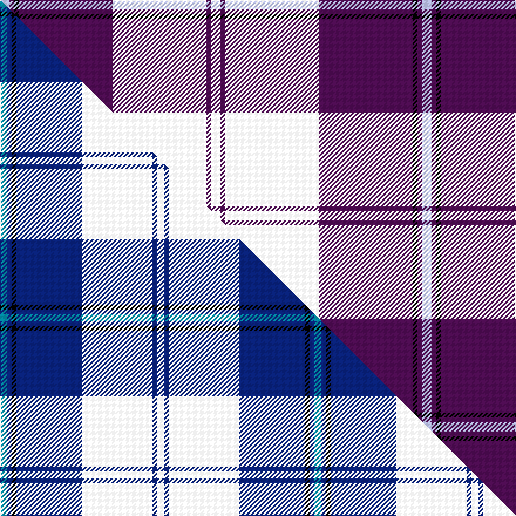

This page is one **sett** — a single exact thread-count. It belongs to the [tartan](/setts/w2dp1w20dp20k1dp1lb2/)
(the same proportion at any scale), whose colour order is pattern [WBKBWBW](/stripes/wbkbwbw/).

Part of the [Cunningham Dress](/tartans/cunningham-dress-2/) tartan — the named design grouping this sett with its other cloths.

Sourced from house-of-tartan.  It is a [7 stripe tartan](/stripes/stripes7/).

Original link http://www.house-of-tartan.scotland.net/house/TartanViewjs.asp?colr=Def&tnam=6531

## Provenance

Earliest known date: 01/01/1986 A dancers' tartan from D C Dalgliesh of Selkirk.

## Thread count
LB/8 DP4 K4 DP80 W80 DP4 W/8

One full sett is **360 threads**.

## Palette
<table><thead><tr><th>Colour</th><th>Shade</th><th>OKLCh</th></tr></thead><tbody><tr><td>LB</td><td><code style="background-color:#B5BBDE;">#B5BBDE</code> <small style="color:#888">#B5BBDE</small></td><td><small style="color:#888">oklch(79.9% 0.050 277.6)</small></td></tr><tr><td>K</td><td><code style="background-color:#000000;">#000000</code> <small style="color:#888">#000000</small></td><td><small style="color:#888">oklch(0.0% 0.000 0.0)</small></td></tr><tr><td>W</td><td><code style="background-color:#F7F7F7;">#F7F7F7</code> <small style="color:#888">#F7F7F7</small></td><td><small style="color:#888">oklch(97.6% 0.000 89.9)</small></td></tr><tr><td>DP</td><td><code style="background-color:#4B0B4F;">#4B0B4F</code> <small style="color:#888">#4B0B4F</small></td><td><small style="color:#888">oklch(30.1% 0.125 325.4)</small></td></tr></tbody></table>

# Sample pattern

## Compared to the master

This cloth is one sett of its design; the master sett (the exemplar the design is anchored on) is below for comparison.

Its **ΔTartan distance** from the master is **1.46** — the same measure the nearest-tartans table ranks by (0 is identical; a re-scale of the same cloth is near 0, a recolour or a different proportion further).

<figure class="master-compare" style="margin:0">

this sett
master sett ★

<figcaption style="color:#888;font-size:smaller">One weave of this sett against the <a href="/setts/t3db2k2db28w30db2w3/">master sett ★</a>, split on the diagonal: a shared proportion runs seamlessly across it with only the shades shifting; a different proportion breaks on it.</figcaption>
</figure>

## Nearest tartan variants

The nearest existing variants by ΔTartan distance, with this cloth at the top so the swatches line up against it.

ΔTartan

Threads

Variant

Sett

—

360

<a href="/variants/s7/w2dp1w20dp20k1dp1lb2~x4/">Cunningham Dress Purple (Dance) Fashion Tartan</a>

<a href="/ttd/edit/#slug=w5dp2w34dp34k2dp2lb4~x2&amp;base=w2dp1w20dp20k1dp1lb2~x4" title="compare in the TTD">0.20</a>

314

<a href="/variants/s7/w5dp2w34dp34k2dp2lb4~x2/">Cunningham Dress Purple (Dance)</a>

<a href="/ttd/edit/#slug=dp8db2dp24db5w26k2w8~x2&amp;base=w2dp1w20dp20k1dp1lb2~x4" title="compare in the TTD">1.92</a>

268

<a href="/variants/s7/dp8db2dp24db5w26k2w8~x2/">Lennox Purple Dress District Tartan</a>

<a href="/ttd/edit/#slug=w5k3w31dp26w4dp10lb4~x2&amp;base=w2dp1w20dp20k1dp1lb2~x4" title="compare in the TTD">2.25</a>

314

<a href="/variants/s7/w5k3w31dp26w4dp10lb4~x2/">MacPherson Dress Purple</a>

## Neighbour map

Every grey dot is one of 13620 variants placed by the first two principal components of the ΔTartan feature space (42% of its variance). Red is this tartan; blue dots are its nearest — click one to open its page.

<svg viewBox="0 0 640 380" role="img" style="max-width:100%;height:auto;border:1px solid #e0e0e0;border-radius:4px;display:block" xmlns="http://www.w3.org/2000/svg"><image href="/nn/cloud.v1.png" width="640" height="380"/><a href="/variants/s7/w5dp2w34dp34k2dp2lb4~x2/"><circle cx="261.7" cy="137.0" r="4" fill="#3465a4"><title>Cunningham Dress Purple (Dance)</title></circle></a><a href="/variants/s7/dp8db2dp24db5w26k2w8~x2/"><circle cx="222.7" cy="172.9" r="4" fill="#3465a4"><title>Lennox Purple Dress District Tartan</title></circle></a><a href="/variants/s7/w5k3w31dp26w4dp10lb4~x2/"><circle cx="236.5" cy="177.6" r="4" fill="#3465a4"><title>MacPherson Dress Purple</title></circle></a><circle cx="272.0" cy="126.9" r="5" fill="#c00000"/><text x="320" y="376" text-anchor="middle" font-size="11" fill="#999">ground</text><text x="11" y="190" text-anchor="middle" font-size="11" fill="#999" transform="rotate(-90 11 190)">complexity</text></svg>

ID: /variants/s7/w2dp1w20dp20k1dp1lb2~x4/
