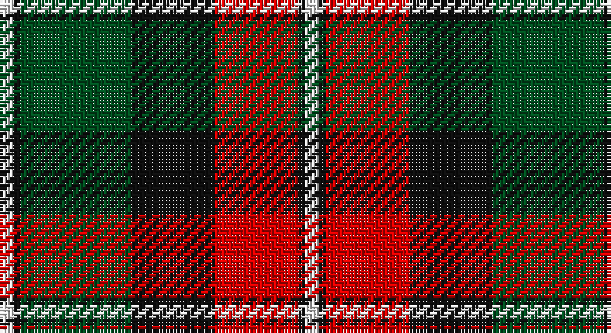

This page is one **sett** — a single exact thread-count. It belongs to the [tartan](/setts/w2k1dg16k12r12k1w2/)
(the same proportion at any scale), whose colour order is pattern [WKGKRKW](/stripes/wkgkrkw/).

Part of the [Prince Edward Island](/tartans/prince-edward-island/) tartan — the named design grouping this sett with its other cloths.

Sourced from register-of-tartans.  It is a [7 stripe tartan](/stripes/stripes7/).

Original link https://www.tartanregister.gov.uk/tartanDetails.aspx?ref=3389

## Also known as

This cloth is also recorded under:

- Prince Edward Island #2

## Register references

External register numbers recorded for this tartan.

- Scottish Register of Tartans: [3389](https://www.tartanregister.gov.uk/tartanDetails.aspx?ref=3389)
- Scottish Tartans World Register: 1815

## Thread count
LN/4 K2 G32 K24 R24 K2 LN/4

One full sett is **176 threads**.

## Palette

Palette: <strong>Tartan Register</strong>
<table><thead><tr><th>Colour</th><th>Threads</th><th>Shade</th><th>Base</th><th>OKLCh</th></tr></thead><tbody><tr><td>LN/</td><td style="text-align:right;font-variant-numeric:tabular-nums">4</td><td><code style="background-color:#E0E0E0;">#E0E0E0</code> <small style="color:#888">#E0E0E0</small></td><td>W <code style="background-color:#F7F7F7;">#F7F7F7</code></td><td><small style="color:#888">oklch(90.7% 0.000 89.9)</small></td></tr><tr><td>K</td><td style="text-align:right;font-variant-numeric:tabular-nums">2</td><td><code style="background-color:#101010;">#101010</code> <small style="color:#888">#101010</small></td><td>K <code style="background-color:#000000;">#000000</code></td><td><small style="color:#888">oklch(17.3% 0.000 89.9)</small></td></tr><tr><td>G</td><td style="text-align:right;font-variant-numeric:tabular-nums">32</td><td><code style="background-color:#005020;">#005020</code> <small style="color:#888">#005020</small></td><td>G <code style="background-color:#006100;">#006100</code></td><td><small style="color:#888">oklch(37.7% 0.105 149.6)</small></td></tr><tr><td>K</td><td style="text-align:right;font-variant-numeric:tabular-nums">24</td><td><code style="background-color:#101010;">#101010</code> <small style="color:#888">#101010</small></td><td>K <code style="background-color:#000000;">#000000</code></td><td><small style="color:#888">oklch(17.3% 0.000 89.9)</small></td></tr><tr><td>R</td><td style="text-align:right;font-variant-numeric:tabular-nums">24</td><td><code style="background-color:#DC0000;">#DC0000</code> <small style="color:#888">#DC0000</small></td><td>R <code style="background-color:#CC0000;">#CC0000</code></td><td><small style="color:#888">oklch(56.2% 0.230 29.2)</small></td></tr><tr><td>K</td><td style="text-align:right;font-variant-numeric:tabular-nums">2</td><td><code style="background-color:#101010;">#101010</code> <small style="color:#888">#101010</small></td><td>K <code style="background-color:#000000;">#000000</code></td><td><small style="color:#888">oklch(17.3% 0.000 89.9)</small></td></tr><tr><td>LN/</td><td style="text-align:right;font-variant-numeric:tabular-nums">4</td><td><code style="background-color:#E0E0E0;">#E0E0E0</code> <small style="color:#888">#E0E0E0</small></td><td>W <code style="background-color:#F7F7F7;">#F7F7F7</code></td><td><small style="color:#888">oklch(90.7% 0.000 89.9)</small></td></tr></tbody></table>

# Sample pattern

## Compared to the master

This cloth is one sett of its design; the master sett (the exemplar the design is anchored on) is below for comparison.

<figure style="margin:0"><figcaption style="color:#888;font-size:smaller">this sett</figcaption></figure>
<figure style="margin:0"><figcaption style="color:#888;font-size:smaller"><a href="/setts/g20dy2g4dy2g4dy18r18dy1ly4dy1r18dy18g18dy1w4/">master sett →</a></figcaption></figure>

## Nearest tartans

The nearest existing variants by ΔTartan distance, with this tartan at the top so the swatches line up against it.

ΔTartan

Tartan

Sett

—

<a href="/ttd/edit/#slug=w2k1dg16k12r12k1w2~x2">Prince Edward Island #2</a> <a class="nn-out" href="/variants/s7/w2k1dg16k12r12k1w2~x2/" title="open its dictionary page">↗</a>

0.78

<a href="/ttd/edit/#slug=k9lr4k1lr4dg15r4k1~x4&amp;base=w2k1dg16k12r12k1w2~x2">Logan - 1797 (Dark)</a> <a class="nn-out" href="/variants/s7/k9lr4k1lr4dg15r4k1~x4/" title="open its dictionary page">↗</a>

0.80

<a href="/ttd/edit/#slug=g8r2g12k6g3db6r24k4~x2&amp;base=w2k1dg16k12r12k1w2~x2">Dickie</a> <a class="nn-out" href="/variants/s8/g8r2g12k6g3db6r24k4~x2/" title="open its dictionary page">↗</a>

0.84

<a href="/ttd/edit/#slug=do2r2do15r1w10dy15r2dy2~x2&amp;base=w2k1dg16k12r12k1w2~x2">Bannockbane Brown #1</a> <a class="nn-out" href="/variants/s8/do2r2do15r1w10dy15r2dy2~x2/" title="open its dictionary page">↗</a>

0.84

<a href="/ttd/edit/#slug=o2dr14o1k14o14ly2~x2&amp;base=w2k1dg16k12r12k1w2~x2">United Distillers</a> <a class="nn-out" href="/variants/s6/o2dr14o1k14o14ly2~x2/" title="open its dictionary page">↗</a>

0.84

<a href="/ttd/edit/#slug=k44lo9k3lo8lo16lo15lo6k7~x2&amp;base=w2k1dg16k12r12k1w2~x2">Longford County Crest (Fashion)</a> <a class="nn-out" href="/variants/s8/k44lo9k3lo8lo16lo15lo6k7~x2/" title="open its dictionary page">↗</a>

0.86

<a href="/ttd/edit/#slug=w2k1g16k12r12k1w2~x2&amp;base=w2k1dg16k12r12k1w2~x2">Prince Edward Island</a> <a class="nn-out" href="/variants/s7/w2k1g16k12r12k1w2~x2/" title="open its dictionary page">↗</a>

0.89

<a href="/ttd/edit/#slug=g3r20g16k22lo6k3g2~x2&amp;base=w2k1dg16k12r12k1w2~x2">Wcwm 1062</a> <a class="nn-out" href="/variants/s7/g3r20g16k22lo6k3g2~x2/" title="open its dictionary page">↗</a>

0.91

<a href="/ttd/edit/#slug=k9r4k1r4g15ri4k1~x2&amp;base=w2k1dg16k12r12k1w2~x2">Logan, Dark</a> <a class="nn-out" href="/variants/s7/k9r4k1r4g15ri4k1~x2/" title="open its dictionary page">↗</a>

0.92

<a href="/ttd/edit/#slug=dp9lr4dp1lr4g15r4dp1~x4&amp;base=w2k1dg16k12r12k1w2~x2">Logan #3</a> <a class="nn-out" href="/variants/s7/dp9lr4dp1lr4g15r4dp1~x4/" title="open its dictionary page">↗</a>

1.01

<a href="/ttd/edit/#slug=k15dg1k3r9dg1r3lo11k1~x4&amp;base=w2k1dg16k12r12k1w2~x2">Island of Innis, The</a> <a class="nn-out" href="/variants/s8/k15dg1k3r9dg1r3lo11k1~x4/" title="open its dictionary page">↗</a>

## Neighbour map

Every grey dot is one of 14360 variants placed by the first two principal components of the ΔTartan feature space (44% of its variance). Red is this tartan; blue dots are its nearest — click one to open its page.

<svg viewBox="0 0 640 380" role="img" style="max-width:100%;height:auto;border:1px solid #e0e0e0;border-radius:4px;display:block" xmlns="http://www.w3.org/2000/svg"><image href="/nn/cloud.v1.png" width="640" height="380"/><a href="/variants/s7/k9lr4k1lr4dg15r4k1~x4/"><circle cx="214.9" cy="186.2" r="4" fill="#3465a4"><title>Logan - 1797 (Dark)</title></circle></a><a href="/variants/s8/g8r2g12k6g3db6r24k4~x2/"><circle cx="200.1" cy="181.3" r="4" fill="#3465a4"><title>Dickie</title></circle></a><a href="/variants/s8/do2r2do15r1w10dy15r2dy2~x2/"><circle cx="193.3" cy="157.9" r="4" fill="#3465a4"><title>Bannockbane Brown #1</title></circle></a><a href="/variants/s6/o2dr14o1k14o14ly2~x2/"><circle cx="204.0" cy="194.2" r="4" fill="#3465a4"><title>United Distillers</title></circle></a><a href="/variants/s8/k44lo9k3lo8lo16lo15lo6k7~x2/"><circle cx="212.1" cy="166.7" r="4" fill="#3465a4"><title>Longford County Crest (Fashion)</title></circle></a><a href="/variants/s7/w2k1g16k12r12k1w2~x2/"><circle cx="171.3" cy="162.6" r="4" fill="#3465a4"><title>Prince Edward Island</title></circle></a><a href="/variants/s7/g3r20g16k22lo6k3g2~x2/"><circle cx="179.2" cy="197.8" r="4" fill="#3465a4"><title>Wcwm 1062</title></circle></a><a href="/variants/s7/k9r4k1r4g15ri4k1~x2/"><circle cx="189.1" cy="173.6" r="4" fill="#3465a4"><title>Logan, Dark</title></circle></a><a href="/variants/s7/dp9lr4dp1lr4g15r4dp1~x4/"><circle cx="210.4" cy="177.3" r="4" fill="#3465a4"><title>Logan #3</title></circle></a><a href="/variants/s8/k15dg1k3r9dg1r3lo11k1~x4/"><circle cx="232.9" cy="163.7" r="4" fill="#3465a4"><title>Island of Innis, The</title></circle></a><circle cx="191.0" cy="168.3" r="5" fill="#c00000"/></svg>

ID: /variants/s7/w2k1dg16k12r12k1w2~x2/
