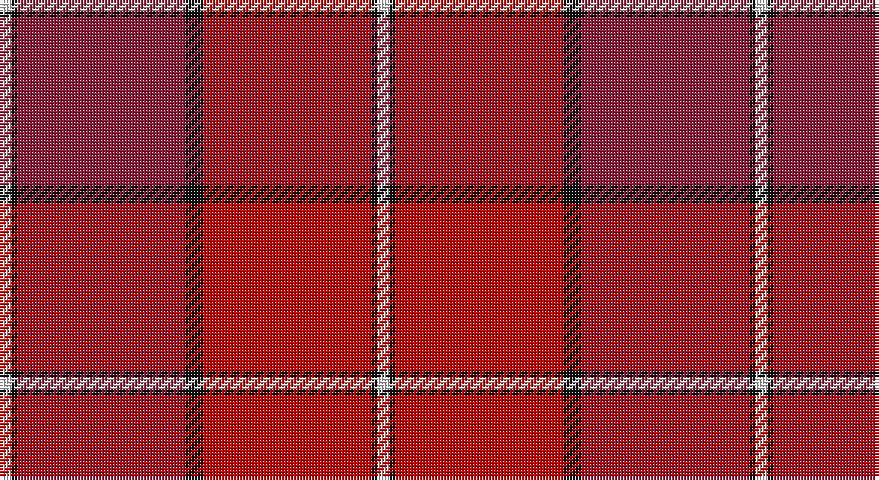

This page is one **sett** — a single exact thread-count. It belongs to the [tartan](/setts/w2k1r28k3ri28k1w2/)
(the same proportion at any scale), whose colour order is pattern [WKRKRKW](/stripes/wkrkrkw/).

Sourced from house-of-tartan.  It is a [7 stripe tartan](/stripes/stripes7/).

Original link http://www.house-of-tartan.scotland.net/house/TartanViewjs.asp?colr=Def&tnam=2057

## Provenance

Earliest known date: 1990 The tartan of the Aberdeen Football Club launched on 12th April, 1990.

## Thread count
LN/4 K2 DR56 K6 R56 K2 LN/4

One full sett is **252 threads**.

## Palette

Palette: <strong>Tartan Register</strong>
<table><thead><tr><th>Colour</th><th>Threads</th><th>Shade</th><th>Base</th><th>OKLCh</th></tr></thead><tbody><tr><td>LN/</td><td style="text-align:right;font-variant-numeric:tabular-nums">4</td><td><code style="background-color:#E0E0E0;">#E0E0E0</code> <small style="color:#888">#E0E0E0</small></td><td>W <code style="background-color:#F7F7F7;">#F7F7F7</code></td><td><small style="color:#888">oklch(90.7% 0.000 89.9)</small></td></tr><tr><td>K</td><td style="text-align:right;font-variant-numeric:tabular-nums">2</td><td><code style="background-color:#101010;">#101010</code> <small style="color:#888">#101010</small></td><td>K <code style="background-color:#000000;">#000000</code></td><td><small style="color:#888">oklch(17.3% 0.000 89.9)</small></td></tr><tr><td>DR</td><td style="text-align:right;font-variant-numeric:tabular-nums">56</td><td><code style="background-color:#901C38;">#901C38</code> <small style="color:#888">#901C38</small></td><td>R <code style="background-color:#CC0000;">#CC0000</code></td><td><small style="color:#888">oklch(43.2% 0.150 13.1)</small></td></tr><tr><td>K</td><td style="text-align:right;font-variant-numeric:tabular-nums">6</td><td><code style="background-color:#101010;">#101010</code> <small style="color:#888">#101010</small></td><td>K <code style="background-color:#000000;">#000000</code></td><td><small style="color:#888">oklch(17.3% 0.000 89.9)</small></td></tr><tr><td>R</td><td style="text-align:right;font-variant-numeric:tabular-nums">56</td><td><code style="background-color:#C80000;">#C80000</code> <small style="color:#888">#C80000</small></td><td>R <code style="background-color:#CC0000;">#CC0000</code></td><td><small style="color:#888">oklch(52.3% 0.215 29.2)</small></td></tr><tr><td>K</td><td style="text-align:right;font-variant-numeric:tabular-nums">2</td><td><code style="background-color:#101010;">#101010</code> <small style="color:#888">#101010</small></td><td>K <code style="background-color:#000000;">#000000</code></td><td><small style="color:#888">oklch(17.3% 0.000 89.9)</small></td></tr><tr><td>LN/</td><td style="text-align:right;font-variant-numeric:tabular-nums">4</td><td><code style="background-color:#E0E0E0;">#E0E0E0</code> <small style="color:#888">#E0E0E0</small></td><td>W <code style="background-color:#F7F7F7;">#F7F7F7</code></td><td><small style="color:#888">oklch(90.7% 0.000 89.9)</small></td></tr></tbody></table>

# Sample pattern

## Nearest tartans

The nearest existing variants by ΔTartan distance, with this tartan at the top so the swatches line up against it.

ΔTartan

Tartan

Sett

—

<a href="/ttd/edit/#slug=w2k1r28k3ri28k1w2~x2">Aberdeen F.C. Corporate Tartan</a> <a class="nn-out" href="/variants/s7/w2k1r28k3ri28k1w2~x2/" title="open its dictionary page">↗</a>

0.96

<a href="/ttd/edit/#slug=w2k1r28k3m28k1w2~x2&amp;base=w2k1r28k3ri28k1w2~x2">Aberdeen Football Club (1990)</a> <a class="nn-out" href="/variants/s7/w2k1r28k3m28k1w2~x2/" title="open its dictionary page">↗</a>

1.49

<a href="/variants/s8/r24dg2lb1dg1ri24/">MacNab WI1</a>

1.53

<a href="/ttd/edit/#slug=r3ly2r18db8w1ri18r2~x2&amp;base=w2k1r28k3ri28k1w2~x2">Barbour - Cardinal Red</a> <a class="nn-out" href="/variants/s7/r3ly2r18db8w1ri18r2~x2/" title="open its dictionary page">↗</a>

1.84

<a href="/ttd/edit/#slug=r52dr26w5dr3w2dr6r2~x2&amp;base=w2k1r28k3ri28k1w2~x2">St. Andrews School (Delaware) (Corp)</a> <a class="nn-out" href="/variants/s7/r52dr26w5dr3w2dr6r2~x2/" title="open its dictionary page">↗</a>

1.84

<a href="/ttd/edit/#slug=r5p2r2g42r5p36r70p2ly2r7g2~x2&amp;base=w2k1r28k3ri28k1w2~x2">MacPherson of Cluny</a> <a class="nn-out" href="/variants/s11/r5p2r2g42r5p36r70p2ly2r7g2~x2/" title="open its dictionary page">↗</a>

1.84

<a href="/ttd/edit/#slug=k3o6lr13r2lr2r32lr1r2lr2~x2&amp;base=w2k1r28k3ri28k1w2~x2">Fueglistal (Aargau) (Personal)</a> <a class="nn-out" href="/variants/s9/k3o6lr13r2lr2r32lr1r2lr2~x2/" title="open its dictionary page">↗</a>

1.87

<a href="/ttd/edit/#slug=p4g8db6p8r6g2r2g2r24g1r3~x2&amp;base=w2k1r28k3ri28k1w2~x2">MacDougal 4</a> <a class="nn-out" href="/variants/s11/p4g8db6p8r6g2r2g2r24g1r3~x2/" title="open its dictionary page">↗</a>

1.88

<a href="/ttd/edit/#slug=ri4r34do20r4do8r6ly2r5do2r3ri4&amp;base=w2k1r28k3ri28k1w2~x2">Morgan (Welsh Name)</a> <a class="nn-out" href="/variants/s11/ri4r34do20r4do8r6ly2r5do2r3ri4/" title="open its dictionary page">↗</a>

1.88

<a href="/ttd/edit/#slug=ri8riii22r2riii8r4riii6r6riii3r48riii6dr48rii8&amp;base=w2k1r28k3ri28k1w2~x2">Ferguson Red, George (Personal)</a> <a class="nn-out" href="/variants/s12/ri8riii22r2riii8r4riii6r6riii3r48riii6dr48rii8/" title="open its dictionary page">↗</a>

1.89

<a href="/ttd/edit/#slug=r107k9r5dp41r5g51r14&amp;base=w2k1r28k3ri28k1w2~x2">Buccleuch</a> <a class="nn-out" href="/variants/s7/r107k9r5dp41r5g51r14/" title="open its dictionary page">↗</a>

## Neighbour map

Every grey dot is one of 14360 variants placed by the first two principal components of the ΔTartan feature space (44% of its variance). Red is this tartan; blue dots are its nearest — click one to open its page.

<svg viewBox="0 0 640 380" role="img" style="max-width:100%;height:auto;border:1px solid #e0e0e0;border-radius:4px;display:block" xmlns="http://www.w3.org/2000/svg"><image href="/nn/cloud.v1.png" width="640" height="380"/><a href="/variants/s7/w2k1r28k3m28k1w2~x2/"><circle cx="344.1" cy="127.1" r="4" fill="#3465a4"><title>Aberdeen Football Club (1990)</title></circle></a><a href="/variants/s8/r24dg2lb1dg1ri24/"><circle cx="381.5" cy="132.0" r="4" fill="#3465a4"><title>MacNab WI1</title></circle></a><a href="/variants/s7/r3ly2r18db8w1ri18r2~x2/"><circle cx="304.0" cy="162.6" r="4" fill="#3465a4"><title>Barbour - Cardinal Red</title></circle></a><a href="/variants/s7/r52dr26w5dr3w2dr6r2~x2/"><circle cx="428.5" cy="144.4" r="4" fill="#3465a4"><title>St. Andrews School (Delaware) (Corp)</title></circle></a><a href="/variants/s11/r5p2r2g42r5p36r70p2ly2r7g2~x2/"><circle cx="367.2" cy="100.4" r="4" fill="#3465a4"><title>MacPherson of Cluny</title></circle></a><a href="/variants/s9/k3o6lr13r2lr2r32lr1r2lr2~x2/"><circle cx="412.0" cy="112.3" r="4" fill="#3465a4"><title>Fueglistal (Aargau) (Personal)</title></circle></a><a href="/variants/s11/p4g8db6p8r6g2r2g2r24g1r3~x2/"><circle cx="341.9" cy="137.6" r="4" fill="#3465a4"><title>MacDougal 4</title></circle></a><a href="/variants/s11/ri4r34do20r4do8r6ly2r5do2r3ri4/"><circle cx="400.3" cy="152.3" r="4" fill="#3465a4"><title>Morgan (Welsh Name)</title></circle></a><a href="/variants/s12/ri8riii22r2riii8r4riii6r6riii3r48riii6dr48rii8/"><circle cx="274.8" cy="114.5" r="4" fill="#3465a4"><title>Ferguson Red, George (Personal)</title></circle></a><a href="/variants/s7/r107k9r5dp41r5g51r14/"><circle cx="362.8" cy="153.5" r="4" fill="#3465a4"><title>Buccleuch</title></circle></a><circle cx="367.0" cy="139.7" r="5" fill="#c00000"/></svg>

ID: /variants/s7/w2k1r28k3ri28k1w2~x2/
