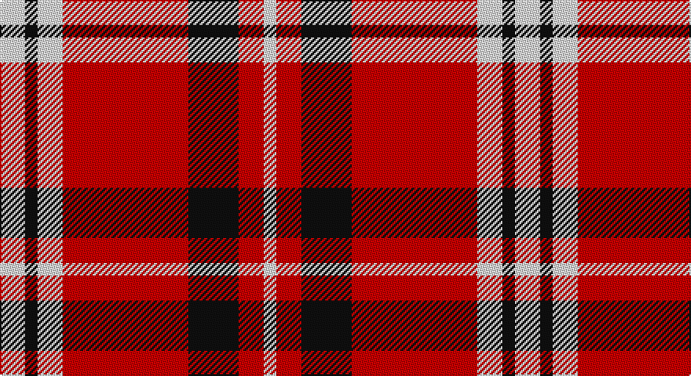

This page is one **sett** — a single exact thread-count. It belongs to the [tartan](/setts/w2k1w2r10k4r2w1/)
(the same proportion at any scale), whose colour order is pattern [WKWRKRW](/stripes/wkwrkrw/).

Sourced from tartans-authority.  It is a [7 stripe tartan](/stripes/stripes7/).

Original link http://www.tartansauthority.com/tartan-ferret/display/7950/

## Register references

External register numbers recorded for this tartan.

- Scottish Tartans Authority (ITI): 7950

## Thread count
LN/16 K8 LN16 R80 K32 R16 LN/8

One full sett is **328 threads**.

## Palette

Palette: <strong>Tartan Register</strong>
<table><thead><tr><th>Colour</th><th>Threads</th><th>Shade</th><th>Base</th><th>OKLCh</th></tr></thead><tbody><tr><td>LN/</td><td style="text-align:right;font-variant-numeric:tabular-nums">16</td><td><code style="background-color:#E0E0E0;">#E0E0E0</code> <small style="color:#888">#E0E0E0</small></td><td>W <code style="background-color:#F7F7F7;">#F7F7F7</code></td><td><small style="color:#888">oklch(90.7% 0.000 89.9)</small></td></tr><tr><td>K</td><td style="text-align:right;font-variant-numeric:tabular-nums">8</td><td><code style="background-color:#101010;">#101010</code> <small style="color:#888">#101010</small></td><td>K <code style="background-color:#000000;">#000000</code></td><td><small style="color:#888">oklch(17.3% 0.000 89.9)</small></td></tr><tr><td>LN</td><td style="text-align:right;font-variant-numeric:tabular-nums">16</td><td><code style="background-color:#E0E0E0;">#E0E0E0</code> <small style="color:#888">#E0E0E0</small></td><td>W <code style="background-color:#F7F7F7;">#F7F7F7</code></td><td><small style="color:#888">oklch(90.7% 0.000 89.9)</small></td></tr><tr><td>R</td><td style="text-align:right;font-variant-numeric:tabular-nums">80</td><td><code style="background-color:#C80000;">#C80000</code> <small style="color:#888">#C80000</small></td><td>R <code style="background-color:#CC0000;">#CC0000</code></td><td><small style="color:#888">oklch(52.3% 0.215 29.2)</small></td></tr><tr><td>K</td><td style="text-align:right;font-variant-numeric:tabular-nums">32</td><td><code style="background-color:#101010;">#101010</code> <small style="color:#888">#101010</small></td><td>K <code style="background-color:#000000;">#000000</code></td><td><small style="color:#888">oklch(17.3% 0.000 89.9)</small></td></tr><tr><td>R</td><td style="text-align:right;font-variant-numeric:tabular-nums">16</td><td><code style="background-color:#C80000;">#C80000</code> <small style="color:#888">#C80000</small></td><td>R <code style="background-color:#CC0000;">#CC0000</code></td><td><small style="color:#888">oklch(52.3% 0.215 29.2)</small></td></tr><tr><td>LN/</td><td style="text-align:right;font-variant-numeric:tabular-nums">8</td><td><code style="background-color:#E0E0E0;">#E0E0E0</code> <small style="color:#888">#E0E0E0</small></td><td>W <code style="background-color:#F7F7F7;">#F7F7F7</code></td><td><small style="color:#888">oklch(90.7% 0.000 89.9)</small></td></tr></tbody></table>

# Sample pattern

## Nearest tartans

The nearest existing variants by ΔTartan distance, with this tartan at the top so the swatches line up against it.

ΔTartan

Tartan

Sett

—

<a href="/ttd/edit/#slug=w2k1w2r10k4r2w1~x8">Russell, Ralph T. (Personal)</a> <a class="nn-out" href="/variants/s7/w2k1w2r10k4r2w1~x8/" title="open its dictionary page">↗</a>

1.10

<a href="/ttd/edit/#slug=k9r18w2k2w4k2w2r12k9r6~x2&amp;base=w2k1w2r10k4r2w1~x8">Brice</a> <a class="nn-out" href="/variants/s10/k9r18w2k2w4k2w2r12k9r6~x2/" title="open its dictionary page">↗</a>

1.23

<a href="/variants/s6/r28k4w2k13~x2/">Dunbar Ancient</a>

1.28

<a href="/ttd/edit/#slug=r6lb3r37k16lb16g4~x2&amp;base=w2k1w2r10k4r2w1~x8">Nesbit, Rose</a> <a class="nn-out" href="/variants/s6/r6lb3r37k16lb16g4~x2/" title="open its dictionary page">↗</a>

1.32

<a href="/ttd/edit/#slug=r3ly2r2ly3r3ly7r3k7r14ly2~x2&amp;base=w2k1w2r10k4r2w1~x8">Austin College Page</a> <a class="nn-out" href="/variants/s10/r3ly2r2ly3r3ly7r3k7r14ly2~x2/" title="open its dictionary page">↗</a>

1.34

<a href="/ttd/edit/#slug=k4r26k4w2k13ly4~x2&amp;base=w2k1w2r10k4r2w1~x8">Dunbar #2</a> <a class="nn-out" href="/variants/s6/k4r26k4w2k13ly4~x2/" title="open its dictionary page">↗</a>

1.41

<a href="/ttd/edit/#slug=k1r8g1r1w8r1k1~x6&amp;base=w2k1w2r10k4r2w1~x8">Cameron, Hose</a> <a class="nn-out" href="/variants/s7/k1r8g1r1w8r1k1~x6/" title="open its dictionary page">↗</a>

1.43

<a href="/ttd/edit/#slug=r6k3r29k23w4k7ly3~x2&amp;base=w2k1w2r10k4r2w1~x8">MacPherson Red Cluny</a> <a class="nn-out" href="/variants/s7/r6k3r29k23w4k7ly3~x2/" title="open its dictionary page">↗</a>

1.46

<a href="/ttd/edit/#slug=r3ri3w23ri3r3ri23k2ri3~x2&amp;base=w2k1w2r10k4r2w1~x8">Cameron, Hose for E</a> <a class="nn-out" href="/variants/s8/r3ri3w23ri3r3ri23k2ri3~x2/" title="open its dictionary page">↗</a>

1.47

<a href="/ttd/edit/#slug=r6k9r12w2k2w4~x2&amp;base=w2k1w2r10k4r2w1~x8">Brice (Artefact)</a> <a class="nn-out" href="/variants/s6/r6k9r12w2k2w4~x2/" title="open its dictionary page">↗</a>

1.49

<a href="/ttd/edit/#slug=w6o1r4w1db4o1r8w1r2~x2&amp;base=w2k1w2r10k4r2w1~x8">Unidentified #41</a> <a class="nn-out" href="/variants/s9/w6o1r4w1db4o1r8w1r2~x2/" title="open its dictionary page">↗</a>

## Neighbour map

Every grey dot is one of 14360 variants placed by the first two principal components of the ΔTartan feature space (44% of its variance). Red is this tartan; blue dots are its nearest — click one to open its page.

<svg viewBox="0 0 640 380" role="img" style="max-width:100%;height:auto;border:1px solid #e0e0e0;border-radius:4px;display:block" xmlns="http://www.w3.org/2000/svg"><image href="/nn/cloud.v1.png" width="640" height="380"/><a href="/variants/s10/k9r18w2k2w4k2w2r12k9r6~x2/"><circle cx="279.4" cy="185.4" r="4" fill="#3465a4"><title>Brice</title></circle></a><a href="/variants/s6/r28k4w2k13~x2/"><circle cx="333.3" cy="177.6" r="4" fill="#3465a4"><title>Dunbar Ancient</title></circle></a><a href="/variants/s6/r6lb3r37k16lb16g4~x2/"><circle cx="265.6" cy="172.9" r="4" fill="#3465a4"><title>Nesbit, Rose</title></circle></a><a href="/variants/s10/r3ly2r2ly3r3ly7r3k7r14ly2~x2/"><circle cx="257.1" cy="191.2" r="4" fill="#3465a4"><title>Austin College Page</title></circle></a><a href="/variants/s6/k4r26k4w2k13ly4~x2/"><circle cx="280.3" cy="166.4" r="4" fill="#3465a4"><title>Dunbar #2</title></circle></a><a href="/variants/s7/k1r8g1r1w8r1k1~x6/"><circle cx="235.2" cy="157.3" r="4" fill="#3465a4"><title>Cameron, Hose</title></circle></a><a href="/variants/s7/r6k3r29k23w4k7ly3~x2/"><circle cx="260.4" cy="175.4" r="4" fill="#3465a4"><title>MacPherson Red Cluny</title></circle></a><a href="/variants/s8/r3ri3w23ri3r3ri23k2ri3~x2/"><circle cx="284.0" cy="137.4" r="4" fill="#3465a4"><title>Cameron, Hose for E</title></circle></a><a href="/variants/s6/r6k9r12w2k2w4~x2/"><circle cx="232.9" cy="231.1" r="4" fill="#3465a4"><title>Brice (Artefact)</title></circle></a><a href="/variants/s9/w6o1r4w1db4o1r8w1r2~x2/"><circle cx="219.8" cy="168.9" r="4" fill="#3465a4"><title>Unidentified #41</title></circle></a><circle cx="293.1" cy="178.5" r="5" fill="#c00000"/></svg>

ID: /variants/s7/w2k1w2r10k4r2w1~x8/
