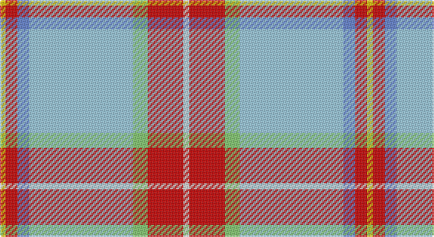

This page is one **sett** — a single exact thread-count. It belongs to the [tartan](/setts/w2r12lg5lb35b4r4ly2/)
(the same proportion at any scale), whose colour order is pattern [WRYWBRY](/stripes/wrywbry/).

Sourced from tartans-authority.  It is a [7 stripe tartan](/stripes/stripes7/).

Original link http://www.tartansauthority.com/tartan-ferret/display/7470/

2 attestations — the source records this cloth was collapsed from (oldest owns this page)

<ul>
<li>Jan 2008 — Nicolson of the Isles (Personal) (tartans-authority, <a href="http://www.tartansauthority.com/tartan-ferret/display/7470/">record</a>)</li>
<li>undated — Nicolson of the Isles (Personal) (register-of-tartans, <a href="https://www.tartanregister.gov.uk/tartanDetails.aspx?ref=5515">record</a>)</li>
</ul>

## Register references

External register numbers recorded for this tartan.

- Scottish Register of Tartans: [5515](https://www.tartanregister.gov.uk/tartanDetails.aspx?ref=5515)
- Scottish Tartans Authority (ITI): 7470

## Thread count
Y/4 R8 B8 LB70 LG10 R24 LN/4

One full sett is **248 threads**.

## Palette

Palette: <strong>Tartan Register</strong> <small style="color:#888">(4 of 6 colours)</small>
<table><thead><tr><th>Colour</th><th>Threads</th><th>Shade</th><th>Base</th><th>OKLCh</th></tr></thead><tbody><tr><td>Y/</td><td style="text-align:right;font-variant-numeric:tabular-nums">4</td><td><code style="background-color:#E8C000;">#E8C000</code> <small style="color:#888">#E8C000</small></td><td>Y <code style="background-color:#F2BF00;">#F2BF00</code></td><td><small style="color:#888">oklch(81.9% 0.168 93.7)</small></td></tr><tr><td>R</td><td style="text-align:right;font-variant-numeric:tabular-nums">8</td><td><code style="background-color:#C80000;">#C80000</code> <small style="color:#888">#C80000</small></td><td>R <code style="background-color:#CC0000;">#CC0000</code></td><td><small style="color:#888">oklch(52.3% 0.215 29.2)</small></td></tr><tr><td>B</td><td style="text-align:right;font-variant-numeric:tabular-nums">8</td><td><code style="background-color:#6080D0;">#6080D0</code> <small style="color:#888">#6080D0</small></td><td>B <code style="background-color:#2A418A;">#2A418A</code></td><td><small style="color:#888">oklch(61.2% 0.127 266.3)</small></td></tr><tr><td>LB</td><td style="text-align:right;font-variant-numeric:tabular-nums">70</td><td><code style="background-color:#98C8E8;">#98C8E8</code> <small style="color:#888">#98C8E8</small></td><td>W <code style="background-color:#F7F7F7;">#F7F7F7</code></td><td><small style="color:#888">oklch(81.0% 0.068 237.9)</small></td></tr><tr><td>LG</td><td style="text-align:right;font-variant-numeric:tabular-nums">10</td><td><code style="background-color:#80C86C;">#80C86C</code> <small style="color:#888">#80C86C</small></td><td>Y <code style="background-color:#F2BF00;">#F2BF00</code></td><td><small style="color:#888">oklch(76.4% 0.144 139.1)</small></td></tr><tr><td>R</td><td style="text-align:right;font-variant-numeric:tabular-nums">24</td><td><code style="background-color:#C80000;">#C80000</code> <small style="color:#888">#C80000</small></td><td>R <code style="background-color:#CC0000;">#CC0000</code></td><td><small style="color:#888">oklch(52.3% 0.215 29.2)</small></td></tr><tr><td>LN/</td><td style="text-align:right;font-variant-numeric:tabular-nums">4</td><td><code style="background-color:#E0E0E0;">#E0E0E0</code> <small style="color:#888">#E0E0E0</small></td><td>W <code style="background-color:#F7F7F7;">#F7F7F7</code></td><td><small style="color:#888">oklch(90.7% 0.000 89.9)</small></td></tr></tbody></table>

# Sample pattern

## Nearest tartans

The nearest existing variants by ΔTartan distance, with this tartan at the top so the swatches line up against it.

ΔTartan

Tartan

Sett

—

<a href="/ttd/edit/#slug=w2r12lg5lb35b4r4ly2~x2">Nicolson of the Isles (Personal)</a> <a class="nn-out" href="/variants/s7/w2r12lg5lb35b4r4ly2~x2/" title="open its dictionary page">↗</a>

1.14

<a href="/ttd/edit/#slug=lb55t8w8t8g5lb8ly4w4k4~x2&amp;base=w2r12lg5lb35b4r4ly2~x2">Ofsharick, Matthew (Personal)</a> <a class="nn-out" href="/variants/s9/lb55t8w8t8g5lb8ly4w4k4~x2/" title="open its dictionary page">↗</a>

1.20

<a href="/ttd/edit/#slug=lg8lr2r3lr2ly2lr28r10lb1db3lb2~x2&amp;base=w2r12lg5lb35b4r4ly2~x2">Confederate Memorial Commemmorative Tartan</a> <a class="nn-out" href="/variants/s10/lg8lr2r3lr2ly2lr28r10lb1db3lb2~x2/" title="open its dictionary page">↗</a>

1.20

<a href="/ttd/edit/#slug=n1w1o2w1n1w16o6db1ly1t1~x4&amp;base=w2r12lg5lb35b4r4ly2~x2">Gray, Thomas (Personal)</a> <a class="nn-out" href="/variants/s10/n1w1o2w1n1w16o6db1ly1t1~x4/" title="open its dictionary page">↗</a>

1.36

<a href="/ttd/edit/#slug=o55b8w8b8g5o8ly4w4k4~x2&amp;base=w2r12lg5lb35b4r4ly2~x2">Ofsharick, Matthew (Personal)</a> <a class="nn-out" href="/variants/s9/o55b8w8b8g5o8ly4w4k4~x2/" title="open its dictionary page">↗</a>

1.48

<a href="/ttd/edit/#slug=o18ly1o2ly1o2db6w4dy1g6~x2&amp;base=w2r12lg5lb35b4r4ly2~x2">Nickel Lodge Centennial Corporate Tartan</a> <a class="nn-out" href="/variants/s9/o18ly1o2ly1o2db6w4dy1g6~x2/" title="open its dictionary page">↗</a>

1.49

<a href="/ttd/edit/#slug=t4t24ly5g2t3db5ly33db2~x2&amp;base=w2r12lg5lb35b4r4ly2~x2">Los Angeles (District)</a> <a class="nn-out" href="/variants/s8/t4t24ly5g2t3db5ly33db2~x2/" title="open its dictionary page">↗</a>

1.50

<a href="/ttd/edit/#slug=w50o4lo2k2lo2o4lo10o15t2~x2&amp;base=w2r12lg5lb35b4r4ly2~x2">Australian, dress</a> <a class="nn-out" href="/variants/s9/w50o4lo2k2lo2o4lo10o15t2~x2/" title="open its dictionary page">↗</a>

1.52

<a href="/ttd/edit/#slug=lb40db4lb4p5g5lb3ly6r3~x2&amp;base=w2r12lg5lb35b4r4ly2~x2">Miller Hargreaves (Personal)</a> <a class="nn-out" href="/variants/s8/lb40db4lb4p5g5lb3ly6r3~x2/" title="open its dictionary page">↗</a>

1.56

<a href="/ttd/edit/#slug=t14db1n3g1n3db1n4w24r1~x4&amp;base=w2r12lg5lb35b4r4ly2~x2">Musselburgh Dress (Dance)</a> <a class="nn-out" href="/variants/s9/t14db1n3g1n3db1n4w24r1~x4/" title="open its dictionary page">↗</a>

1.58

<a href="/ttd/edit/#slug=w18o29t2dp3k1~x2&amp;base=w2r12lg5lb35b4r4ly2~x2">Kinloch of Loch Awe (Personal)</a> <a class="nn-out" href="/variants/s5/w18o29t2dp3k1~x2/" title="open its dictionary page">↗</a>

## Neighbour map

Every grey dot is one of 14360 variants placed by the first two principal components of the ΔTartan feature space (44% of its variance). Red is this tartan; blue dots are its nearest — click one to open its page.

<svg viewBox="0 0 640 380" role="img" style="max-width:100%;height:auto;border:1px solid #e0e0e0;border-radius:4px;display:block" xmlns="http://www.w3.org/2000/svg"><image href="/nn/cloud.v1.png" width="640" height="380"/><a href="/variants/s9/lb55t8w8t8g5lb8ly4w4k4~x2/"><circle cx="301.4" cy="103.6" r="4" fill="#3465a4"><title>Ofsharick, Matthew (Personal)</title></circle></a><a href="/variants/s10/lg8lr2r3lr2ly2lr28r10lb1db3lb2~x2/"><circle cx="286.3" cy="79.6" r="4" fill="#3465a4"><title>Confederate Memorial Commemmorative Tartan</title></circle></a><a href="/variants/s10/n1w1o2w1n1w16o6db1ly1t1~x4/"><circle cx="317.9" cy="92.7" r="4" fill="#3465a4"><title>Gray, Thomas (Personal)</title></circle></a><a href="/variants/s9/o55b8w8b8g5o8ly4w4k4~x2/"><circle cx="317.5" cy="118.4" r="4" fill="#3465a4"><title>Ofsharick, Matthew (Personal)</title></circle></a><a href="/variants/s9/o18ly1o2ly1o2db6w4dy1g6~x2/"><circle cx="271.1" cy="121.7" r="4" fill="#3465a4"><title>Nickel Lodge Centennial Corporate Tartan</title></circle></a><a href="/variants/s8/t4t24ly5g2t3db5ly33db2~x2/"><circle cx="254.4" cy="119.7" r="4" fill="#3465a4"><title>Los Angeles (District)</title></circle></a><a href="/variants/s9/w50o4lo2k2lo2o4lo10o15t2~x2/"><circle cx="317.6" cy="83.9" r="4" fill="#3465a4"><title>Australian, dress</title></circle></a><a href="/variants/s8/lb40db4lb4p5g5lb3ly6r3~x2/"><circle cx="359.9" cy="114.3" r="4" fill="#3465a4"><title>Miller Hargreaves (Personal)</title></circle></a><a href="/variants/s9/t14db1n3g1n3db1n4w24r1~x4/"><circle cx="225.3" cy="75.9" r="4" fill="#3465a4"><title>Musselburgh Dress (Dance)</title></circle></a><a href="/variants/s5/w18o29t2dp3k1~x2/"><circle cx="323.1" cy="131.8" r="4" fill="#3465a4"><title>Kinloch of Loch Awe (Personal)</title></circle></a><circle cx="289.3" cy="114.8" r="5" fill="#c00000"/></svg>

ID: /variants/s7/w2r12lg5lb35b4r4ly2~x2/
