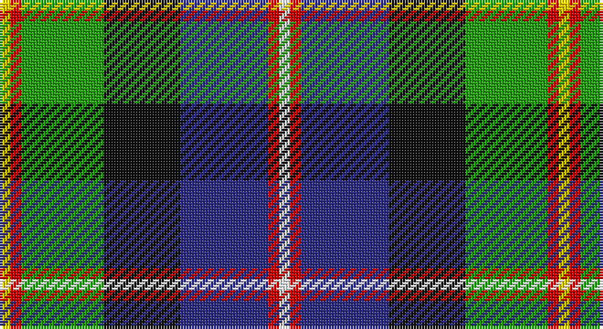

This page is one **sett** — a single exact thread-count. It belongs to the [tartan](/setts/w2r2db16k14g15r2ly2/)
(the same proportion at any scale), whose colour order is pattern [WRBKGRY](/stripes/wrbkgry/).

Sourced from tartans-authority.  It is a [7 stripe tartan](/stripes/stripes7/).

Original link http://www.tartansauthority.com/tartan-ferret/display/3857/

## Also known as

This cloth is also recorded under:

- Council of Scottish Clans & Ass. (Co

2 attestations — the source records this cloth was collapsed from (oldest owns this page)

<ul>
<li>pre 2000 — Council of Scottish Clans & Ass. (Co (tartans-authority, <a href="http://www.tartansauthority.com/tartan-ferret/display/3857/">record</a>)</li>
<li>undated — Council of Scottish Clans & Ass. (register-of-tartans, <a href="https://www.tartanregister.gov.uk/tartanDetails.aspx?ref=5417">record</a>)</li>
</ul>

## Register references

External register numbers recorded for this tartan.

- Scottish Register of Tartans: [5417](https://www.tartanregister.gov.uk/tartanDetails.aspx?ref=5417)
- Scottish Tartans Authority (ITI): 3857

## Thread count
Y/4 R4 G30 K28 DB32 R4 W/4

One full sett is **204 threads**.

## Palette

Palette: <strong>Tartan Register</strong>
<table><thead><tr><th>Colour</th><th>Threads</th><th>Shade</th><th>Base</th><th>OKLCh</th></tr></thead><tbody><tr><td>Y/</td><td style="text-align:right;font-variant-numeric:tabular-nums">4</td><td><code style="background-color:#FCCC00;">#FCCC00</code> <small style="color:#888">#FCCC00</small></td><td>Y <code style="background-color:#F2BF00;">#F2BF00</code></td><td><small style="color:#888">oklch(86.2% 0.176 91.5)</small></td></tr><tr><td>R</td><td style="text-align:right;font-variant-numeric:tabular-nums">4</td><td><code style="background-color:#C80000;">#C80000</code> <small style="color:#888">#C80000</small></td><td>R <code style="background-color:#CC0000;">#CC0000</code></td><td><small style="color:#888">oklch(52.3% 0.215 29.2)</small></td></tr><tr><td>G</td><td style="text-align:right;font-variant-numeric:tabular-nums">30</td><td><code style="background-color:#289C18;">#289C18</code> <small style="color:#888">#289C18</small></td><td>G <code style="background-color:#006100;">#006100</code></td><td><small style="color:#888">oklch(60.6% 0.191 141.6)</small></td></tr><tr><td>K</td><td style="text-align:right;font-variant-numeric:tabular-nums">28</td><td><code style="background-color:#101010;">#101010</code> <small style="color:#888">#101010</small></td><td>K <code style="background-color:#000000;">#000000</code></td><td><small style="color:#888">oklch(17.3% 0.000 89.9)</small></td></tr><tr><td>DB</td><td style="text-align:right;font-variant-numeric:tabular-nums">32</td><td><code style="background-color:#2C2C80;">#2C2C80</code> <small style="color:#888">#2C2C80</small></td><td>B <code style="background-color:#2A418A;">#2A418A</code></td><td><small style="color:#888">oklch(35.0% 0.138 276.6)</small></td></tr><tr><td>R</td><td style="text-align:right;font-variant-numeric:tabular-nums">4</td><td><code style="background-color:#C80000;">#C80000</code> <small style="color:#888">#C80000</small></td><td>R <code style="background-color:#CC0000;">#CC0000</code></td><td><small style="color:#888">oklch(52.3% 0.215 29.2)</small></td></tr><tr><td>W/</td><td style="text-align:right;font-variant-numeric:tabular-nums">4</td><td><code style="background-color:#FCFCFC;">#FCFCFC</code> <small style="color:#888">#FCFCFC</small></td><td>W <code style="background-color:#F7F7F7;">#F7F7F7</code></td><td><small style="color:#888">oklch(99.1% 0.000 89.9)</small></td></tr></tbody></table>

# Sample pattern

## Nearest tartans

The nearest existing variants by ΔTartan distance, with this tartan at the top so the swatches line up against it.

ΔTartan

Tartan

Sett

—

<a href="/ttd/edit/#slug=w2r2db16k14g15r2ly2~x2">Council of Scottish Clans &amp; Ass. (Co</a> <a class="nn-out" href="/variants/s7/w2r2db16k14g15r2ly2~x2/" title="open its dictionary page">↗</a>

0.77

<a href="/ttd/edit/#slug=r4g16w2k15db15k2db2ly2~x2&amp;base=w2r2db16k14g15r2ly2~x2">Cowan, of Inveresk</a> <a class="nn-out" href="/variants/s8/r4g16w2k15db15k2db2ly2~x2/" title="open its dictionary page">↗</a>

0.86

<a href="/ttd/edit/#slug=k20ly4db13w4g30w4r13~x2&amp;base=w2r2db16k14g15r2ly2~x2">South Africa 1994 (Fashion)</a> <a class="nn-out" href="/variants/s7/k20ly4db13w4g30w4r13~x2/" title="open its dictionary page">↗</a>

0.88

<a href="/ttd/edit/#slug=k10ly3k2b20k10g15k2r3w3~x2&amp;base=w2r2db16k14g15r2ly2~x2">McCuaig (2010) (Name)</a> <a class="nn-out" href="/variants/s9/k10ly3k2b20k10g15k2r3w3~x2/" title="open its dictionary page">↗</a>

0.93

<a href="/ttd/edit/#slug=g2dp2g10k6r2k6t10k1lb2~x2&amp;base=w2r2db16k14g15r2ly2~x2">Birch (Personal) (Estimated threadcount)</a> <a class="nn-out" href="/variants/s9/g2dp2g10k6r2k6t10k1lb2~x2/" title="open its dictionary page">↗</a>

0.93

<a href="/ttd/edit/#slug=k6r3g30ly10db30w3~x2&amp;base=w2r2db16k14g15r2ly2~x2">Turnbull of Thornton (Personal)</a> <a class="nn-out" href="/variants/s6/k6r3g30ly10db30w3~x2/" title="open its dictionary page">↗</a>

1.00

<a href="/ttd/edit/#slug=w10k52db52dg24ly10dg5r5&amp;base=w2r2db16k14g15r2ly2~x2">Harvey of Cornwall (Personal)</a> <a class="nn-out" href="/variants/s7/w10k52db52dg24ly10dg5r5/" title="open its dictionary page">↗</a>

1.00

<a href="/ttd/edit/#slug=r3ly2g12k12db14w3~x2&amp;base=w2r2db16k14g15r2ly2~x2">Jamestown Parish Church (Corporate)</a> <a class="nn-out" href="/variants/s6/r3ly2g12k12db14w3~x2/" title="open its dictionary page">↗</a>

1.02

<a href="/ttd/edit/#slug=r3g18r4t3r4k13r3db18g2ly3~x2&amp;base=w2r2db16k14g15r2ly2~x2">Stirling, and Bannockburn</a> <a class="nn-out" href="/variants/s10/r3g18r4t3r4k13r3db18g2ly3~x2/" title="open its dictionary page">↗</a>

1.02

<a href="/ttd/edit/#slug=db34w5db5r5db5dr26g33o6~x2&amp;base=w2r2db16k14g15r2ly2~x2">Blairmore</a> <a class="nn-out" href="/variants/s8/db34w5db5r5db5dr26g33o6~x2/" title="open its dictionary page">↗</a>

1.04

<a href="/ttd/edit/#slug=w2db3r6k8g12lo1db4k2w2~x2&amp;base=w2r2db16k14g15r2ly2~x2">National (1934), The</a> <a class="nn-out" href="/variants/s9/w2db3r6k8g12lo1db4k2w2~x2/" title="open its dictionary page">↗</a>

## Neighbour map

Every grey dot is one of 14360 variants placed by the first two principal components of the ΔTartan feature space (44% of its variance). Red is this tartan; blue dots are its nearest — click one to open its page.

<svg viewBox="0 0 640 380" role="img" style="max-width:100%;height:auto;border:1px solid #e0e0e0;border-radius:4px;display:block" xmlns="http://www.w3.org/2000/svg"><image href="/nn/cloud.v1.png" width="640" height="380"/><a href="/variants/s8/r4g16w2k15db15k2db2ly2~x2/"><circle cx="79.2" cy="163.9" r="4" fill="#3465a4"><title>Cowan, of Inveresk</title></circle></a><a href="/variants/s7/k20ly4db13w4g30w4r13~x2/"><circle cx="79.4" cy="180.4" r="4" fill="#3465a4"><title>South Africa 1994 (Fashion)</title></circle></a><a href="/variants/s9/k10ly3k2b20k10g15k2r3w3~x2/"><circle cx="115.1" cy="160.5" r="4" fill="#3465a4"><title>McCuaig (2010) (Name)</title></circle></a><a href="/variants/s9/g2dp2g10k6r2k6t10k1lb2~x2/"><circle cx="76.5" cy="159.3" r="4" fill="#3465a4"><title>Birch (Personal) (Estimated threadcount)</title></circle></a><a href="/variants/s6/k6r3g30ly10db30w3~x2/"><circle cx="143.5" cy="174.0" r="4" fill="#3465a4"><title>Turnbull of Thornton (Personal)</title></circle></a><a href="/variants/s7/w10k52db52dg24ly10dg5r5/"><circle cx="123.4" cy="168.4" r="4" fill="#3465a4"><title>Harvey of Cornwall (Personal)</title></circle></a><a href="/variants/s6/r3ly2g12k12db14w3~x2/"><circle cx="74.9" cy="204.0" r="4" fill="#3465a4"><title>Jamestown Parish Church (Corporate)</title></circle></a><a href="/variants/s10/r3g18r4t3r4k13r3db18g2ly3~x2/"><circle cx="71.0" cy="146.1" r="4" fill="#3465a4"><title>Stirling, and Bannockburn</title></circle></a><a href="/variants/s8/db34w5db5r5db5dr26g33o6~x2/"><circle cx="119.1" cy="180.2" r="4" fill="#3465a4"><title>Blairmore</title></circle></a><a href="/variants/s9/w2db3r6k8g12lo1db4k2w2~x2/"><circle cx="74.6" cy="146.9" r="4" fill="#3465a4"><title>National (1934), The</title></circle></a><circle cx="84.4" cy="168.5" r="5" fill="#c00000"/></svg>

ID: /variants/s7/w2r2db16k14g15r2ly2~x2/
