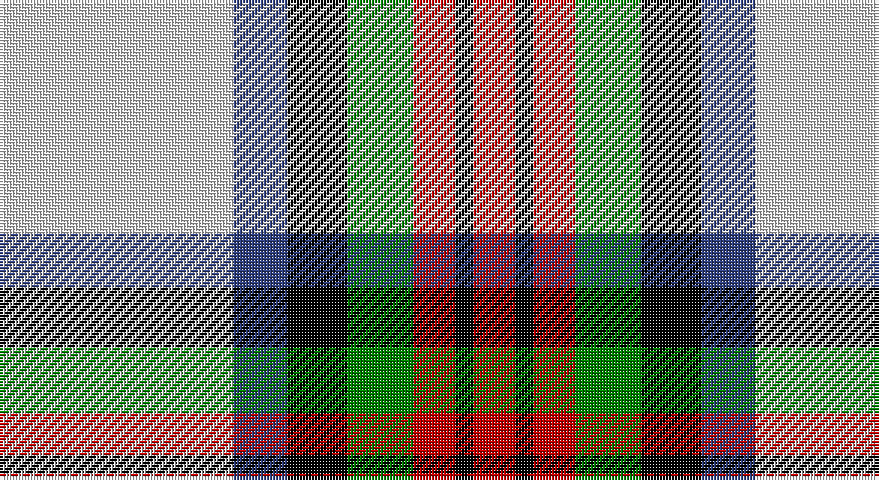

This page is one **sett** — a single exact thread-count. It belongs to the [tartan](/setts/w39db9k10g11r7k3r7/)
(the same proportion at any scale), whose colour order is pattern [RKRGKBW](/stripes/rkrgkbw/).

Part of the [MacDuff Dress](/tartans/macduff-dress/) tartan — the named design grouping this sett with its other cloths.

Sourced from weddslist.  It is a [7 stripe tartan](/stripes/stripes7/).

Original link http://www.weddslist.com/cgi-bin/tartans/pg.pl?source=sts

## Provenance

Earliest known date: pre 2003 From Scott Adie pattern.

## Also known as

This cloth is also recorded under:

- MacDuff Dress #3
- MacDuff Dress #4
- MacDuff Dress #5
- MacDuff dress
- MacDuff, dress

2 attestations — the source records this cloth was collapsed from (oldest owns this page)

<ul>
<li>undated — MacDuff dress (weddslist, <a href="http://www.weddslist.com/cgi-bin/tartans/pg.pl?source=sts">record</a>)</li>
<li>undated — MacDuff Dress Clan Tartan (house-of-tartan, <a href="http://www.house-of-tartan.scotland.net/house/TartanViewjs.asp?colr=Def&tnam=1601">record</a>)</li>
</ul>

## Thread count
LN/78 B18 K20 G22 R14 K6 R/14

One full sett is **252 threads**.

## Palette

Palette: <strong>Tartan Register</strong> <small style="color:#888">(2 of 5 colours)</small>
<table><thead><tr><th>Colour</th><th>Threads</th><th>Shade</th><th>Base</th><th>OKLCh</th></tr></thead><tbody><tr><td>LN/</td><td style="text-align:right;font-variant-numeric:tabular-nums">78</td><td><code style="background-color:#E0E0E0;">#E0E0E0</code> <small style="color:#888">#E0E0E0</small></td><td>W <code style="background-color:#F7F7F7;">#F7F7F7</code></td><td><small style="color:#888">oklch(90.7% 0.000 89.9)</small></td></tr><tr><td>B</td><td style="text-align:right;font-variant-numeric:tabular-nums">18</td><td><code style="background-color:#304080;">#304080</code> <small style="color:#888">#304080</small></td><td>B <code style="background-color:#2A418A;">#2A418A</code></td><td><small style="color:#888">oklch(39.4% 0.109 270.2)</small></td></tr><tr><td>K</td><td style="text-align:right;font-variant-numeric:tabular-nums">20</td><td><code style="background-color:#000000;">#000000</code> <small style="color:#888">#000000</small></td><td>K <code style="background-color:#000000;">#000000</code></td><td><small style="color:#888">oklch(0.0% 0.000 0.0)</small></td></tr><tr><td>G</td><td style="text-align:right;font-variant-numeric:tabular-nums">22</td><td><code style="background-color:#008000;">#008000</code> <small style="color:#888">#008000</small></td><td>G <code style="background-color:#006100;">#006100</code></td><td><small style="color:#888">oklch(52.0% 0.177 142.5)</small></td></tr><tr><td>R</td><td style="text-align:right;font-variant-numeric:tabular-nums">14</td><td><code style="background-color:#C00000;">#C00000</code> <small style="color:#888">#C00000</small></td><td>R <code style="background-color:#CC0000;">#CC0000</code></td><td><small style="color:#888">oklch(50.7% 0.208 29.2)</small></td></tr><tr><td>K</td><td style="text-align:right;font-variant-numeric:tabular-nums">6</td><td><code style="background-color:#000000;">#000000</code> <small style="color:#888">#000000</small></td><td>K <code style="background-color:#000000;">#000000</code></td><td><small style="color:#888">oklch(0.0% 0.000 0.0)</small></td></tr><tr><td>R/</td><td style="text-align:right;font-variant-numeric:tabular-nums">14</td><td><code style="background-color:#C00000;">#C00000</code> <small style="color:#888">#C00000</small></td><td>R <code style="background-color:#CC0000;">#CC0000</code></td><td><small style="color:#888">oklch(50.7% 0.208 29.2)</small></td></tr></tbody></table>

# Sample pattern

## Compared to the master

This cloth is one sett of its design; the master sett (the exemplar the design is anchored on) is below for comparison.

<figure style="margin:0"><figcaption style="color:#888;font-size:smaller">this sett</figcaption></figure>
<figure style="margin:0"><figcaption style="color:#888;font-size:smaller"><a href="/setts/r16k6r14dg22k16db16w10r6w45k4r4/">master sett →</a></figcaption></figure>

## Nearest tartans

The nearest existing variants by ΔTartan distance, with this tartan at the top so the swatches line up against it.

ΔTartan

Tartan

Sett

—

<a href="/ttd/edit/#slug=w39db9k10g11r7k3r7~x2">MacDuff dress</a> <a class="nn-out" href="/variants/s7/w39db9k10g11r7k3r7~x2/" title="open its dictionary page">↗</a>

0.34

<a href="/ttd/edit/#slug=w39db9k10dg11r7k3r7~x2&amp;base=w39db9k10g11r7k3r7~x2">MacDuff Dress #5</a> <a class="nn-out" href="/variants/s7/w39db9k10dg11r7k3r7~x2/" title="open its dictionary page">↗</a>

0.86

<a href="/ttd/edit/#slug=w8g5t10dp24w30g2lp2~x2&amp;base=w39db9k10g11r7k3r7~x2">Shiel, Purple (Dance)</a> <a class="nn-out" href="/variants/s7/w8g5t10dp24w30g2lp2~x2/" title="open its dictionary page">↗</a>

0.92

<a href="/ttd/edit/#slug=r3w33dp8dg18r9g3~x2&amp;base=w39db9k10g11r7k3r7~x2">MacKintosh Dress (Dance)</a> <a class="nn-out" href="/variants/s6/r3w33dp8dg18r9g3~x2/" title="open its dictionary page">↗</a>

0.92

<a href="/variants/s8/wi4k13wi17lo2r2lo24wi2w2~x2/">Lalage (Personal)</a>

0.94

<a href="/ttd/edit/#slug=r6db2p21w3dg19w26dg3w5~x2&amp;base=w39db9k10g11r7k3r7~x2">Culloden, dress Ancient</a> <a class="nn-out" href="/variants/s8/r6db2p21w3dg19w26dg3w5~x2/" title="open its dictionary page">↗</a>

0.97

<a href="/ttd/edit/#slug=r5w2o20ly2k16w18k2w5~x2&amp;base=w39db9k10g11r7k3r7~x2">Ailsa Craig</a> <a class="nn-out" href="/variants/s8/r5w2o20ly2k16w18k2w5~x2/" title="open its dictionary page">↗</a>

0.98

<a href="/ttd/edit/#slug=g4ly7o9ly9db20w2db2~x2&amp;base=w39db9k10g11r7k3r7~x2">Tombow 140th Anniversary, The</a> <a class="nn-out" href="/variants/s7/g4ly7o9ly9db20w2db2~x2/" title="open its dictionary page">↗</a>

0.99

<a href="/ttd/edit/#slug=r2db2w26g25k14db13w26db2r2~x2&amp;base=w39db9k10g11r7k3r7~x2">MacNaughton Dress</a> <a class="nn-out" href="/variants/s9/r2db2w26g25k14db13w26db2r2~x2/" title="open its dictionary page">↗</a>

0.99

<a href="/ttd/edit/#slug=w4k2w18k11db2y18ly2~x2&amp;base=w39db9k10g11r7k3r7~x2">Barbour - Ancient</a> <a class="nn-out" href="/variants/s7/w4k2w18k11db2y18ly2~x2/" title="open its dictionary page">↗</a>

1.04

<a href="/ttd/edit/#slug=r5w2t20ly2k16w18k2w5~x2&amp;base=w39db9k10g11r7k3r7~x2">Ailsa Craig (District)</a> <a class="nn-out" href="/variants/s8/r5w2t20ly2k16w18k2w5~x2/" title="open its dictionary page">↗</a>

## Neighbour map

Every grey dot is one of 14360 variants placed by the first two principal components of the ΔTartan feature space (44% of its variance). Red is this tartan; blue dots are its nearest — click one to open its page.

<svg viewBox="0 0 640 380" role="img" style="max-width:100%;height:auto;border:1px solid #e0e0e0;border-radius:4px;display:block" xmlns="http://www.w3.org/2000/svg"><image href="/nn/cloud.v1.png" width="640" height="380"/><a href="/variants/s7/w39db9k10dg11r7k3r7~x2/"><circle cx="170.4" cy="139.6" r="4" fill="#3465a4"><title>MacDuff Dress #5</title></circle></a><a href="/variants/s7/w8g5t10dp24w30g2lp2~x2/"><circle cx="197.8" cy="138.1" r="4" fill="#3465a4"><title>Shiel, Purple (Dance)</title></circle></a><a href="/variants/s6/r3w33dp8dg18r9g3~x2/"><circle cx="175.2" cy="158.8" r="4" fill="#3465a4"><title>MacKintosh Dress (Dance)</title></circle></a><a href="/variants/s8/wi4k13wi17lo2r2lo24wi2w2~x2/"><circle cx="165.7" cy="134.6" r="4" fill="#3465a4"><title>Lalage (Personal)</title></circle></a><a href="/variants/s8/r6db2p21w3dg19w26dg3w5~x2/"><circle cx="154.6" cy="140.9" r="4" fill="#3465a4"><title>Culloden, dress Ancient</title></circle></a><a href="/variants/s8/r5w2o20ly2k16w18k2w5~x2/"><circle cx="117.1" cy="147.9" r="4" fill="#3465a4"><title>Ailsa Craig</title></circle></a><a href="/variants/s7/g4ly7o9ly9db20w2db2~x2/"><circle cx="155.4" cy="171.6" r="4" fill="#3465a4"><title>Tombow 140th Anniversary, The</title></circle></a><a href="/variants/s9/r2db2w26g25k14db13w26db2r2~x2/"><circle cx="167.9" cy="141.2" r="4" fill="#3465a4"><title>MacNaughton Dress</title></circle></a><a href="/variants/s7/w4k2w18k11db2y18ly2~x2/"><circle cx="129.6" cy="159.4" r="4" fill="#3465a4"><title>Barbour - Ancient</title></circle></a><a href="/variants/s8/r5w2t20ly2k16w18k2w5~x2/"><circle cx="115.6" cy="148.7" r="4" fill="#3465a4"><title>Ailsa Craig (District)</title></circle></a><circle cx="164.3" cy="138.9" r="5" fill="#c00000"/></svg>

ID: /variants/s7/w39db9k10g11r7k3r7~x2/
