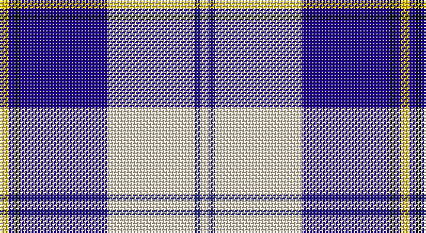

This page is one **sett** — a single exact thread-count. It belongs to the [tartan](/setts/w3dbi2w30db30k2db2ly3/)
(the same proportion at any scale), whose colour order is pattern [WBWBKBY](/stripes/wbwbkby/).

Sourced from tartans-authority.  It is a [7 stripe tartan](/stripes/stripes7/).

Original link http://www.tartansauthority.com/tartan-ferret/display/7594/

## Also known as

This cloth is also recorded under:

- Torridon, Saphire

2 attestations — the source records this cloth was collapsed from (oldest owns this page)

<ul>
<li>March 2008 — Torridon, Saphire (Dance) (tartans-authority, <a href="http://www.tartansauthority.com/tartan-ferret/display/7594/">record</a>)</li>
<li>undated — Torridon Saphire (register-of-tartans, <a href="https://www.tartanregister.gov.uk/tartanDetails.aspx?ref=5618">record</a>)</li>
</ul>

## Register references

External register numbers recorded for this tartan.

- Scottish Register of Tartans: [5618](https://www.tartanregister.gov.uk/tartanDetails.aspx?ref=5618)
- Scottish Tartans Authority (ITI): 7594

## Thread count
Y/6 DBa4 K4 DBa60 W60 DB4 W/6

One full sett is **276 threads**.

## Palette

Palette: <strong>Tartan Register</strong> <small style="color:#888">(3 of 5 colours)</small>
<table><thead><tr><th>Colour</th><th>Threads</th><th>Shade</th><th>Base</th><th>OKLCh</th></tr></thead><tbody><tr><td>Y/</td><td style="text-align:right;font-variant-numeric:tabular-nums">6</td><td><code style="background-color:#E8C000;">#E8C000</code> <small style="color:#888">#E8C000</small></td><td>Y <code style="background-color:#F2BF00;">#F2BF00</code></td><td><small style="color:#888">oklch(81.9% 0.168 93.7)</small></td></tr><tr><td>DBa</td><td style="text-align:right;font-variant-numeric:tabular-nums">4</td><td><code style="background-color:#20008C;">#20008C</code> <small style="color:#888">#20008C</small></td><td>B <code style="background-color:#2A418A;">#2A418A</code></td><td><small style="color:#888">oklch(30.4% 0.192 274.5)</small></td></tr><tr><td>K</td><td style="text-align:right;font-variant-numeric:tabular-nums">4</td><td><code style="background-color:#000C14;">#000C14</code> <small style="color:#888">#000C14</small></td><td>K <code style="background-color:#000000;">#000000</code></td><td><small style="color:#888">oklch(14.5% 0.029 231.2)</small></td></tr><tr><td>DBa</td><td style="text-align:right;font-variant-numeric:tabular-nums">60</td><td><code style="background-color:#20008C;">#20008C</code> <small style="color:#888">#20008C</small></td><td>B <code style="background-color:#2A418A;">#2A418A</code></td><td><small style="color:#888">oklch(30.4% 0.192 274.5)</small></td></tr><tr><td>W</td><td style="text-align:right;font-variant-numeric:tabular-nums">60</td><td><code style="background-color:#F0E0C8;">#F0E0C8</code> <small style="color:#888">#F0E0C8</small></td><td>W <code style="background-color:#F7F7F7;">#F7F7F7</code></td><td><small style="color:#888">oklch(91.3% 0.036 78.1)</small></td></tr><tr><td>DB</td><td style="text-align:right;font-variant-numeric:tabular-nums">4</td><td><code style="background-color:#2C2C80;">#2C2C80</code> <small style="color:#888">#2C2C80</small></td><td>B <code style="background-color:#2A418A;">#2A418A</code></td><td><small style="color:#888">oklch(35.0% 0.138 276.6)</small></td></tr><tr><td>W/</td><td style="text-align:right;font-variant-numeric:tabular-nums">6</td><td><code style="background-color:#F0E0C8;">#F0E0C8</code> <small style="color:#888">#F0E0C8</small></td><td>W <code style="background-color:#F7F7F7;">#F7F7F7</code></td><td><small style="color:#888">oklch(91.3% 0.036 78.1)</small></td></tr></tbody></table>

# Sample pattern

## Nearest tartans

The nearest existing variants by ΔTartan distance, with this tartan at the top so the swatches line up against it.

ΔTartan

Tartan

Sett

—

<a href="/ttd/edit/#slug=w3dbi2w30db30k2db2ly3~x2">Torridon, Saphire (Dance)</a> <a class="nn-out" href="/variants/s7/w3dbi2w30db30k2db2ly3~x2/" title="open its dictionary page">↗</a>

0.96

<a href="/ttd/edit/#slug=b3db2k2db28w30db2w3~x2&amp;base=w3dbi2w30db30k2db2ly3~x2">Cunningham, Dress Blue (Dance)</a> <a class="nn-out" href="/variants/s7/b3db2k2db28w30db2w3~x2/" title="open its dictionary page">↗</a>

1.04

<a href="/ttd/edit/#slug=t2db1k1db20w20db1w2~x4&amp;base=w3dbi2w30db30k2db2ly3~x2">Cunningham, Dress Blue (Dance) Fashion Tartan</a> <a class="nn-out" href="/variants/s7/t2db1k1db20w20db1w2~x4/" title="open its dictionary page">↗</a>

1.18

<a href="/ttd/edit/#slug=db30t2w2t2db4ti10w25db4~x2&amp;base=w3dbi2w30db30k2db2ly3~x2">Eildon/Longniddry Blue Dress Fashion Tartan</a> <a class="nn-out" href="/variants/s8/db30t2w2t2db4ti10w25db4~x2/" title="open its dictionary page">↗</a>

1.23

<a href="/ttd/edit/#slug=db4r2db31k10g4w21g2~x2&amp;base=w3dbi2w30db30k2db2ly3~x2">Sinclair Dress (Dance)</a> <a class="nn-out" href="/variants/s7/db4r2db31k10g4w21g2~x2/" title="open its dictionary page">↗</a>

1.25

<a href="/ttd/edit/#slug=b4r2b40k11g2w16r2~x2&amp;base=w3dbi2w30db30k2db2ly3~x2">Jack Sinclair (Personal)</a> <a class="nn-out" href="/variants/s7/b4r2b40k11g2w16r2~x2/" title="open its dictionary page">↗</a>

1.27

<a href="/variants/s7/w30b4w3dp2r2dp24wi2~x2/">St Andrews Links Dress</a>

1.31

<a href="/ttd/edit/#slug=db8r3db36t3k10w34r4w3r3w8~x2&amp;base=w3dbi2w30db30k2db2ly3~x2">Stewart of Appin Htg Dress</a> <a class="nn-out" href="/variants/s10/db8r3db36t3k10w34r4w3r3w8~x2/" title="open its dictionary page">↗</a>

1.31

<a href="/ttd/edit/#slug=db41ti2w2ti2db5t12w31db4~x2&amp;base=w3dbi2w30db30k2db2ly3~x2">Harmony Eildon (Dance)</a> <a class="nn-out" href="/variants/s8/db41ti2w2ti2db5t12w31db4~x2/" title="open its dictionary page">↗</a>

1.34

<a href="/ttd/edit/#slug=db8t3db28w32dt3w4~x2&amp;base=w3dbi2w30db30k2db2ly3~x2">Ailsa, Royal Blue (Dance)</a> <a class="nn-out" href="/variants/s6/db8t3db28w32dt3w4~x2/" title="open its dictionary page">↗</a>

1.36

<a href="/ttd/edit/#slug=w3db2k4db2w2db26r4w30r2w3~x2&amp;base=w3dbi2w30db30k2db2ly3~x2">Harris, Royal Blue (Dance)</a> <a class="nn-out" href="/variants/s10/w3db2k4db2w2db26r4w30r2w3~x2/" title="open its dictionary page">↗</a>

## Neighbour map

Every grey dot is one of 14360 variants placed by the first two principal components of the ΔTartan feature space (44% of its variance). Red is this tartan; blue dots are its nearest — click one to open its page.

<svg viewBox="0 0 640 380" role="img" style="max-width:100%;height:auto;border:1px solid #e0e0e0;border-radius:4px;display:block" xmlns="http://www.w3.org/2000/svg"><image href="/nn/cloud.v1.png" width="640" height="380"/><a href="/variants/s7/b3db2k2db28w30db2w3~x2/"><circle cx="268.2" cy="141.5" r="4" fill="#3465a4"><title>Cunningham, Dress Blue (Dance)</title></circle></a><a href="/variants/s7/t2db1k1db20w20db1w2~x4/"><circle cx="288.4" cy="129.3" r="4" fill="#3465a4"><title>Cunningham, Dress Blue (Dance) Fashion Tartan</title></circle></a><a href="/variants/s8/db30t2w2t2db4ti10w25db4~x2/"><circle cx="243.4" cy="147.6" r="4" fill="#3465a4"><title>Eildon/Longniddry Blue Dress Fashion Tartan</title></circle></a><a href="/variants/s7/db4r2db31k10g4w21g2~x2/"><circle cx="213.2" cy="144.0" r="4" fill="#3465a4"><title>Sinclair Dress (Dance)</title></circle></a><a href="/variants/s7/b4r2b40k11g2w16r2~x2/"><circle cx="286.2" cy="119.9" r="4" fill="#3465a4"><title>Jack Sinclair (Personal)</title></circle></a><a href="/variants/s7/w30b4w3dp2r2dp24wi2~x2/"><circle cx="247.1" cy="115.1" r="4" fill="#3465a4"><title>St Andrews Links Dress</title></circle></a><a href="/variants/s10/db8r3db36t3k10w34r4w3r3w8~x2/"><circle cx="168.3" cy="120.3" r="4" fill="#3465a4"><title>Stewart of Appin Htg Dress</title></circle></a><a href="/variants/s8/db41ti2w2ti2db5t12w31db4~x2/"><circle cx="278.5" cy="134.5" r="4" fill="#3465a4"><title>Harmony Eildon (Dance)</title></circle></a><a href="/variants/s6/db8t3db28w32dt3w4~x2/"><circle cx="242.4" cy="176.5" r="4" fill="#3465a4"><title>Ailsa, Royal Blue (Dance)</title></circle></a><a href="/variants/s10/w3db2k4db2w2db26r4w30r2w3~x2/"><circle cx="257.8" cy="113.8" r="4" fill="#3465a4"><title>Harris, Royal Blue (Dance)</title></circle></a><circle cx="238.7" cy="122.5" r="5" fill="#c00000"/></svg>

ID: /variants/s7/w3dbi2w30db30k2db2ly3~x2/
