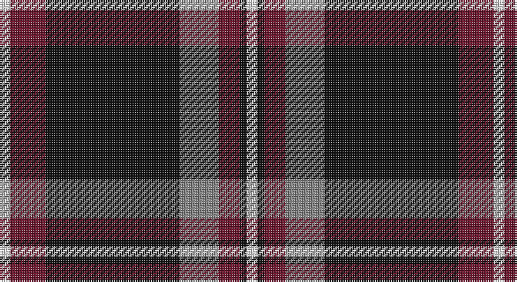

This page is one **sett** — a single exact thread-count. It belongs to the [tartan](/setts/w3dr10k38o11dr6k2w3/)
(the same proportion at any scale), whose colour order is pattern [WBKRBKW](/stripes/wbkrbkw/).

Part of the [Phantom](/tartans/phantom/) tartan — the named design grouping this sett with its other cloths.

Sourced from tartans-authority.  It is a [7 stripe tartan](/stripes/stripes7/).

Original link http://www.tartansauthority.com/tartan-ferret/display/10050/

## Register references

External register numbers recorded for this tartan.

- Scottish Register of Tartans: [10050](https://www.tartanregister.gov.uk/tartanDetails?ref=10050)
- Scottish Tartans Authority (ITI): 10050

## Thread count
LN/6 DR20 K76 N22 DR12 K4 LN/6

One full sett is **280 threads**.

## Palette

Palette: <strong>Tartan Register</strong> <small style="color:#888">(2 of 4 colours)</small>
<table><thead><tr><th>Colour</th><th>Threads</th><th>Shade</th><th>Base</th><th>OKLCh</th></tr></thead><tbody><tr><td>LN/</td><td style="text-align:right;font-variant-numeric:tabular-nums">6</td><td><code style="background-color:#E0E0E0;">#E0E0E0</code> <small style="color:#888">#E0E0E0</small></td><td>W <code style="background-color:#F7F7F7;">#F7F7F7</code></td><td><small style="color:#888">oklch(90.7% 0.000 89.9)</small></td></tr><tr><td>DR</td><td style="text-align:right;font-variant-numeric:tabular-nums">20</td><td><code style="background-color:#6C142C;">#6C142C</code> <small style="color:#888">#6C142C</small></td><td>B <code style="background-color:#2A418A;">#2A418A</code></td><td><small style="color:#888">oklch(35.4% 0.121 10.6)</small></td></tr><tr><td>K</td><td style="text-align:right;font-variant-numeric:tabular-nums">76</td><td><code style="background-color:#101010;">#101010</code> <small style="color:#888">#101010</small></td><td>K <code style="background-color:#000000;">#000000</code></td><td><small style="color:#888">oklch(17.3% 0.000 89.9)</small></td></tr><tr><td>N</td><td style="text-align:right;font-variant-numeric:tabular-nums">22</td><td><code style="background-color:#848484;">#848484</code> <small style="color:#888">#848484</small></td><td>R <code style="background-color:#CC0000;">#CC0000</code></td><td><small style="color:#888">oklch(61.3% 0.000 89.9)</small></td></tr><tr><td>DR</td><td style="text-align:right;font-variant-numeric:tabular-nums">12</td><td><code style="background-color:#6C142C;">#6C142C</code> <small style="color:#888">#6C142C</small></td><td>B <code style="background-color:#2A418A;">#2A418A</code></td><td><small style="color:#888">oklch(35.4% 0.121 10.6)</small></td></tr><tr><td>K</td><td style="text-align:right;font-variant-numeric:tabular-nums">4</td><td><code style="background-color:#101010;">#101010</code> <small style="color:#888">#101010</small></td><td>K <code style="background-color:#000000;">#000000</code></td><td><small style="color:#888">oklch(17.3% 0.000 89.9)</small></td></tr><tr><td>LN/</td><td style="text-align:right;font-variant-numeric:tabular-nums">6</td><td><code style="background-color:#E0E0E0;">#E0E0E0</code> <small style="color:#888">#E0E0E0</small></td><td>W <code style="background-color:#F7F7F7;">#F7F7F7</code></td><td><small style="color:#888">oklch(90.7% 0.000 89.9)</small></td></tr></tbody></table>

# Sample pattern

## Compared to the master

This cloth is one sett of its design; the master sett (the exemplar the design is anchored on) is below for comparison.

<figure style="margin:0"><figcaption style="color:#888;font-size:smaller">this sett</figcaption></figure>
<figure style="margin:0"><figcaption style="color:#888;font-size:smaller"><a href="/setts/w3o10k38wi11o6k2w3/">master sett →</a></figcaption></figure>

## Nearest tartans

The nearest existing variants by ΔTartan distance, with this tartan at the top so the swatches line up against it.

ΔTartan

Tartan

Sett

—

<a href="/ttd/edit/#slug=w3dr10k38o11dr6k2w3~x2">Phantom (Corporate)</a> <a class="nn-out" href="/variants/s7/w3dr10k38o11dr6k2w3~x2/" title="open its dictionary page">↗</a>

0.91

<a href="/ttd/edit/#slug=r10k15g2k2w1k1w1~x4&amp;base=w3dr10k38o11dr6k2w3~x2">Ikelman No 4</a> <a class="nn-out" href="/variants/s7/r10k15g2k2w1k1w1~x4/" title="open its dictionary page">↗</a>

0.95

<a href="/ttd/edit/#slug=o4k48o16r12db3~x2&amp;base=w3dr10k38o11dr6k2w3~x2">Calgary Firefighters (Corporate)</a> <a class="nn-out" href="/variants/s5/o4k48o16r12db3~x2/" title="open its dictionary page">↗</a>

1.01

<a href="/ttd/edit/#slug=y4k48y16r12b3~x2&amp;base=w3dr10k38o11dr6k2w3~x2">Calgary Firefighters</a> <a class="nn-out" href="/variants/s5/y4k48y16r12b3~x2/" title="open its dictionary page">↗</a>

1.13

<a href="/ttd/edit/#slug=k38t2m24w2k16m6t2k3t5~x2&amp;base=w3dr10k38o11dr6k2w3~x2">Universal Scientific Indust (Corp.)</a> <a class="nn-out" href="/variants/s9/k38t2m24w2k16m6t2k3t5~x2/" title="open its dictionary page">↗</a>

1.13

<a href="/variants/s7/w3o10k38wi11o6k2w3~x2/">Phantom</a>

1.16

<a href="/ttd/edit/#slug=k76dt11k3ly6k3dt13k11o76&amp;base=w3dr10k38o11dr6k2w3~x2">Kunbi</a> <a class="nn-out" href="/variants/s8/k76dt11k3ly6k3dt13k11o76/" title="open its dictionary page">↗</a>

1.17

<a href="/ttd/edit/#slug=dt14o1dt1o1dt6oi14w1oi1~x4&amp;base=w3dr10k38o11dr6k2w3~x2">Corrie</a> <a class="nn-out" href="/variants/s8/dt14o1dt1o1dt6oi14w1oi1~x4/" title="open its dictionary page">↗</a>

1.17

<a href="/ttd/edit/#slug=n19r2n3r2n3k43r22g3~x2&amp;base=w3dr10k38o11dr6k2w3~x2">Carson Red (Personal)</a> <a class="nn-out" href="/variants/s8/n19r2n3r2n3k43r22g3~x2/" title="open its dictionary page">↗</a>

1.17

<a href="/ttd/edit/#slug=r10k3w1k15ly1w3k3ly1~x4&amp;base=w3dr10k38o11dr6k2w3~x2">Cunard o' the Clyde</a> <a class="nn-out" href="/variants/s8/r10k3w1k15ly1w3k3ly1~x4/" title="open its dictionary page">↗</a>

1.18

<a href="/ttd/edit/#slug=lo8k50o15dg6o6db3o6lo2~x2&amp;base=w3dr10k38o11dr6k2w3~x2">Royal College of G.P.s (Corporate)</a> <a class="nn-out" href="/variants/s8/lo8k50o15dg6o6db3o6lo2~x2/" title="open its dictionary page">↗</a>

## Neighbour map

Every grey dot is one of 14360 variants placed by the first two principal components of the ΔTartan feature space (44% of its variance). Red is this tartan; blue dots are its nearest — click one to open its page.

<svg viewBox="0 0 640 380" role="img" style="max-width:100%;height:auto;border:1px solid #e0e0e0;border-radius:4px;display:block" xmlns="http://www.w3.org/2000/svg"><image href="/nn/cloud.v1.png" width="640" height="380"/><a href="/variants/s7/r10k15g2k2w1k1w1~x4/"><circle cx="317.4" cy="159.6" r="4" fill="#3465a4"><title>Ikelman No 4</title></circle></a><a href="/variants/s5/o4k48o16r12db3~x2/"><circle cx="335.4" cy="189.7" r="4" fill="#3465a4"><title>Calgary Firefighters (Corporate)</title></circle></a><a href="/variants/s5/y4k48y16r12b3~x2/"><circle cx="341.8" cy="193.6" r="4" fill="#3465a4"><title>Calgary Firefighters</title></circle></a><a href="/variants/s9/k38t2m24w2k16m6t2k3t5~x2/"><circle cx="338.9" cy="150.8" r="4" fill="#3465a4"><title>Universal Scientific Indust (Corp.)</title></circle></a><a href="/variants/s7/w3o10k38wi11o6k2w3~x2/"><circle cx="285.9" cy="140.9" r="4" fill="#3465a4"><title>Phantom</title></circle></a><a href="/variants/s8/k76dt11k3ly6k3dt13k11o76/"><circle cx="298.1" cy="140.0" r="4" fill="#3465a4"><title>Kunbi</title></circle></a><a href="/variants/s8/dt14o1dt1o1dt6oi14w1oi1~x4/"><circle cx="325.0" cy="166.7" r="4" fill="#3465a4"><title>Corrie</title></circle></a><a href="/variants/s8/n19r2n3r2n3k43r22g3~x2/"><circle cx="284.3" cy="148.4" r="4" fill="#3465a4"><title>Carson Red (Personal)</title></circle></a><a href="/variants/s8/r10k3w1k15ly1w3k3ly1~x4/"><circle cx="302.4" cy="152.8" r="4" fill="#3465a4"><title>Cunard o' the Clyde</title></circle></a><a href="/variants/s8/lo8k50o15dg6o6db3o6lo2~x2/"><circle cx="296.7" cy="121.8" r="4" fill="#3465a4"><title>Royal College of G.P.s (Corporate)</title></circle></a><circle cx="314.2" cy="157.6" r="5" fill="#c00000"/></svg>

ID: /variants/s7/w3dr10k38o11dr6k2w3~x2/
