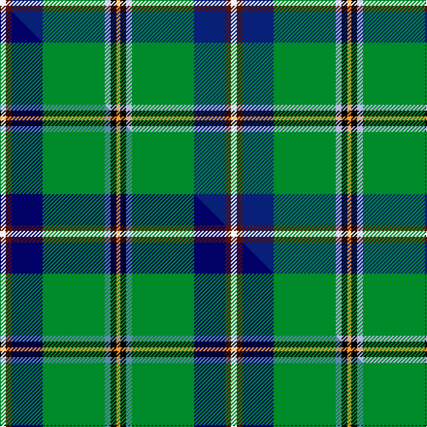

This page is one **sett** — a single exact thread-count. It belongs to the [tartan](/setts/w3dr3db16g32lb3k3lo2/)
(the same proportion at any scale), whose colour order is pattern [WBBGWKY](/stripes/wbbgwky/).

Part of the [Washington State](/tartans/washington-state/) tartan — the named design grouping this sett with its other cloths.

Sourced from tartans-authority.  It is a [7 stripe tartan](/stripes/stripes7/).

Original link [https://www.tartanregister.gov.uk/tartanDetails.aspx?ref=2133](https://www.tartanregister.gov.uk/tartanDetails.aspx?ref=2133)

Dataset <small>— provenance for this record, inherited from the source manifest</small>

<dl class="dataset-prov">
<dt>source</dt><dd><a href="/sources/tartans-authority/">Scottish Tartans Authority</a></dd>
<dt>data captured from</dt><dd><a href="https://github.com/thetartan/tartan-database/blob/master/data/tartans-authority/data.csv">https://github.com/thetartan/tartan-database/blob/master/data/tartans-authority/data.csv</a></dd>
<dt>data date</dt><dd>1988 <small>(this record)</small></dd>
<dt>licence</dt><dd><a href="https://creativecommons.org/licenses/by-nc-nd/4.0/">CC BY-NC-ND 4.0</a></dd>
</dl>

Capture chain <small>— the hands this data passed through, oldest first; each capture carries its own licence</small>

<ol class="capture-chain">
<li><a href="https://www.tartansauthority.com/">Scottish Tartans Authority</a> <small>the heritage body's archive — its tartan-ferret record browser is retired (links repaired to the SRT, above)</small></li>
<li><a href="https://github.com/thetartan/tartan-database">thetartan/tartan-database</a> <small>2016-2017</small> · <a href="https://creativecommons.org/licenses/by-nc-nd/4.0/">CC BY-NC-ND 4.0</a> <small>Levko Kravets's frozen compilation — the capture we vendored, and where its CC licence text came from</small></li>
<li>this dictionary <small>captured 2026-06-10 · commit 5bf86c7566</small> <small>each re-capture is a git commit to data/sources</small></li>
</ol>

## Register references

External register numbers recorded for this tartan.

- Scottish Tartans Authority (ITI): 2133

## Thread count
W/6 DR6 DB32 G64 LB6 K6 LO/4

One full sett is **238 threads**.

## Palette
<table><thead><tr><th>Colour</th><th>Shade</th><th>OKLCh</th></tr></thead><tbody><tr><td>LB</td><td><code style="background-color:#B5BBDE;">#B5BBDE</code> <small style="color:#888">#B5BBDE</small></td><td><small style="color:#888">oklch(79.9% 0.050 277.6)</small></td></tr><tr><td>DB</td><td><code style="background-color:#082077;">#082077</code> <small style="color:#888">#082077</small></td><td><small style="color:#888">oklch(30.0% 0.149 265.1)</small></td></tr><tr><td>DR</td><td><code style="background-color:#55120C;">#55120C</code> <small style="color:#888">#55120C</small></td><td><small style="color:#888">oklch(30.0% 0.099 29.3)</small></td></tr><tr><td>LO</td><td><code style="background-color:#FF9C34;">#FF9C34</code> <small style="color:#888">#FF9C34</small></td><td><small style="color:#888">oklch(77.9% 0.161 61.8)</small></td></tr><tr><td>G</td><td><code style="background-color:#008B2A;">#008B2A</code> <small style="color:#888">#008B2A</small></td><td><small style="color:#888">oklch(55.4% 0.170 145.9)</small></td></tr><tr><td>K</td><td><code style="background-color:#000000;">#000000</code> <small style="color:#888">#000000</small></td><td><small style="color:#888">oklch(0.0% 0.000 0.0)</small></td></tr><tr><td>W</td><td><code style="background-color:#F7F7F7;">#F7F7F7</code> <small style="color:#888">#F7F7F7</small></td><td><small style="color:#888">oklch(97.6% 0.000 89.9)</small></td></tr></tbody></table>

# Sample pattern

## Compared to the master

This cloth is one sett of its design; the master sett (the exemplar the design is anchored on) is below for comparison.

Its **ΔTartan distance** from the master is **0.06** — the same measure the nearest-tartans table ranks by (0 is identical; a re-scale of the same cloth is near 0, a recolour or a different proportion further).

<figure class="master-compare" style="margin:0">

this sett
master sett ★

<figcaption style="color:#888;font-size:smaller">One weave of this sett against the <a href="/setts/w3dr3db16g32t3k3lo2/">master sett ★</a>, split on the diagonal: a shared proportion runs seamlessly across it with only the shades shifting; a different proportion breaks on it.</figcaption>
</figure>

## Nearest tartan variants

The nearest existing variants by ΔTartan distance, with this cloth at the top so the swatches line up against it.

ΔTartan

Threads

Variant

Sett

—

238

<a href="/variants/s7/w3dr3db16g32lb3k3lo2~x2/">Washington State (US State)</a>

<a href="/ttd/edit/#slug=w3dr3db16g32t3k3lo2~x2~db0906265-t2503227&amp;base=w3dr3db16g32lb3k3lo2~x2" title="compare in the TTD">0.06</a>

238

<a href="/variants/s7/w3dr3db16g32t3k3lo2~x2~db0906265-t2503227/">Washington State</a>

<a href="/ttd/edit/#slug=w3r4db13g37lb3k3y2~x2&amp;base=w3dr3db16g32lb3k3lo2~x2" title="compare in the TTD">0.67</a>

250

<a href="/variants/s7/w3r4db13g37lb3k3y2~x2/">Washington District Tartan</a>

<a href="/ttd/edit/#slug=w3r4db13g37b3k3y2~x2&amp;base=w3dr3db16g32lb3k3lo2~x2" title="compare in the TTD">0.68</a>

250

<a href="/variants/s7/w3r4db13g37b3k3y2~x2/">Washington</a>

<a href="/ttd/edit/#slug=k3g44db27ly6r10w3~x2&amp;base=w3dr3db16g32lb3k3lo2~x2" title="compare in the TTD">1.22</a>

360

<a href="/variants/s6/k3g44db27ly6r10w3~x2/">Shawlands International (Commem.)</a>

<a href="/ttd/edit/#slug=r3lb2dg20k3db8g2lb2~x2~dg1806142-g2408144&amp;base=w3dr3db16g32lb3k3lo2~x2" title="compare in the TTD">2.05</a>

150

<a href="/variants/s7/r3lb2dg20k3db8g2lb2~x2~dg1806142-g2408144/">Royal British Legion (Corporate)</a>

<a href="/ttd/edit/#slug=k2db2g16dt2y1dt13w2~x2~db1406275-dt1204274&amp;base=w3dr3db16g32lb3k3lo2~x2" title="compare in the TTD">2.25</a>

144

<a href="/variants/s7/k2dbi2g16db2y1db13w2~x2~dbi1406275-db1204274/">Wishart Hunting Family Tartan</a>

<a href="/ttd/edit/#slug=k2n2g16db2y1db13w2~x2~n1604274-db0805267&amp;base=w3dr3db16g32lb3k3lo2~x2" title="compare in the TTD">2.26</a>

144

<a href="/variants/s7/k2dbi2g16db2y1db13w2~x2~dbi1604274-db0805267/">Wishart, hunting</a>

<a href="/ttd/edit/#slug=k1g15dy1y2dy1w6r1db3k1~x2&amp;base=w3dr3db16g32lb3k3lo2~x2" title="compare in the TTD">2.36</a>

120

<a href="/variants/s9/k1g15dy1y2dy1w6r1db3k1~x2/">Nor Westers Tartan</a>

<a href="/ttd/edit/#slug=k16w4y2g31n4dp4~x4~n2203265-dp1502305&amp;base=w3dr3db16g32lb3k3lo2~x2" title="compare in the TTD">2.41</a>

408

<a href="/variants/s6/k16w4y2g31n4dp4~x4~n2203265-dp1502305/">Lethcoe (Thousand Oaks) (Personal)</a>

<a href="/ttd/edit/#slug=k1g23k1y3k1w8r1lb5k1~x2&amp;base=w3dr3db16g32lb3k3lo2~x2" title="compare in the TTD">2.49</a>

172

<a href="/variants/s9/k1g23k1y3k1w8r1lb5k1~x2/">Nor Westers</a>

## Neighbour map

Every grey dot is one of 13621 variants placed by the first two principal components of the ΔTartan feature space (42% of its variance). Red is this tartan; blue dots are its nearest — click one to open its page.

<svg viewBox="0 0 640 380" role="img" style="max-width:100%;height:auto;border:1px solid #e0e0e0;border-radius:4px;display:block" xmlns="http://www.w3.org/2000/svg"><image href="/nn/cloud.v1.png" width="640" height="380"/><a href="/variants/s7/w3dr3db16g32t3k3lo2~x2~db0906265-t2503227/"><circle cx="205.3" cy="113.2" r="4" fill="#3465a4"><title>Washington State</title></circle></a><a href="/variants/s7/w3r4db13g37lb3k3y2~x2/"><circle cx="248.3" cy="103.3" r="4" fill="#3465a4"><title>Washington District Tartan</title></circle></a><a href="/variants/s7/w3r4db13g37b3k3y2~x2/"><circle cx="252.0" cy="104.6" r="4" fill="#3465a4"><title>Washington</title></circle></a><a href="/variants/s6/k3g44db27ly6r10w3~x2/"><circle cx="198.0" cy="149.2" r="4" fill="#3465a4"><title>Shawlands International (Commem.)</title></circle></a><a href="/variants/s7/r3lb2dg20k3db8g2lb2~x2~dg1806142-g2408144/"><circle cx="202.8" cy="153.2" r="4" fill="#3465a4"><title>Royal British Legion (Corporate)</title></circle></a><a href="/variants/s7/k2dbi2g16db2y1db13w2~x2~dbi1406275-db1204274/"><circle cx="199.2" cy="138.1" r="4" fill="#3465a4"><title>Wishart Hunting Family Tartan</title></circle></a><a href="/variants/s7/k2dbi2g16db2y1db13w2~x2~dbi1604274-db0805267/"><circle cx="185.5" cy="134.6" r="4" fill="#3465a4"><title>Wishart, hunting</title></circle></a><a href="/variants/s9/k1g15dy1y2dy1w6r1db3k1~x2/"><circle cx="156.9" cy="92.2" r="4" fill="#3465a4"><title>Nor Westers Tartan</title></circle></a><a href="/variants/s6/k16w4y2g31n4dp4~x4~n2203265-dp1502305/"><circle cx="200.0" cy="140.0" r="4" fill="#3465a4"><title>Lethcoe (Thousand Oaks) (Personal)</title></circle></a><a href="/variants/s9/k1g23k1y3k1w8r1lb5k1~x2/"><circle cx="217.7" cy="84.2" r="4" fill="#3465a4"><title>Nor Westers</title></circle></a><circle cx="214.2" cy="117.8" r="5" fill="#c00000"/><text x="320" y="376" text-anchor="middle" font-size="11" fill="#999">ground</text><text x="11" y="190" text-anchor="middle" font-size="11" fill="#999" transform="rotate(-90 11 190)">complexity</text></svg>

ID: /variants/s7/w3dr3db16g32lb3k3lo2~x2/
