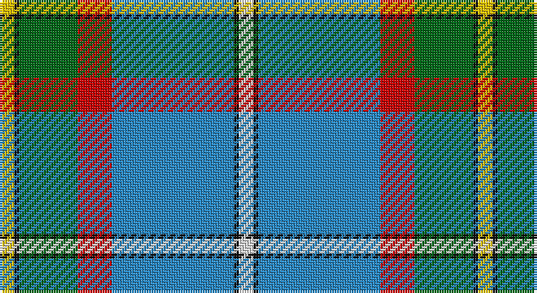

This page is one **sett** — a single exact thread-count. It belongs to the [tartan](/setts/w3k1t25r7g12k1ly3/)
(the same proportion at any scale), whose colour order is pattern [WKBRGKY](/stripes/wkbrgky/).

Sourced from register-of-tartans.  It is a [7 stripe tartan](/stripes/stripes7/).

Original link https://www.tartanregister.gov.uk/tartanDetails.aspx?ref=591

2 attestations — the source records this cloth was collapsed from (oldest owns this page)

<ul>
<li>01/01/1978 — Caskie (register-of-tartans, <a href="https://www.tartanregister.gov.uk/tartanDetails.aspx?ref=591">record</a>)</li>
<li>pre 1978 — Caskie (Name) (tartans-authority, <a href="http://www.tartansauthority.com/tartan-ferret/display/5894/">record</a>)</li>
</ul>

## Register references

External register numbers recorded for this tartan.

- Scottish Register of Tartans: [591](https://www.tartanregister.gov.uk/tartanDetails.aspx?ref=591)
- Scottish Tartans Authority (ITI): 5894

## Thread count
Y/6 K2 G24 R14 B50 K2 LN/6

One full sett is **196 threads**.

## Palette

Palette: <strong>Tartan Register</strong>
<table><thead><tr><th>Colour</th><th>Threads</th><th>Shade</th><th>Base</th><th>OKLCh</th></tr></thead><tbody><tr><td>Y/</td><td style="text-align:right;font-variant-numeric:tabular-nums">6</td><td><code style="background-color:#E8C000;">#E8C000</code> <small style="color:#888">#E8C000</small></td><td>Y <code style="background-color:#F2BF00;">#F2BF00</code></td><td><small style="color:#888">oklch(81.9% 0.168 93.7)</small></td></tr><tr><td>K</td><td style="text-align:right;font-variant-numeric:tabular-nums">2</td><td><code style="background-color:#101010;">#101010</code> <small style="color:#888">#101010</small></td><td>K <code style="background-color:#000000;">#000000</code></td><td><small style="color:#888">oklch(17.3% 0.000 89.9)</small></td></tr><tr><td>G</td><td style="text-align:right;font-variant-numeric:tabular-nums">24</td><td><code style="background-color:#006818;">#006818</code> <small style="color:#888">#006818</small></td><td>G <code style="background-color:#006100;">#006100</code></td><td><small style="color:#888">oklch(45.0% 0.142 145.0)</small></td></tr><tr><td>R</td><td style="text-align:right;font-variant-numeric:tabular-nums">14</td><td><code style="background-color:#C80000;">#C80000</code> <small style="color:#888">#C80000</small></td><td>R <code style="background-color:#CC0000;">#CC0000</code></td><td><small style="color:#888">oklch(52.3% 0.215 29.2)</small></td></tr><tr><td>B</td><td style="text-align:right;font-variant-numeric:tabular-nums">50</td><td><code style="background-color:#2888C4;">#2888C4</code> <small style="color:#888">#2888C4</small></td><td>B <code style="background-color:#2A418A;">#2A418A</code></td><td><small style="color:#888">oklch(60.1% 0.125 241.5)</small></td></tr><tr><td>K</td><td style="text-align:right;font-variant-numeric:tabular-nums">2</td><td><code style="background-color:#101010;">#101010</code> <small style="color:#888">#101010</small></td><td>K <code style="background-color:#000000;">#000000</code></td><td><small style="color:#888">oklch(17.3% 0.000 89.9)</small></td></tr><tr><td>LN/</td><td style="text-align:right;font-variant-numeric:tabular-nums">6</td><td><code style="background-color:#E0E0E0;">#E0E0E0</code> <small style="color:#888">#E0E0E0</small></td><td>W <code style="background-color:#F7F7F7;">#F7F7F7</code></td><td><small style="color:#888">oklch(90.7% 0.000 89.9)</small></td></tr></tbody></table>

# Sample pattern

## Nearest tartans

The nearest existing variants by ΔTartan distance, with this tartan at the top so the swatches line up against it.

ΔTartan

Tartan

Sett

—

<a href="/ttd/edit/#slug=w3k1t25r7g12k1ly3~x2">Caskie</a> <a class="nn-out" href="/variants/s7/w3k1t25r7g12k1ly3~x2/" title="open its dictionary page">↗</a>

0.96

<a href="/ttd/edit/#slug=w2db20gi2g2gi2g4gi8ly2r1~x2&amp;base=w3k1t25r7g12k1ly3~x2">Nova Scotia (Province)</a> <a class="nn-out" href="/variants/s9/w2db20gi2g2gi2g4gi8ly2r1~x2/" title="open its dictionary page">↗</a>

1.07

<a href="/ttd/edit/#slug=r8ly2o7ly2n24k2g1~x2&amp;base=w3k1t25r7g12k1ly3~x2">(4) Traill</a> <a class="nn-out" href="/variants/s7/r8ly2o7ly2n24k2g1~x2/" title="open its dictionary page">↗</a>

1.08

<a href="/ttd/edit/#slug=o36ly2o1ly2o4dt12w8dy2dg12~x2&amp;base=w3k1t25r7g12k1ly3~x2">Nickel Lodge Centennial (Corporate)</a> <a class="nn-out" href="/variants/s9/o36ly2o1ly2o4dt12w8dy2dg12~x2/" title="open its dictionary page">↗</a>

1.08

<a href="/ttd/edit/#slug=ly2r2k2b27k6g13k1lb2~x2&amp;base=w3k1t25r7g12k1ly3~x2">German MacLeod</a> <a class="nn-out" href="/variants/s8/ly2r2k2b27k6g13k1lb2~x2/" title="open its dictionary page">↗</a>

1.08

<a href="/ttd/edit/#slug=o16ly1o2ly1o2dt6w4dy1dg6~x2&amp;base=w3k1t25r7g12k1ly3~x2">Nickel Lodge Centennial</a> <a class="nn-out" href="/variants/s9/o16ly1o2ly1o2dt6w4dy1dg6~x2/" title="open its dictionary page">↗</a>

1.10

<a href="/ttd/edit/#slug=o18ly1o2ly1o2db6w4dy1g6~x2&amp;base=w3k1t25r7g12k1ly3~x2">Nickel Lodge Centennial Corporate Tartan</a> <a class="nn-out" href="/variants/s9/o18ly1o2ly1o2db6w4dy1g6~x2/" title="open its dictionary page">↗</a>

1.11

<a href="/ttd/edit/#slug=w3k1r4g20k3b30w4r2~x2&amp;base=w3k1t25r7g12k1ly3~x2">Scottish Prison Service (Corporate)</a> <a class="nn-out" href="/variants/s8/w3k1r4g20k3b30w4r2~x2/" title="open its dictionary page">↗</a>

1.13

<a href="/ttd/edit/#slug=b24w2b6g9r6b3r6g35k2ly2~x2&amp;base=w3k1t25r7g12k1ly3~x2">O'Donohue Personal)</a> <a class="nn-out" href="/variants/s10/b24w2b6g9r6b3r6g35k2ly2~x2/" title="open its dictionary page">↗</a>

1.16

<a href="/ttd/edit/#slug=r3w6r2g32db36k2db4ly2~x2&amp;base=w3k1t25r7g12k1ly3~x2">Canadian Centennial</a> <a class="nn-out" href="/variants/s8/r3w6r2g32db36k2db4ly2~x2/" title="open its dictionary page">↗</a>

1.20

<a href="/ttd/edit/#slug=y4ly2y39dt10o4dt4r4dt25w3~x2&amp;base=w3k1t25r7g12k1ly3~x2">Blue Blas Alba</a> <a class="nn-out" href="/variants/s9/y4ly2y39dt10o4dt4r4dt25w3~x2/" title="open its dictionary page">↗</a>

## Neighbour map

Every grey dot is one of 14360 variants placed by the first two principal components of the ΔTartan feature space (44% of its variance). Red is this tartan; blue dots are its nearest — click one to open its page.

<svg viewBox="0 0 640 380" role="img" style="max-width:100%;height:auto;border:1px solid #e0e0e0;border-radius:4px;display:block" xmlns="http://www.w3.org/2000/svg"><image href="/nn/cloud.v1.png" width="640" height="380"/><a href="/variants/s9/w2db20gi2g2gi2g4gi8ly2r1~x2/"><circle cx="230.4" cy="114.4" r="4" fill="#3465a4"><title>Nova Scotia (Province)</title></circle></a><a href="/variants/s7/r8ly2o7ly2n24k2g1~x2/"><circle cx="275.7" cy="119.0" r="4" fill="#3465a4"><title>(4) Traill</title></circle></a><a href="/variants/s9/o36ly2o1ly2o4dt12w8dy2dg12~x2/"><circle cx="290.0" cy="94.5" r="4" fill="#3465a4"><title>Nickel Lodge Centennial (Corporate)</title></circle></a><a href="/variants/s8/ly2r2k2b27k6g13k1lb2~x2/"><circle cx="263.1" cy="112.8" r="4" fill="#3465a4"><title>German MacLeod</title></circle></a><a href="/variants/s9/o16ly1o2ly1o2dt6w4dy1dg6~x2/"><circle cx="247.1" cy="131.4" r="4" fill="#3465a4"><title>Nickel Lodge Centennial</title></circle></a><a href="/variants/s9/o18ly1o2ly1o2db6w4dy1g6~x2/"><circle cx="271.1" cy="121.7" r="4" fill="#3465a4"><title>Nickel Lodge Centennial Corporate Tartan</title></circle></a><a href="/variants/s8/w3k1r4g20k3b30w4r2~x2/"><circle cx="251.9" cy="116.2" r="4" fill="#3465a4"><title>Scottish Prison Service (Corporate)</title></circle></a><a href="/variants/s10/b24w2b6g9r6b3r6g35k2ly2~x2/"><circle cx="241.1" cy="123.3" r="4" fill="#3465a4"><title>O'Donohue Personal)</title></circle></a><a href="/variants/s8/r3w6r2g32db36k2db4ly2~x2/"><circle cx="242.8" cy="121.0" r="4" fill="#3465a4"><title>Canadian Centennial</title></circle></a><a href="/variants/s9/y4ly2y39dt10o4dt4r4dt25w3~x2/"><circle cx="245.8" cy="115.4" r="4" fill="#3465a4"><title>Blue Blas Alba</title></circle></a><circle cx="241.3" cy="119.5" r="5" fill="#c00000"/></svg>

ID: /variants/s7/w3k1t25r7g12k1ly3~x2/
