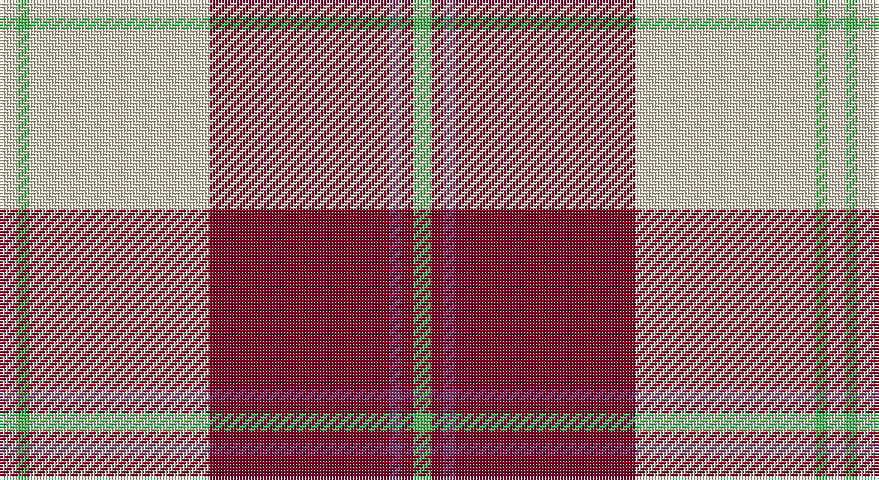

This page is one **sett** — a single exact thread-count. It belongs to the [tartan](/setts/w3lg2w30r30n2r2lg3/)
(the same proportion at any scale), whose colour order is pattern [WYWRBRY](/stripes/wywrbry/).

Sourced from tartans-authority.  It is a [7 stripe tartan](/stripes/stripes7/).

Original link http://www.tartansauthority.com/tartan-ferret/display/7607/

## Also known as

This cloth is also recorded under:

- Torridon, Burgundy

2 attestations — the source records this cloth was collapsed from (oldest owns this page)

<ul>
<li>March 2008 — Torridon, Burgundy (Dance) (tartans-authority, <a href="http://www.tartansauthority.com/tartan-ferret/display/7607/">record</a>)</li>
<li>undated — Torridon Burgundy (register-of-tartans, <a href="https://www.tartanregister.gov.uk/tartanDetails.aspx?ref=5631">record</a>)</li>
</ul>

## Register references

External register numbers recorded for this tartan.

- Scottish Register of Tartans: [5631](https://www.tartanregister.gov.uk/tartanDetails.aspx?ref=5631)
- Scottish Tartans Authority (ITI): 7607

## Thread count
W/6 LG4 W60 DR60 P4 DR4 LG/6

One full sett is **276 threads**.

## Palette

Palette: <strong>Tartan Register</strong> <small style="color:#888">(2 of 4 colours)</small>
<table><thead><tr><th>Colour</th><th>Threads</th><th>Shade</th><th>Base</th><th>OKLCh</th></tr></thead><tbody><tr><td>W/</td><td style="text-align:right;font-variant-numeric:tabular-nums">6</td><td><code style="background-color:#F0E0C8;">#F0E0C8</code> <small style="color:#888">#F0E0C8</small></td><td>W <code style="background-color:#F7F7F7;">#F7F7F7</code></td><td><small style="color:#888">oklch(91.3% 0.036 78.1)</small></td></tr><tr><td>LG</td><td style="text-align:right;font-variant-numeric:tabular-nums">4</td><td><code style="background-color:#58BC60;">#58BC60</code> <small style="color:#888">#58BC60</small></td><td>Y <code style="background-color:#F2BF00;">#F2BF00</code></td><td><small style="color:#888">oklch(71.3% 0.160 145.2)</small></td></tr><tr><td>W</td><td style="text-align:right;font-variant-numeric:tabular-nums">60</td><td><code style="background-color:#F0E0C8;">#F0E0C8</code> <small style="color:#888">#F0E0C8</small></td><td>W <code style="background-color:#F7F7F7;">#F7F7F7</code></td><td><small style="color:#888">oklch(91.3% 0.036 78.1)</small></td></tr><tr><td>DR</td><td style="text-align:right;font-variant-numeric:tabular-nums">60</td><td><code style="background-color:#800028;">#800028</code> <small style="color:#888">#800028</small></td><td>R <code style="background-color:#CC0000;">#CC0000</code></td><td><small style="color:#888">oklch(38.2% 0.152 14.5)</small></td></tr><tr><td>P</td><td style="text-align:right;font-variant-numeric:tabular-nums">4</td><td><code style="background-color:#843470;">#843470</code> <small style="color:#888">#843470</small></td><td>B <code style="background-color:#2A418A;">#2A418A</code></td><td><small style="color:#888">oklch(45.7% 0.132 338.4)</small></td></tr><tr><td>DR</td><td style="text-align:right;font-variant-numeric:tabular-nums">4</td><td><code style="background-color:#800028;">#800028</code> <small style="color:#888">#800028</small></td><td>R <code style="background-color:#CC0000;">#CC0000</code></td><td><small style="color:#888">oklch(38.2% 0.152 14.5)</small></td></tr><tr><td>LG/</td><td style="text-align:right;font-variant-numeric:tabular-nums">6</td><td><code style="background-color:#58BC60;">#58BC60</code> <small style="color:#888">#58BC60</small></td><td>Y <code style="background-color:#F2BF00;">#F2BF00</code></td><td><small style="color:#888">oklch(71.3% 0.160 145.2)</small></td></tr></tbody></table>

# Sample pattern

## Nearest tartans

The nearest existing variants by ΔTartan distance, with this tartan at the top so the swatches line up against it.

ΔTartan

Tartan

Sett

—

<a href="/ttd/edit/#slug=w3lg2w30r30n2r2lg3~x2">Torridon, Burgundy (Dance)</a> <a class="nn-out" href="/variants/s7/w3lg2w30r30n2r2lg3~x2/" title="open its dictionary page">↗</a>

0.55

<a href="/ttd/edit/#slug=w5r2w34r34k2r2ly4~x2&amp;base=w3lg2w30r30n2r2lg3~x2">Cunningham Dress Burgundy (Dance)</a> <a class="nn-out" href="/variants/s7/w5r2w34r34k2r2ly4~x2/" title="open its dictionary page">↗</a>

0.72

<a href="/ttd/edit/#slug=ri3r2db2r30w30db2w3~x2&amp;base=w3lg2w30r30n2r2lg3~x2">Torridon, Cherry (Dance)</a> <a class="nn-out" href="/variants/s7/ri3r2db2r30w30db2w3~x2/" title="open its dictionary page">↗</a>

0.81

<a href="/ttd/edit/#slug=w5r2w34r34k2r2db4~x2&amp;base=w3lg2w30r30n2r2lg3~x2">Cunningham Dress</a> <a class="nn-out" href="/variants/s7/w5r2w34r34k2r2db4~x2/" title="open its dictionary page">↗</a>

0.84

<a href="/ttd/edit/#slug=w4k2w25r21w3r8ly3~x2&amp;base=w3lg2w30r30n2r2lg3~x2">MacPherson Dress Burgundy (Dance)</a> <a class="nn-out" href="/variants/s7/w4k2w25r21w3r8ly3~x2/" title="open its dictionary page">↗</a>

1.06

<a href="/ttd/edit/#slug=w5k2w30r24w3r8dt3~x2&amp;base=w3lg2w30r30n2r2lg3~x2">Arduaine, Red (Dance)</a> <a class="nn-out" href="/variants/s7/w5k2w30r24w3r8dt3~x2/" title="open its dictionary page">↗</a>

1.09

<a href="/ttd/edit/#slug=o4w2ri2r34w37k2~x2&amp;base=w3lg2w30r30n2r2lg3~x2">Papalia, Special Dress</a> <a class="nn-out" href="/variants/s6/o4w2ri2r34w37k2~x2/" title="open its dictionary page">↗</a>

1.20

<a href="/ttd/edit/#slug=r40w40k5w2k6w2k5w6~x2&amp;base=w3lg2w30r30n2r2lg3~x2">Masai Shuka 14 (Artefact)</a> <a class="nn-out" href="/variants/s8/r40w40k5w2k6w2k5w6~x2/" title="open its dictionary page">↗</a>

1.21

<a href="/ttd/edit/#slug=k1r1w1r15w15r1w1k1~x4&amp;base=w3lg2w30r30n2r2lg3~x2">Bundy, Dress Red (Personal Dance)</a> <a class="nn-out" href="/variants/s8/k1r1w1r15w15r1w1k1~x4/" title="open its dictionary page">↗</a>

1.23

<a href="/ttd/edit/#slug=k1r8g1r1w8r1k1~x6&amp;base=w3lg2w30r30n2r2lg3~x2">Cameron, Hose</a> <a class="nn-out" href="/variants/s7/k1r8g1r1w8r1k1~x6/" title="open its dictionary page">↗</a>

1.24

<a href="/ttd/edit/#slug=ri42rii2w2rii2ri5r12w32ri4~x2&amp;base=w3lg2w30r30n2r2lg3~x2">Longniddry Burgundy (Dance)</a> <a class="nn-out" href="/variants/s8/ri42rii2w2rii2ri5r12w32ri4~x2/" title="open its dictionary page">↗</a>

## Neighbour map

Every grey dot is one of 14360 variants placed by the first two principal components of the ΔTartan feature space (44% of its variance). Red is this tartan; blue dots are its nearest — click one to open its page.

<svg viewBox="0 0 640 380" role="img" style="max-width:100%;height:auto;border:1px solid #e0e0e0;border-radius:4px;display:block" xmlns="http://www.w3.org/2000/svg"><image href="/nn/cloud.v1.png" width="640" height="380"/><a href="/variants/s7/w5r2w34r34k2r2ly4~x2/"><circle cx="279.5" cy="121.3" r="4" fill="#3465a4"><title>Cunningham Dress Burgundy (Dance)</title></circle></a><a href="/variants/s7/ri3r2db2r30w30db2w3~x2/"><circle cx="283.3" cy="126.8" r="4" fill="#3465a4"><title>Torridon, Cherry (Dance)</title></circle></a><a href="/variants/s7/w5r2w34r34k2r2db4~x2/"><circle cx="286.1" cy="118.3" r="4" fill="#3465a4"><title>Cunningham Dress</title></circle></a><a href="/variants/s7/w4k2w25r21w3r8ly3~x2/"><circle cx="263.6" cy="153.4" r="4" fill="#3465a4"><title>MacPherson Dress Burgundy (Dance)</title></circle></a><a href="/variants/s7/w5k2w30r24w3r8dt3~x2/"><circle cx="295.3" cy="141.5" r="4" fill="#3465a4"><title>Arduaine, Red (Dance)</title></circle></a><a href="/variants/s6/o4w2ri2r34w37k2~x2/"><circle cx="263.3" cy="108.9" r="4" fill="#3465a4"><title>Papalia, Special Dress</title></circle></a><a href="/variants/s8/r40w40k5w2k6w2k5w6~x2/"><circle cx="294.7" cy="126.4" r="4" fill="#3465a4"><title>Masai Shuka 14 (Artefact)</title></circle></a><a href="/variants/s8/k1r1w1r15w15r1w1k1~x4/"><circle cx="322.1" cy="129.7" r="4" fill="#3465a4"><title>Bundy, Dress Red (Personal Dance)</title></circle></a><a href="/variants/s7/k1r8g1r1w8r1k1~x6/"><circle cx="235.2" cy="157.3" r="4" fill="#3465a4"><title>Cameron, Hose</title></circle></a><a href="/variants/s8/ri42rii2w2rii2ri5r12w32ri4~x2/"><circle cx="300.3" cy="116.6" r="4" fill="#3465a4"><title>Longniddry Burgundy (Dance)</title></circle></a><circle cx="274.9" cy="129.1" r="5" fill="#c00000"/></svg>

ID: /variants/s7/w3lg2w30r30n2r2lg3~x2/
