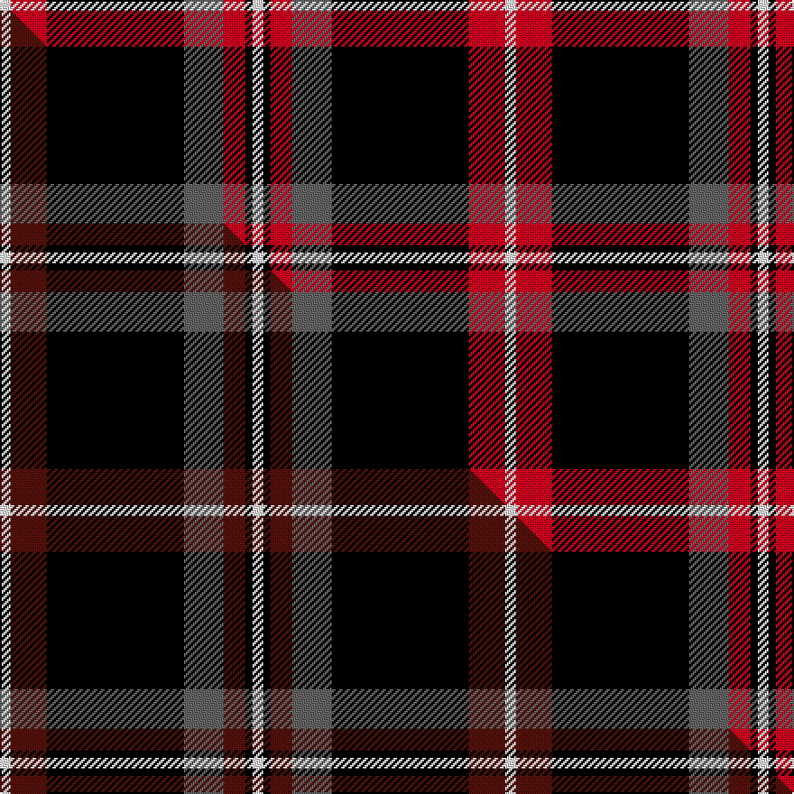

This is one **variant** — a specific cloth: this exact thread count and colourway, with its own
provenance below. It is one weaving of the [sett](/setts/w3r10k38n11r6k2w3/) (the scale-free proportion — the
same cloth at any scale or shade), whose colour order is pattern [WKRBKRW](/stripes/wkrbkrw/).

Part of the [Phantom](/tartans/p/ph/phantom/) tartan — the named design grouping this sett with its other cloths.

Sourced from tartans-authority.  It is a [7 stripe tartan](/stripes/stripes7/).

Original link [https://www.tartanregister.gov.uk/tartanDetails.aspx?ref=10050](https://www.tartanregister.gov.uk/tartanDetails.aspx?ref=10050)

Dataset <small>— provenance for this record, inherited from the source manifest</small>

<dl class="dataset-prov">
<dt>source</dt><dd><a href="/sources/tartans-authority/">Scottish Tartans Authority</a></dd>
<dt>data captured from</dt><dd><a href="https://github.com/thetartan/tartan-database/blob/master/data/tartans-authority/data.csv">https://github.com/thetartan/tartan-database/blob/master/data/tartans-authority/data.csv</a></dd>
<dt>data date</dt><dd>20th May 2009 <small>(this record)</small></dd>
<dt>licence</dt><dd><a href="https://creativecommons.org/licenses/by-nc-nd/4.0/">CC BY-NC-ND 4.0</a></dd>
</dl>

Capture chain <small>— the hands this data passed through, oldest first; each capture carries its own licence</small>

<ol class="capture-chain">
<li><a href="https://www.tartansauthority.com/">Scottish Tartans Authority</a> <small>the heritage body's archive — its tartan-ferret record browser is retired (links repaired to the SRT, above)</small></li>
<li><a href="https://github.com/thetartan/tartan-database">thetartan/tartan-database</a> <small>2016-2017</small> · <a href="https://creativecommons.org/licenses/by-nc-nd/4.0/">CC BY-NC-ND 4.0</a> <small>Levko Kravets's frozen compilation — the capture we vendored, and where its CC licence text came from</small></li>
<li>this dictionary <small>captured 2026-06-10 · commit 5bf86c7566</small> <small>each re-capture is a git commit to data/sources</small></li>
</ol>

## Register references

External register numbers recorded for this tartan.

- Scottish Register of Tartans: [10050](https://www.tartanregister.gov.uk/tartanDetails?ref=10050)
- Scottish Tartans Authority (ITI): 10050

## Thread count
W/6 R20 K76 N22 R12 K4 W/6

One full sett is **280 threads**.

## Palette
<table><thead><tr><th>Colour</th><th>Shade</th><th>OKLCh</th></tr></thead><tbody><tr><td>R</td><td><code style="background-color:#D60020;">#D60020</code> <small style="color:#888">#D60020</small></td><td><small style="color:#888">oklch(55.2% 0.224 25.5)</small></td></tr><tr><td>K</td><td><code style="background-color:#000000;">#000000</code> <small style="color:#888">#000000</small></td><td><small style="color:#888">oklch(0.0% 0.000 0.0)</small></td></tr><tr><td>W</td><td><code style="background-color:#F7F7F7;">#F7F7F7</code> <small style="color:#888">#F7F7F7</small></td><td><small style="color:#888">oklch(97.6% 0.000 89.9)</small></td></tr><tr><td>N</td><td><code style="background-color:#636363;">#636363</code> <small style="color:#888">#636363</small></td><td><small style="color:#888">oklch(50.0% 0.000 89.9)</small></td></tr></tbody></table>

# Sample pattern

## Compared to the master

This cloth is one sett of its design; the master sett (the exemplar the design is anchored on) is below for comparison.

Its **ΔTartan distance** from the master is **0.12** — the same measure the nearest-tartans table ranks by (0 is identical; a re-scale of the same cloth is near 0, a recolour or a different proportion further).

<figure class="master-compare" style="margin:0">

this sett
master sett ★

<figcaption style="color:#888;font-size:smaller">One weave of this sett against the <a href="/setts/w3dr10k38n11dr6k2w3/">master sett ★</a>, split on the diagonal: a shared proportion runs seamlessly across it with only the shades shifting; a different proportion breaks on it.</figcaption>
</figure>

## Nearest tartan variants

The nearest existing variants by ΔTartan distance, with this cloth at the top so the swatches line up against it.

ΔTartan

Threads

Variant

Sett

—

280

<a href="/variants/s7/w3r10k38n11r6k2w3~x2/">Phantom (Corporate)</a>

<a href="/ttd/edit/#slug=w3dr10k38n11dr6k2w3~x2&amp;base=w3r10k38n11r6k2w3~x2" title="compare in the TTD">0.12</a>

280

<a href="/variants/s7/w3dr10k38n11dr6k2w3~x2/">Phantom</a>

<a href="/ttd/edit/#slug=k38lb2o24w2k16o6lb2k3lb5~x2&amp;base=w3r10k38n11r6k2w3~x2" title="compare in the TTD">2.08</a>

306

<a href="/variants/s9/k38lb2o24w2k16o6lb2k3lb5~x2/">Universal Scientific Indust (Corp.)</a>

<a href="/ttd/edit/#slug=k32w12r1w2r15~x2&amp;base=w3r10k38n11r6k2w3~x2" title="compare in the TTD">2.25</a>

154

<a href="/variants/s5/k32w12r1w2r15~x2/">Nunes (2014)</a>

<a href="/ttd/edit/#slug=r10k3w1k15ly1w3k3ly1~x4&amp;base=w3r10k38n11r6k2w3~x2" title="compare in the TTD">2.34</a>

252

<a href="/variants/s8/r10k3w1k15ly1w3k3ly1~x4/">Cunard o' the Clyde</a>

<a href="/ttd/edit/#slug=r10k15g2k2w1k1w1~x4&amp;base=w3r10k38n11r6k2w3~x2" title="compare in the TTD">2.35</a>

212

<a href="/variants/s7/r10k15g2k2w1k1w1~x4/">Ikelman No 4</a>

<a href="/ttd/edit/#slug=k60w2r10dg6w4r15y10~x2&amp;base=w3r10k38n11r6k2w3~x2" title="compare in the TTD">2.40</a>

288

<a href="/variants/s7/k60w2r10dg6w4r15y10~x2/">Iberia Dress, Black (Fashion)</a>

<a href="/ttd/edit/#slug=y2k2r2w8k14r1k1r1k1r1~x2&amp;base=w3r10k38n11r6k2w3~x2" title="compare in the TTD">2.43</a>

126

<a href="/variants/s10/y2k2r2w8k14r1k1r1k1r1~x2/">Barbecue Plaid (Fashion)</a>

<a href="/ttd/edit/#slug=db5r12k38r4w2r2w2r2w2r4~x2&amp;base=w3r10k38n11r6k2w3~x2" title="compare in the TTD">2.44</a>

274

<a href="/variants/s10/db5r12k38r4w2r2w2r2w2r4~x2/">Good Conduct (USA)</a>

<a href="/ttd/edit/#slug=k43dr10w3k3w15db3~x2&amp;base=w3r10k38n11r6k2w3~x2" title="compare in the TTD">2.47</a>

216

<a href="/variants/s6/k43dr10w3k3w15db3~x2/">Bro-Wened</a>

<a href="/ttd/edit/#slug=r12k2w8k4n16r2k31n2&amp;base=w3r10k38n11r6k2w3~x2" title="compare in the TTD">2.49</a>

140

<a href="/variants/s8/r12k2w8k4n16r2k31n2/">Distripress Annual Congress 2012</a>

## Neighbour map

Every grey dot is one of 13621 variants placed by the first two principal components of the ΔTartan feature space (42% of its variance). Red is this tartan; blue dots are its nearest — click one to open its page. The map is a flat projection of a many-dimensional space — [how to read it](/posts/neighbourhood-maps/).

<svg viewBox="0 0 640 380" role="img" style="max-width:100%;height:auto;border:1px solid #e0e0e0;border-radius:4px;display:block" xmlns="http://www.w3.org/2000/svg"><image href="/nn/cloud.v1.png" width="640" height="380"/><a href="/variants/s7/w3dr10k38n11dr6k2w3~x2/"><circle cx="273.5" cy="135.4" r="4" fill="#3465a4"><title>Phantom</title></circle></a><a href="/variants/s9/k38lb2o24w2k16o6lb2k3lb5~x2/"><circle cx="284.8" cy="120.5" r="4" fill="#3465a4"><title>Universal Scientific Indust (Corp.)</title></circle></a><a href="/variants/s5/k32w12r1w2r15~x2/"><circle cx="273.1" cy="148.4" r="4" fill="#3465a4"><title>Nunes (2014)</title></circle></a><a href="/variants/s8/r10k3w1k15ly1w3k3ly1~x4/"><circle cx="257.2" cy="133.0" r="4" fill="#3465a4"><title>Cunard o' the Clyde</title></circle></a><a href="/variants/s7/r10k15g2k2w1k1w1~x4/"><circle cx="273.9" cy="133.0" r="4" fill="#3465a4"><title>Ikelman No 4</title></circle></a><a href="/variants/s7/k60w2r10dg6w4r15y10~x2/"><circle cx="272.8" cy="91.7" r="4" fill="#3465a4"><title>Iberia Dress, Black (Fashion)</title></circle></a><a href="/variants/s10/y2k2r2w8k14r1k1r1k1r1~x2/"><circle cx="235.9" cy="114.4" r="4" fill="#3465a4"><title>Barbecue Plaid (Fashion)</title></circle></a><a href="/variants/s10/db5r12k38r4w2r2w2r2w2r4~x2/"><circle cx="262.8" cy="92.2" r="4" fill="#3465a4"><title>Good Conduct (USA)</title></circle></a><a href="/variants/s6/k43dr10w3k3w15db3~x2/"><circle cx="283.7" cy="148.6" r="4" fill="#3465a4"><title>Bro-Wened</title></circle></a><a href="/variants/s8/r12k2w8k4n16r2k31n2/"><circle cx="203.5" cy="140.7" r="4" fill="#3465a4"><title>Distripress Annual Congress 2012</title></circle></a><circle cx="259.0" cy="125.9" r="5" fill="#c00000"/><text x="320" y="376" text-anchor="middle" font-size="11" fill="#999">ground</text><text x="11" y="190" text-anchor="middle" font-size="11" fill="#999" transform="rotate(-90 11 190)">complexity</text></svg>

ID: /variants/s7/w3r10k38n11r6k2w3~x2/
