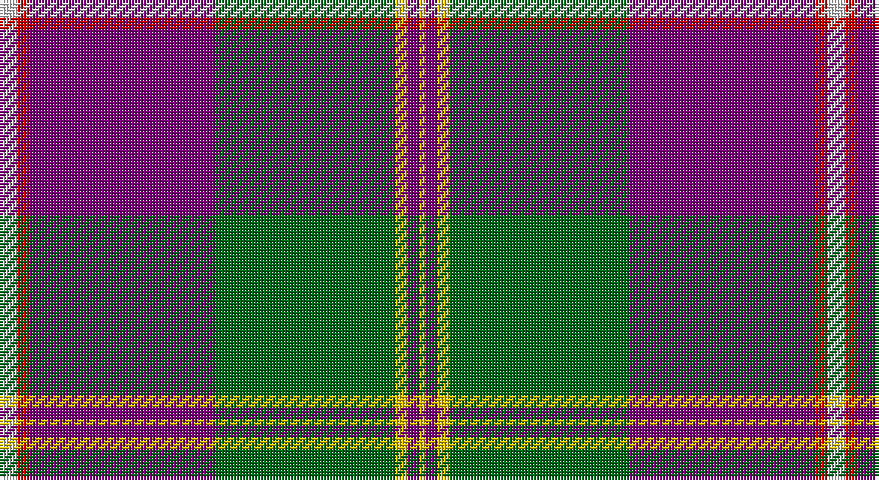

This page is one **sett** — a single exact thread-count. It belongs to the [tartan](/setts/w3r2dp31g30ly2dp2ly1/)
(the same proportion at any scale), whose colour order is pattern [WRBGYBY](/stripes/wrbgyby/).

Part of the [Caig](/tartans/caig/) tartan — the named design grouping this sett with its other cloths.

Sourced from tartans-authority.  It is a [7 stripe tartan](/stripes/stripes7/).

Original link http://www.tartansauthority.com/tartan-ferret/display/7352/

## Register references

External register numbers recorded for this tartan.

- Scottish Tartans Authority (ITI): 7352

## Thread count
LN/6 R4 P62 G60 Y4 P4 Y/2

One full sett is **276 threads**.

## Palette

Palette: <strong>Tartan Register</strong>
<table><thead><tr><th>Colour</th><th>Threads</th><th>Shade</th><th>Base</th><th>OKLCh</th></tr></thead><tbody><tr><td>LN/</td><td style="text-align:right;font-variant-numeric:tabular-nums">6</td><td><code style="background-color:#E0E0E0;">#E0E0E0</code> <small style="color:#888">#E0E0E0</small></td><td>W <code style="background-color:#F7F7F7;">#F7F7F7</code></td><td><small style="color:#888">oklch(90.7% 0.000 89.9)</small></td></tr><tr><td>R</td><td style="text-align:right;font-variant-numeric:tabular-nums">4</td><td><code style="background-color:#C80000;">#C80000</code> <small style="color:#888">#C80000</small></td><td>R <code style="background-color:#CC0000;">#CC0000</code></td><td><small style="color:#888">oklch(52.3% 0.215 29.2)</small></td></tr><tr><td>P</td><td style="text-align:right;font-variant-numeric:tabular-nums">62</td><td><code style="background-color:#780078;">#780078</code> <small style="color:#888">#780078</small></td><td>B <code style="background-color:#2A418A;">#2A418A</code></td><td><small style="color:#888">oklch(40.2% 0.185 328.4)</small></td></tr><tr><td>G</td><td style="text-align:right;font-variant-numeric:tabular-nums">60</td><td><code style="background-color:#006818;">#006818</code> <small style="color:#888">#006818</small></td><td>G <code style="background-color:#006100;">#006100</code></td><td><small style="color:#888">oklch(45.0% 0.142 145.0)</small></td></tr><tr><td>Y</td><td style="text-align:right;font-variant-numeric:tabular-nums">4</td><td><code style="background-color:#E8C000;">#E8C000</code> <small style="color:#888">#E8C000</small></td><td>Y <code style="background-color:#F2BF00;">#F2BF00</code></td><td><small style="color:#888">oklch(81.9% 0.168 93.7)</small></td></tr><tr><td>P</td><td style="text-align:right;font-variant-numeric:tabular-nums">4</td><td><code style="background-color:#780078;">#780078</code> <small style="color:#888">#780078</small></td><td>B <code style="background-color:#2A418A;">#2A418A</code></td><td><small style="color:#888">oklch(40.2% 0.185 328.4)</small></td></tr><tr><td>Y/</td><td style="text-align:right;font-variant-numeric:tabular-nums">2</td><td><code style="background-color:#E8C000;">#E8C000</code> <small style="color:#888">#E8C000</small></td><td>Y <code style="background-color:#F2BF00;">#F2BF00</code></td><td><small style="color:#888">oklch(81.9% 0.168 93.7)</small></td></tr></tbody></table>

# Sample pattern

## Compared to the master

This cloth is one sett of its design; the master sett (the exemplar the design is anchored on) is below for comparison.

<figure style="margin:0"><figcaption style="color:#888;font-size:smaller">this sett</figcaption></figure>
<figure style="margin:0"><figcaption style="color:#888;font-size:smaller"><a href="/setts/w3r2p31g30ly2g2ly1/">master sett →</a></figcaption></figure>

## Nearest tartans

The nearest existing variants by ΔTartan distance, with this tartan at the top so the swatches line up against it.

ΔTartan

Tartan

Sett

—

<a href="/ttd/edit/#slug=w3r2dp31g30ly2dp2ly1~x2">Caig (Corporate)</a> <a class="nn-out" href="/variants/s7/w3r2dp31g30ly2dp2ly1~x2/" title="open its dictionary page">↗</a>

0.63

<a href="/ttd/edit/#slug=w3r2p31g30ly2g2ly1~x2&amp;base=w3r2dp31g30ly2dp2ly1~x2">Caig (Personal)</a> <a class="nn-out" href="/variants/s7/w3r2p31g30ly2g2ly1~x2/" title="open its dictionary page">↗</a>

0.91

<a href="/ttd/edit/#slug=dt50r26k9r4w2lo2r10~x2&amp;base=w3r2dp31g30ly2dp2ly1~x2">Java Saint Andrew Society Dress</a> <a class="nn-out" href="/variants/s7/dt50r26k9r4w2lo2r10~x2/" title="open its dictionary page">↗</a>

1.05

<a href="/ttd/edit/#slug=p6r1p20g6p6g24k1g2w4~x2&amp;base=w3r2dp31g30ly2dp2ly1~x2">MacNeill</a> <a class="nn-out" href="/variants/s9/p6r1p20g6p6g24k1g2w4~x2/" title="open its dictionary page">↗</a>

1.08

<a href="/ttd/edit/#slug=lr60k6lr8k2lr8w2r12k49lo4&amp;base=w3r2dp31g30ly2dp2ly1~x2">Motherwell Football Club. Modern</a> <a class="nn-out" href="/variants/s9/lr60k6lr8k2lr8w2r12k49lo4/" title="open its dictionary page">↗</a>

1.20

<a href="/ttd/edit/#slug=db60w2r10dg6w4r15ly10~x2&amp;base=w3r2dp31g30ly2dp2ly1~x2">Iberia Dress, Blue (Fashion)</a> <a class="nn-out" href="/variants/s7/db60w2r10dg6w4r15ly10~x2/" title="open its dictionary page">↗</a>

1.21

<a href="/ttd/edit/#slug=w5n38y3db11y1db11y3n4w5lo1~x2&amp;base=w3r2dp31g30ly2dp2ly1~x2">Ballarat</a> <a class="nn-out" href="/variants/s10/w5n38y3db11y1db11y3n4w5lo1~x2/" title="open its dictionary page">↗</a>

1.28

<a href="/ttd/edit/#slug=lo8k50o15dg6o6db3o6lo2~x2&amp;base=w3r2dp31g30ly2dp2ly1~x2">Royal College of G.P.s (Corporate)</a> <a class="nn-out" href="/variants/s8/lo8k50o15dg6o6db3o6lo2~x2/" title="open its dictionary page">↗</a>

1.29

<a href="/variants/s8/t72r16k5ly2dt16~x2/">Thomas Jean Marc Personal Tartan</a>

1.30

<a href="/ttd/edit/#slug=dp3r3dp34g18lo2g18lb2r3~x2&amp;base=w3r2dp31g30ly2dp2ly1~x2">Singh</a> <a class="nn-out" href="/variants/s8/dp3r3dp34g18lo2g18lb2r3~x2/" title="open its dictionary page">↗</a>

1.30

<a href="/ttd/edit/#slug=w5n38o3db11o1db11o3n4w5lo1~x2&amp;base=w3r2dp31g30ly2dp2ly1~x2">Ballarat</a> <a class="nn-out" href="/variants/s10/w5n38o3db11o1db11o3n4w5lo1~x2/" title="open its dictionary page">↗</a>

## Neighbour map

Every grey dot is one of 14360 variants placed by the first two principal components of the ΔTartan feature space (44% of its variance). Red is this tartan; blue dots are its nearest — click one to open its page.

<svg viewBox="0 0 640 380" role="img" style="max-width:100%;height:auto;border:1px solid #e0e0e0;border-radius:4px;display:block" xmlns="http://www.w3.org/2000/svg"><image href="/nn/cloud.v1.png" width="640" height="380"/><a href="/variants/s7/w3r2p31g30ly2g2ly1~x2/"><circle cx="297.8" cy="110.0" r="4" fill="#3465a4"><title>Caig (Personal)</title></circle></a><a href="/variants/s7/dt50r26k9r4w2lo2r10~x2/"><circle cx="312.9" cy="135.0" r="4" fill="#3465a4"><title>Java Saint Andrew Society Dress</title></circle></a><a href="/variants/s9/p6r1p20g6p6g24k1g2w4~x2/"><circle cx="278.2" cy="126.1" r="4" fill="#3465a4"><title>MacNeill</title></circle></a><a href="/variants/s9/lr60k6lr8k2lr8w2r12k49lo4/"><circle cx="292.3" cy="97.9" r="4" fill="#3465a4"><title>Motherwell Football Club. Modern</title></circle></a><a href="/variants/s7/db60w2r10dg6w4r15ly10~x2/"><circle cx="323.4" cy="111.4" r="4" fill="#3465a4"><title>Iberia Dress, Blue (Fashion)</title></circle></a><a href="/variants/s10/w5n38y3db11y1db11y3n4w5lo1~x2/"><circle cx="306.1" cy="94.9" r="4" fill="#3465a4"><title>Ballarat</title></circle></a><a href="/variants/s8/lo8k50o15dg6o6db3o6lo2~x2/"><circle cx="296.7" cy="121.8" r="4" fill="#3465a4"><title>Royal College of G.P.s (Corporate)</title></circle></a><a href="/variants/s8/t72r16k5ly2dt16~x2/"><circle cx="326.3" cy="104.3" r="4" fill="#3465a4"><title>Thomas Jean Marc Personal Tartan</title></circle></a><a href="/variants/s8/dp3r3dp34g18lo2g18lb2r3~x2/"><circle cx="287.8" cy="155.2" r="4" fill="#3465a4"><title>Singh</title></circle></a><a href="/variants/s10/w5n38o3db11o1db11o3n4w5lo1~x2/"><circle cx="303.8" cy="91.8" r="4" fill="#3465a4"><title>Ballarat</title></circle></a><circle cx="313.0" cy="115.1" r="5" fill="#c00000"/></svg>

ID: /variants/s7/w3r2dp31g30ly2dp2ly1~x2/
