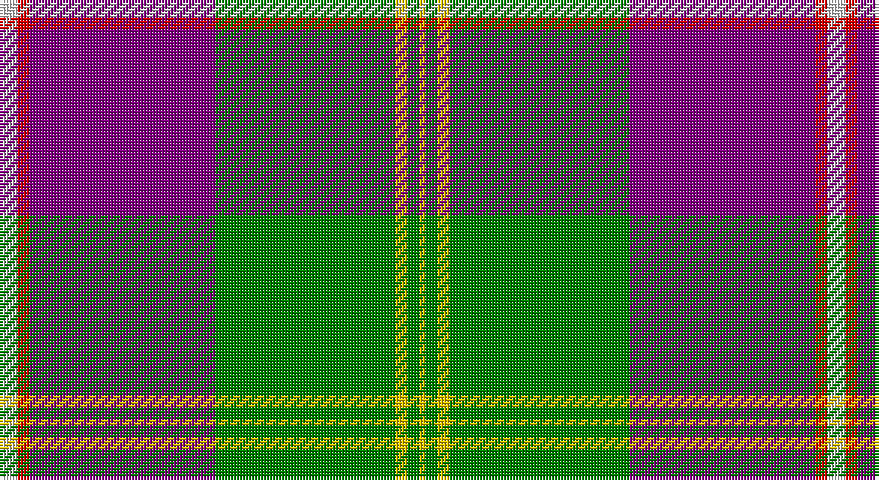

This page is one **sett** — a single exact thread-count. It belongs to the [tartan](/setts/w3r2p31g30ly2g2ly1/)
(the same proportion at any scale), whose colour order is pattern [WRBGYGY](/stripes/wrbgygy/).

Part of the [Caig](/tartans/caig/) tartan — the named design grouping this sett with its other cloths.

Sourced from register-of-tartans.  It is a [7 stripe tartan](/stripes/stripes7/).

Original link https://www.tartanregister.gov.uk/tartanDetails.aspx?ref=5829

## Register references

External register numbers recorded for this tartan.

- Scottish Register of Tartans: [5829](https://www.tartanregister.gov.uk/tartanDetails.aspx?ref=5829)
- Scottish Tartans Authority (ITI): 7352
- Scottish Tartans World Register: 3188

## Thread count
LN/6 R4 P62 G60 Y4 G4 Y/2

One full sett is **276 threads**.

## Palette

Palette: <strong>Tartan Register</strong> <small style="color:#888">(3 of 5 colours)</small>
<table><thead><tr><th>Colour</th><th>Threads</th><th>Shade</th><th>Base</th><th>OKLCh</th></tr></thead><tbody><tr><td>LN/</td><td style="text-align:right;font-variant-numeric:tabular-nums">6</td><td><code style="background-color:#E0E0E0;">#E0E0E0</code> <small style="color:#888">#E0E0E0</small></td><td>W <code style="background-color:#F7F7F7;">#F7F7F7</code></td><td><small style="color:#888">oklch(90.7% 0.000 89.9)</small></td></tr><tr><td>R</td><td style="text-align:right;font-variant-numeric:tabular-nums">4</td><td><code style="background-color:#DC0000;">#DC0000</code> <small style="color:#888">#DC0000</small></td><td>R <code style="background-color:#CC0000;">#CC0000</code></td><td><small style="color:#888">oklch(56.2% 0.230 29.2)</small></td></tr><tr><td>P</td><td style="text-align:right;font-variant-numeric:tabular-nums">62</td><td><code style="background-color:#800080;">#800080</code> <small style="color:#888">#800080</small></td><td>B <code style="background-color:#2A418A;">#2A418A</code></td><td><small style="color:#888">oklch(42.1% 0.193 328.4)</small></td></tr><tr><td>G</td><td style="text-align:right;font-variant-numeric:tabular-nums">60</td><td><code style="background-color:#008000;">#008000</code> <small style="color:#888">#008000</small></td><td>G <code style="background-color:#006100;">#006100</code></td><td><small style="color:#888">oklch(52.0% 0.177 142.5)</small></td></tr><tr><td>Y</td><td style="text-align:right;font-variant-numeric:tabular-nums">4</td><td><code style="background-color:#E8C000;">#E8C000</code> <small style="color:#888">#E8C000</small></td><td>Y <code style="background-color:#F2BF00;">#F2BF00</code></td><td><small style="color:#888">oklch(81.9% 0.168 93.7)</small></td></tr><tr><td>G</td><td style="text-align:right;font-variant-numeric:tabular-nums">4</td><td><code style="background-color:#008000;">#008000</code> <small style="color:#888">#008000</small></td><td>G <code style="background-color:#006100;">#006100</code></td><td><small style="color:#888">oklch(52.0% 0.177 142.5)</small></td></tr><tr><td>Y/</td><td style="text-align:right;font-variant-numeric:tabular-nums">2</td><td><code style="background-color:#E8C000;">#E8C000</code> <small style="color:#888">#E8C000</small></td><td>Y <code style="background-color:#F2BF00;">#F2BF00</code></td><td><small style="color:#888">oklch(81.9% 0.168 93.7)</small></td></tr></tbody></table>

# Sample pattern

## Nearest tartans

The nearest existing variants by ΔTartan distance, with this tartan at the top so the swatches line up against it.

ΔTartan

Tartan

Sett

—

<a href="/ttd/edit/#slug=w3r2p31g30ly2g2ly1~x2">Caig (Personal)</a> <a class="nn-out" href="/variants/s7/w3r2p31g30ly2g2ly1~x2/" title="open its dictionary page">↗</a>

0.63

<a href="/ttd/edit/#slug=w3r2dp31g30ly2dp2ly1~x2&amp;base=w3r2p31g30ly2g2ly1~x2">Caig (Corporate)</a> <a class="nn-out" href="/variants/s7/w3r2dp31g30ly2dp2ly1~x2/" title="open its dictionary page">↗</a>

0.89

<a href="/ttd/edit/#slug=lr60k6lr8k2lr8w2r12k49lo4&amp;base=w3r2p31g30ly2g2ly1~x2">Motherwell Football Club. Modern</a> <a class="nn-out" href="/variants/s9/lr60k6lr8k2lr8w2r12k49lo4/" title="open its dictionary page">↗</a>

0.97

<a href="/ttd/edit/#slug=p6r1p20g6p6g24k1g2w4~x2&amp;base=w3r2p31g30ly2g2ly1~x2">MacNeill</a> <a class="nn-out" href="/variants/s9/p6r1p20g6p6g24k1g2w4~x2/" title="open its dictionary page">↗</a>

1.22

<a href="/ttd/edit/#slug=t4db32ly3ly32g1ly2g1ly4~x2&amp;base=w3r2p31g30ly2g2ly1~x2">McClurg (Name)</a> <a class="nn-out" href="/variants/s8/t4db32ly3ly32g1ly2g1ly4~x2/" title="open its dictionary page">↗</a>

1.29

<a href="/ttd/edit/#slug=w5n38y3db11y1db11y3n4w5lo1~x2&amp;base=w3r2p31g30ly2g2ly1~x2">Ballarat</a> <a class="nn-out" href="/variants/s10/w5n38y3db11y1db11y3n4w5lo1~x2/" title="open its dictionary page">↗</a>

1.30

<a href="/ttd/edit/#slug=k3r1k18w1lo18g1lo1w2~x4&amp;base=w3r2p31g30ly2g2ly1~x2">Dunlop Hunting</a> <a class="nn-out" href="/variants/s8/k3r1k18w1lo18g1lo1w2~x4/" title="open its dictionary page">↗</a>

1.34

<a href="/ttd/edit/#slug=g44db2g4db2g6k16m40db2ly11&amp;base=w3r2p31g30ly2g2ly1~x2">(1) Stewart, modern</a> <a class="nn-out" href="/variants/s9/g44db2g4db2g6k16m40db2ly11/" title="open its dictionary page">↗</a>

1.35

<a href="/ttd/edit/#slug=o4g2o7dt30o8dt7lg5g1w2~x2&amp;base=w3r2p31g30ly2g2ly1~x2">Inchforth (Personal)</a> <a class="nn-out" href="/variants/s9/o4g2o7dt30o8dt7lg5g1w2~x2/" title="open its dictionary page">↗</a>

1.38

<a href="/ttd/edit/#slug=w5n38o3db11o1db11o3n4w5lo1~x2&amp;base=w3r2p31g30ly2g2ly1~x2">Ballarat</a> <a class="nn-out" href="/variants/s10/w5n38o3db11o1db11o3n4w5lo1~x2/" title="open its dictionary page">↗</a>

1.41

<a href="/ttd/edit/#slug=dt50r26k9r4w2lo2r10~x2&amp;base=w3r2p31g30ly2g2ly1~x2">Java Saint Andrew Society Dress</a> <a class="nn-out" href="/variants/s7/dt50r26k9r4w2lo2r10~x2/" title="open its dictionary page">↗</a>

## Neighbour map

Every grey dot is one of 14360 variants placed by the first two principal components of the ΔTartan feature space (44% of its variance). Red is this tartan; blue dots are its nearest — click one to open its page.

<svg viewBox="0 0 640 380" role="img" style="max-width:100%;height:auto;border:1px solid #e0e0e0;border-radius:4px;display:block" xmlns="http://www.w3.org/2000/svg"><image href="/nn/cloud.v1.png" width="640" height="380"/><a href="/variants/s7/w3r2dp31g30ly2dp2ly1~x2/"><circle cx="313.0" cy="115.1" r="4" fill="#3465a4"><title>Caig (Corporate)</title></circle></a><a href="/variants/s9/lr60k6lr8k2lr8w2r12k49lo4/"><circle cx="292.3" cy="97.9" r="4" fill="#3465a4"><title>Motherwell Football Club. Modern</title></circle></a><a href="/variants/s9/p6r1p20g6p6g24k1g2w4~x2/"><circle cx="278.2" cy="126.1" r="4" fill="#3465a4"><title>MacNeill</title></circle></a><a href="/variants/s8/t4db32ly3ly32g1ly2g1ly4~x2/"><circle cx="274.7" cy="87.9" r="4" fill="#3465a4"><title>McClurg (Name)</title></circle></a><a href="/variants/s10/w5n38y3db11y1db11y3n4w5lo1~x2/"><circle cx="306.1" cy="94.9" r="4" fill="#3465a4"><title>Ballarat</title></circle></a><a href="/variants/s8/k3r1k18w1lo18g1lo1w2~x4/"><circle cx="265.6" cy="119.4" r="4" fill="#3465a4"><title>Dunlop Hunting</title></circle></a><a href="/variants/s9/g44db2g4db2g6k16m40db2ly11/"><circle cx="214.6" cy="113.4" r="4" fill="#3465a4"><title>(1) Stewart, modern</title></circle></a><a href="/variants/s9/o4g2o7dt30o8dt7lg5g1w2~x2/"><circle cx="333.0" cy="120.4" r="4" fill="#3465a4"><title>Inchforth (Personal)</title></circle></a><a href="/variants/s10/w5n38o3db11o1db11o3n4w5lo1~x2/"><circle cx="303.8" cy="91.8" r="4" fill="#3465a4"><title>Ballarat</title></circle></a><a href="/variants/s7/dt50r26k9r4w2lo2r10~x2/"><circle cx="312.9" cy="135.0" r="4" fill="#3465a4"><title>Java Saint Andrew Society Dress</title></circle></a><circle cx="297.8" cy="110.0" r="5" fill="#c00000"/></svg>

ID: /variants/s7/w3r2p31g30ly2g2ly1~x2/
