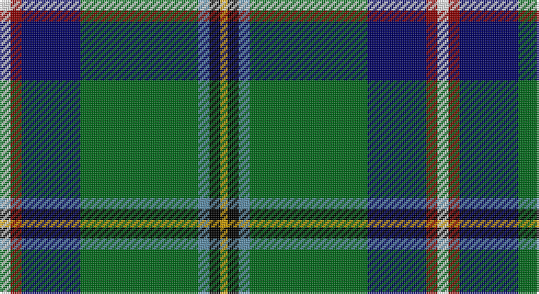

This page is one **sett** — a single exact thread-count. It belongs to the [tartan](/setts/w3r3db16g32t3k3ly2/)
(the same proportion at any scale), whose colour order is pattern [WRBGBKY](/stripes/wrbgbky/).

Sourced from register-of-tartans.  It is a [7 stripe tartan](/stripes/stripes7/).

Original link https://www.tartanregister.gov.uk/tartanDetails.aspx?ref=4495

2 attestations — the source records this cloth was collapsed from (oldest owns this page)

<ul>
<li>01/01/1988 — Washington State (register-of-tartans, <a href="https://www.tartanregister.gov.uk/tartanDetails.aspx?ref=4495">record</a>)</li>
<li>1988 — Washington State (US State) (tartans-authority, <a href="http://www.tartansauthority.com/tartan-ferret/display/2133/">record</a>)</li>
</ul>

## Register references

External register numbers recorded for this tartan.

- Scottish Register of Tartans: [4495](https://www.tartanregister.gov.uk/tartanDetails.aspx?ref=4495)
- Scottish Tartans Authority (ITI): 2133
- Scottish Tartans World Register: 2133

## Thread count
W/6 DR6 DB32 G64 B6 K6 DY/4

One full sett is **238 threads**.

## Palette

Palette: <strong>Tartan Register</strong> <small style="color:#888">(9 of 12 colours)</small>
<table><thead><tr><th>Colour</th><th>Threads</th><th>Shade</th><th>Base</th><th>OKLCh</th></tr></thead><tbody><tr><td>W/</td><td style="text-align:right;font-variant-numeric:tabular-nums">6</td><td><code style="background-color:#F8F8F8;">#F8F8F8</code> <small style="color:#888">#F8F8F8</small></td><td>W <code style="background-color:#F7F7F7;">#F7F7F7</code></td><td><small style="color:#888">oklch(97.9% 0.000 89.9)</small></td></tr><tr><td>DR</td><td style="text-align:right;font-variant-numeric:tabular-nums">6</td><td><code style="background-color:#8C0000;">#8C0000</code> <small style="color:#888">#8C0000</small></td><td>R <code style="background-color:#CC0000;">#CC0000</code></td><td><small style="color:#888">oklch(40.2% 0.165 29.2)</small></td></tr><tr><td>DB</td><td style="text-align:right;font-variant-numeric:tabular-nums">32</td><td><code style="background-color:#000064;">#000064</code> <small style="color:#888">#000064</small></td><td>B <code style="background-color:#2A418A;">#2A418A</code></td><td><small style="color:#888">oklch(22.7% 0.158 264.1)</small></td></tr><tr><td>G</td><td style="text-align:right;font-variant-numeric:tabular-nums">64</td><td><code style="background-color:#006818;">#006818</code> <small style="color:#888">#006818</small></td><td>G <code style="background-color:#006100;">#006100</code></td><td><small style="color:#888">oklch(45.0% 0.142 145.0)</small></td></tr><tr><td>B</td><td style="text-align:right;font-variant-numeric:tabular-nums">6</td><td><code style="background-color:#5C8CA8;">#5C8CA8</code> <small style="color:#888">#5C8CA8</small></td><td>B <code style="background-color:#2A418A;">#2A418A</code></td><td><small style="color:#888">oklch(61.7% 0.067 235.0)</small></td></tr><tr><td>K</td><td style="text-align:right;font-variant-numeric:tabular-nums">6</td><td><code style="background-color:#000000;">#000000</code> <small style="color:#888">#000000</small></td><td>K <code style="background-color:#000000;">#000000</code></td><td><small style="color:#888">oklch(0.0% 0.000 0.0)</small></td></tr><tr><td>DY/</td><td style="text-align:right;font-variant-numeric:tabular-nums">4</td><td><code style="background-color:#C89800;">#C89800</code> <small style="color:#888">#C89800</small></td><td>Y <code style="background-color:#F2BF00;">#F2BF00</code></td><td><small style="color:#888">oklch(70.6% 0.144 85.9)</small></td></tr></tbody></table>

# Sample pattern

## Nearest tartans

The nearest existing variants by ΔTartan distance, with this tartan at the top so the swatches line up against it.

ΔTartan

Tartan

Sett

—

<a href="/ttd/edit/#slug=w3r3db16g32t3k3ly2~x2">Washington State</a> <a class="nn-out" href="/variants/s7/w3r3db16g32t3k3ly2~x2/" title="open its dictionary page">↗</a>

0.96

<a href="/ttd/edit/#slug=r3ti16k12g2k2dg32t2dg2lb3~x2&amp;base=w3r3db16g32t3k3ly2~x2">Scottish Ambulance Service (Corporat</a> <a class="nn-out" href="/variants/s9/r3ti16k12g2k2dg32t2dg2lb3~x2/" title="open its dictionary page">↗</a>

1.07

<a href="/ttd/edit/#slug=b2lb1b2k16g20k14r2w2ly2~x2&amp;base=w3r3db16g32t3k3ly2~x2">Brooke</a> <a class="nn-out" href="/variants/s9/b2lb1b2k16g20k14r2w2ly2~x2/" title="open its dictionary page">↗</a>

1.07

<a href="/ttd/edit/#slug=w3r4db13g37t3k3ly2~x2&amp;base=w3r3db16g32t3k3ly2~x2">Washington District Tartan</a> <a class="nn-out" href="/variants/s7/w3r4db13g37t3k3ly2~x2/" title="open its dictionary page">↗</a>

1.24

<a href="/ttd/edit/#slug=ly3k8o3g4gi4dt22lyi2~x2&amp;base=w3r3db16g32t3k3ly2~x2">Young Enterprise Scotland</a> <a class="nn-out" href="/variants/s7/ly3k8o3g4gi4dt22lyi2~x2/" title="open its dictionary page">↗</a>

1.28

<a href="/ttd/edit/#slug=k2db2g16dbi2ly1dbi13w2~x2&amp;base=w3r3db16g32t3k3ly2~x2">Wishart, hunting</a> <a class="nn-out" href="/variants/s7/k2db2g16dbi2ly1dbi13w2~x2/" title="open its dictionary page">↗</a>

1.31

<a href="/ttd/edit/#slug=r3w6r2g32db36k2db4ly2~x2&amp;base=w3r3db16g32t3k3ly2~x2">Canadian Centennial</a> <a class="nn-out" href="/variants/s8/r3w6r2g32db36k2db4ly2~x2/" title="open its dictionary page">↗</a>

1.31

<a href="/ttd/edit/#slug=w3r4db13g37b3k3ly2~x2&amp;base=w3r3db16g32t3k3ly2~x2">Washington</a> <a class="nn-out" href="/variants/s7/w3r4db13g37b3k3ly2~x2/" title="open its dictionary page">↗</a>

1.34

<a href="/ttd/edit/#slug=w2db20dg2g2dg2g4dg8ly2r1~x2&amp;base=w3r3db16g32t3k3ly2~x2">Nova Scotia</a> <a class="nn-out" href="/variants/s9/w2db20dg2g2dg2g4dg8ly2r1~x2/" title="open its dictionary page">↗</a>

1.41

<a href="/ttd/edit/#slug=r4g14k3lp3g12db36w4~x2&amp;base=w3r3db16g32t3k3ly2~x2">Vipont</a> <a class="nn-out" href="/variants/s7/r4g14k3lp3g12db36w4~x2/" title="open its dictionary page">↗</a>

1.42

<a href="/ttd/edit/#slug=k2dbi2g16db2ly1db13w2~x2&amp;base=w3r3db16g32t3k3ly2~x2">Wishart Hunting Family Tartan</a> <a class="nn-out" href="/variants/s7/k2dbi2g16db2ly1db13w2~x2/" title="open its dictionary page">↗</a>

## Neighbour map

Every grey dot is one of 14360 variants placed by the first two principal components of the ΔTartan feature space (44% of its variance). Red is this tartan; blue dots are its nearest — click one to open its page.

<svg viewBox="0 0 640 380" role="img" style="max-width:100%;height:auto;border:1px solid #e0e0e0;border-radius:4px;display:block" xmlns="http://www.w3.org/2000/svg"><image href="/nn/cloud.v1.png" width="640" height="380"/><a href="/variants/s9/r3ti16k12g2k2dg32t2dg2lb3~x2/"><circle cx="184.6" cy="104.7" r="4" fill="#3465a4"><title>Scottish Ambulance Service (Corporat</title></circle></a><a href="/variants/s9/b2lb1b2k16g20k14r2w2ly2~x2/"><circle cx="206.7" cy="100.5" r="4" fill="#3465a4"><title>Brooke</title></circle></a><a href="/variants/s7/w3r4db13g37t3k3ly2~x2/"><circle cx="282.8" cy="115.5" r="4" fill="#3465a4"><title>Washington District Tartan</title></circle></a><a href="/variants/s7/ly3k8o3g4gi4dt22lyi2~x2/"><circle cx="170.9" cy="140.7" r="4" fill="#3465a4"><title>Young Enterprise Scotland</title></circle></a><a href="/variants/s7/k2db2g16dbi2ly1dbi13w2~x2/"><circle cx="194.0" cy="139.7" r="4" fill="#3465a4"><title>Wishart, hunting</title></circle></a><a href="/variants/s8/r3w6r2g32db36k2db4ly2~x2/"><circle cx="242.8" cy="121.0" r="4" fill="#3465a4"><title>Canadian Centennial</title></circle></a><a href="/variants/s7/w3r4db13g37b3k3ly2~x2/"><circle cx="269.5" cy="108.4" r="4" fill="#3465a4"><title>Washington</title></circle></a><a href="/variants/s9/w2db20dg2g2dg2g4dg8ly2r1~x2/"><circle cx="231.2" cy="115.7" r="4" fill="#3465a4"><title>Nova Scotia</title></circle></a><a href="/variants/s7/r4g14k3lp3g12db36w4~x2/"><circle cx="220.7" cy="154.8" r="4" fill="#3465a4"><title>Vipont</title></circle></a><a href="/variants/s7/k2dbi2g16db2ly1db13w2~x2/"><circle cx="223.7" cy="150.6" r="4" fill="#3465a4"><title>Wishart Hunting Family Tartan</title></circle></a><circle cx="224.6" cy="119.1" r="5" fill="#c00000"/></svg>

ID: /variants/s7/w3r3db16g32t3k3ly2~x2/
