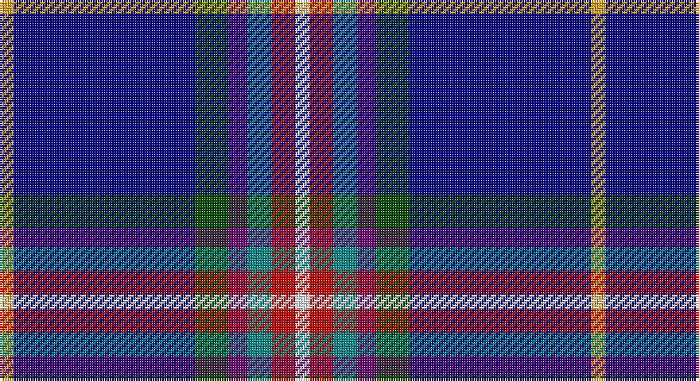

This page is one **sett** — a single exact thread-count. It belongs to the [tartan](/setts/w3r5g5dp4dg7db38lo3/)
(the same proportion at any scale), whose colour order is pattern [WRGBGBY](/stripes/wrgbgby/).

Sourced from register-of-tartans.  It is a [7 stripe tartan](/stripes/stripes7/).

Original link https://www.tartanregister.gov.uk/tartanDetails.aspx?ref=11383

## Register references

External register numbers recorded for this tartan.

- Scottish Register of Tartans: [11383](https://www.tartanregister.gov.uk/tartanDetails.aspx?ref=11383)

## Thread count
Y/6 DB76 G14 P8 B10 R10 W/6

One full sett is **248 threads**.

## Palette

Palette: <strong>Tartan Register</strong>
<table><thead><tr><th>Colour</th><th>Threads</th><th>Shade</th><th>Base</th><th>OKLCh</th></tr></thead><tbody><tr><td>Y/</td><td style="text-align:right;font-variant-numeric:tabular-nums">6</td><td><code style="background-color:#E0A126;">#E0A126</code> <small style="color:#888">#E0A126</small></td><td>Y <code style="background-color:#F2BF00;">#F2BF00</code></td><td><small style="color:#888">oklch(75.1% 0.146 78.3)</small></td></tr><tr><td>DB</td><td style="text-align:right;font-variant-numeric:tabular-nums">76</td><td><code style="background-color:#00008C;">#00008C</code> <small style="color:#888">#00008C</small></td><td>B <code style="background-color:#2A418A;">#2A418A</code></td><td><small style="color:#888">oklch(28.9% 0.200 264.1)</small></td></tr><tr><td>G</td><td style="text-align:right;font-variant-numeric:tabular-nums">14</td><td><code style="background-color:#004C00;">#004C00</code> <small style="color:#888">#004C00</small></td><td>G <code style="background-color:#006100;">#006100</code></td><td><small style="color:#888">oklch(36.1% 0.123 142.5)</small></td></tr><tr><td>P</td><td style="text-align:right;font-variant-numeric:tabular-nums">8</td><td><code style="background-color:#6C0070;">#6C0070</code> <small style="color:#888">#6C0070</small></td><td>B <code style="background-color:#2A418A;">#2A418A</code></td><td><small style="color:#888">oklch(37.6% 0.174 326.5)</small></td></tr><tr><td>B</td><td style="text-align:right;font-variant-numeric:tabular-nums">10</td><td><code style="background-color:#048888;">#048888</code> <small style="color:#888">#048888</small></td><td>G <code style="background-color:#006100;">#006100</code></td><td><small style="color:#888">oklch(56.8% 0.096 194.8)</small></td></tr><tr><td>R</td><td style="text-align:right;font-variant-numeric:tabular-nums">10</td><td><code style="background-color:#C80000;">#C80000</code> <small style="color:#888">#C80000</small></td><td>R <code style="background-color:#CC0000;">#CC0000</code></td><td><small style="color:#888">oklch(52.3% 0.215 29.2)</small></td></tr><tr><td>W/</td><td style="text-align:right;font-variant-numeric:tabular-nums">6</td><td><code style="background-color:#FFFFFF;">#FFFFFF</code> <small style="color:#888">#FFFFFF</small></td><td>W <code style="background-color:#F7F7F7;">#F7F7F7</code></td><td><small style="color:#888">oklch(100.0% 0.000 89.9)</small></td></tr></tbody></table>

# Sample pattern

## Nearest tartans

The nearest existing variants by ΔTartan distance, with this tartan at the top so the swatches line up against it.

ΔTartan

Tartan

Sett

—

<a href="/ttd/edit/#slug=w3r5g5dp4dg7db38lo3~x2">Blairgowrie Golf Club, The</a> <a class="nn-out" href="/variants/s7/w3r5g5dp4dg7db38lo3~x2/" title="open its dictionary page">↗</a>

1.26

<a href="/ttd/edit/#slug=db40r3k10lo2lr15w2lr4~x2&amp;base=w3r5g5dp4dg7db38lo3~x2">U.S. Forces Thurso (Military)</a> <a class="nn-out" href="/variants/s7/db40r3k10lo2lr15w2lr4~x2/" title="open its dictionary page">↗</a>

1.29

<a href="/ttd/edit/#slug=m1g2t10r1db15w1~x4&amp;base=w3r5g5dp4dg7db38lo3~x2">Oren Peterson</a> <a class="nn-out" href="/variants/s6/m1g2t10r1db15w1~x4/" title="open its dictionary page">↗</a>

1.54

<a href="/ttd/edit/#slug=db73k9ly3k5dbi13w3t7k5w7r16&amp;base=w3r5g5dp4dg7db38lo3~x2">Ambulance Victoria</a> <a class="nn-out" href="/variants/s10/db73k9ly3k5dbi13w3t7k5w7r16/" title="open its dictionary page">↗</a>

1.54

<a href="/ttd/edit/#slug=g7lb2db28dg14dp5lb2dp5lb2db27b2~x2&amp;base=w3r5g5dp4dg7db38lo3~x2">Head of The Lakes</a> <a class="nn-out" href="/variants/s10/g7lb2db28dg14dp5lb2dp5lb2db27b2~x2/" title="open its dictionary page">↗</a>

1.59

<a href="/ttd/edit/#slug=db30b10lb10db5m3ly3g3~x2&amp;base=w3r5g5dp4dg7db38lo3~x2">Wrigglesworth (Name)</a> <a class="nn-out" href="/variants/s7/db30b10lb10db5m3ly3g3~x2/" title="open its dictionary page">↗</a>

1.59

<a href="/ttd/edit/#slug=lb8db10dt69w6dt6r8b19lb3&amp;base=w3r5g5dp4dg7db38lo3~x2">Virginia International Tattoo Hixon</a> <a class="nn-out" href="/variants/s8/lb8db10dt69w6dt6r8b19lb3/" title="open its dictionary page">↗</a>

1.61

<a href="/ttd/edit/#slug=db39o3k14o3t14ly4w2dr2~x2&amp;base=w3r5g5dp4dg7db38lo3~x2">Unidentified, Lady's kilt</a> <a class="nn-out" href="/variants/s8/db39o3k14o3t14ly4w2dr2~x2/" title="open its dictionary page">↗</a>

1.68

<a href="/ttd/edit/#slug=w1dp3g6k1db12ly1db2ly1~x4&amp;base=w3r5g5dp4dg7db38lo3~x2">Lambert, Patrice (Personal)</a> <a class="nn-out" href="/variants/s8/w1dp3g6k1db12ly1db2ly1~x4/" title="open its dictionary page">↗</a>

1.68

<a href="/ttd/edit/#slug=w1p3g6k1db12ly1db2ly1~x4&amp;base=w3r5g5dp4dg7db38lo3~x2">Lambert, Patrice (Personal)</a> <a class="nn-out" href="/variants/s8/w1p3g6k1db12ly1db2ly1~x4/" title="open its dictionary page">↗</a>

1.69

<a href="/ttd/edit/#slug=p5g8k5db32w2r2~x2&amp;base=w3r5g5dp4dg7db38lo3~x2">Marion (Personal)</a> <a class="nn-out" href="/variants/s6/p5g8k5db32w2r2~x2/" title="open its dictionary page">↗</a>

## Neighbour map

Every grey dot is one of 14360 variants placed by the first two principal components of the ΔTartan feature space (44% of its variance). Red is this tartan; blue dots are its nearest — click one to open its page.

<svg viewBox="0 0 640 380" role="img" style="max-width:100%;height:auto;border:1px solid #e0e0e0;border-radius:4px;display:block" xmlns="http://www.w3.org/2000/svg"><image href="/nn/cloud.v1.png" width="640" height="380"/><a href="/variants/s7/db40r3k10lo2lr15w2lr4~x2/"><circle cx="259.3" cy="121.2" r="4" fill="#3465a4"><title>U.S. Forces Thurso (Military)</title></circle></a><a href="/variants/s6/m1g2t10r1db15w1~x4/"><circle cx="245.7" cy="144.8" r="4" fill="#3465a4"><title>Oren Peterson</title></circle></a><a href="/variants/s10/db73k9ly3k5dbi13w3t7k5w7r16/"><circle cx="230.5" cy="67.1" r="4" fill="#3465a4"><title>Ambulance Victoria</title></circle></a><a href="/variants/s10/g7lb2db28dg14dp5lb2dp5lb2db27b2~x2/"><circle cx="286.2" cy="145.8" r="4" fill="#3465a4"><title>Head of The Lakes</title></circle></a><a href="/variants/s7/db30b10lb10db5m3ly3g3~x2/"><circle cx="238.1" cy="160.4" r="4" fill="#3465a4"><title>Wrigglesworth (Name)</title></circle></a><a href="/variants/s8/lb8db10dt69w6dt6r8b19lb3/"><circle cx="298.9" cy="110.6" r="4" fill="#3465a4"><title>Virginia International Tattoo Hixon</title></circle></a><a href="/variants/s8/db39o3k14o3t14ly4w2dr2~x2/"><circle cx="207.4" cy="101.6" r="4" fill="#3465a4"><title>Unidentified, Lady's kilt</title></circle></a><a href="/variants/s8/w1dp3g6k1db12ly1db2ly1~x4/"><circle cx="235.0" cy="145.6" r="4" fill="#3465a4"><title>Lambert, Patrice (Personal)</title></circle></a><a href="/variants/s8/w1p3g6k1db12ly1db2ly1~x4/"><circle cx="202.8" cy="133.9" r="4" fill="#3465a4"><title>Lambert, Patrice (Personal)</title></circle></a><a href="/variants/s6/p5g8k5db32w2r2~x2/"><circle cx="318.0" cy="153.2" r="4" fill="#3465a4"><title>Marion (Personal)</title></circle></a><circle cx="257.4" cy="121.3" r="5" fill="#c00000"/></svg>

ID: /variants/s7/w3r5g5dp4dg7db38lo3~x2/
