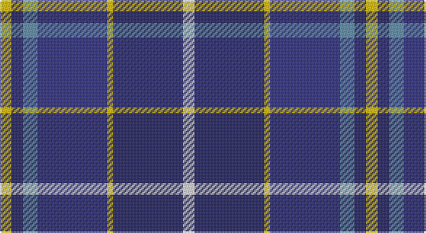

This page is one **sett** — a single exact thread-count. It belongs to the [tartan](/setts/w4db24ly2dbi24t5db4ly4/)
(the same proportion at any scale), whose colour order is pattern [WBYBBBY](/stripes/wbybbby/).

Sourced from house-of-tartan.  It is a [7 stripe tartan](/stripes/stripes7/).

Original link http://www.house-of-tartan.scotland.net/house/TartanViewjs.asp?colr=Def&tnam=5797

## Provenance

Earliest known date: pre 2003 Designed by Fiona Hall of Lochcarron as a corporate tartan for the Mina Company of Tokyo whose logo is a butterfly. The blues are from the company's colours and represent the sky, the yellow represents the butterfly and the white is for the clouds.'Perhonen' is Finnish for butterfly and chosen because the Japanese design world has a great affinity with some Scandinavian countries.

## Thread count
Y/8 DBa8 B10 DB48 Y4 DBa48 LN/8

One full sett is **252 threads**.

## Palette

Palette: <strong>Tartan Register</strong> <small style="color:#888">(5 of 7 colours)</small>
<table><thead><tr><th>Colour</th><th>Threads</th><th>Shade</th><th>Base</th><th>OKLCh</th></tr></thead><tbody><tr><td>Y/</td><td style="text-align:right;font-variant-numeric:tabular-nums">8</td><td><code style="background-color:#E8C000;">#E8C000</code> <small style="color:#888">#E8C000</small></td><td>Y <code style="background-color:#F2BF00;">#F2BF00</code></td><td><small style="color:#888">oklch(81.9% 0.168 93.7)</small></td></tr><tr><td>DBa</td><td style="text-align:right;font-variant-numeric:tabular-nums">8</td><td><code style="background-color:#202060;">#202060</code> <small style="color:#888">#202060</small></td><td>B <code style="background-color:#2A418A;">#2A418A</code></td><td><small style="color:#888">oklch(28.9% 0.111 276.9)</small></td></tr><tr><td>B</td><td style="text-align:right;font-variant-numeric:tabular-nums">10</td><td><code style="background-color:#5C8CA8;">#5C8CA8</code> <small style="color:#888">#5C8CA8</small></td><td>B <code style="background-color:#2A418A;">#2A418A</code></td><td><small style="color:#888">oklch(61.7% 0.067 235.0)</small></td></tr><tr><td>DB</td><td style="text-align:right;font-variant-numeric:tabular-nums">48</td><td><code style="background-color:#2C2C80;">#2C2C80</code> <small style="color:#888">#2C2C80</small></td><td>B <code style="background-color:#2A418A;">#2A418A</code></td><td><small style="color:#888">oklch(35.0% 0.138 276.6)</small></td></tr><tr><td>Y</td><td style="text-align:right;font-variant-numeric:tabular-nums">4</td><td><code style="background-color:#E8C000;">#E8C000</code> <small style="color:#888">#E8C000</small></td><td>Y <code style="background-color:#F2BF00;">#F2BF00</code></td><td><small style="color:#888">oklch(81.9% 0.168 93.7)</small></td></tr><tr><td>DBa</td><td style="text-align:right;font-variant-numeric:tabular-nums">48</td><td><code style="background-color:#202060;">#202060</code> <small style="color:#888">#202060</small></td><td>B <code style="background-color:#2A418A;">#2A418A</code></td><td><small style="color:#888">oklch(28.9% 0.111 276.9)</small></td></tr><tr><td>LN/</td><td style="text-align:right;font-variant-numeric:tabular-nums">8</td><td><code style="background-color:#E0E0E0;">#E0E0E0</code> <small style="color:#888">#E0E0E0</small></td><td>W <code style="background-color:#F7F7F7;">#F7F7F7</code></td><td><small style="color:#888">oklch(90.7% 0.000 89.9)</small></td></tr></tbody></table>

# Sample pattern

## Nearest tartans

The nearest existing variants by ΔTartan distance, with this tartan at the top so the swatches line up against it.

ΔTartan

Tartan

Sett

—

<a href="/ttd/edit/#slug=w4db24ly2dbi24t5db4ly4~x2">Mina Perhonen Japanese Corporate Tartan</a> <a class="nn-out" href="/variants/s7/w4db24ly2dbi24t5db4ly4~x2/" title="open its dictionary page">↗</a>

0.83

<a href="/ttd/edit/#slug=db26w2db3dbi15t26dbi2t3ly4~x2&amp;base=w4db24ly2dbi24t5db4ly4~x2">Banff and Buchan District Tartan</a> <a class="nn-out" href="/variants/s8/db26w2db3dbi15t26dbi2t3ly4~x2/" title="open its dictionary page">↗</a>

0.85

<a href="/ttd/edit/#slug=db3t24k11db20w2db5lo3~x2&amp;base=w4db24ly2dbi24t5db4ly4~x2">Icelandair</a> <a class="nn-out" href="/variants/s7/db3t24k11db20w2db5lo3~x2/" title="open its dictionary page">↗</a>

0.87

<a href="/ttd/edit/#slug=dbi26w2dbi3db15t26db2t3ly4~x2&amp;base=w4db24ly2dbi24t5db4ly4~x2">Banff, and Buchan</a> <a class="nn-out" href="/variants/s8/dbi26w2dbi3db15t26db2t3ly4~x2/" title="open its dictionary page">↗</a>

0.96

<a href="/ttd/edit/#slug=db4p2dp3db24b24w3~x2&amp;base=w4db24ly2dbi24t5db4ly4~x2">Aberdeen Academy of Performing Arts</a> <a class="nn-out" href="/variants/s6/db4p2dp3db24b24w3~x2/" title="open its dictionary page">↗</a>

1.03

<a href="/ttd/edit/#slug=w2db15y2dbi20r9w2~x2&amp;base=w4db24ly2dbi24t5db4ly4~x2">The Open Championship</a> <a class="nn-out" href="/variants/s6/w2db15y2dbi20r9w2~x2/" title="open its dictionary page">↗</a>

1.09

<a href="/ttd/edit/#slug=db25k3db7k15b25k2b2w4~x2&amp;base=w4db24ly2dbi24t5db4ly4~x2">Sabema</a> <a class="nn-out" href="/variants/s8/db25k3db7k15b25k2b2w4~x2/" title="open its dictionary page">↗</a>

1.13

<a href="/ttd/edit/#slug=db4dpi2dp3db24t24w3~x2&amp;base=w4db24ly2dbi24t5db4ly4~x2">Aberdeen Academy of Performing Art</a> <a class="nn-out" href="/variants/s6/db4dpi2dp3db24t24w3~x2/" title="open its dictionary page">↗</a>

1.16

<a href="/ttd/edit/#slug=db12k4g4r1g4k1lo1~x4&amp;base=w4db24ly2dbi24t5db4ly4~x2">MacLaren</a> <a class="nn-out" href="/variants/s7/db12k4g4r1g4k1lo1~x4/" title="open its dictionary page">↗</a>

1.18

<a href="/ttd/edit/#slug=ly3db20db4dt4db4dt20g4dp4ly2~x2&amp;base=w4db24ly2dbi24t5db4ly4~x2">Blue Peter</a> <a class="nn-out" href="/variants/s9/ly3db20db4dt4db4dt20g4dp4ly2~x2/" title="open its dictionary page">↗</a>

1.20

<a href="/ttd/edit/#slug=db35r2k16ly2t25w2t6~x2&amp;base=w4db24ly2dbi24t5db4ly4~x2">US Forces (Thurso) Regimental Tartan</a> <a class="nn-out" href="/variants/s7/db35r2k16ly2t25w2t6~x2/" title="open its dictionary page">↗</a>

## Neighbour map

Every grey dot is one of 14360 variants placed by the first two principal components of the ΔTartan feature space (44% of its variance). Red is this tartan; blue dots are its nearest — click one to open its page.

<svg viewBox="0 0 640 380" role="img" style="max-width:100%;height:auto;border:1px solid #e0e0e0;border-radius:4px;display:block" xmlns="http://www.w3.org/2000/svg"><image href="/nn/cloud.v1.png" width="640" height="380"/><a href="/variants/s8/db26w2db3dbi15t26dbi2t3ly4~x2/"><circle cx="196.0" cy="169.2" r="4" fill="#3465a4"><title>Banff and Buchan District Tartan</title></circle></a><a href="/variants/s7/db3t24k11db20w2db5lo3~x2/"><circle cx="206.7" cy="188.5" r="4" fill="#3465a4"><title>Icelandair</title></circle></a><a href="/variants/s8/dbi26w2dbi3db15t26db2t3ly4~x2/"><circle cx="182.0" cy="165.4" r="4" fill="#3465a4"><title>Banff, and Buchan</title></circle></a><a href="/variants/s6/db4p2dp3db24b24w3~x2/"><circle cx="264.3" cy="188.9" r="4" fill="#3465a4"><title>Aberdeen Academy of Performing Arts</title></circle></a><a href="/variants/s6/w2db15y2dbi20r9w2~x2/"><circle cx="176.8" cy="189.4" r="4" fill="#3465a4"><title>The Open Championship</title></circle></a><a href="/variants/s8/db25k3db7k15b25k2b2w4~x2/"><circle cx="215.5" cy="195.5" r="4" fill="#3465a4"><title>Sabema</title></circle></a><a href="/variants/s6/db4dpi2dp3db24t24w3~x2/"><circle cx="265.6" cy="184.4" r="4" fill="#3465a4"><title>Aberdeen Academy of Performing Art</title></circle></a><a href="/variants/s7/db12k4g4r1g4k1lo1~x4/"><circle cx="236.6" cy="187.8" r="4" fill="#3465a4"><title>MacLaren</title></circle></a><a href="/variants/s9/ly3db20db4dt4db4dt20g4dp4ly2~x2/"><circle cx="233.8" cy="188.9" r="4" fill="#3465a4"><title>Blue Peter</title></circle></a><a href="/variants/s7/db35r2k16ly2t25w2t6~x2/"><circle cx="198.7" cy="147.5" r="4" fill="#3465a4"><title>US Forces (Thurso) Regimental Tartan</title></circle></a><circle cx="212.6" cy="177.3" r="5" fill="#c00000"/></svg>

ID: /variants/s7/w4db24ly2dbi24t5db4ly4~x2/
