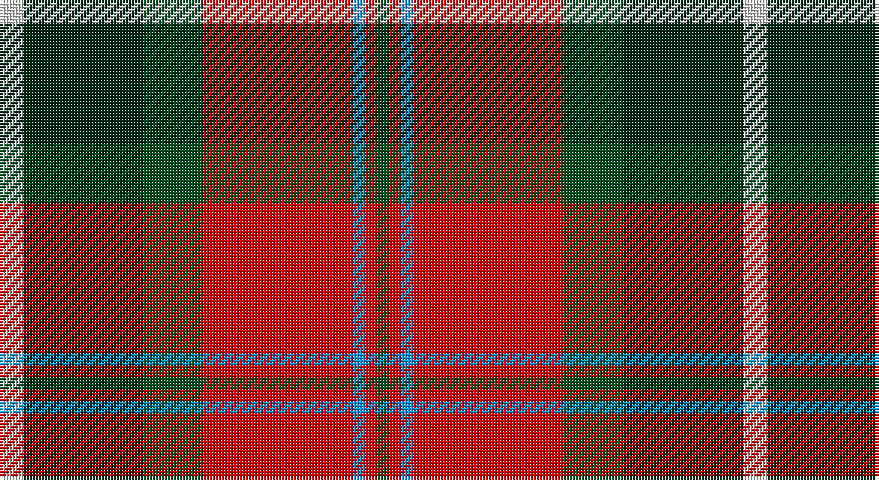

This page is one **sett** — a single exact thread-count. It belongs to the [tartan](/setts/w4dg20dgi10r25b2r2dgi2/)
(the same proportion at any scale), whose colour order is pattern [GRBRGGW](/stripes/grbrggw/).

Part of the [Caledonian Brewery](/tartans/caledonian-brewery/) tartan — the named design grouping this sett with its other cloths.

Sourced from register-of-tartans.  It is a [7 stripe tartan](/stripes/stripes7/).

Original link https://www.tartanregister.gov.uk/tartanDetails.aspx?ref=471

## Register references

External register numbers recorded for this tartan.

- Scottish Register of Tartans: [471](https://www.tartanregister.gov.uk/tartanDetails.aspx?ref=471)
- Scottish Tartans Authority (ITI): 2315
- Scottish Tartans World Register: 2315

## Thread count
LN/8 DG40 G20 R50 B4 R4 G/4

One full sett is **248 threads**.

## Palette

Palette: <strong>Tartan Register</strong>
<table><thead><tr><th>Colour</th><th>Threads</th><th>Shade</th><th>Base</th><th>OKLCh</th></tr></thead><tbody><tr><td>LN/</td><td style="text-align:right;font-variant-numeric:tabular-nums">8</td><td><code style="background-color:#E0E0E0;">#E0E0E0</code> <small style="color:#888">#E0E0E0</small></td><td>W <code style="background-color:#F7F7F7;">#F7F7F7</code></td><td><small style="color:#888">oklch(90.7% 0.000 89.9)</small></td></tr><tr><td>DG</td><td style="text-align:right;font-variant-numeric:tabular-nums">40</td><td><code style="background-color:#002814;">#002814</code> <small style="color:#888">#002814</small></td><td>G <code style="background-color:#006100;">#006100</code></td><td><small style="color:#888">oklch(24.4% 0.059 156.5)</small></td></tr><tr><td>G</td><td style="text-align:right;font-variant-numeric:tabular-nums">20</td><td><code style="background-color:#005020;">#005020</code> <small style="color:#888">#005020</small></td><td>G <code style="background-color:#006100;">#006100</code></td><td><small style="color:#888">oklch(37.7% 0.105 149.6)</small></td></tr><tr><td>R</td><td style="text-align:right;font-variant-numeric:tabular-nums">50</td><td><code style="background-color:#DC0000;">#DC0000</code> <small style="color:#888">#DC0000</small></td><td>R <code style="background-color:#CC0000;">#CC0000</code></td><td><small style="color:#888">oklch(56.2% 0.230 29.2)</small></td></tr><tr><td>B</td><td style="text-align:right;font-variant-numeric:tabular-nums">4</td><td><code style="background-color:#0596FA;">#0596FA</code> <small style="color:#888">#0596FA</small></td><td>B <code style="background-color:#2A418A;">#2A418A</code></td><td><small style="color:#888">oklch(66.0% 0.180 248.9)</small></td></tr><tr><td>R</td><td style="text-align:right;font-variant-numeric:tabular-nums">4</td><td><code style="background-color:#DC0000;">#DC0000</code> <small style="color:#888">#DC0000</small></td><td>R <code style="background-color:#CC0000;">#CC0000</code></td><td><small style="color:#888">oklch(56.2% 0.230 29.2)</small></td></tr><tr><td>G/</td><td style="text-align:right;font-variant-numeric:tabular-nums">4</td><td><code style="background-color:#005020;">#005020</code> <small style="color:#888">#005020</small></td><td>G <code style="background-color:#006100;">#006100</code></td><td><small style="color:#888">oklch(37.7% 0.105 149.6)</small></td></tr></tbody></table>

# Sample pattern

## Nearest tartans

The nearest existing variants by ΔTartan distance, with this tartan at the top so the swatches line up against it.

ΔTartan

Tartan

Sett

—

<a href="/ttd/edit/#slug=w4dg20dgi10r25b2r2dgi2~x2">Caledonian Brewery (Corporate)</a> <a class="nn-out" href="/variants/s7/w4dg20dgi10r25b2r2dgi2~x2/" title="open its dictionary page">↗</a>

0.62

<a href="/ttd/edit/#slug=w4dg20g10r25b2r2g2~x2&amp;base=w4dg20dgi10r25b2r2dgi2~x2">Caledonian Brewery</a> <a class="nn-out" href="/variants/s7/w4dg20g10r25b2r2g2~x2/" title="open its dictionary page">↗</a>

0.73

<a href="/ttd/edit/#slug=r24w2ly3dg16k16w2ly3~x2&amp;base=w4dg20dgi10r25b2r2dgi2~x2">MacLachlan #4</a> <a class="nn-out" href="/variants/s7/r24w2ly3dg16k16w2ly3~x2/" title="open its dictionary page">↗</a>

0.76

<a href="/ttd/edit/#slug=r24w2ly3g16k16w2ly3~x2&amp;base=w4dg20dgi10r25b2r2dgi2~x2">MacLachlan Old Clan Tartan</a> <a class="nn-out" href="/variants/s7/r24w2ly3g16k16w2ly3~x2/" title="open its dictionary page">↗</a>

0.99

<a href="/ttd/edit/#slug=k10ly2dg11r11w1r1w1k9~x2&amp;base=w4dg20dgi10r25b2r2dgi2~x2">Unidentified No 5</a> <a class="nn-out" href="/variants/s8/k10ly2dg11r11w1r1w1k9~x2/" title="open its dictionary page">↗</a>

1.00

<a href="/ttd/edit/#slug=g6k2g3k2g6db8r20ly2r3g2~x2&amp;base=w4dg20dgi10r25b2r2dgi2~x2">Connolly Dress (Name)</a> <a class="nn-out" href="/variants/s10/g6k2g3k2g6db8r20ly2r3g2~x2/" title="open its dictionary page">↗</a>

1.02

<a href="/ttd/edit/#slug=r24n4k4g4w13k2~x4&amp;base=w4dg20dgi10r25b2r2dgi2~x2">Rose White Dress</a> <a class="nn-out" href="/variants/s6/r24n4k4g4w13k2~x4/" title="open its dictionary page">↗</a>

1.04

<a href="/ttd/edit/#slug=lb1k1r10g10k5lb5r10k1lb1~x4&amp;base=w4dg20dgi10r25b2r2dgi2~x2">Graham of Montrose Red</a> <a class="nn-out" href="/variants/s9/lb1k1r10g10k5lb5r10k1lb1~x4/" title="open its dictionary page">↗</a>

1.05

<a href="/ttd/edit/#slug=db4r11db1g8r2g4k1ly2~x4&amp;base=w4dg20dgi10r25b2r2dgi2~x2">Craik, of Assington</a> <a class="nn-out" href="/variants/s8/db4r11db1g8r2g4k1ly2~x4/" title="open its dictionary page">↗</a>

1.08

<a href="/ttd/edit/#slug=do47r8k22r7w3r24do9r10ly3~x2&amp;base=w4dg20dgi10r25b2r2dgi2~x2">Ulster Ancestry</a> <a class="nn-out" href="/variants/s9/do47r8k22r7w3r24do9r10ly3~x2/" title="open its dictionary page">↗</a>

1.08

<a href="/ttd/edit/#slug=lb4k13g6r16lbi2r2g2~x2&amp;base=w4dg20dgi10r25b2r2dgi2~x2">Caledonian Brewery Corporate Tartan</a> <a class="nn-out" href="/variants/s7/lb4k13g6r16lbi2r2g2~x2/" title="open its dictionary page">↗</a>

## Neighbour map

Every grey dot is one of 14360 variants placed by the first two principal components of the ΔTartan feature space (44% of its variance). Red is this tartan; blue dots are its nearest — click one to open its page.

<svg viewBox="0 0 640 380" role="img" style="max-width:100%;height:auto;border:1px solid #e0e0e0;border-radius:4px;display:block" xmlns="http://www.w3.org/2000/svg"><image href="/nn/cloud.v1.png" width="640" height="380"/><a href="/variants/s7/w4dg20g10r25b2r2g2~x2/"><circle cx="206.6" cy="159.2" r="4" fill="#3465a4"><title>Caledonian Brewery</title></circle></a><a href="/variants/s7/r24w2ly3dg16k16w2ly3~x2/"><circle cx="153.5" cy="153.4" r="4" fill="#3465a4"><title>MacLachlan #4</title></circle></a><a href="/variants/s7/r24w2ly3g16k16w2ly3~x2/"><circle cx="154.4" cy="155.6" r="4" fill="#3465a4"><title>MacLachlan Old Clan Tartan</title></circle></a><a href="/variants/s8/k10ly2dg11r11w1r1w1k9~x2/"><circle cx="173.7" cy="170.9" r="4" fill="#3465a4"><title>Unidentified No 5</title></circle></a><a href="/variants/s10/g6k2g3k2g6db8r20ly2r3g2~x2/"><circle cx="209.2" cy="154.5" r="4" fill="#3465a4"><title>Connolly Dress (Name)</title></circle></a><a href="/variants/s6/r24n4k4g4w13k2~x4/"><circle cx="201.2" cy="152.3" r="4" fill="#3465a4"><title>Rose White Dress</title></circle></a><a href="/variants/s9/lb1k1r10g10k5lb5r10k1lb1~x4/"><circle cx="198.3" cy="173.1" r="4" fill="#3465a4"><title>Graham of Montrose Red</title></circle></a><a href="/variants/s8/db4r11db1g8r2g4k1ly2~x4/"><circle cx="187.9" cy="170.9" r="4" fill="#3465a4"><title>Craik, of Assington</title></circle></a><a href="/variants/s9/do47r8k22r7w3r24do9r10ly3~x2/"><circle cx="227.4" cy="143.1" r="4" fill="#3465a4"><title>Ulster Ancestry</title></circle></a><a href="/variants/s7/lb4k13g6r16lbi2r2g2~x2/"><circle cx="171.7" cy="189.2" r="4" fill="#3465a4"><title>Caledonian Brewery Corporate Tartan</title></circle></a><circle cx="202.2" cy="154.6" r="5" fill="#c00000"/></svg>

ID: /variants/s7/w4dg20dgi10r25b2r2dgi2~x2/
