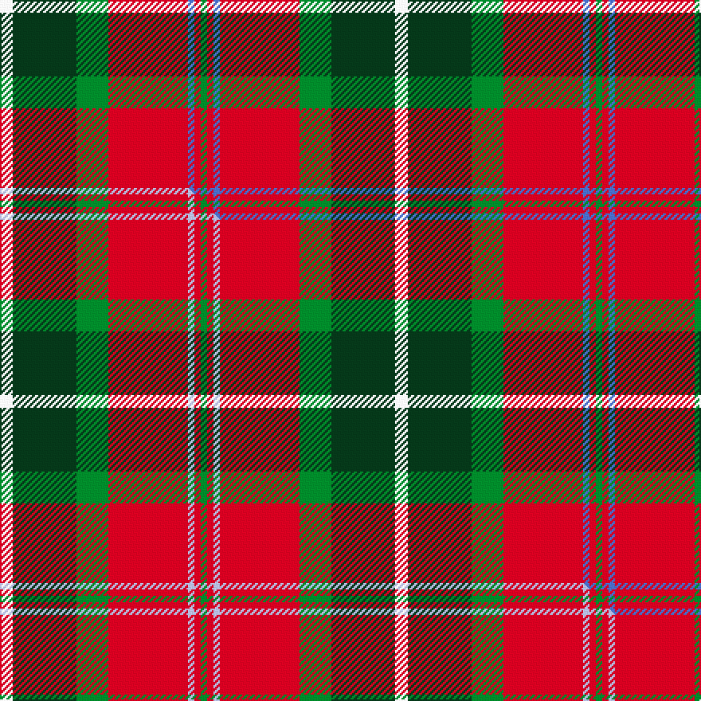

This is one **variant** — a specific cloth: this exact thread count and colourway, with its own
provenance below. It is one weaving of the [sett](/setts/w4dg20g10r25b2r2g2/) (the scale-free proportion — the
same cloth at any scale or shade), whose colour order is pattern [GRBRGGW](/stripes/grbrggw/).

Part of the [Caledonian Brewery](/tartans/caledonian-brewery-2/) tartan — the named design grouping this sett with its other cloths.

Sourced from weddslist.  It is a [7 stripe tartan](/stripes/stripes7/).

Original link [http://www.weddslist.com/cgi-bin/tartans/pg.pl?source=sts](http://www.weddslist.com/cgi-bin/tartans/pg.pl?source=sts)

Dataset <small>— provenance for this record, inherited from the source manifest</small>

<dl class="dataset-prov">
<dt>source</dt><dd><a href="/sources/weddslist/">Weddslist</a></dd>
<dt>data captured from</dt><dd><a href="https://github.com/thetartan/tartan-database/blob/master/data/weddslist/data.csv">https://github.com/thetartan/tartan-database/blob/master/data/weddslist/data.csv</a></dd>
<dt>data date</dt><dd>2016-11-17 <small>(dataset default)</small></dd>
<dt>licence</dt><dd><a href="https://creativecommons.org/licenses/by-nc-nd/4.0/">CC BY-NC-ND 4.0</a></dd>
</dl>

Capture chain <small>— the hands this data passed through, oldest first; each capture carries its own licence</small>

<ol class="capture-chain">
<li><a href="https://www.weddslist.com/tartans/">Weddslist</a> <small>the living privately compiled reference</small></li>
<li><a href="https://github.com/thetartan/tartan-database">thetartan/tartan-database</a> <small>2016-2017</small> · <a href="https://creativecommons.org/licenses/by-nc-nd/4.0/">CC BY-NC-ND 4.0</a> <small>Levko Kravets's frozen compilation — the capture we vendored, and where its CC licence text came from</small></li>
<li>this dictionary <small>captured 2026-06-10 · commit 5bf86c7566</small> <small>each re-capture is a git commit to data/sources</small></li>
</ol>

## Thread count
W/8 DG40 G20 R50 B4 R4 G/4

One full sett is **248 threads**.

## Palette
<table><thead><tr><th>Colour</th><th>Shade</th><th>OKLCh</th></tr></thead><tbody><tr><td>B</td><td><code style="background-color:#466CC8;">#466CC8</code> <small style="color:#888">#466CC8</small></td><td><small style="color:#888">oklch(55.1% 0.149 265.0)</small></td></tr><tr><td>DG</td><td><code style="background-color:#053819;">#053819</code> <small style="color:#888">#053819</small></td><td><small style="color:#888">oklch(30.0% 0.075 151.3)</small></td></tr><tr><td>G</td><td><code style="background-color:#008B2A;">#008B2A</code> <small style="color:#888">#008B2A</small></td><td><small style="color:#888">oklch(55.4% 0.170 145.9)</small></td></tr><tr><td>W</td><td><code style="background-color:#F7F7F7;">#F7F7F7</code> <small style="color:#888">#F7F7F7</small></td><td><small style="color:#888">oklch(97.6% 0.000 89.9)</small></td></tr><tr><td>R</td><td><code style="background-color:#D60020;">#D60020</code> <small style="color:#888">#D60020</small></td><td><small style="color:#888">oklch(55.2% 0.224 25.5)</small></td></tr></tbody></table>

# Sample pattern

## Compared to the master

This cloth is one sett of its design; the master sett (the exemplar the design is anchored on) is below for comparison.

Its **ΔTartan distance** from the master is **0.02** — the same measure the nearest-tartans table ranks by (0 is identical; a re-scale of the same cloth is near 0, a recolour or a different proportion further).

<figure class="master-compare" style="margin:0">

this sett
master sett ★

<figcaption style="color:#888;font-size:smaller">One weave of this sett against the <a href="/setts/w4dg20g10r25lb2r2g2/">master sett ★</a>, split on the diagonal: a shared proportion runs seamlessly across it with only the shades shifting; a different proportion breaks on it.</figcaption>
</figure>

## Nearest tartan variants

The nearest existing variants by ΔTartan distance, with this cloth at the top so the swatches line up against it.

ΔTartan

Threads

Variant

Sett

—

248

<a href="/variants/s7/w4dg20g10r25b2r2g2~x2/">Caledonian Brewery</a>

<a href="/ttd/edit/#slug=w4dg20g10r25lb2r2g2~x2&amp;base=w4dg20g10r25b2r2g2~x2" title="compare in the TTD">0.02</a>

248

<a href="/variants/s7/w4dg20g10r25lb2r2g2~x2/">Caledonian Brewery (Corporate)</a>

<a href="/ttd/edit/#slug=g6dg2g3dg2g6db8r20ly2r3g2~x2&amp;base=w4dg20g10r25b2r2g2~x2" title="compare in the TTD">1.95</a>

200

<a href="/variants/s10/g6dg2g3dg2g6db8r20ly2r3g2~x2/">Connolly Dress (Name)</a>

<a href="/ttd/edit/#slug=r30db3r2db3r6db14g26dg6~g2408144-dg1806142&amp;base=w4dg20g10r25b2r2g2~x2" title="compare in the TTD">2.18</a>

144

<a href="/variants/s8/r30db3r2db3r6db14g26dg6~g2408144-dg1806142/">Cranston Dress Family Tartan</a>

<a href="/ttd/edit/#slug=db8y4r30dg30lo3dg4~x2&amp;base=w4dg20g10r25b2r2g2~x2" title="compare in the TTD">2.19</a>

292

<a href="/variants/s6/db8y4r30dg30lo3dg4~x2/">Hutcheson (Name)</a>

<a href="/ttd/edit/#slug=r3dr14g8r2g2w2g2r1~x2&amp;base=w4dg20g10r25b2r2g2~x2" title="compare in the TTD">2.21</a>

128

<a href="/variants/s8/r3dr14g8r2g2w2g2r1~x2/">Scott Hunting Clan Tartan</a>

<a href="/ttd/edit/#slug=r15w1db4y1g15~x4&amp;base=w4dg20g10r25b2r2g2~x2" title="compare in the TTD">2.22</a>

168

<a href="/variants/s5/r15w1db4y1g15~x4/">Eglinton, Duke of (Artefact)</a>

<a href="/ttd/edit/#slug=r15db2r1db2r3db7g13dg3~x2~g2408144-dg1806142&amp;base=w4dg20g10r25b2r2g2~x2" title="compare in the TTD">2.27</a>

148

<a href="/variants/s8/r15db2r1db2r3db7g13dg3~x2~g2408144-dg1806142/">Cranston Dress</a>

<a href="/ttd/edit/#slug=dp24g2lo2g2lo5g8o20dy4~x2&amp;base=w4dg20g10r25b2r2g2~x2" title="compare in the TTD">2.28</a>

212

<a href="/variants/s8/dp24g2lo2g2lo5g8o20dy4~x2/">Glen Shee</a>

<a href="/ttd/edit/#slug=dt12w2dt13dg3g2r24g3~x2&amp;base=w4dg20g10r25b2r2g2~x2" title="compare in the TTD">2.30</a>

206

<a href="/variants/s7/dt12w2dt13dg3g2r24g3~x2/">Wellmont Foundation (Corporate)</a>

<a href="/ttd/edit/#slug=r3b1r12o3dg12w1dg2~x4&amp;base=w4dg20g10r25b2r2g2~x2" title="compare in the TTD">2.35</a>

252

<a href="/variants/s7/r3b1r12o3dg12w1dg2~x4/">Leckie (Personal)</a>

## Neighbour map

Every grey dot is one of 13621 variants placed by the first two principal components of the ΔTartan feature space (42% of its variance). Red is this tartan; blue dots are its nearest — click one to open its page.

<svg viewBox="0 0 640 380" role="img" style="max-width:100%;height:auto;border:1px solid #e0e0e0;border-radius:4px;display:block" xmlns="http://www.w3.org/2000/svg"><image href="/nn/cloud.v1.png" width="640" height="380"/><a href="/variants/s7/w4dg20g10r25lb2r2g2~x2/"><circle cx="215.4" cy="173.1" r="4" fill="#3465a4"><title>Caledonian Brewery (Corporate)</title></circle></a><a href="/variants/s10/g6dg2g3dg2g6db8r20ly2r3g2~x2/"><circle cx="216.1" cy="169.2" r="4" fill="#3465a4"><title>Connolly Dress (Name)</title></circle></a><a href="/variants/s8/r30db3r2db3r6db14g26dg6~g2408144-dg1806142/"><circle cx="242.0" cy="179.6" r="4" fill="#3465a4"><title>Cranston Dress Family Tartan</title></circle></a><a href="/variants/s6/db8y4r30dg30lo3dg4~x2/"><circle cx="247.9" cy="195.1" r="4" fill="#3465a4"><title>Hutcheson (Name)</title></circle></a><a href="/variants/s8/r3dr14g8r2g2w2g2r1~x2/"><circle cx="242.1" cy="175.6" r="4" fill="#3465a4"><title>Scott Hunting Clan Tartan</title></circle></a><a href="/variants/s5/r15w1db4y1g15~x4/"><circle cx="257.3" cy="189.9" r="4" fill="#3465a4"><title>Eglinton, Duke of (Artefact)</title></circle></a><a href="/variants/s8/r15db2r1db2r3db7g13dg3~x2~g2408144-dg1806142/"><circle cx="234.7" cy="182.5" r="4" fill="#3465a4"><title>Cranston Dress</title></circle></a><a href="/variants/s8/dp24g2lo2g2lo5g8o20dy4~x2/"><circle cx="205.2" cy="177.5" r="4" fill="#3465a4"><title>Glen Shee</title></circle></a><a href="/variants/s7/dt12w2dt13dg3g2r24g3~x2/"><circle cx="242.9" cy="179.5" r="4" fill="#3465a4"><title>Wellmont Foundation (Corporate)</title></circle></a><a href="/variants/s7/r3b1r12o3dg12w1dg2~x4/"><circle cx="261.6" cy="175.4" r="4" fill="#3465a4"><title>Leckie (Personal)</title></circle></a><circle cx="217.4" cy="173.8" r="5" fill="#c00000"/><text x="320" y="376" text-anchor="middle" font-size="11" fill="#999">ground</text><text x="11" y="190" text-anchor="middle" font-size="11" fill="#999" transform="rotate(-90 11 190)">complexity</text></svg>

ID: /variants/s7/w4dg20g10r25b2r2g2~x2/
