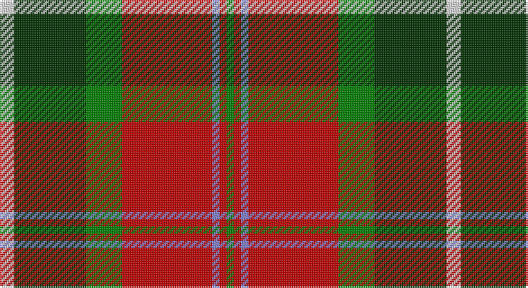

This page is one **sett** — a single exact thread-count. It belongs to the [tartan](/setts/w4dg20g10r25b2r2g2/)
(the same proportion at any scale), whose colour order is pattern [GRBRGGW](/stripes/grbrggw/).

Part of the [Caledonian Brewery](/tartans/caledonian-brewery/) tartan — the named design grouping this sett with its other cloths.

Sourced from weddslist.  It is a [7 stripe tartan](/stripes/stripes7/).

Original link http://www.weddslist.com/cgi-bin/tartans/pg.pl?source=sts

## Thread count
LN/8 DG40 G20 R50 B4 R4 G/4

One full sett is **248 threads**.

## Palette

Palette: <strong>Tartan Dictionary</strong> <small style="color:#888">(1 of 5 colours)</small>
<table><thead><tr><th>Colour</th><th>Threads</th><th>Shade</th><th>Base</th><th>OKLCh</th></tr></thead><tbody><tr><td>LN/</td><td style="text-align:right;font-variant-numeric:tabular-nums">8</td><td><code style="background-color:#E0E0E0;">#E0E0E0</code> <small style="color:#888">#E0E0E0</small></td><td>W <code style="background-color:#F7F7F7;">#F7F7F7</code></td><td><small style="color:#888">oklch(90.7% 0.000 89.9)</small></td></tr><tr><td>DG</td><td style="text-align:right;font-variant-numeric:tabular-nums">40</td><td><code style="background-color:#003000;">#003000</code> <small style="color:#888">#003000</small></td><td>G <code style="background-color:#006100;">#006100</code></td><td><small style="color:#888">oklch(26.8% 0.091 142.5)</small></td></tr><tr><td>G</td><td style="text-align:right;font-variant-numeric:tabular-nums">20</td><td><code style="background-color:#008000;">#008000</code> <small style="color:#888">#008000</small></td><td>G <code style="background-color:#006100;">#006100</code></td><td><small style="color:#888">oklch(52.0% 0.177 142.5)</small></td></tr><tr><td>R</td><td style="text-align:right;font-variant-numeric:tabular-nums">50</td><td><code style="background-color:#C00000;">#C00000</code> <small style="color:#888">#C00000</small></td><td>R <code style="background-color:#CC0000;">#CC0000</code></td><td><small style="color:#888">oklch(50.7% 0.208 29.2)</small></td></tr><tr><td>B</td><td style="text-align:right;font-variant-numeric:tabular-nums">4</td><td><code style="background-color:#8080D0;">#8080D0</code> <small style="color:#888">#8080D0</small></td><td>B <code style="background-color:#2A418A;">#2A418A</code></td><td><small style="color:#888">oklch(63.4% 0.119 282.5)</small></td></tr><tr><td>R</td><td style="text-align:right;font-variant-numeric:tabular-nums">4</td><td><code style="background-color:#C00000;">#C00000</code> <small style="color:#888">#C00000</small></td><td>R <code style="background-color:#CC0000;">#CC0000</code></td><td><small style="color:#888">oklch(50.7% 0.208 29.2)</small></td></tr><tr><td>G/</td><td style="text-align:right;font-variant-numeric:tabular-nums">4</td><td><code style="background-color:#008000;">#008000</code> <small style="color:#888">#008000</small></td><td>G <code style="background-color:#006100;">#006100</code></td><td><small style="color:#888">oklch(52.0% 0.177 142.5)</small></td></tr></tbody></table>

# Sample pattern

## Compared to the master

This cloth is one sett of its design; the master sett (the exemplar the design is anchored on) is below for comparison.

<figure style="margin:0"><figcaption style="color:#888;font-size:smaller">this sett</figcaption></figure>
<figure style="margin:0"><figcaption style="color:#888;font-size:smaller"><a href="/setts/w4dg20dgi10r25b2r2dgi2/">master sett →</a></figcaption></figure>

## Nearest tartans

The nearest existing variants by ΔTartan distance, with this tartan at the top so the swatches line up against it.

ΔTartan

Tartan

Sett

—

<a href="/ttd/edit/#slug=w4dg20g10r25b2r2g2~x2">Caledonian Brewery</a> <a class="nn-out" href="/variants/s7/w4dg20g10r25b2r2g2~x2/" title="open its dictionary page">↗</a>

0.62

<a href="/ttd/edit/#slug=w4dg20dgi10r25b2r2dgi2~x2&amp;base=w4dg20g10r25b2r2g2~x2">Caledonian Brewery (Corporate)</a> <a class="nn-out" href="/variants/s7/w4dg20dgi10r25b2r2dgi2~x2/" title="open its dictionary page">↗</a>

0.70

<a href="/ttd/edit/#slug=db4r11db1g8r2g4k1ly2~x4&amp;base=w4dg20g10r25b2r2g2~x2">Craik, of Assington</a> <a class="nn-out" href="/variants/s8/db4r11db1g8r2g4k1ly2~x4/" title="open its dictionary page">↗</a>

0.81

<a href="/ttd/edit/#slug=r24w2ly3g16k16w2ly3~x2&amp;base=w4dg20g10r25b2r2g2~x2">MacLachlan Old Clan Tartan</a> <a class="nn-out" href="/variants/s7/r24w2ly3g16k16w2ly3~x2/" title="open its dictionary page">↗</a>

0.89

<a href="/ttd/edit/#slug=o30k4o3k4o3g20dt20ly4~x2&amp;base=w4dg20g10r25b2r2g2~x2">Sikh (Corporate)</a> <a class="nn-out" href="/variants/s8/o30k4o3k4o3g20dt20ly4~x2/" title="open its dictionary page">↗</a>

0.96

<a href="/ttd/edit/#slug=r24w2ly3dg16k16w2ly3~x2&amp;base=w4dg20g10r25b2r2g2~x2">MacLachlan #4</a> <a class="nn-out" href="/variants/s7/r24w2ly3dg16k16w2ly3~x2/" title="open its dictionary page">↗</a>

1.03

<a href="/ttd/edit/#slug=g6k2g3k2g6db8r20ly2r3g2~x2&amp;base=w4dg20g10r25b2r2g2~x2">Connolly Dress (Name)</a> <a class="nn-out" href="/variants/s10/g6k2g3k2g6db8r20ly2r3g2~x2/" title="open its dictionary page">↗</a>

1.05

<a href="/ttd/edit/#slug=k2db1g10r10ly1~x6&amp;base=w4dg20g10r25b2r2g2~x2">Turnbull Dress</a> <a class="nn-out" href="/variants/s5/k2db1g10r10ly1~x6/" title="open its dictionary page">↗</a>

1.05

<a href="/ttd/edit/#slug=k7db3g28r28ly3~x2&amp;base=w4dg20g10r25b2r2g2~x2">Turnbull, dress</a> <a class="nn-out" href="/variants/s5/k7db3g28r28ly3~x2/" title="open its dictionary page">↗</a>

1.06

<a href="/ttd/edit/#slug=p8r3ly1r3g14r3ly1~x4&amp;base=w4dg20g10r25b2r2g2~x2">Logan, with Yellow</a> <a class="nn-out" href="/variants/s7/p8r3ly1r3g14r3ly1~x4/" title="open its dictionary page">↗</a>

1.06

<a href="/ttd/edit/#slug=r15w1db4ly1g15~x4&amp;base=w4dg20g10r25b2r2g2~x2">Eglinton, Duke of (Artefact)</a> <a class="nn-out" href="/variants/s5/r15w1db4ly1g15~x4/" title="open its dictionary page">↗</a>

## Neighbour map

Every grey dot is one of 14360 variants placed by the first two principal components of the ΔTartan feature space (44% of its variance). Red is this tartan; blue dots are its nearest — click one to open its page.

<svg viewBox="0 0 640 380" role="img" style="max-width:100%;height:auto;border:1px solid #e0e0e0;border-radius:4px;display:block" xmlns="http://www.w3.org/2000/svg"><image href="/nn/cloud.v1.png" width="640" height="380"/><a href="/variants/s7/w4dg20dgi10r25b2r2dgi2~x2/"><circle cx="202.2" cy="154.6" r="4" fill="#3465a4"><title>Caledonian Brewery (Corporate)</title></circle></a><a href="/variants/s8/db4r11db1g8r2g4k1ly2~x4/"><circle cx="187.9" cy="170.9" r="4" fill="#3465a4"><title>Craik, of Assington</title></circle></a><a href="/variants/s7/r24w2ly3g16k16w2ly3~x2/"><circle cx="154.4" cy="155.6" r="4" fill="#3465a4"><title>MacLachlan Old Clan Tartan</title></circle></a><a href="/variants/s8/o30k4o3k4o3g20dt20ly4~x2/"><circle cx="195.1" cy="176.0" r="4" fill="#3465a4"><title>Sikh (Corporate)</title></circle></a><a href="/variants/s7/r24w2ly3dg16k16w2ly3~x2/"><circle cx="153.5" cy="153.4" r="4" fill="#3465a4"><title>MacLachlan #4</title></circle></a><a href="/variants/s10/g6k2g3k2g6db8r20ly2r3g2~x2/"><circle cx="209.2" cy="154.5" r="4" fill="#3465a4"><title>Connolly Dress (Name)</title></circle></a><a href="/variants/s5/k2db1g10r10ly1~x6/"><circle cx="235.2" cy="194.8" r="4" fill="#3465a4"><title>Turnbull Dress</title></circle></a><a href="/variants/s5/k7db3g28r28ly3~x2/"><circle cx="196.2" cy="189.8" r="4" fill="#3465a4"><title>Turnbull, dress</title></circle></a><a href="/variants/s7/p8r3ly1r3g14r3ly1~x4/"><circle cx="239.1" cy="174.8" r="4" fill="#3465a4"><title>Logan, with Yellow</title></circle></a><a href="/variants/s5/r15w1db4ly1g15~x4/"><circle cx="249.6" cy="177.9" r="4" fill="#3465a4"><title>Eglinton, Duke of (Artefact)</title></circle></a><circle cx="206.6" cy="159.2" r="5" fill="#c00000"/></svg>

ID: /variants/s7/w4dg20g10r25b2r2g2~x2/
