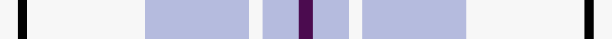

This is one **variant** — a specific cloth: this exact thread count and colourway, with its own
provenance below. It is one weaving of the [sett](/tartans/m/ma/macpherson-turquoise-dress/) (the scale-free proportion — the
same cloth at any scale or shade), whose colour order is pattern [BWWWWKW](/stripes/bwwwwkw/).

Part of the [MacPherson Turquoise Dress](/tartans/m/ma/macpherson-turquoise-dress/) tartan — the named design grouping this sett with its other cloths.

Sourced from house-of-tartan.  It is a [7 stripe tartan](/stripes/stripes7/).

Original link [http://www.house-of-tartan.scotland.net/house/TartanViewjs.asp?colr=Def&tnam=8183](http://www.house-of-tartan.scotland.net/house/TartanViewjs.asp?colr=Def&tnam=8183)

## Provenance

Earliest known date: Threadcount and colours aren't 100% original. Generated manually.

Dataset <small>— provenance for this record, inherited from the source manifest</small>

<dl class="dataset-prov">
<dt>source</dt><dd><a href="/sources/house-of-tartan/">House of Tartan</a></dd>
<dt>data captured from</dt><dd><a href="https://github.com/thetartan/tartan-database/blob/master/data/house-of-tartan/data.csv">https://github.com/thetartan/tartan-database/blob/master/data/house-of-tartan/data.csv</a></dd>
<dt>data date</dt><dd>2017-01-10 <small>(dataset default)</small></dd>
<dt>licence</dt><dd><a href="https://creativecommons.org/licenses/by-nc-nd/4.0/">CC BY-NC-ND 4.0</a></dd>
</dl>

Capture chain <small>— the hands this data passed through, oldest first; each capture carries its own licence</small>

<ol class="capture-chain">
<li><a href="http://www.house-of-tartan.scotland.net/">House of Tartan</a> <small>the weaver/retailer's database — the site is now offline; the URL is kept as the ultimate source's identity</small></li>
<li><a href="https://github.com/thetartan/tartan-database">thetartan/tartan-database</a> <small>2016-2017</small> · <a href="https://creativecommons.org/licenses/by-nc-nd/4.0/">CC BY-NC-ND 4.0</a> <small>Levko Kravets's frozen compilation — the capture we vendored, and where its CC licence text came from</small></li>
<li>this dictionary <small>captured 2026-06-10 · commit 5bf86c7566</small> <small>each re-capture is a git commit to data/sources</small></li>
</ol>

## Thread count
W/8 K4 W52 LB46 W6 LB16 DP/6

One full sett is **262 threads**.

## Palette
<table><thead><tr><th>Colour</th><th>Shade</th><th>OKLCh</th></tr></thead><tbody><tr><td>LB</td><td><code style="background-color:#B5BBDE;">#B5BBDE</code> <small style="color:#888">#B5BBDE</small></td><td><small style="color:#888">oklch(79.9% 0.050 277.6)</small></td></tr><tr><td>K</td><td><code style="background-color:#000000;">#000000</code> <small style="color:#888">#000000</small></td><td><small style="color:#888">oklch(0.0% 0.000 0.0)</small></td></tr><tr><td>W</td><td><code style="background-color:#F7F7F7;">#F7F7F7</code> <small style="color:#888">#F7F7F7</small></td><td><small style="color:#888">oklch(97.6% 0.000 89.9)</small></td></tr><tr><td>DP</td><td><code style="background-color:#4B0B4F;">#4B0B4F</code> <small style="color:#888">#4B0B4F</small></td><td><small style="color:#888">oklch(30.1% 0.125 325.4)</small></td></tr></tbody></table>

# Sample pattern

## Nearest tartan variants

The nearest existing variants by ΔTartan distance, with this cloth at the top so the swatches line up against it.

ΔTartan

Threads

Variant

Sett

—

262

<a href="/variants/s7/w4k2w26lb23w3lb8dp3~x2/">MacPherson Turquoise Dress Tartan</a>

<a href="/ttd/edit/#slug=w5k3w26db21w3db8y3~x2&amp;base=w4k2w26lb23w3lb8dp3~x2" title="compare in the TTD">0.79</a>

260

<a href="/variants/s7/w5k3w26db21w3db8y3~x2/">MacPherson Dress Blue (Dance)</a>

<a href="/ttd/edit/#slug=lb38k2w2k2lb5g10w30lb4~x2&amp;base=w4k2w26lb23w3lb8dp3~x2" title="compare in the TTD">2.41</a>

288

<a href="/variants/s8/lb38k2w2k2lb5g10w30lb4~x2/">Longniddry Turquoise (Dance)</a>

<a href="/ttd/edit/#slug=w8k2w26db5lb24db2lb8~x2&amp;base=w4k2w26lb23w3lb8dp3~x2" title="compare in the TTD">2.43</a>

268

<a href="/variants/s7/w8k2w26db5lb24db2lb8~x2/">Lennox Turquoise Dress District Tartan</a>

<a href="/ttd/edit/#slug=lb42k2w2k2lb5b12w32lb4~x2&amp;base=w4k2w26lb23w3lb8dp3~x2" title="compare in the TTD">2.50</a>

312

<a href="/variants/s8/lb42k2w2k2lb5b12w32lb4~x2/">Longniddry, dress (Turquoise)</a>

<a href="/ttd/edit/#slug=db23w8lb2k5w44db4~x2&amp;base=w4k2w26lb23w3lb8dp3~x2" title="compare in the TTD">2.78</a>

290

<a href="/variants/s6/db23w8lb2k5w44db4~x2/">WaterAid</a>

<a href="/ttd/edit/#slug=t6n2t25n4w25k2w6~x2~t2405244-n1802249&amp;base=w4k2w26lb23w3lb8dp3~x2" title="compare in the TTD">3.03</a>

256

<a href="/variants/s7/t6n2t25n4w25k2w6~x2~t2405244-n1802249/">Lennox Dress, Purple (Dance)</a>

<a href="/ttd/edit/#slug=r9w25k7w45lb60dg4ly5&amp;base=w4k2w26lb23w3lb8dp3~x2" title="compare in the TTD">3.10</a>

296

<a href="/variants/s7/r9w25k7w45lb60dg4ly5/">Ch. Supt. Everett and Mrs Julene Summerfield Dress</a>

<a href="/ttd/edit/#slug=r9w27k7w45lb60dg4lo5&amp;base=w4k2w26lb23w3lb8dp3~x2" title="compare in the TTD">3.13</a>

300

<a href="/variants/s7/r9w27k7w45lb60dg4lo5/">Ch. Supt. Everett and Mrs Julene Sum</a>

<a href="/ttd/edit/#slug=db28w36lb28w36lb85r3lb3r3~db1404245&amp;base=w4k2w26lb23w3lb8dp3~x2" title="compare in the TTD">3.44</a>

413

<a href="/variants/s8/db28w36lb28w36lb85r3lb3r3~db1404245/">Malmo Skyblue</a>

<a href="/ttd/edit/#slug=r3t2w35t35r2g3~x2&amp;base=w4k2w26lb23w3lb8dp3~x2" title="compare in the TTD">3.49</a>

308

<a href="/variants/s6/r3t2w35t35r2g3~x2/">Galloway (Dance)</a>

## Neighbour map

Every grey dot is one of 13656 variants placed by the first two principal components of the ΔTartan feature space (42% of its variance). Red is this tartan; blue dots are its nearest — click one to open its page. The map is a flat projection of a many-dimensional space — [how to read it](/posts/neighbourhood-maps/).

<svg viewBox="0 0 640 380" role="img" style="max-width:100%;height:auto;border:1px solid #e0e0e0;border-radius:4px;display:block" xmlns="http://www.w3.org/2000/svg"><image href="/nn/cloud.v1.png" width="640" height="380"/><a href="/variants/s7/w5k3w26db21w3db8y3~x2/"><circle cx="227.3" cy="188.2" r="4" fill="#3465a4"><title>MacPherson Dress Blue (Dance)</title></circle></a><a href="/variants/s8/lb38k2w2k2lb5g10w30lb4~x2/"><circle cx="302.3" cy="155.6" r="4" fill="#3465a4"><title>Longniddry Turquoise (Dance)</title></circle></a><a href="/variants/s7/w8k2w26db5lb24db2lb8~x2/"><circle cx="258.4" cy="192.1" r="4" fill="#3465a4"><title>Lennox Turquoise Dress District Tartan</title></circle></a><a href="/variants/s8/lb42k2w2k2lb5b12w32lb4~x2/"><circle cx="312.7" cy="152.4" r="4" fill="#3465a4"><title>Longniddry, dress (Turquoise)</title></circle></a><a href="/variants/s6/db23w8lb2k5w44db4~x2/"><circle cx="316.8" cy="147.6" r="4" fill="#3465a4"><title>WaterAid</title></circle></a><a href="/variants/s7/t6n2t25n4w25k2w6~x2~t2405244-n1802249/"><circle cx="248.2" cy="184.6" r="4" fill="#3465a4"><title>Lennox Dress, Purple (Dance)</title></circle></a><a href="/variants/s7/r9w25k7w45lb60dg4ly5/"><circle cx="220.9" cy="153.5" r="4" fill="#3465a4"><title>Ch. Supt. Everett and Mrs Julene Summerfield Dress</title></circle></a><a href="/variants/s7/r9w27k7w45lb60dg4lo5/"><circle cx="223.7" cy="153.9" r="4" fill="#3465a4"><title>Ch. Supt. Everett and Mrs Julene Sum</title></circle></a><a href="/variants/s8/db28w36lb28w36lb85r3lb3r3~db1404245/"><circle cx="339.1" cy="169.0" r="4" fill="#3465a4"><title>Malmo Skyblue</title></circle></a><a href="/variants/s6/r3t2w35t35r2g3~x2/"><circle cx="301.1" cy="162.5" r="4" fill="#3465a4"><title>Galloway (Dance)</title></circle></a><circle cx="304.9" cy="191.5" r="5" fill="#c00000"/><text x="320" y="376" text-anchor="middle" font-size="11" fill="#999">ground</text><text x="11" y="190" text-anchor="middle" font-size="11" fill="#999" transform="rotate(-90 11 190)">complexity</text></svg>

ID: /variants/s7/w4k2w26lb23w3lb8dp3~x2/
