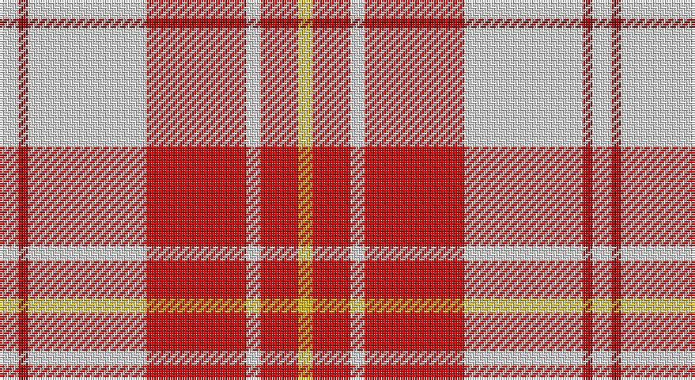

This page is one **sett** — a single exact thread-count. It belongs to the [tartan](/setts/w4ri2w25r21w3r8ly3/)
(the same proportion at any scale), whose colour order is pattern [WRWRWRY](/stripes/wrwrwry/).

Part of the [MacPherson Dress](/tartans/macpherson-dress/) tartan — the named design grouping this sett with its other cloths.

Sourced from register-of-tartans.  It is a [7 stripe tartan](/stripes/stripes7/).

Original link https://www.tartanregister.gov.uk/tartanDetails.aspx?ref=2720

## Also known as

This cloth is also recorded under:

- MacPherson Dress Blue
- MacPherson Dress Blue #2
- MacPherson Dress Green
- MacPherson Dress Purple
- MacPherson Dress Red
- MacPherson Dress, Blue
- MacPherson Dress, Green
- MacPherson Dress, Purple
- MacPherson Dress, Red
- MacPherson Dress, Royal Blue
- MacPherson Red Dress
- MacPherson, Red
- MacPherson, dress
- MacPherson, dress green
- MacPherson, dress red

2 attestations — the source records this cloth was collapsed from (oldest owns this page)

<ul>
<li>undated — MacPherson Dress Red (register-of-tartans, <a href="https://www.tartanregister.gov.uk/tartanDetails.aspx?ref=2720">record</a>)</li>
<li>undated — MacPherson, dress red (weddslist, <a href="http://www.weddslist.com/cgi-bin/tartans/pg.pl?source=sts">record</a>)</li>
</ul>

## Register references

External register numbers recorded for this tartan.

- Scottish Register of Tartans: [2720](https://www.tartanregister.gov.uk/tartanDetails.aspx?ref=2720)
- Scottish Tartans World Register: 1874

## Thread count
LN/8 DR4 LN50 R42 LN6 R16 Y/6

One full sett is **250 threads**.

## Palette

Palette: <strong>Tartan Register</strong>
<table><thead><tr><th>Colour</th><th>Threads</th><th>Shade</th><th>Base</th><th>OKLCh</th></tr></thead><tbody><tr><td>LN/</td><td style="text-align:right;font-variant-numeric:tabular-nums">8</td><td><code style="background-color:#E0E0E0;">#E0E0E0</code> <small style="color:#888">#E0E0E0</small></td><td>W <code style="background-color:#F7F7F7;">#F7F7F7</code></td><td><small style="color:#888">oklch(90.7% 0.000 89.9)</small></td></tr><tr><td>DR</td><td style="text-align:right;font-variant-numeric:tabular-nums">4</td><td><code style="background-color:#960000;">#960000</code> <small style="color:#888">#960000</small></td><td>R <code style="background-color:#CC0000;">#CC0000</code></td><td><small style="color:#888">oklch(42.3% 0.173 29.2)</small></td></tr><tr><td>LN</td><td style="text-align:right;font-variant-numeric:tabular-nums">50</td><td><code style="background-color:#E0E0E0;">#E0E0E0</code> <small style="color:#888">#E0E0E0</small></td><td>W <code style="background-color:#F7F7F7;">#F7F7F7</code></td><td><small style="color:#888">oklch(90.7% 0.000 89.9)</small></td></tr><tr><td>R</td><td style="text-align:right;font-variant-numeric:tabular-nums">42</td><td><code style="background-color:#DC0000;">#DC0000</code> <small style="color:#888">#DC0000</small></td><td>R <code style="background-color:#CC0000;">#CC0000</code></td><td><small style="color:#888">oklch(56.2% 0.230 29.2)</small></td></tr><tr><td>LN</td><td style="text-align:right;font-variant-numeric:tabular-nums">6</td><td><code style="background-color:#E0E0E0;">#E0E0E0</code> <small style="color:#888">#E0E0E0</small></td><td>W <code style="background-color:#F7F7F7;">#F7F7F7</code></td><td><small style="color:#888">oklch(90.7% 0.000 89.9)</small></td></tr><tr><td>R</td><td style="text-align:right;font-variant-numeric:tabular-nums">16</td><td><code style="background-color:#DC0000;">#DC0000</code> <small style="color:#888">#DC0000</small></td><td>R <code style="background-color:#CC0000;">#CC0000</code></td><td><small style="color:#888">oklch(56.2% 0.230 29.2)</small></td></tr><tr><td>Y/</td><td style="text-align:right;font-variant-numeric:tabular-nums">6</td><td><code style="background-color:#E8C000;">#E8C000</code> <small style="color:#888">#E8C000</small></td><td>Y <code style="background-color:#F2BF00;">#F2BF00</code></td><td><small style="color:#888">oklch(81.9% 0.168 93.7)</small></td></tr></tbody></table>

# Sample pattern

## Compared to the master

This cloth is one sett of its design; the master sett (the exemplar the design is anchored on) is below for comparison.

<figure style="margin:0"><figcaption style="color:#888;font-size:smaller">this sett</figcaption></figure>
<figure style="margin:0"><figcaption style="color:#888;font-size:smaller"><a href="/setts/w5dp3w26r20w3r8ly3/">master sett →</a></figcaption></figure>

## Nearest tartans

The nearest existing variants by ΔTartan distance, with this tartan at the top so the swatches line up against it.

ΔTartan

Tartan

Sett

—

<a href="/ttd/edit/#slug=w4ri2w25r21w3r8ly3~x2">MacPherson Dress Red</a> <a class="nn-out" href="/variants/s7/w4ri2w25r21w3r8ly3~x2/" title="open its dictionary page">↗</a>

0.70

<a href="/ttd/edit/#slug=w5k2w30r24w3r8dt3~x2&amp;base=w4ri2w25r21w3r8ly3~x2">Arduaine, Red (Dance)</a> <a class="nn-out" href="/variants/s7/w5k2w30r24w3r8dt3~x2/" title="open its dictionary page">↗</a>

0.72

<a href="/ttd/edit/#slug=w5dp3w26r20w3r8ly3~x2&amp;base=w4ri2w25r21w3r8ly3~x2">MacPherson Dress Red (Dance)</a> <a class="nn-out" href="/variants/s7/w5dp3w26r20w3r8ly3~x2/" title="open its dictionary page">↗</a>

0.76

<a href="/ttd/edit/#slug=r8m2r24m5w25dy2w8~x2&amp;base=w4ri2w25r21w3r8ly3~x2">Lennox Dress District Tartan</a> <a class="nn-out" href="/variants/s7/r8m2r24m5w25dy2w8~x2/" title="open its dictionary page">↗</a>

0.77

<a href="/ttd/edit/#slug=w5p3w26r20w3r8ly3~x2&amp;base=w4ri2w25r21w3r8ly3~x2">MacPherson, Red</a> <a class="nn-out" href="/variants/s7/w5p3w26r20w3r8ly3~x2/" title="open its dictionary page">↗</a>

0.90

<a href="/ttd/edit/#slug=r8dp2r24dp5w25dy2w8~x2&amp;base=w4ri2w25r21w3r8ly3~x2">MacGiboney (Personal)</a> <a class="nn-out" href="/variants/s7/r8dp2r24dp5w25dy2w8~x2/" title="open its dictionary page">↗</a>

0.94

<a href="/ttd/edit/#slug=r8p2r24p5w25o2w8~x2&amp;base=w4ri2w25r21w3r8ly3~x2">Lennox, dress</a> <a class="nn-out" href="/variants/s7/r8p2r24p5w25o2w8~x2/" title="open its dictionary page">↗</a>

1.04

<a href="/ttd/edit/#slug=r2ri1r10ri2w10db1w2~x4&amp;base=w4ri2w25r21w3r8ly3~x2">Lennox Dress #2</a> <a class="nn-out" href="/variants/s7/r2ri1r10ri2w10db1w2~x4/" title="open its dictionary page">↗</a>

1.07

<a href="/ttd/edit/#slug=r8ri3r28w32ri3w4~x2&amp;base=w4ri2w25r21w3r8ly3~x2">Ailsa, Red V2 (Dance)</a> <a class="nn-out" href="/variants/s6/r8ri3r28w32ri3w4~x2/" title="open its dictionary page">↗</a>

1.08

<a href="/ttd/edit/#slug=r3k2r23ri3r3w23r3ri3~x2&amp;base=w4ri2w25r21w3r8ly3~x2">Cameron Hose #2</a> <a class="nn-out" href="/variants/s8/r3k2r23ri3r3w23r3ri3~x2/" title="open its dictionary page">↗</a>

1.16

<a href="/ttd/edit/#slug=ri3r2db2r30w30db2w3~x2&amp;base=w4ri2w25r21w3r8ly3~x2">Torridon, Cherry (Dance)</a> <a class="nn-out" href="/variants/s7/ri3r2db2r30w30db2w3~x2/" title="open its dictionary page">↗</a>

## Neighbour map

Every grey dot is one of 14360 variants placed by the first two principal components of the ΔTartan feature space (44% of its variance). Red is this tartan; blue dots are its nearest — click one to open its page.

<svg viewBox="0 0 640 380" role="img" style="max-width:100%;height:auto;border:1px solid #e0e0e0;border-radius:4px;display:block" xmlns="http://www.w3.org/2000/svg"><image href="/nn/cloud.v1.png" width="640" height="380"/><a href="/variants/s7/w5k2w30r24w3r8dt3~x2/"><circle cx="295.3" cy="141.5" r="4" fill="#3465a4"><title>Arduaine, Red (Dance)</title></circle></a><a href="/variants/s7/w5dp3w26r20w3r8ly3~x2/"><circle cx="265.3" cy="169.5" r="4" fill="#3465a4"><title>MacPherson Dress Red (Dance)</title></circle></a><a href="/variants/s7/r8m2r24m5w25dy2w8~x2/"><circle cx="252.3" cy="159.5" r="4" fill="#3465a4"><title>Lennox Dress District Tartan</title></circle></a><a href="/variants/s7/w5p3w26r20w3r8ly3~x2/"><circle cx="263.8" cy="169.4" r="4" fill="#3465a4"><title>MacPherson, Red</title></circle></a><a href="/variants/s7/r8dp2r24dp5w25dy2w8~x2/"><circle cx="247.0" cy="157.2" r="4" fill="#3465a4"><title>MacGiboney (Personal)</title></circle></a><a href="/variants/s7/r8p2r24p5w25o2w8~x2/"><circle cx="248.5" cy="159.2" r="4" fill="#3465a4"><title>Lennox, dress</title></circle></a><a href="/variants/s7/r2ri1r10ri2w10db1w2~x4/"><circle cx="235.9" cy="158.9" r="4" fill="#3465a4"><title>Lennox Dress #2</title></circle></a><a href="/variants/s6/r8ri3r28w32ri3w4~x2/"><circle cx="291.5" cy="179.9" r="4" fill="#3465a4"><title>Ailsa, Red V2 (Dance)</title></circle></a><a href="/variants/s8/r3k2r23ri3r3w23r3ri3~x2/"><circle cx="293.0" cy="138.2" r="4" fill="#3465a4"><title>Cameron Hose #2</title></circle></a><a href="/variants/s7/ri3r2db2r30w30db2w3~x2/"><circle cx="283.3" cy="126.8" r="4" fill="#3465a4"><title>Torridon, Cherry (Dance)</title></circle></a><circle cx="287.8" cy="154.9" r="5" fill="#c00000"/></svg>

ID: /variants/s7/w4ri2w25r21w3r8ly3~x2/
