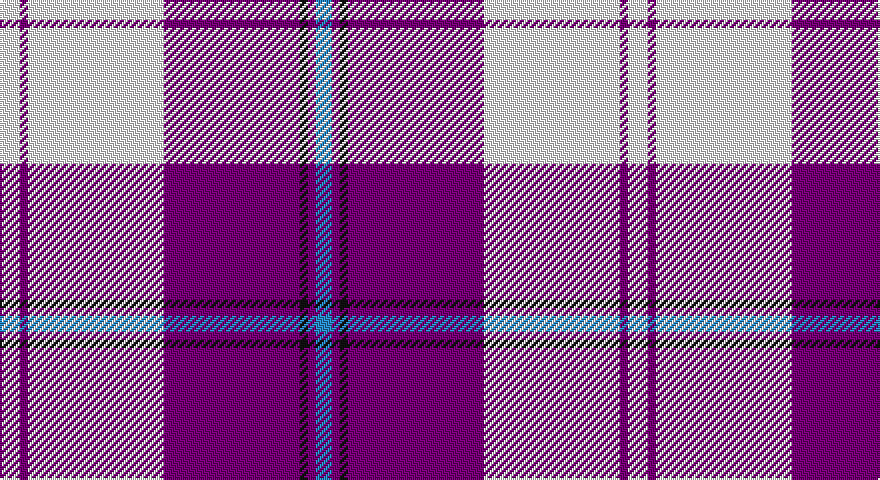

This page is one **sett** — a single exact thread-count. It belongs to the [tartan](/setts/w5dp2w34dp34k2dp2t4/)
(the same proportion at any scale), whose colour order is pattern [BBKBWBW](/stripes/bbkbwbw/).

Part of the [Cunningham Dress,](/tartans/cunningham-dress/) tartan — the named design grouping this sett with its other cloths.

Sourced from register-of-tartans.  It is a [7 stripe tartan](/stripes/stripes7/).

Original link https://www.tartanregister.gov.uk/tartanDetails.aspx?ref=849

## Also known as

This cloth is also recorded under:

- Cunningham Dress
- Cunningham Dress Green
- Cunningham Dress Purple
- Cunningham Dress, Blue
- Cunningham Dress, Green
- Cunningham, Dress Blue
- Cunningham, dress

## Register references

External register numbers recorded for this tartan.

- Scottish Register of Tartans: [849](https://www.tartanregister.gov.uk/tartanDetails.aspx?ref=849)
- Scottish Tartans Authority (ITI): 6531

## Thread count
W/10 P4 W68 P68 K4 P4 B/8

One full sett is **314 threads**.

## Palette

Palette: <strong>Tartan Register</strong>
<table><thead><tr><th>Colour</th><th>Threads</th><th>Shade</th><th>Base</th><th>OKLCh</th></tr></thead><tbody><tr><td>W/</td><td style="text-align:right;font-variant-numeric:tabular-nums">10</td><td><code style="background-color:#F8F8F8;">#F8F8F8</code> <small style="color:#888">#F8F8F8</small></td><td>W <code style="background-color:#F7F7F7;">#F7F7F7</code></td><td><small style="color:#888">oklch(97.9% 0.000 89.9)</small></td></tr><tr><td>P</td><td style="text-align:right;font-variant-numeric:tabular-nums">4</td><td><code style="background-color:#780078;">#780078</code> <small style="color:#888">#780078</small></td><td>B <code style="background-color:#2A418A;">#2A418A</code></td><td><small style="color:#888">oklch(40.2% 0.185 328.4)</small></td></tr><tr><td>W</td><td style="text-align:right;font-variant-numeric:tabular-nums">68</td><td><code style="background-color:#F8F8F8;">#F8F8F8</code> <small style="color:#888">#F8F8F8</small></td><td>W <code style="background-color:#F7F7F7;">#F7F7F7</code></td><td><small style="color:#888">oklch(97.9% 0.000 89.9)</small></td></tr><tr><td>P</td><td style="text-align:right;font-variant-numeric:tabular-nums">68</td><td><code style="background-color:#780078;">#780078</code> <small style="color:#888">#780078</small></td><td>B <code style="background-color:#2A418A;">#2A418A</code></td><td><small style="color:#888">oklch(40.2% 0.185 328.4)</small></td></tr><tr><td>K</td><td style="text-align:right;font-variant-numeric:tabular-nums">4</td><td><code style="background-color:#101010;">#101010</code> <small style="color:#888">#101010</small></td><td>K <code style="background-color:#000000;">#000000</code></td><td><small style="color:#888">oklch(17.3% 0.000 89.9)</small></td></tr><tr><td>P</td><td style="text-align:right;font-variant-numeric:tabular-nums">4</td><td><code style="background-color:#780078;">#780078</code> <small style="color:#888">#780078</small></td><td>B <code style="background-color:#2A418A;">#2A418A</code></td><td><small style="color:#888">oklch(40.2% 0.185 328.4)</small></td></tr><tr><td>B/</td><td style="text-align:right;font-variant-numeric:tabular-nums">8</td><td><code style="background-color:#2888C4;">#2888C4</code> <small style="color:#888">#2888C4</small></td><td>B <code style="background-color:#2A418A;">#2A418A</code></td><td><small style="color:#888">oklch(60.1% 0.125 241.5)</small></td></tr></tbody></table>

# Sample pattern

## Compared to the master

This cloth is one sett of its design; the master sett (the exemplar the design is anchored on) is below for comparison.

<figure style="margin:0"><figcaption style="color:#888;font-size:smaller">this sett</figcaption></figure>
<figure style="margin:0"><figcaption style="color:#888;font-size:smaller"><a href="/setts/b3db2k2db28w30db2w3/">master sett →</a></figcaption></figure>

## Nearest tartans

The nearest existing variants by ΔTartan distance, with this tartan at the top so the swatches line up against it.

ΔTartan

Tartan

Sett

—

<a href="/ttd/edit/#slug=w5dp2w34dp34k2dp2t4~x2">Cunningham Dress Purple (Dance)</a> <a class="nn-out" href="/variants/s7/w5dp2w34dp34k2dp2t4~x2/" title="open its dictionary page">↗</a>

0.49

<a href="/ttd/edit/#slug=t2dp1k1dp20w20dp1w2~x4&amp;base=w5dp2w34dp34k2dp2t4~x2">Cunningham Dress Purple (Dance) Fashion Tartan</a> <a class="nn-out" href="/variants/s7/t2dp1k1dp20w20dp1w2~x4/" title="open its dictionary page">↗</a>

1.06

<a href="/ttd/edit/#slug=dp42lb2w2lb2dp5t12w32dp4~x2&amp;base=w5dp2w34dp34k2dp2t4~x2">Longniddry Dress (Dance)</a> <a class="nn-out" href="/variants/s8/dp42lb2w2lb2dp5t12w32dp4~x2/" title="open its dictionary page">↗</a>

1.08

<a href="/ttd/edit/#slug=w8k4w54db18m6db8m49w6&amp;base=w5dp2w34dp34k2dp2t4~x2">Merida Dance</a> <a class="nn-out" href="/variants/s8/w8k4w54db18m6db8m49w6/" title="open its dictionary page">↗</a>

1.11

<a href="/ttd/edit/#slug=w5k3w31p26w4p10t4~x2&amp;base=w5dp2w34dp34k2dp2t4~x2">MacPherson, dress (purple)</a> <a class="nn-out" href="/variants/s7/w5k3w31p26w4p10t4~x2/" title="open its dictionary page">↗</a>

1.11

<a href="/variants/s7/w30b4w3dp2r2dp24wi2~x2/">St Andrews Links Dress</a>

1.12

<a href="/ttd/edit/#slug=w5k3w31dp26w4dp10t4~x2&amp;base=w5dp2w34dp34k2dp2t4~x2">MacPherson Dress Purple</a> <a class="nn-out" href="/variants/s7/w5k3w31dp26w4dp10t4~x2/" title="open its dictionary page">↗</a>

1.14

<a href="/ttd/edit/#slug=dp42db2w2db2dp5t12w32dp4~x2&amp;base=w5dp2w34dp34k2dp2t4~x2">Longniddry Dress District Tartan</a> <a class="nn-out" href="/variants/s8/dp42db2w2db2dp5t12w32dp4~x2/" title="open its dictionary page">↗</a>

1.16

<a href="/ttd/edit/#slug=dp8db2dp24db5w26k2w8~x2&amp;base=w5dp2w34dp34k2dp2t4~x2">Lennox Purple Dress District Tartan</a> <a class="nn-out" href="/variants/s7/dp8db2dp24db5w26k2w8~x2/" title="open its dictionary page">↗</a>

1.20

<a href="/ttd/edit/#slug=p42db2w2db2p5b12w32p4~x2&amp;base=w5dp2w34dp34k2dp2t4~x2">Longniddry, dress</a> <a class="nn-out" href="/variants/s8/p42db2w2db2p5b12w32p4~x2/" title="open its dictionary page">↗</a>

1.41

<a href="/ttd/edit/#slug=w8k6w54db16m6db8m49w6&amp;base=w5dp2w34dp34k2dp2t4~x2">Meridia Dance</a> <a class="nn-out" href="/variants/s8/w8k6w54db16m6db8m49w6/" title="open its dictionary page">↗</a>

## Neighbour map

Every grey dot is one of 14360 variants placed by the first two principal components of the ΔTartan feature space (44% of its variance). Red is this tartan; blue dots are its nearest — click one to open its page.

<svg viewBox="0 0 640 380" role="img" style="max-width:100%;height:auto;border:1px solid #e0e0e0;border-radius:4px;display:block" xmlns="http://www.w3.org/2000/svg"><image href="/nn/cloud.v1.png" width="640" height="380"/><a href="/variants/s7/t2dp1k1dp20w20dp1w2~x4/"><circle cx="299.7" cy="120.4" r="4" fill="#3465a4"><title>Cunningham Dress Purple (Dance) Fashion Tartan</title></circle></a><a href="/variants/s8/dp42lb2w2lb2dp5t12w32dp4~x2/"><circle cx="291.8" cy="122.4" r="4" fill="#3465a4"><title>Longniddry Dress (Dance)</title></circle></a><a href="/variants/s8/w8k4w54db18m6db8m49w6/"><circle cx="217.3" cy="131.7" r="4" fill="#3465a4"><title>Merida Dance</title></circle></a><a href="/variants/s7/w5k3w31p26w4p10t4~x2/"><circle cx="249.2" cy="164.0" r="4" fill="#3465a4"><title>MacPherson, dress (purple)</title></circle></a><a href="/variants/s7/w30b4w3dp2r2dp24wi2~x2/"><circle cx="247.1" cy="115.1" r="4" fill="#3465a4"><title>St Andrews Links Dress</title></circle></a><a href="/variants/s7/w5k3w31dp26w4dp10t4~x2/"><circle cx="250.4" cy="165.1" r="4" fill="#3465a4"><title>MacPherson Dress Purple</title></circle></a><a href="/variants/s8/dp42db2w2db2dp5t12w32dp4~x2/"><circle cx="291.5" cy="123.1" r="4" fill="#3465a4"><title>Longniddry Dress District Tartan</title></circle></a><a href="/variants/s7/dp8db2dp24db5w26k2w8~x2/"><circle cx="236.7" cy="160.9" r="4" fill="#3465a4"><title>Lennox Purple Dress District Tartan</title></circle></a><a href="/variants/s8/p42db2w2db2p5b12w32p4~x2/"><circle cx="296.5" cy="122.5" r="4" fill="#3465a4"><title>Longniddry, dress</title></circle></a><a href="/variants/s8/w8k6w54db16m6db8m49w6/"><circle cx="204.6" cy="150.4" r="4" fill="#3465a4"><title>Meridia Dance</title></circle></a><circle cx="279.0" cy="124.5" r="5" fill="#c00000"/></svg>

ID: /variants/s7/w5dp2w34dp34k2dp2t4~x2/
