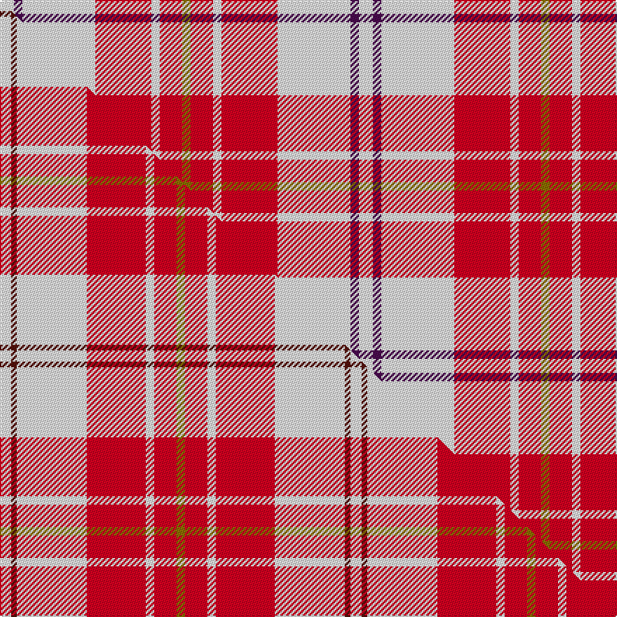

This is one **variant** — a specific cloth: this exact thread count and colourway, with its own
provenance below. It is one weaving of the [sett](/setts/w5dp3w26r20w3r8y3/) (the scale-free proportion — the
same cloth at any scale or shade), whose colour order is pattern [GRWRWBW](/stripes/grwrwbw/).

Part of the [MacPherson Dress](/tartans/m/ma/macpherson-dress-6/) tartan — the named design grouping this sett with its other cloths.

Sourced from register-of-tartans.  It is a [7 stripe tartan](/stripes/stripes7/).

Original link [https://www.tartanregister.gov.uk/tartanDetails.aspx?ref=2721](https://www.tartanregister.gov.uk/tartanDetails.aspx?ref=2721)

## Provenance

Earliest known date: Date unknown There are a great number of variations of the Dress MacPherson, many of them modern trade designs which are popular with country dancers. Hugh Macpherson of Edinburgh, kiltmaker and tartan designer some decades ago, supplied samples of these to the Scottish Tartan Society around 1980.

4 attestations — the source records this cloth was collapsed from (oldest owns this page)

<ul>
<li>01/01/1980 — MacPherson Dress Red (Dance) (register-of-tartans, <a href="https://www.tartanregister.gov.uk/tartanDetails.aspx?ref=2721">record</a>)  <em>There are a great number of variations of the Dress MacPherson, many of them modern trade designs which are popular with country dancers. Hugh Macpherson of Edinburgh, kiltmaker and tartan designer, supplied samples of these to the Scottish Tartans Society in around 1980. Hugh departed from his normal practice here and introduced an additional colour with purple tramlines instead of red on the white band.</em></li>
<li>1980 — MacPherson Dress, Red (Dance) (tartans-authority, <a href="https://www.tartanregister.gov.uk/tartanDetails.aspx?ref=1793">record</a>)  <em>There are a great number of variations of the Dress MacPherson, many of them modern trade designs which are popular with country dancers. Hugh Macpherson of Edinburgh, kiltmaker and tartan designer some decades ago, supplied samples of these to the Scottish Tartan Society around 1980. Hugh departed fromhis normal practice here and introduced an additional colour with purple tramlines instead of red on the white band.</em></li>
<li>undated — MacPherson, Red (weddslist, <a href="http://www.weddslist.com/cgi-bin/tartans/pg.pl?source=sts">record</a>) </li>
<li>undated — MacPherson Red Dress Clan Tartan (house-of-tartan, <a href="http://www.house-of-tartan.scotland.net/house/TartanViewjs.asp?colr=Def&tnam=1793">record</a>) </li>
</ul>

Dataset <small>— provenance for this record, inherited from the source manifest</small>

<dl class="dataset-prov">
<dt>source</dt><dd><a href="/sources/register-of-tartans/">Scottish Register of Tartans</a></dd>
<dt>data captured from</dt><dd><a href="https://github.com/thetartan/tartan-database/blob/master/data/register-of-tartans/data.csv">https://github.com/thetartan/tartan-database/blob/master/data/register-of-tartans/data.csv</a></dd>
<dt>data date</dt><dd>1980 <small>(this record)</small></dd>
<dt>licence</dt><dd><a href="https://www.tartanregister.gov.uk/copyright">Crown copyright</a></dd>
</dl>

Capture chain <small>— the hands this data passed through, oldest first; each capture carries its own licence</small>

<ol class="capture-chain">
<li><a href="https://www.tartanregister.gov.uk/">Scottish Register of Tartans</a> · <a href="https://www.tartanregister.gov.uk/copyright">Crown copyright</a> <small>the living register — still published by National Records of Scotland</small></li>
<li><a href="https://github.com/thetartan/tartan-database">thetartan/tartan-database</a> <small>2016-2017</small> · <a href="https://creativecommons.org/licenses/by-nc-nd/4.0/">CC BY-NC-ND 4.0</a> <small>Levko Kravets's frozen compilation — the capture we vendored, and where its CC licence text came from</small></li>
<li>this dictionary <small>captured 2026-06-10 · commit 5bf86c7566</small> <small>each re-capture is a git commit to data/sources</small></li>
</ol>

## Register references

External register numbers recorded for this tartan.

- Scottish Register of Tartans: [2721](https://www.tartanregister.gov.uk/tartanDetails.aspx?ref=2721)
- Scottish Tartans Authority (ITI): 1793
- Scottish Tartans World Register: 1793

## Thread count
W/10 DP6 W52 R40 W6 R16 Y/6

One full sett is **256 threads**.

## Palette
<table><thead><tr><th>Colour</th><th>Shade</th><th>OKLCh</th></tr></thead><tbody><tr><td>W</td><td><code style="background-color:#F7F7F7;">#F7F7F7</code> <small style="color:#888">#F7F7F7</small></td><td><small style="color:#888">oklch(97.6% 0.000 89.9)</small></td></tr><tr><td>DP</td><td><code style="background-color:#4B0B4F;">#4B0B4F</code> <small style="color:#888">#4B0B4F</small></td><td><small style="color:#888">oklch(30.1% 0.125 325.4)</small></td></tr><tr><td>R</td><td><code style="background-color:#D60020;">#D60020</code> <small style="color:#888">#D60020</small></td><td><small style="color:#888">oklch(55.2% 0.224 25.5)</small></td></tr><tr><td>Y</td><td><code style="background-color:#8B6E00;">#8B6E00</code> <small style="color:#888">#8B6E00</small></td><td><small style="color:#888">oklch(55.1% 0.113 90.4)</small></td></tr></tbody></table>

# Sample pattern

## Compared to the master

This cloth is one sett of its design; the master sett (the exemplar the design is anchored on) is below for comparison.

Its **ΔTartan distance** from the master is **2.11** — the same measure the nearest-tartans table ranks by (0 is identical; a re-scale of the same cloth is near 0, a recolour or a different proportion further).

<figure class="master-compare" style="margin:0">

this sett
master sett ★

<figcaption style="color:#888;font-size:smaller">One weave of this sett against the <a href="/setts/w4dr2w25r21w3r8y3/">master sett ★</a>, split on the diagonal: a shared proportion runs seamlessly across it with only the shades shifting; a different proportion breaks on it.</figcaption>
</figure>

## Nearest tartan variants

The nearest existing variants by ΔTartan distance, with this cloth at the top so the swatches line up against it.

ΔTartan

Threads

Variant

Sett

—

256

<a href="/variants/s7/w5dp3w26r20w3r8y3~x2/">MacPherson Dress Red (Dance)</a>

<a href="/ttd/edit/#slug=r2w1r9w9r1w2~x6&amp;base=w5dp3w26r20w3r8y3~x2" title="compare in the TTD">1.93</a>

264

<a href="/variants/s6/r2w1r9w9r1w2~x6/">Erskine Red &amp; White (Dance)</a>

<a href="/ttd/edit/#slug=r6w2r29w29r2w6~x2&amp;base=w5dp3w26r20w3r8y3~x2" title="compare in the TTD">1.96</a>

272

<a href="/variants/s6/r6w2r29w29r2w6~x2/">Erskine, Burgundy (Dance)</a>

<a href="/ttd/edit/#slug=w4k2w25r21w3r8y3~x2&amp;base=w5dp3w26r20w3r8y3~x2" title="compare in the TTD">2.01</a>

250

<a href="/variants/s7/w4k2w25r21w3r8y3~x2/">MacPherson Dress Burgandy Clan Tartan</a>

<a href="/ttd/edit/#slug=w4dr2w25r21w3r8y3~x2&amp;base=w5dp3w26r20w3r8y3~x2" title="compare in the TTD">2.11</a>

250

<a href="/variants/s7/w4dr2w25r21w3r8y3~x2/">MacPherson Dress Red</a>

<a href="/ttd/edit/#slug=w4r2w25ri21w3ri8y3~x2~r1506028-ri2008029&amp;base=w5dp3w26r20w3r8y3~x2" title="compare in the TTD">2.15</a>

250

<a href="/variants/s7/w4r2w25ri21w3ri8y3~x2~r1506028-ri2008029/">MacPherson, dress red</a>

<a href="/ttd/edit/#slug=g3r2dp2r30w30g2w3~x2&amp;base=w5dp3w26r20w3r8y3~x2" title="compare in the TTD">2.18</a>

276

<a href="/variants/s7/g3r2dp2r30w30g2w3~x2/">Torridon, Burgundy (Dance)</a>

<a href="/ttd/edit/#slug=r8dp2r24dp5w25o2w8~x2&amp;base=w5dp3w26r20w3r8y3~x2" title="compare in the TTD">2.22</a>

264

<a href="/variants/s7/r8dp2r24dp5w25o2w8~x2/">Lennox, dress</a>

<a href="/ttd/edit/#slug=r8dp2r24dp5w25dy2w8~x2&amp;base=w5dp3w26r20w3r8y3~x2" title="compare in the TTD">2.23</a>

264

<a href="/variants/s7/r8dp2r24dp5w25dy2w8~x2/">MacGiboney (Personal)</a>

<a href="/ttd/edit/#slug=r8dp2r24db5w26o2w8~x2&amp;base=w5dp3w26r20w3r8y3~x2" title="compare in the TTD">2.24</a>

268

<a href="/variants/s7/r8dp2r24db5w26o2w8~x2/">Lennox, dress</a>

<a href="/ttd/edit/#slug=r8dp2r24db5w26dy2w8~x2&amp;base=w5dp3w26r20w3r8y3~x2" title="compare in the TTD">2.24</a>

268

<a href="/variants/s7/r8dp2r24db5w26dy2w8~x2/">Lennox Dress</a>

## Neighbour map

Every grey dot is one of 13621 variants placed by the first two principal components of the ΔTartan feature space (42% of its variance). Red is this tartan; blue dots are its nearest — click one to open its page.

<svg viewBox="0 0 640 380" role="img" style="max-width:100%;height:auto;border:1px solid #e0e0e0;border-radius:4px;display:block" xmlns="http://www.w3.org/2000/svg"><image href="/nn/cloud.v1.png" width="640" height="380"/><a href="/variants/s6/r2w1r9w9r1w2~x6/"><circle cx="351.4" cy="234.6" r="4" fill="#3465a4"><title>Erskine Red &amp; White (Dance)</title></circle></a><a href="/variants/s6/r6w2r29w29r2w6~x2/"><circle cx="370.6" cy="211.2" r="4" fill="#3465a4"><title>Erskine, Burgundy (Dance)</title></circle></a><a href="/variants/s7/w4k2w25r21w3r8y3~x2/"><circle cx="267.3" cy="170.4" r="4" fill="#3465a4"><title>MacPherson Dress Burgandy Clan Tartan</title></circle></a><a href="/variants/s7/w4dr2w25r21w3r8y3~x2/"><circle cx="287.7" cy="180.8" r="4" fill="#3465a4"><title>MacPherson Dress Red</title></circle></a><a href="/variants/s7/w4r2w25ri21w3ri8y3~x2~r1506028-ri2008029/"><circle cx="283.1" cy="180.0" r="4" fill="#3465a4"><title>MacPherson, dress red</title></circle></a><a href="/variants/s7/g3r2dp2r30w30g2w3~x2/"><circle cx="291.1" cy="155.8" r="4" fill="#3465a4"><title>Torridon, Burgundy (Dance)</title></circle></a><a href="/variants/s7/r8dp2r24dp5w25o2w8~x2/"><circle cx="254.7" cy="185.7" r="4" fill="#3465a4"><title>Lennox, dress</title></circle></a><a href="/variants/s7/r8dp2r24dp5w25dy2w8~x2/"><circle cx="252.0" cy="184.9" r="4" fill="#3465a4"><title>MacGiboney (Personal)</title></circle></a><a href="/variants/s7/r8dp2r24db5w26o2w8~x2/"><circle cx="239.2" cy="170.1" r="4" fill="#3465a4"><title>Lennox, dress</title></circle></a><a href="/variants/s7/r8dp2r24db5w26dy2w8~x2/"><circle cx="236.6" cy="169.4" r="4" fill="#3465a4"><title>Lennox Dress</title></circle></a><circle cx="273.3" cy="196.7" r="5" fill="#c00000"/><text x="320" y="376" text-anchor="middle" font-size="11" fill="#999">ground</text><text x="11" y="190" text-anchor="middle" font-size="11" fill="#999" transform="rotate(-90 11 190)">complexity</text></svg>

ID: /variants/s7/w5dp3w26r20w3r8y3~x2/
