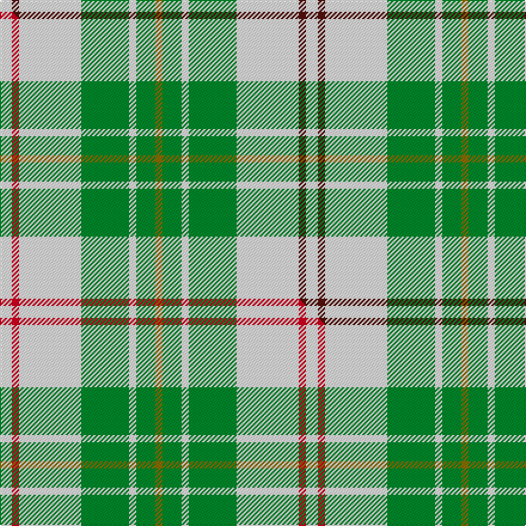

This is one **variant** — a specific cloth: this exact thread count and colourway, with its own
provenance below. It is one weaving of the [sett](/setts/w5dr3w26g20w3g8y3/) (the scale-free proportion — the
same cloth at any scale or shade), whose colour order is pattern [GGWGWBW](/stripes/ggwgwbw/).

Part of the [MacPherson Dress](/tartans/macpherson-dress-3/) tartan — the named design grouping this sett with its other cloths.

Sourced from tartans-authority.  It is a [7 stripe tartan](/stripes/stripes7/).

Original link [https://www.tartanregister.gov.uk/tartanDetails.aspx?ref=1870](https://www.tartanregister.gov.uk/tartanDetails.aspx?ref=1870)

Dataset <small>— provenance for this record, inherited from the source manifest</small>

<dl class="dataset-prov">
<dt>source</dt><dd><a href="/sources/tartans-authority/">Scottish Tartans Authority</a></dd>
<dt>data captured from</dt><dd><a href="https://github.com/thetartan/tartan-database/blob/master/data/tartans-authority/data.csv">https://github.com/thetartan/tartan-database/blob/master/data/tartans-authority/data.csv</a></dd>
<dt>data date</dt><dd>1980 <small>(this record)</small></dd>
<dt>licence</dt><dd><a href="https://creativecommons.org/licenses/by-nc-nd/4.0/">CC BY-NC-ND 4.0</a></dd>
</dl>

Capture chain <small>— the hands this data passed through, oldest first; each capture carries its own licence</small>

<ol class="capture-chain">
<li><a href="https://www.tartansauthority.com/">Scottish Tartans Authority</a> <small>the heritage body's archive — its tartan-ferret record browser is retired (links repaired to the SRT, above)</small></li>
<li><a href="https://github.com/thetartan/tartan-database">thetartan/tartan-database</a> <small>2016-2017</small> · <a href="https://creativecommons.org/licenses/by-nc-nd/4.0/">CC BY-NC-ND 4.0</a> <small>Levko Kravets's frozen compilation — the capture we vendored, and where its CC licence text came from</small></li>
<li>this dictionary <small>captured 2026-06-10 · commit 5bf86c7566</small> <small>each re-capture is a git commit to data/sources</small></li>
</ol>

## Register references

External register numbers recorded for this tartan.

- Scottish Tartans Authority (ITI): 1870

## Thread count
W/10 DR6 W52 G40 W6 G16 Y/6

One full sett is **256 threads**.

## Palette
<table><thead><tr><th>Colour</th><th>Shade</th><th>OKLCh</th></tr></thead><tbody><tr><td>G</td><td><code style="background-color:#008B2A;">#008B2A</code> <small style="color:#888">#008B2A</small></td><td><small style="color:#888">oklch(55.4% 0.170 145.9)</small></td></tr><tr><td>W</td><td><code style="background-color:#F7F7F7;">#F7F7F7</code> <small style="color:#888">#F7F7F7</small></td><td><small style="color:#888">oklch(97.6% 0.000 89.9)</small></td></tr><tr><td>DR</td><td><code style="background-color:#55120C;">#55120C</code> <small style="color:#888">#55120C</small></td><td><small style="color:#888">oklch(30.0% 0.099 29.3)</small></td></tr><tr><td>Y</td><td><code style="background-color:#8B6E00;">#8B6E00</code> <small style="color:#888">#8B6E00</small></td><td><small style="color:#888">oklch(55.1% 0.113 90.4)</small></td></tr></tbody></table>

# Sample pattern

## Compared to the master

This cloth is one sett of its design; the master sett (the exemplar the design is anchored on) is below for comparison.

Its **ΔTartan distance** from the master is **0.03** — the same measure the nearest-tartans table ranks by (0 is identical; a re-scale of the same cloth is near 0, a recolour or a different proportion further).

<figure class="master-compare" style="margin:0">

this sett
master sett ★

<figcaption style="color:#888;font-size:smaller">One weave of this sett against the <a href="/setts/w5r3w26g20w3g8y3/">master sett ★</a>, split on the diagonal: a shared proportion runs seamlessly across it with only the shades shifting; a different proportion breaks on it.</figcaption>
</figure>

## Nearest tartan variants

The nearest existing variants by ΔTartan distance, with this cloth at the top so the swatches line up against it.

ΔTartan

Threads

Variant

Sett

—

256

<a href="/variants/s7/w5dr3w26g20w3g8y3~x2/">MacPherson Dress, Green (Dance)</a>

<a href="/ttd/edit/#slug=w5r3w26g20w3g8y3~x2&amp;base=w5dr3w26g20w3g8y3~x2" title="compare in the TTD">0.03</a>

256

<a href="/variants/s7/w5r3w26g20w3g8y3~x2/">MacPherson Dress Green (Dance)</a>

<a href="/ttd/edit/#slug=w5r3w26g21w3g8y3~x2&amp;base=w5dr3w26g20w3g8y3~x2" title="compare in the TTD">0.07</a>

260

<a href="/variants/s7/w5r3w26g21w3g8y3~x2/">MacPherson Dress Blue (Dance) #2</a>

<a href="/ttd/edit/#slug=w5r3w26dt21w3dt8y3~x2&amp;base=w5dr3w26g20w3g8y3~x2" title="compare in the TTD">0.22</a>

260

<a href="/variants/s7/w5r3w26dt21w3dt8y3~x2/">MacPherson Dress, Blue (Dance)</a>

<a href="/ttd/edit/#slug=w12g12w1g12w12ly1~x4&amp;base=w5dr3w26g20w3g8y3~x2" title="compare in the TTD">1.20</a>

348

<a href="/variants/s6/w12g12w1g12w12ly1~x4/">Wallace Green Dress Fashion Tartan</a>

<a href="/ttd/edit/#slug=g6w2g29w29g2w6~x2&amp;base=w5dr3w26g20w3g8y3~x2" title="compare in the TTD">1.96</a>

272

<a href="/variants/s6/g6w2g29w29g2w6~x2/">Erskine, Green (Dance)</a>

<a href="/ttd/edit/#slug=w12r2w12g17w12r2w5b2~x4&amp;base=w5dr3w26g20w3g8y3~x2" title="compare in the TTD">2.58</a>

456

<a href="/variants/s8/w12r2w12g17w12r2w5b2~x4/">Milne, Green (Dance)</a>

<a href="/ttd/edit/#slug=w2o1w2g6w10o6w2g1w2~x2&amp;base=w5dr3w26g20w3g8y3~x2" title="compare in the TTD">3.38</a>

120

<a href="/variants/s9/w2o1w2g6w10o6w2g1w2~x2/">O'Neill</a>

<a href="/ttd/edit/#slug=dg4w35g31w4~x2&amp;base=w5dr3w26g20w3g8y3~x2" title="compare in the TTD">3.42</a>

280

<a href="/variants/s4/dg4w35g31w4~x2/">Lewis, Green (Dance)</a>

<a href="/ttd/edit/#slug=y8w3y28w32dp3w4~x2&amp;base=w5dr3w26g20w3g8y3~x2" title="compare in the TTD">3.45</a>

288

<a href="/variants/s6/y8w3y28w32dp3w4~x2/">Ailsa Yellow Fashion Tartan</a>

<a href="/ttd/edit/#slug=g3r2g27dg3w30dg2w3~x2&amp;base=w5dr3w26g20w3g8y3~x2" title="compare in the TTD">3.54</a>

268

<a href="/variants/s7/g3r2g27dg3w30dg2w3~x2/">Uist, Green (Dance)</a>

## Neighbour map

Every grey dot is one of 13621 variants placed by the first two principal components of the ΔTartan feature space (42% of its variance). Red is this tartan; blue dots are its nearest — click one to open its page.

<svg viewBox="0 0 640 380" role="img" style="max-width:100%;height:auto;border:1px solid #e0e0e0;border-radius:4px;display:block" xmlns="http://www.w3.org/2000/svg"><image href="/nn/cloud.v1.png" width="640" height="380"/><a href="/variants/s7/w5r3w26g20w3g8y3~x2/"><circle cx="278.8" cy="217.8" r="4" fill="#3465a4"><title>MacPherson Dress Green (Dance)</title></circle></a><a href="/variants/s7/w5r3w26g21w3g8y3~x2/"><circle cx="276.8" cy="217.7" r="4" fill="#3465a4"><title>MacPherson Dress Blue (Dance) #2</title></circle></a><a href="/variants/s7/w5r3w26dt21w3dt8y3~x2/"><circle cx="250.9" cy="204.0" r="4" fill="#3465a4"><title>MacPherson Dress, Blue (Dance)</title></circle></a><a href="/variants/s6/w12g12w1g12w12ly1~x4/"><circle cx="330.1" cy="267.6" r="4" fill="#3465a4"><title>Wallace Green Dress Fashion Tartan</title></circle></a><a href="/variants/s6/g6w2g29w29g2w6~x2/"><circle cx="382.0" cy="242.5" r="4" fill="#3465a4"><title>Erskine, Green (Dance)</title></circle></a><a href="/variants/s8/w12r2w12g17w12r2w5b2~x4/"><circle cx="328.0" cy="227.5" r="4" fill="#3465a4"><title>Milne, Green (Dance)</title></circle></a><a href="/variants/s9/w2o1w2g6w10o6w2g1w2~x2/"><circle cx="309.5" cy="219.9" r="4" fill="#3465a4"><title>O'Neill</title></circle></a><a href="/variants/s4/dg4w35g31w4~x2/"><circle cx="333.6" cy="274.1" r="4" fill="#3465a4"><title>Lewis, Green (Dance)</title></circle></a><a href="/variants/s6/y8w3y28w32dp3w4~x2/"><circle cx="345.6" cy="234.5" r="4" fill="#3465a4"><title>Ailsa Yellow Fashion Tartan</title></circle></a><a href="/variants/s7/g3r2g27dg3w30dg2w3~x2/"><circle cx="278.6" cy="170.0" r="4" fill="#3465a4"><title>Uist, Green (Dance)</title></circle></a><circle cx="285.1" cy="224.4" r="5" fill="#c00000"/><text x="320" y="376" text-anchor="middle" font-size="11" fill="#999">ground</text><text x="11" y="190" text-anchor="middle" font-size="11" fill="#999" transform="rotate(-90 11 190)">complexity</text></svg>

ID: /variants/s7/w5dr3w26g20w3g8y3~x2/
