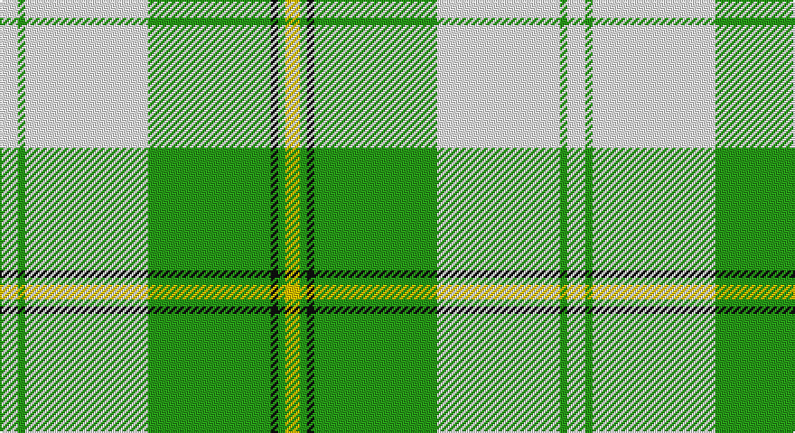

This page is one **sett** — a single exact thread-count. It belongs to the [tartan](/setts/w5g2w34g34k2g2ly4/)
(the same proportion at any scale), whose colour order is pattern [WGWGKGY](/stripes/wgwgkgy/).

Part of the [Cunningham Dress,](/tartans/cunningham-dress/) tartan — the named design grouping this sett with its other cloths.

Sourced from register-of-tartans.  It is a [7 stripe tartan](/stripes/stripes7/).

Original link https://www.tartanregister.gov.uk/tartanDetails.aspx?ref=848

## Also known as

This cloth is also recorded under:

- Cunningham Dress
- Cunningham Dress Green
- Cunningham Dress Purple
- Cunningham Dress, Blue
- Cunningham Dress, Green
- Cunningham, Dress Blue
- Cunningham, dress

2 attestations — the source records this cloth was collapsed from (oldest owns this page)

<ul>
<li>01/01/1988 — Cunningham Dress Green (Dance) (register-of-tartans, <a href="https://www.tartanregister.gov.uk/tartanDetails.aspx?ref=848">record</a>)</li>
<li>1988 — Cunningham Dress, Green (Dance) (tartans-authority, <a href="http://www.tartansauthority.com/tartan-ferret/display/6532/">record</a>)</li>
</ul>

## Register references

External register numbers recorded for this tartan.

- Scottish Register of Tartans: [848](https://www.tartanregister.gov.uk/tartanDetails.aspx?ref=848)
- Scottish Tartans Authority (ITI): 6532

## Thread count
W/10 G4 W68 G68 K4 G4 Y/8

One full sett is **314 threads**.

## Palette

Palette: <strong>Tartan Register</strong>
<table><thead><tr><th>Colour</th><th>Threads</th><th>Shade</th><th>Base</th><th>OKLCh</th></tr></thead><tbody><tr><td>W/</td><td style="text-align:right;font-variant-numeric:tabular-nums">10</td><td><code style="background-color:#F8F8F8;">#F8F8F8</code> <small style="color:#888">#F8F8F8</small></td><td>W <code style="background-color:#F7F7F7;">#F7F7F7</code></td><td><small style="color:#888">oklch(97.9% 0.000 89.9)</small></td></tr><tr><td>G</td><td style="text-align:right;font-variant-numeric:tabular-nums">4</td><td><code style="background-color:#289C18;">#289C18</code> <small style="color:#888">#289C18</small></td><td>G <code style="background-color:#006100;">#006100</code></td><td><small style="color:#888">oklch(60.6% 0.191 141.6)</small></td></tr><tr><td>W</td><td style="text-align:right;font-variant-numeric:tabular-nums">68</td><td><code style="background-color:#F8F8F8;">#F8F8F8</code> <small style="color:#888">#F8F8F8</small></td><td>W <code style="background-color:#F7F7F7;">#F7F7F7</code></td><td><small style="color:#888">oklch(97.9% 0.000 89.9)</small></td></tr><tr><td>G</td><td style="text-align:right;font-variant-numeric:tabular-nums">68</td><td><code style="background-color:#289C18;">#289C18</code> <small style="color:#888">#289C18</small></td><td>G <code style="background-color:#006100;">#006100</code></td><td><small style="color:#888">oklch(60.6% 0.191 141.6)</small></td></tr><tr><td>K</td><td style="text-align:right;font-variant-numeric:tabular-nums">4</td><td><code style="background-color:#101010;">#101010</code> <small style="color:#888">#101010</small></td><td>K <code style="background-color:#000000;">#000000</code></td><td><small style="color:#888">oklch(17.3% 0.000 89.9)</small></td></tr><tr><td>G</td><td style="text-align:right;font-variant-numeric:tabular-nums">4</td><td><code style="background-color:#289C18;">#289C18</code> <small style="color:#888">#289C18</small></td><td>G <code style="background-color:#006100;">#006100</code></td><td><small style="color:#888">oklch(60.6% 0.191 141.6)</small></td></tr><tr><td>Y/</td><td style="text-align:right;font-variant-numeric:tabular-nums">8</td><td><code style="background-color:#E8C000;">#E8C000</code> <small style="color:#888">#E8C000</small></td><td>Y <code style="background-color:#F2BF00;">#F2BF00</code></td><td><small style="color:#888">oklch(81.9% 0.168 93.7)</small></td></tr></tbody></table>

# Sample pattern

## Compared to the master

This cloth is one sett of its design; the master sett (the exemplar the design is anchored on) is below for comparison.

<figure style="margin:0"><figcaption style="color:#888;font-size:smaller">this sett</figcaption></figure>
<figure style="margin:0"><figcaption style="color:#888;font-size:smaller"><a href="/setts/b3db2k2db28w30db2w3/">master sett →</a></figcaption></figure>

## Nearest tartans

The nearest existing variants by ΔTartan distance, with this tartan at the top so the swatches line up against it.

ΔTartan

Tartan

Sett

—

<a href="/ttd/edit/#slug=w5g2w34g34k2g2ly4~x2">Cunningham Dress Green (Dance)</a> <a class="nn-out" href="/variants/s7/w5g2w34g34k2g2ly4~x2/" title="open its dictionary page">↗</a>

0.68

<a href="/ttd/edit/#slug=w2g1w20g20k1g1ly2~x4&amp;base=w5g2w34g34k2g2ly4~x2">Cunningham Dress Green (Dance) Fashion Tartan</a> <a class="nn-out" href="/variants/s7/w2g1w20g20k1g1ly2~x4/" title="open its dictionary page">↗</a>

1.24

<a href="/ttd/edit/#slug=g3r2g27dg3w30dg2w3~x2&amp;base=w5g2w34g34k2g2ly4~x2">Uist, Green (Dance)</a> <a class="nn-out" href="/variants/s7/g3r2g27dg3w30dg2w3~x2/" title="open its dictionary page">↗</a>

1.39

<a href="/ttd/edit/#slug=g1g1w1g15w15g1w1g1~x4&amp;base=w5g2w34g34k2g2ly4~x2">Bundy, Dress Black Personal)</a> <a class="nn-out" href="/variants/s8/g1g1w1g15w15g1w1g1~x4/" title="open its dictionary page">↗</a>

1.54

<a href="/ttd/edit/#slug=g42gi2w2gi2g5dg12w32g4~x2&amp;base=w5g2w34g34k2g2ly4~x2">Longniddry, Green</a> <a class="nn-out" href="/variants/s8/g42gi2w2gi2g5dg12w32g4~x2/" title="open its dictionary page">↗</a>

1.63

<a href="/ttd/edit/#slug=n4w2n1w36g21ly4~x2&amp;base=w5g2w34g34k2g2ly4~x2">Skye, Green (Dance)</a> <a class="nn-out" href="/variants/s6/n4w2n1w36g21ly4~x2/" title="open its dictionary page">↗</a>

1.66

<a href="/ttd/edit/#slug=w5r3w26g20w3g8ly3~x2&amp;base=w5g2w34g34k2g2ly4~x2">MacPherson Dress Green (Dance)</a> <a class="nn-out" href="/variants/s7/w5r3w26g20w3g8ly3~x2/" title="open its dictionary page">↗</a>

1.75

<a href="/ttd/edit/#slug=w38r12w37g32k3w4k3g32r4&amp;base=w5g2w34g34k2g2ly4~x2">MacDiarmid, dress</a> <a class="nn-out" href="/variants/s9/w38r12w37g32k3w4k3g32r4/" title="open its dictionary page">↗</a>

1.75

<a href="/ttd/edit/#slug=gi42g2w2g2gi5dt12w32gi4~x2&amp;base=w5g2w34g34k2g2ly4~x2">Longniddry Green (Dance)</a> <a class="nn-out" href="/variants/s8/gi42g2w2g2gi5dt12w32gi4~x2/" title="open its dictionary page">↗</a>

1.77

<a href="/ttd/edit/#slug=gi42g2w2g2gi5dg12w32gi4~x2&amp;base=w5g2w34g34k2g2ly4~x2">Longniddry Green District Tartan</a> <a class="nn-out" href="/variants/s8/gi42g2w2g2gi5dg12w32gi4~x2/" title="open its dictionary page">↗</a>

1.81

<a href="/ttd/edit/#slug=g3w29g3db3g3db6g13ly3r2~x2&amp;base=w5g2w34g34k2g2ly4~x2">Nova Scotia, dress</a> <a class="nn-out" href="/variants/s9/g3w29g3db3g3db6g13ly3r2~x2/" title="open its dictionary page">↗</a>

## Neighbour map

Every grey dot is one of 14360 variants placed by the first two principal components of the ΔTartan feature space (44% of its variance). Red is this tartan; blue dots are its nearest — click one to open its page.

<svg viewBox="0 0 640 380" role="img" style="max-width:100%;height:auto;border:1px solid #e0e0e0;border-radius:4px;display:block" xmlns="http://www.w3.org/2000/svg"><image href="/nn/cloud.v1.png" width="640" height="380"/><a href="/variants/s7/w2g1w20g20k1g1ly2~x4/"><circle cx="310.3" cy="141.9" r="4" fill="#3465a4"><title>Cunningham Dress Green (Dance) Fashion Tartan</title></circle></a><a href="/variants/s7/g3r2g27dg3w30dg2w3~x2/"><circle cx="266.4" cy="145.5" r="4" fill="#3465a4"><title>Uist, Green (Dance)</title></circle></a><a href="/variants/s8/g1g1w1g15w15g1w1g1~x4/"><circle cx="294.8" cy="144.2" r="4" fill="#3465a4"><title>Bundy, Dress Black Personal)</title></circle></a><a href="/variants/s8/g42gi2w2gi2g5dg12w32g4~x2/"><circle cx="280.1" cy="139.1" r="4" fill="#3465a4"><title>Longniddry, Green</title></circle></a><a href="/variants/s6/n4w2n1w36g21ly4~x2/"><circle cx="335.6" cy="121.2" r="4" fill="#3465a4"><title>Skye, Green (Dance)</title></circle></a><a href="/variants/s7/w5r3w26g20w3g8ly3~x2/"><circle cx="244.8" cy="183.7" r="4" fill="#3465a4"><title>MacPherson Dress Green (Dance)</title></circle></a><a href="/variants/s9/w38r12w37g32k3w4k3g32r4/"><circle cx="223.6" cy="162.6" r="4" fill="#3465a4"><title>MacDiarmid, dress</title></circle></a><a href="/variants/s8/gi42g2w2g2gi5dt12w32gi4~x2/"><circle cx="265.5" cy="129.7" r="4" fill="#3465a4"><title>Longniddry Green (Dance)</title></circle></a><a href="/variants/s8/gi42g2w2g2gi5dg12w32gi4~x2/"><circle cx="279.7" cy="138.8" r="4" fill="#3465a4"><title>Longniddry Green District Tartan</title></circle></a><a href="/variants/s9/g3w29g3db3g3db6g13ly3r2~x2/"><circle cx="209.9" cy="121.1" r="4" fill="#3465a4"><title>Nova Scotia, dress</title></circle></a><circle cx="281.2" cy="140.9" r="5" fill="#c00000"/></svg>

ID: /variants/s7/w5g2w34g34k2g2ly4~x2/
