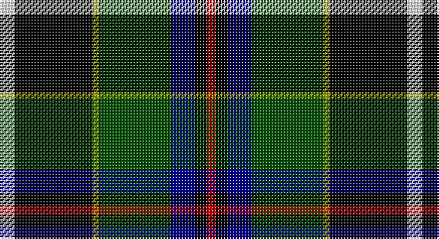

This page is one **sett** — a single exact thread-count. It belongs to the [tartan](/setts/w5k26ly2dg24db8k4r3/)
(the same proportion at any scale), whose colour order is pattern [RKBGYKW](/stripes/rkbgykw/).

Part of the [Cornish Hunting](/tartans/cornish-hunting/) tartan — the named design grouping this sett with its other cloths.

Sourced from tartans-authority.  It is a [7 stripe tartan](/stripes/stripes7/).

Original link http://www.tartansauthority.com/tartan-ferret/display/1568/

## Also known as

This cloth is also recorded under:

- Cornish Htg
- Cornish, hunting

## Register references

External register numbers recorded for this tartan.

- Scottish Tartans Authority (ITI): 1568

## Thread count
LN/10 K52 LG4 G48 DB16 K8 R/6

One full sett is **272 threads**.

## Palette

Palette: <strong>Tartan Register</strong>
<table><thead><tr><th>Colour</th><th>Threads</th><th>Shade</th><th>Base</th><th>OKLCh</th></tr></thead><tbody><tr><td>LN/</td><td style="text-align:right;font-variant-numeric:tabular-nums">10</td><td><code style="background-color:#E0E0E0;">#E0E0E0</code> <small style="color:#888">#E0E0E0</small></td><td>W <code style="background-color:#F7F7F7;">#F7F7F7</code></td><td><small style="color:#888">oklch(90.7% 0.000 89.9)</small></td></tr><tr><td>K</td><td style="text-align:right;font-variant-numeric:tabular-nums">52</td><td><code style="background-color:#000000;">#000000</code> <small style="color:#888">#000000</small></td><td>K <code style="background-color:#000000;">#000000</code></td><td><small style="color:#888">oklch(0.0% 0.000 0.0)</small></td></tr><tr><td>LG</td><td style="text-align:right;font-variant-numeric:tabular-nums">4</td><td><code style="background-color:#9C9C00;">#9C9C00</code> <small style="color:#888">#9C9C00</small></td><td>Y <code style="background-color:#F2BF00;">#F2BF00</code></td><td><small style="color:#888">oklch(67.1% 0.146 109.8)</small></td></tr><tr><td>G</td><td style="text-align:right;font-variant-numeric:tabular-nums">48</td><td><code style="background-color:#004C00;">#004C00</code> <small style="color:#888">#004C00</small></td><td>G <code style="background-color:#006100;">#006100</code></td><td><small style="color:#888">oklch(36.1% 0.123 142.5)</small></td></tr><tr><td>DB</td><td style="text-align:right;font-variant-numeric:tabular-nums">16</td><td><code style="background-color:#00008C;">#00008C</code> <small style="color:#888">#00008C</small></td><td>B <code style="background-color:#2A418A;">#2A418A</code></td><td><small style="color:#888">oklch(28.9% 0.200 264.1)</small></td></tr><tr><td>K</td><td style="text-align:right;font-variant-numeric:tabular-nums">8</td><td><code style="background-color:#000000;">#000000</code> <small style="color:#888">#000000</small></td><td>K <code style="background-color:#000000;">#000000</code></td><td><small style="color:#888">oklch(0.0% 0.000 0.0)</small></td></tr><tr><td>R/</td><td style="text-align:right;font-variant-numeric:tabular-nums">6</td><td><code style="background-color:#C80000;">#C80000</code> <small style="color:#888">#C80000</small></td><td>R <code style="background-color:#CC0000;">#CC0000</code></td><td><small style="color:#888">oklch(52.3% 0.215 29.2)</small></td></tr></tbody></table>

# Sample pattern

## Compared to the master

This cloth is one sett of its design; the master sett (the exemplar the design is anchored on) is below for comparison.

<figure style="margin:0"><figcaption style="color:#888;font-size:smaller">this sett</figcaption></figure>
<figure style="margin:0"><figcaption style="color:#888;font-size:smaller"><a href="/setts/k26ly2dg24db8k4r3k4db8dg24ly2k26w5/">master sett →</a></figcaption></figure>

## Nearest tartans

The nearest existing variants by ΔTartan distance, with this tartan at the top so the swatches line up against it.

ΔTartan

Tartan

Sett

—

<a href="/ttd/edit/#slug=w5k26ly2dg24db8k4r3~x2">Cornish Htg (District)</a> <a class="nn-out" href="/variants/s7/w5k26ly2dg24db8k4r3~x2/" title="open its dictionary page">↗</a>

0.48

<a href="/variants/s7/w5k26ly2dg24ki7k3r3~x2/">Cornish, hunting</a>

0.84

<a href="/ttd/edit/#slug=r5k12ly2dg25ly2db12t5~x2&amp;base=w5k26ly2dg24db8k4r3~x2">James</a> <a class="nn-out" href="/variants/s7/r5k12ly2dg25ly2db12t5~x2/" title="open its dictionary page">↗</a>

0.99

<a href="/ttd/edit/#slug=w1r2db16k14g15k3ly1~x2&amp;base=w5k26ly2dg24db8k4r3~x2">MacNeil 7</a> <a class="nn-out" href="/variants/s7/w1r2db16k14g15k3ly1~x2/" title="open its dictionary page">↗</a>

1.03

<a href="/ttd/edit/#slug=k2r1g15k15db15ly1k2~x2&amp;base=w5k26ly2dg24db8k4r3~x2">MacCaskill</a> <a class="nn-out" href="/variants/s7/k2r1g15k15db15ly1k2~x2/" title="open its dictionary page">↗</a>

1.13

<a href="/ttd/edit/#slug=ly1k3dg15k14db16r2lb1~x2&amp;base=w5k26ly2dg24db8k4r3~x2">MacNeil</a> <a class="nn-out" href="/variants/s7/ly1k3dg15k14db16r2lb1~x2/" title="open its dictionary page">↗</a>

1.22

<a href="/ttd/edit/#slug=k26ly2dg24db8k4r3k4db8dg24ly2k26w5~x2&amp;base=w5k26ly2dg24db8k4r3~x2">Cornish Hunting</a> <a class="nn-out" href="/variants/s12/k26ly2dg24db8k4r3k4db8dg24ly2k26w5~x2/" title="open its dictionary page">↗</a>

1.23

<a href="/ttd/edit/#slug=w5k26ly2dg24dt7k3r3~x2&amp;base=w5k26ly2dg24db8k4r3~x2">Cornish Hunting District Tartan</a> <a class="nn-out" href="/variants/s7/w5k26ly2dg24dt7k3r3~x2/" title="open its dictionary page">↗</a>

1.27

<a href="/variants/s8/k2k5ki4k1ki4g16ki3g2~x4/">Arundel County (District)</a>

1.27

<a href="/ttd/edit/#slug=r3w2dy10dg37k12db21w2~x2&amp;base=w5k26ly2dg24db8k4r3~x2">Jones, The</a> <a class="nn-out" href="/variants/s7/r3w2dy10dg37k12db21w2~x2/" title="open its dictionary page">↗</a>

1.29

<a href="/ttd/edit/#slug=w1db12k12g12k5ly1~x4&amp;base=w5k26ly2dg24db8k4r3~x2">MacNeil 5</a> <a class="nn-out" href="/variants/s6/w1db12k12g12k5ly1~x4/" title="open its dictionary page">↗</a>

## Neighbour map

Every grey dot is one of 14360 variants placed by the first two principal components of the ΔTartan feature space (44% of its variance). Red is this tartan; blue dots are its nearest — click one to open its page.

<svg viewBox="0 0 640 380" role="img" style="max-width:100%;height:auto;border:1px solid #e0e0e0;border-radius:4px;display:block" xmlns="http://www.w3.org/2000/svg"><image href="/nn/cloud.v1.png" width="640" height="380"/><a href="/variants/s7/w5k26ly2dg24ki7k3r3~x2/"><circle cx="175.7" cy="156.8" r="4" fill="#3465a4"><title>Cornish, hunting</title></circle></a><a href="/variants/s7/r5k12ly2dg25ly2db12t5~x2/"><circle cx="143.2" cy="166.2" r="4" fill="#3465a4"><title>James</title></circle></a><a href="/variants/s7/w1r2db16k14g15k3ly1~x2/"><circle cx="134.8" cy="149.0" r="4" fill="#3465a4"><title>MacNeil 7</title></circle></a><a href="/variants/s7/k2r1g15k15db15ly1k2~x2/"><circle cx="178.1" cy="168.3" r="4" fill="#3465a4"><title>MacCaskill</title></circle></a><a href="/variants/s7/ly1k3dg15k14db16r2lb1~x2/"><circle cx="150.7" cy="161.3" r="4" fill="#3465a4"><title>MacNeil</title></circle></a><a href="/variants/s12/k26ly2dg24db8k4r3k4db8dg24ly2k26w5~x2/"><circle cx="178.2" cy="145.6" r="4" fill="#3465a4"><title>Cornish Hunting</title></circle></a><a href="/variants/s7/w5k26ly2dg24dt7k3r3~x2/"><circle cx="196.0" cy="164.1" r="4" fill="#3465a4"><title>Cornish Hunting District Tartan</title></circle></a><a href="/variants/s8/k2k5ki4k1ki4g16ki3g2~x4/"><circle cx="181.8" cy="148.7" r="4" fill="#3465a4"><title>Arundel County (District)</title></circle></a><a href="/variants/s7/r3w2dy10dg37k12db21w2~x2/"><circle cx="199.2" cy="154.6" r="4" fill="#3465a4"><title>Jones, The</title></circle></a><a href="/variants/s6/w1db12k12g12k5ly1~x4/"><circle cx="157.6" cy="199.8" r="4" fill="#3465a4"><title>MacNeil 5</title></circle></a><circle cx="165.7" cy="156.6" r="5" fill="#c00000"/></svg>

ID: /variants/s7/w5k26ly2dg24db8k4r3~x2/
