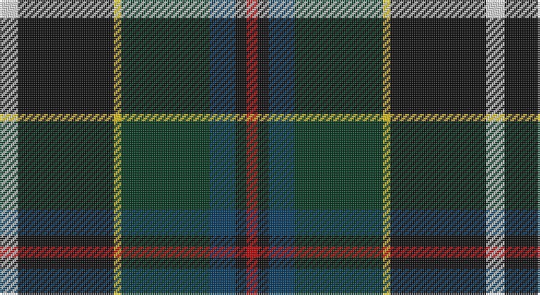

This page is one **sett** — a single exact thread-count. It belongs to the [tartan](/setts/w5k26ly2dg24dt7k3r3/)
(the same proportion at any scale), whose colour order is pattern [RKBGYKW](/stripes/rkbgykw/).

Part of the [Cornish Hunting](/tartans/cornish-hunting/) tartan — the named design grouping this sett with its other cloths.

Sourced from house-of-tartan.  It is a [7 stripe tartan](/stripes/stripes7/).

Original link http://www.house-of-tartan.scotland.net/house/TartanViewjs.asp?colr=Def&tnam=1568

## Provenance

Earliest known date: 1984 The Cornish Hunting tartan was first produced in 1984, and was marketed by the firm, Cornovi Creations, Cornwall. It is based on the Cornish National tartan designed by E.E. Morton-Nance, who regarded tartan as the heritage of all Celts, not Scots alone. (P Smith and G Teall, District Tartans, 1992) The hunting sett replaces the 'National' yellow with dark green and the azure with a darker shade of blue. Cornish Hunting is a registered design (No. 514267).

## Also known as

This cloth is also recorded under:

- Cornish Htg
- Cornish, hunting

## Thread count
LN/10 K52 Y4 DG48 DB14 K6 R/6

One full sett is **264 threads**.

## Palette

Palette: <strong>Tartan Register</strong>
<table><thead><tr><th>Colour</th><th>Threads</th><th>Shade</th><th>Base</th><th>OKLCh</th></tr></thead><tbody><tr><td>LN/</td><td style="text-align:right;font-variant-numeric:tabular-nums">10</td><td><code style="background-color:#E0E0E0;">#E0E0E0</code> <small style="color:#888">#E0E0E0</small></td><td>W <code style="background-color:#F7F7F7;">#F7F7F7</code></td><td><small style="color:#888">oklch(90.7% 0.000 89.9)</small></td></tr><tr><td>K</td><td style="text-align:right;font-variant-numeric:tabular-nums">52</td><td><code style="background-color:#101010;">#101010</code> <small style="color:#888">#101010</small></td><td>K <code style="background-color:#000000;">#000000</code></td><td><small style="color:#888">oklch(17.3% 0.000 89.9)</small></td></tr><tr><td>Y</td><td style="text-align:right;font-variant-numeric:tabular-nums">4</td><td><code style="background-color:#E8C000;">#E8C000</code> <small style="color:#888">#E8C000</small></td><td>Y <code style="background-color:#F2BF00;">#F2BF00</code></td><td><small style="color:#888">oklch(81.9% 0.168 93.7)</small></td></tr><tr><td>DG</td><td style="text-align:right;font-variant-numeric:tabular-nums">48</td><td><code style="background-color:#003820;">#003820</code> <small style="color:#888">#003820</small></td><td>G <code style="background-color:#006100;">#006100</code></td><td><small style="color:#888">oklch(30.0% 0.070 158.3)</small></td></tr><tr><td>DB</td><td style="text-align:right;font-variant-numeric:tabular-nums">14</td><td><code style="background-color:#003C64;">#003C64</code> <small style="color:#888">#003C64</small></td><td>B <code style="background-color:#2A418A;">#2A418A</code></td><td><small style="color:#888">oklch(34.5% 0.089 246.0)</small></td></tr><tr><td>K</td><td style="text-align:right;font-variant-numeric:tabular-nums">6</td><td><code style="background-color:#101010;">#101010</code> <small style="color:#888">#101010</small></td><td>K <code style="background-color:#000000;">#000000</code></td><td><small style="color:#888">oklch(17.3% 0.000 89.9)</small></td></tr><tr><td>R/</td><td style="text-align:right;font-variant-numeric:tabular-nums">6</td><td><code style="background-color:#C80000;">#C80000</code> <small style="color:#888">#C80000</small></td><td>R <code style="background-color:#CC0000;">#CC0000</code></td><td><small style="color:#888">oklch(52.3% 0.215 29.2)</small></td></tr></tbody></table>

# Sample pattern

## Compared to the master

This cloth is one sett of its design; the master sett (the exemplar the design is anchored on) is below for comparison.

<figure style="margin:0"><figcaption style="color:#888;font-size:smaller">this sett</figcaption></figure>
<figure style="margin:0"><figcaption style="color:#888;font-size:smaller"><a href="/setts/k26ly2dg24db8k4r3k4db8dg24ly2k26w5/">master sett →</a></figcaption></figure>

## Nearest tartans

The nearest existing variants by ΔTartan distance, with this tartan at the top so the swatches line up against it.

ΔTartan

Tartan

Sett

—

<a href="/ttd/edit/#slug=w5k26ly2dg24dt7k3r3~x2">Cornish Hunting District Tartan</a> <a class="nn-out" href="/variants/s7/w5k26ly2dg24dt7k3r3~x2/" title="open its dictionary page">↗</a>

0.78

<a href="/ttd/edit/#slug=r3w2dy10dg37k12db21w2~x2&amp;base=w5k26ly2dg24dt7k3r3~x2">Jones, The</a> <a class="nn-out" href="/variants/s7/r3w2dy10dg37k12db21w2~x2/" title="open its dictionary page">↗</a>

0.79

<a href="/ttd/edit/#slug=db3r2db18k6dg18ly2g3~x2&amp;base=w5k26ly2dg24dt7k3r3~x2">McComb</a> <a class="nn-out" href="/variants/s7/db3r2db18k6dg18ly2g3~x2/" title="open its dictionary page">↗</a>

0.81

<a href="/ttd/edit/#slug=r2k6ly1dg12ly1db6lr2~x4&amp;base=w5k26ly2dg24dt7k3r3~x2">James (Personal)</a> <a class="nn-out" href="/variants/s7/r2k6ly1dg12ly1db6lr2~x4/" title="open its dictionary page">↗</a>

0.88

<a href="/ttd/edit/#slug=w2r3db33k33g33k6ly2~x2&amp;base=w5k26ly2dg24dt7k3r3~x2">MacNeil - 1840 (Chief's sett)</a> <a class="nn-out" href="/variants/s7/w2r3db33k33g33k6ly2~x2/" title="open its dictionary page">↗</a>

0.90

<a href="/ttd/edit/#slug=b3k2r2k12g10ly1k1g2lb2~x4&amp;base=w5k26ly2dg24dt7k3r3~x2">Roderick Dhu</a> <a class="nn-out" href="/variants/s9/b3k2r2k12g10ly1k1g2lb2~x4/" title="open its dictionary page">↗</a>

0.94

<a href="/ttd/edit/#slug=r3g2db27k19g27dp2ly3~x2&amp;base=w5k26ly2dg24dt7k3r3~x2">Christian Hunting (Personal)</a> <a class="nn-out" href="/variants/s7/r3g2db27k19g27dp2ly3~x2/" title="open its dictionary page">↗</a>

0.94

<a href="/ttd/edit/#slug=db5k10db48k72w12dg48r5&amp;base=w5k26ly2dg24dt7k3r3~x2">Colquhoun (Clan)</a> <a class="nn-out" href="/variants/s7/db5k10db48k72w12dg48r5/" title="open its dictionary page">↗</a>

0.97

<a href="/ttd/edit/#slug=r5k12ly2dg25ly2db12t5~x2&amp;base=w5k26ly2dg24dt7k3r3~x2">James</a> <a class="nn-out" href="/variants/s7/r5k12ly2dg25ly2db12t5~x2/" title="open its dictionary page">↗</a>

1.01

<a href="/ttd/edit/#slug=r5t2k30n26ly2n2db4~x2&amp;base=w5k26ly2dg24dt7k3r3~x2">Milne-Murtaugh (Personal)</a> <a class="nn-out" href="/variants/s7/r5t2k30n26ly2n2db4~x2/" title="open its dictionary page">↗</a>

1.02

<a href="/ttd/edit/#slug=r3g3db4g17k13dt26w3~x2&amp;base=w5k26ly2dg24dt7k3r3~x2">Royal Burgh of Peebles (District)</a> <a class="nn-out" href="/variants/s7/r3g3db4g17k13dt26w3~x2/" title="open its dictionary page">↗</a>

## Neighbour map

Every grey dot is one of 14360 variants placed by the first two principal components of the ΔTartan feature space (44% of its variance). Red is this tartan; blue dots are its nearest — click one to open its page.

<svg viewBox="0 0 640 380" role="img" style="max-width:100%;height:auto;border:1px solid #e0e0e0;border-radius:4px;display:block" xmlns="http://www.w3.org/2000/svg"><image href="/nn/cloud.v1.png" width="640" height="380"/><a href="/variants/s7/r3w2dy10dg37k12db21w2~x2/"><circle cx="199.2" cy="154.6" r="4" fill="#3465a4"><title>Jones, The</title></circle></a><a href="/variants/s7/db3r2db18k6dg18ly2g3~x2/"><circle cx="177.1" cy="182.7" r="4" fill="#3465a4"><title>McComb</title></circle></a><a href="/variants/s7/r2k6ly1dg12ly1db6lr2~x4/"><circle cx="163.3" cy="170.6" r="4" fill="#3465a4"><title>James (Personal)</title></circle></a><a href="/variants/s7/w2r3db33k33g33k6ly2~x2/"><circle cx="182.3" cy="161.3" r="4" fill="#3465a4"><title>MacNeil - 1840 (Chief's sett)</title></circle></a><a href="/variants/s9/b3k2r2k12g10ly1k1g2lb2~x4/"><circle cx="187.0" cy="146.6" r="4" fill="#3465a4"><title>Roderick Dhu</title></circle></a><a href="/variants/s7/r3g2db27k19g27dp2ly3~x2/"><circle cx="174.9" cy="167.6" r="4" fill="#3465a4"><title>Christian Hunting (Personal)</title></circle></a><a href="/variants/s7/db5k10db48k72w12dg48r5/"><circle cx="207.4" cy="182.7" r="4" fill="#3465a4"><title>Colquhoun (Clan)</title></circle></a><a href="/variants/s7/r5k12ly2dg25ly2db12t5~x2/"><circle cx="143.2" cy="166.2" r="4" fill="#3465a4"><title>James</title></circle></a><a href="/variants/s7/r5t2k30n26ly2n2db4~x2/"><circle cx="235.0" cy="144.9" r="4" fill="#3465a4"><title>Milne-Murtaugh (Personal)</title></circle></a><a href="/variants/s7/r3g3db4g17k13dt26w3~x2/"><circle cx="155.6" cy="191.2" r="4" fill="#3465a4"><title>Royal Burgh of Peebles (District)</title></circle></a><circle cx="196.0" cy="164.1" r="5" fill="#c00000"/></svg>

ID: /variants/s7/w5k26ly2dg24dt7k3r3~x2/
