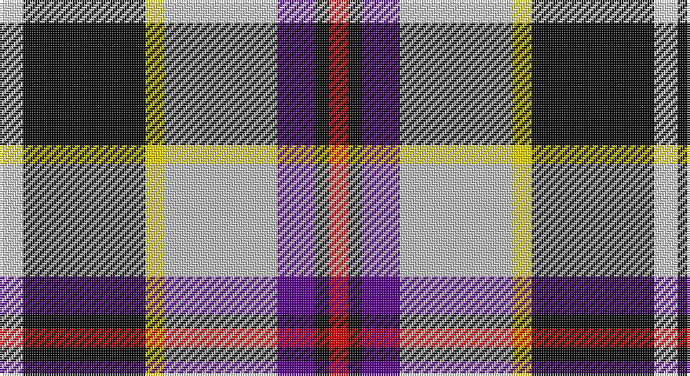

This page is one **sett** — a single exact thread-count. It belongs to the [tartan](/setts/w5k26ly4lb24dp8k3r4/)
(the same proportion at any scale), whose colour order is pattern [RKBWYKW](/stripes/rkbwykw/).

Sourced from register-of-tartans.  It is a [7 stripe tartan](/stripes/stripes7/).

Original link https://www.tartanregister.gov.uk/tartanDetails.aspx?ref=5942

## Register references

External register numbers recorded for this tartan.

- Scottish Register of Tartans: [5942](https://www.tartanregister.gov.uk/tartanDetails.aspx?ref=5942)
- Scottish Tartans World Register: 3145

## Thread count
LN/10 K52 Y8 N48 P16 K6 R/8

One full sett is **278 threads**.

## Palette

Palette: <strong>Tartan Register</strong> <small style="color:#888">(5 of 6 colours)</small>
<table><thead><tr><th>Colour</th><th>Threads</th><th>Shade</th><th>Base</th><th>OKLCh</th></tr></thead><tbody><tr><td>LN/</td><td style="text-align:right;font-variant-numeric:tabular-nums">10</td><td><code style="background-color:#E0E0E0;">#E0E0E0</code> <small style="color:#888">#E0E0E0</small></td><td>W <code style="background-color:#F7F7F7;">#F7F7F7</code></td><td><small style="color:#888">oklch(90.7% 0.000 89.9)</small></td></tr><tr><td>K</td><td style="text-align:right;font-variant-numeric:tabular-nums">52</td><td><code style="background-color:#101010;">#101010</code> <small style="color:#888">#101010</small></td><td>K <code style="background-color:#000000;">#000000</code></td><td><small style="color:#888">oklch(17.3% 0.000 89.9)</small></td></tr><tr><td>Y</td><td style="text-align:right;font-variant-numeric:tabular-nums">8</td><td><code style="background-color:#FADC00;">#FADC00</code> <small style="color:#888">#FADC00</small></td><td>Y <code style="background-color:#F2BF00;">#F2BF00</code></td><td><small style="color:#888">oklch(89.2% 0.185 99.2)</small></td></tr><tr><td>N</td><td style="text-align:right;font-variant-numeric:tabular-nums">48</td><td><code style="background-color:#C0C0C0;">#C0C0C0</code> <small style="color:#888">#C0C0C0</small></td><td>W <code style="background-color:#F7F7F7;">#F7F7F7</code></td><td><small style="color:#888">oklch(80.8% 0.000 89.9)</small></td></tr><tr><td>P</td><td style="text-align:right;font-variant-numeric:tabular-nums">16</td><td><code style="background-color:#5A008C;">#5A008C</code> <small style="color:#888">#5A008C</small></td><td>B <code style="background-color:#2A418A;">#2A418A</code></td><td><small style="color:#888">oklch(37.0% 0.191 306.3)</small></td></tr><tr><td>K</td><td style="text-align:right;font-variant-numeric:tabular-nums">6</td><td><code style="background-color:#101010;">#101010</code> <small style="color:#888">#101010</small></td><td>K <code style="background-color:#000000;">#000000</code></td><td><small style="color:#888">oklch(17.3% 0.000 89.9)</small></td></tr><tr><td>R/</td><td style="text-align:right;font-variant-numeric:tabular-nums">8</td><td><code style="background-color:#DC0000;">#DC0000</code> <small style="color:#888">#DC0000</small></td><td>R <code style="background-color:#CC0000;">#CC0000</code></td><td><small style="color:#888">oklch(56.2% 0.230 29.2)</small></td></tr></tbody></table>

# Sample pattern

## Nearest tartans

The nearest existing variants by ΔTartan distance, with this tartan at the top so the swatches line up against it.

ΔTartan

Tartan

Sett

—

<a href="/ttd/edit/#slug=w5k26ly4lb24dp8k3r4~x2">Pengelly, The Cornish</a> <a class="nn-out" href="/variants/s7/w5k26ly4lb24dp8k3r4~x2/" title="open its dictionary page">↗</a>

0.78

<a href="/ttd/edit/#slug=dt36lo5ri12r9dp5w12lo7~x2&amp;base=w5k26ly4lb24dp8k3r4~x2">Galvez-Brown (Personal)</a> <a class="nn-out" href="/variants/s7/dt36lo5ri12r9dp5w12lo7~x2/" title="open its dictionary page">↗</a>

0.91

<a href="/ttd/edit/#slug=r4o2b15ly2k14w14k2w4~x2&amp;base=w5k26ly4lb24dp8k3r4~x2">Culloden, Stirling</a> <a class="nn-out" href="/variants/s8/r4o2b15ly2k14w14k2w4~x2/" title="open its dictionary page">↗</a>

0.95

<a href="/ttd/edit/#slug=lb5k26ly4lb24dp8k3r4~x2&amp;base=w5k26ly4lb24dp8k3r4~x2">Pengelly, The Cornish (Name)</a> <a class="nn-out" href="/variants/s7/lb5k26ly4lb24dp8k3r4~x2/" title="open its dictionary page">↗</a>

1.00

<a href="/ttd/edit/#slug=lb4ly2lb21k11w2n21r2~x2&amp;base=w5k26ly4lb24dp8k3r4~x2">Barbour -Modern</a> <a class="nn-out" href="/variants/s7/lb4ly2lb21k11w2n21r2~x2/" title="open its dictionary page">↗</a>

1.05

<a href="/ttd/edit/#slug=r17k5w4k6ly5db31k5g6w3~x2&amp;base=w5k26ly4lb24dp8k3r4~x2">Dean/Dundas (Personal)</a> <a class="nn-out" href="/variants/s9/r17k5w4k6ly5db31k5g6w3~x2/" title="open its dictionary page">↗</a>

1.07

<a href="/ttd/edit/#slug=r5w2db20ly2k16w18k2w5~x2&amp;base=w5k26ly4lb24dp8k3r4~x2">Ailsa, Craig</a> <a class="nn-out" href="/variants/s8/r5w2db20ly2k16w18k2w5~x2/" title="open its dictionary page">↗</a>

1.10

<a href="/ttd/edit/#slug=lg2r20g2dt15k2lg19lb2~x2&amp;base=w5k26ly4lb24dp8k3r4~x2">Wallace Memorial Centenary</a> <a class="nn-out" href="/variants/s7/lg2r20g2dt15k2lg19lb2~x2/" title="open its dictionary page">↗</a>

1.13

<a href="/ttd/edit/#slug=r4ly3w12k16g5db20k4w2~x2&amp;base=w5k26ly4lb24dp8k3r4~x2">Iowa Dress (District)</a> <a class="nn-out" href="/variants/s8/r4ly3w12k16g5db20k4w2~x2/" title="open its dictionary page">↗</a>

1.14

<a href="/ttd/edit/#slug=db36ly5r12ri9dp5w12ly7~x2&amp;base=w5k26ly4lb24dp8k3r4~x2">Galvez-Brown</a> <a class="nn-out" href="/variants/s7/db36ly5r12ri9dp5w12ly7~x2/" title="open its dictionary page">↗</a>

1.15

<a href="/ttd/edit/#slug=r3w2db27k19w27dp2ly3~x2&amp;base=w5k26ly4lb24dp8k3r4~x2">Christian Dress (Personal)</a> <a class="nn-out" href="/variants/s7/r3w2db27k19w27dp2ly3~x2/" title="open its dictionary page">↗</a>

## Neighbour map

Every grey dot is one of 14360 variants placed by the first two principal components of the ΔTartan feature space (44% of its variance). Red is this tartan; blue dots are its nearest — click one to open its page.

<svg viewBox="0 0 640 380" role="img" style="max-width:100%;height:auto;border:1px solid #e0e0e0;border-radius:4px;display:block" xmlns="http://www.w3.org/2000/svg"><image href="/nn/cloud.v1.png" width="640" height="380"/><a href="/variants/s7/dt36lo5ri12r9dp5w12lo7~x2/"><circle cx="119.6" cy="164.5" r="4" fill="#3465a4"><title>Galvez-Brown (Personal)</title></circle></a><a href="/variants/s8/r4o2b15ly2k14w14k2w4~x2/"><circle cx="61.4" cy="149.4" r="4" fill="#3465a4"><title>Culloden, Stirling</title></circle></a><a href="/variants/s7/lb5k26ly4lb24dp8k3r4~x2/"><circle cx="151.8" cy="163.3" r="4" fill="#3465a4"><title>Pengelly, The Cornish (Name)</title></circle></a><a href="/variants/s7/lb4ly2lb21k11w2n21r2~x2/"><circle cx="148.0" cy="144.2" r="4" fill="#3465a4"><title>Barbour -Modern</title></circle></a><a href="/variants/s9/r17k5w4k6ly5db31k5g6w3~x2/"><circle cx="122.0" cy="132.9" r="4" fill="#3465a4"><title>Dean/Dundas (Personal)</title></circle></a><a href="/variants/s8/r5w2db20ly2k16w18k2w5~x2/"><circle cx="116.3" cy="155.2" r="4" fill="#3465a4"><title>Ailsa, Craig</title></circle></a><a href="/variants/s7/lg2r20g2dt15k2lg19lb2~x2/"><circle cx="138.5" cy="153.6" r="4" fill="#3465a4"><title>Wallace Memorial Centenary</title></circle></a><a href="/variants/s8/r4ly3w12k16g5db20k4w2~x2/"><circle cx="68.3" cy="150.0" r="4" fill="#3465a4"><title>Iowa Dress (District)</title></circle></a><a href="/variants/s7/db36ly5r12ri9dp5w12ly7~x2/"><circle cx="110.5" cy="151.7" r="4" fill="#3465a4"><title>Galvez-Brown</title></circle></a><a href="/variants/s7/r3w2db27k19w27dp2ly3~x2/"><circle cx="118.8" cy="125.1" r="4" fill="#3465a4"><title>Christian Dress (Personal)</title></circle></a><circle cx="117.9" cy="147.7" r="5" fill="#c00000"/></svg>

ID: /variants/s7/w5k26ly4lb24dp8k3r4~x2/
