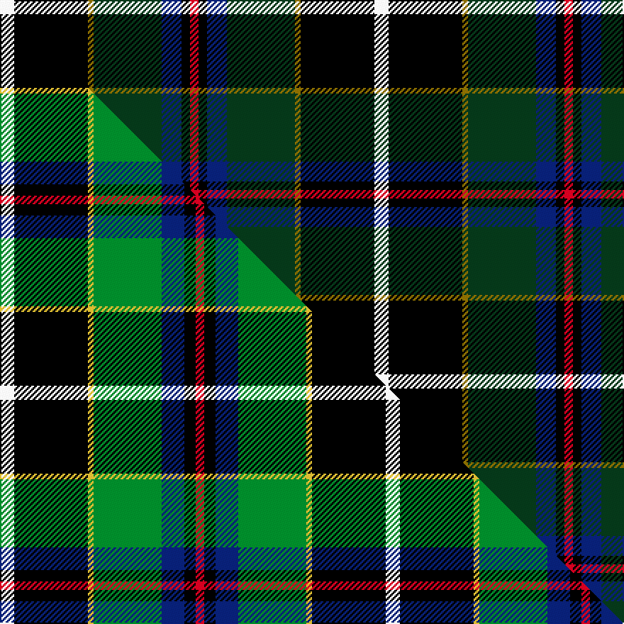

This is one **variant** — a specific cloth: this exact thread count and colourway, with its own
provenance below. It is one weaving of the [sett](/tartans/c/co/cornish-hunting-2/) (the scale-free proportion — the
same cloth at any scale or shade), whose colour order is pattern [RKBGGKW](/stripes/rkbggkw/).

Part of the [Cornish Hunting](/tartans/c/co/cornish-hunting-2/) tartan — the named design grouping this sett with its other cloths.

Sourced from house-of-tartan.  It is a [7 stripe tartan](/stripes/stripes7/).

Original link [http://www.house-of-tartan.scotland.net/house/TartanViewjs.asp?colr=Def&tnam=1568](http://www.house-of-tartan.scotland.net/house/TartanViewjs.asp?colr=Def&tnam=1568)

## Provenance

Earliest known date: 1984 The Cornish Hunting tartan was first produced in 1984, and was marketed by the firm, Cornovi Creations, Cornwall. It is based on the Cornish National tartan designed by E.E. Morton-Nance, who regarded tartan as the heritage of all Celts, not Scots alone. (P Smith and G Teall, District Tartans, 1992) The hunting sett replaces the 'National' yellow with dark green and the azure with a darker shade of blue. Cornish Hunting is a registered design (No. 514267).

Dataset <small>— provenance for this record, inherited from the source manifest</small>

<dl class="dataset-prov">
<dt>source</dt><dd><a href="/sources/house-of-tartan/">House of Tartan</a></dd>
<dt>data captured from</dt><dd><a href="https://github.com/thetartan/tartan-database/blob/master/data/house-of-tartan/data.csv">https://github.com/thetartan/tartan-database/blob/master/data/house-of-tartan/data.csv</a></dd>
<dt>data date</dt><dd>1984 <small>(this record)</small></dd>
<dt>licence</dt><dd><a href="https://creativecommons.org/licenses/by-nc-nd/4.0/">CC BY-NC-ND 4.0</a></dd>
</dl>

Capture chain <small>— the hands this data passed through, oldest first; each capture carries its own licence</small>

<ol class="capture-chain">
<li><a href="http://www.house-of-tartan.scotland.net/">House of Tartan</a> <small>the weaver/retailer's database — the site is now offline; the URL is kept as the ultimate source's identity</small></li>
<li><a href="https://github.com/thetartan/tartan-database">thetartan/tartan-database</a> <small>2016-2017</small> · <a href="https://creativecommons.org/licenses/by-nc-nd/4.0/">CC BY-NC-ND 4.0</a> <small>Levko Kravets's frozen compilation — the capture we vendored, and where its CC licence text came from</small></li>
<li>this dictionary <small>captured 2026-06-10 · commit 5bf86c7566</small> <small>each re-capture is a git commit to data/sources</small></li>
</ol>

## Thread count
W/10 K52 Y4 DG48 DB14 K6 R/6

One full sett is **264 threads**.

## Palette
<table><thead><tr><th>Colour</th><th>Shade</th><th>OKLCh</th></tr></thead><tbody><tr><td>DB</td><td><code style="background-color:#082077;">#082077</code> <small style="color:#888">#082077</small></td><td><small style="color:#888">oklch(30.0% 0.149 265.1)</small></td></tr><tr><td>DG</td><td><code style="background-color:#053819;">#053819</code> <small style="color:#888">#053819</small></td><td><small style="color:#888">oklch(30.0% 0.075 151.3)</small></td></tr><tr><td>K</td><td><code style="background-color:#000000;">#000000</code> <small style="color:#888">#000000</small></td><td><small style="color:#888">oklch(0.0% 0.000 0.0)</small></td></tr><tr><td>W</td><td><code style="background-color:#F7F7F7;">#F7F7F7</code> <small style="color:#888">#F7F7F7</small></td><td><small style="color:#888">oklch(97.6% 0.000 89.9)</small></td></tr><tr><td>R</td><td><code style="background-color:#D60020;">#D60020</code> <small style="color:#888">#D60020</small></td><td><small style="color:#888">oklch(55.2% 0.224 25.5)</small></td></tr><tr><td>Y</td><td><code style="background-color:#8B6E00;">#8B6E00</code> <small style="color:#888">#8B6E00</small></td><td><small style="color:#888">oklch(55.1% 0.113 90.4)</small></td></tr></tbody></table>

# Sample pattern

## Compared to the master

This cloth is one sett of its design; the master sett (the exemplar the design is anchored on) is below for comparison.

Its **ΔTartan distance** from the master is **0.21** — the same measure the nearest-tartans table ranks by (0 is identical; a re-scale of the same cloth is near 0, a recolour or a different proportion further).

<figure class="master-compare" style="margin:0">

this sett
master sett ★

<figcaption style="color:#888;font-size:smaller">One weave of this sett against the <a href="/setts/w5k26ly2g24db8k4r3/">master sett ★</a>, split on the diagonal: a shared proportion runs seamlessly across it with only the shades shifting; a different proportion breaks on it.</figcaption>
</figure>

## Nearest tartan variants

The nearest existing variants by ΔTartan distance, with this cloth at the top so the swatches line up against it.

ΔTartan

Threads

Variant

Sett

—

264

<a href="/variants/s7/w5k26y2dg24db7k3r3~x2/">Cornish Hunting District Tartan</a>

<a href="/ttd/edit/#slug=w5k26y2dg24ki7k3r3~x2~ki1410264&amp;base=w5k26y2dg24db7k3r3~x2" title="compare in the TTD">0.04</a>

264

<a href="/variants/s7/w5k26y2dg24ki7k3r3~x2~ki1410264/">Cornish, hunting</a>

<a href="/ttd/edit/#slug=w5k26ly2g24db8k4r3~x2&amp;base=w5k26y2dg24db7k3r3~x2" title="compare in the TTD">0.21</a>

272

<a href="/variants/s7/w5k26ly2g24db8k4r3~x2/">Cornish Htg (District)</a>

<a href="/ttd/edit/#slug=b8k11w3k11dg22dr2~x2&amp;base=w5k26y2dg24db7k3r3~x2" title="compare in the TTD">1.42</a>

208

<a href="/variants/s6/b8k11w3k11dg22dr2~x2/">Loch Katrine</a>

<a href="/ttd/edit/#slug=y4k1dg16k16r1w3~x2&amp;base=w5k26y2dg24db7k3r3~x2" title="compare in the TTD">1.54</a>

150

<a href="/variants/s6/y4k1dg16k16r1w3~x2/">MacLamroc</a>

<a href="/ttd/edit/#slug=o11k66n32dg11n10db6n10r4~o6414063-r5921033&amp;base=w5k26y2dg24db7k3r3~x2" title="compare in the TTD">1.64</a>

285

<a href="/variants/s8/o11k66n32dg11n10db6n10r4~o6414063-r5921033/">Turnbull, Dress Bruce (Personal)</a>

<a href="/ttd/edit/#slug=k2w1k12g5db11r1~x2&amp;base=w5k26y2dg24db7k3r3~x2" title="compare in the TTD">1.76</a>

122

<a href="/variants/s6/k2w1k12g5db11r1~x2/">New England (Fashion)</a>

<a href="/ttd/edit/#slug=lo11k66n32dg11n10db6n10o4&amp;base=w5k26y2dg24db7k3r3~x2" title="compare in the TTD">1.81</a>

285

<a href="/variants/s8/lo11k66n32dg11n10db6n10o4/">Royal College of General Practitioners</a>

<a href="/ttd/edit/#slug=w2k11y11db3k1r1~x2&amp;base=w5k26y2dg24db7k3r3~x2" title="compare in the TTD">1.84</a>

110

<a href="/variants/s6/w2k11y11db3k1r1~x2/">Cornish National #2</a>

<a href="/ttd/edit/#slug=k6r4k19g4db25r5g3y2~x2&amp;base=w5k26y2dg24db7k3r3~x2" title="compare in the TTD">1.89</a>

256

<a href="/variants/s8/k6r4k19g4db25r5g3y2~x2/">Bootneck 350</a>

<a href="/ttd/edit/#slug=w5k26dy26lb7k3r3~x2&amp;base=w5k26y2dg24db7k3r3~x2" title="compare in the TTD">1.89</a>

264

<a href="/variants/s6/w5k26dy26lb7k3r3~x2/">Cornish National District Tartan</a>

## Neighbour map

Every grey dot is one of 13662 variants placed by the first two principal components of the ΔTartan feature space (42% of its variance). Red is this tartan; blue dots are its nearest — click one to open its page. The map is a flat projection of a many-dimensional space — [how to read it](/posts/neighbourhood-maps/).

<svg viewBox="0 0 640 380" role="img" style="max-width:100%;height:auto;border:1px solid #e0e0e0;border-radius:4px;display:block" xmlns="http://www.w3.org/2000/svg"><image href="/nn/cloud.v1.png" width="640" height="380"/><a href="/variants/s7/w5k26y2dg24ki7k3r3~x2~ki1410264/"><circle cx="150.6" cy="135.7" r="4" fill="#3465a4"><title>Cornish, hunting</title></circle></a><a href="/variants/s7/w5k26ly2g24db8k4r3~x2/"><circle cx="133.0" cy="139.3" r="4" fill="#3465a4"><title>Cornish Htg (District)</title></circle></a><a href="/variants/s6/b8k11w3k11dg22dr2~x2/"><circle cx="153.3" cy="192.2" r="4" fill="#3465a4"><title>Loch Katrine</title></circle></a><a href="/variants/s6/y4k1dg16k16r1w3~x2/"><circle cx="189.3" cy="150.3" r="4" fill="#3465a4"><title>MacLamroc</title></circle></a><a href="/variants/s8/o11k66n32dg11n10db6n10r4~o6414063-r5921033/"><circle cx="182.4" cy="117.0" r="4" fill="#3465a4"><title>Turnbull, Dress Bruce (Personal)</title></circle></a><a href="/variants/s6/k2w1k12g5db11r1~x2/"><circle cx="181.1" cy="168.7" r="4" fill="#3465a4"><title>New England (Fashion)</title></circle></a><a href="/variants/s8/lo11k66n32dg11n10db6n10o4/"><circle cx="184.3" cy="120.4" r="4" fill="#3465a4"><title>Royal College of General Practitioners</title></circle></a><a href="/variants/s6/w2k11y11db3k1r1~x2/"><circle cx="163.2" cy="162.1" r="4" fill="#3465a4"><title>Cornish National #2</title></circle></a><a href="/variants/s8/k6r4k19g4db25r5g3y2~x2/"><circle cx="155.1" cy="149.5" r="4" fill="#3465a4"><title>Bootneck 350</title></circle></a><a href="/variants/s6/w5k26dy26lb7k3r3~x2/"><circle cx="154.1" cy="173.4" r="4" fill="#3465a4"><title>Cornish National District Tartan</title></circle></a><circle cx="154.3" cy="138.7" r="5" fill="#c00000"/><text x="320" y="376" text-anchor="middle" font-size="11" fill="#999">ground</text><text x="11" y="190" text-anchor="middle" font-size="11" fill="#999" transform="rotate(-90 11 190)">complexity</text></svg>

ID: /variants/s7/w5k26y2dg24db7k3r3~x2/
