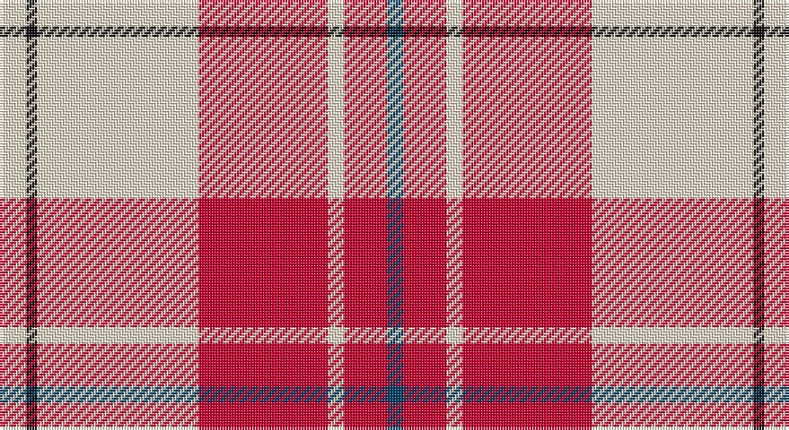

This page is one **sett** — a single exact thread-count. It belongs to the [tartan](/setts/w5k2w30r24w3r8dt3/)
(the same proportion at any scale), whose colour order is pattern [BRWRWKW](/stripes/brwrwkw/).

Sourced from tartans-authority.  It is a [7 stripe tartan](/stripes/stripes7/).

Original link http://www.tartansauthority.com/tartan-ferret/display/7572/

## Also known as

This cloth is also recorded under:

- Arduaine Red
- Arduaine, Red

2 attestations — the source records this cloth was collapsed from (oldest owns this page)

<ul>
<li>March 2008 — Arduaine, Red (Dance) (tartans-authority, <a href="http://www.tartansauthority.com/tartan-ferret/display/7572/">record</a>)</li>
<li>undated — Arduaine Red (register-of-tartans, <a href="https://www.tartanregister.gov.uk/tartanDetails.aspx?ref=5596">record</a>)</li>
</ul>

## Register references

External register numbers recorded for this tartan.

- Scottish Register of Tartans: [5596](https://www.tartanregister.gov.uk/tartanDetails.aspx?ref=5596)
- Scottish Tartans Authority (ITI): 7572

## Thread count
W/10 K4 W60 R48 W6 R16 DB/6

One full sett is **284 threads**.

## Palette

Palette: <strong>Tartan Register</strong>
<table><thead><tr><th>Colour</th><th>Threads</th><th>Shade</th><th>Base</th><th>OKLCh</th></tr></thead><tbody><tr><td>W/</td><td style="text-align:right;font-variant-numeric:tabular-nums">10</td><td><code style="background-color:#F0E0C8;">#F0E0C8</code> <small style="color:#888">#F0E0C8</small></td><td>W <code style="background-color:#F7F7F7;">#F7F7F7</code></td><td><small style="color:#888">oklch(91.3% 0.036 78.1)</small></td></tr><tr><td>K</td><td style="text-align:right;font-variant-numeric:tabular-nums">4</td><td><code style="background-color:#101010;">#101010</code> <small style="color:#888">#101010</small></td><td>K <code style="background-color:#000000;">#000000</code></td><td><small style="color:#888">oklch(17.3% 0.000 89.9)</small></td></tr><tr><td>W</td><td style="text-align:right;font-variant-numeric:tabular-nums">60</td><td><code style="background-color:#F0E0C8;">#F0E0C8</code> <small style="color:#888">#F0E0C8</small></td><td>W <code style="background-color:#F7F7F7;">#F7F7F7</code></td><td><small style="color:#888">oklch(91.3% 0.036 78.1)</small></td></tr><tr><td>R</td><td style="text-align:right;font-variant-numeric:tabular-nums">48</td><td><code style="background-color:#C8002C;">#C8002C</code> <small style="color:#888">#C8002C</small></td><td>R <code style="background-color:#CC0000;">#CC0000</code></td><td><small style="color:#888">oklch(52.6% 0.212 22.0)</small></td></tr><tr><td>W</td><td style="text-align:right;font-variant-numeric:tabular-nums">6</td><td><code style="background-color:#F0E0C8;">#F0E0C8</code> <small style="color:#888">#F0E0C8</small></td><td>W <code style="background-color:#F7F7F7;">#F7F7F7</code></td><td><small style="color:#888">oklch(91.3% 0.036 78.1)</small></td></tr><tr><td>R</td><td style="text-align:right;font-variant-numeric:tabular-nums">16</td><td><code style="background-color:#C8002C;">#C8002C</code> <small style="color:#888">#C8002C</small></td><td>R <code style="background-color:#CC0000;">#CC0000</code></td><td><small style="color:#888">oklch(52.6% 0.212 22.0)</small></td></tr><tr><td>DB/</td><td style="text-align:right;font-variant-numeric:tabular-nums">6</td><td><code style="background-color:#003C64;">#003C64</code> <small style="color:#888">#003C64</small></td><td>B <code style="background-color:#2A418A;">#2A418A</code></td><td><small style="color:#888">oklch(34.5% 0.089 246.0)</small></td></tr></tbody></table>

# Sample pattern

## Nearest tartans

The nearest existing variants by ΔTartan distance, with this tartan at the top so the swatches line up against it.

ΔTartan

Tartan

Sett

—

<a href="/ttd/edit/#slug=w5k2w30r24w3r8dt3~x2">Arduaine, Red (Dance)</a> <a class="nn-out" href="/variants/s7/w5k2w30r24w3r8dt3~x2/" title="open its dictionary page">↗</a>

0.70

<a href="/ttd/edit/#slug=w4ri2w25r21w3r8ly3~x2&amp;base=w5k2w30r24w3r8dt3~x2">MacPherson Dress Red</a> <a class="nn-out" href="/variants/s7/w4ri2w25r21w3r8ly3~x2/" title="open its dictionary page">↗</a>

0.76

<a href="/ttd/edit/#slug=w5r2w34r34k2r2db4~x2&amp;base=w5k2w30r24w3r8dt3~x2">Cunningham Dress</a> <a class="nn-out" href="/variants/s7/w5r2w34r34k2r2db4~x2/" title="open its dictionary page">↗</a>

0.84

<a href="/ttd/edit/#slug=ri3r2db2r30w30db2w3~x2&amp;base=w5k2w30r24w3r8dt3~x2">Torridon, Cherry (Dance)</a> <a class="nn-out" href="/variants/s7/ri3r2db2r30w30db2w3~x2/" title="open its dictionary page">↗</a>

0.85

<a href="/ttd/edit/#slug=w4k2w25r21w3r8ly3~x2&amp;base=w5k2w30r24w3r8dt3~x2">MacPherson Dress Burgundy (Dance)</a> <a class="nn-out" href="/variants/s7/w4k2w25r21w3r8ly3~x2/" title="open its dictionary page">↗</a>

0.89

<a href="/ttd/edit/#slug=r8dp2r24dp5w25dy2w8~x2&amp;base=w5k2w30r24w3r8dt3~x2">MacGiboney (Personal)</a> <a class="nn-out" href="/variants/s7/r8dp2r24dp5w25dy2w8~x2/" title="open its dictionary page">↗</a>

0.90

<a href="/ttd/edit/#slug=r8m2r24m5w25dy2w8~x2&amp;base=w5k2w30r24w3r8dt3~x2">Lennox Dress District Tartan</a> <a class="nn-out" href="/variants/s7/r8m2r24m5w25dy2w8~x2/" title="open its dictionary page">↗</a>

0.91

<a href="/ttd/edit/#slug=r8p2r24p5w25o2w8~x2&amp;base=w5k2w30r24w3r8dt3~x2">Lennox, dress</a> <a class="nn-out" href="/variants/s7/r8p2r24p5w25o2w8~x2/" title="open its dictionary page">↗</a>

0.92

<a href="/ttd/edit/#slug=w5p3w26r20w3r8ly3~x2&amp;base=w5k2w30r24w3r8dt3~x2">MacPherson, Red</a> <a class="nn-out" href="/variants/s7/w5p3w26r20w3r8ly3~x2/" title="open its dictionary page">↗</a>

0.93

<a href="/ttd/edit/#slug=w5dp3w26r20w3r8ly3~x2&amp;base=w5k2w30r24w3r8dt3~x2">MacPherson Dress Red (Dance)</a> <a class="nn-out" href="/variants/s7/w5dp3w26r20w3r8ly3~x2/" title="open its dictionary page">↗</a>

1.06

<a href="/ttd/edit/#slug=w3lg2w30r30n2r2lg3~x2&amp;base=w5k2w30r24w3r8dt3~x2">Torridon, Burgundy (Dance)</a> <a class="nn-out" href="/variants/s7/w3lg2w30r30n2r2lg3~x2/" title="open its dictionary page">↗</a>

## Neighbour map

Every grey dot is one of 14360 variants placed by the first two principal components of the ΔTartan feature space (44% of its variance). Red is this tartan; blue dots are its nearest — click one to open its page.

<svg viewBox="0 0 640 380" role="img" style="max-width:100%;height:auto;border:1px solid #e0e0e0;border-radius:4px;display:block" xmlns="http://www.w3.org/2000/svg"><image href="/nn/cloud.v1.png" width="640" height="380"/><a href="/variants/s7/w4ri2w25r21w3r8ly3~x2/"><circle cx="287.8" cy="154.9" r="4" fill="#3465a4"><title>MacPherson Dress Red</title></circle></a><a href="/variants/s7/w5r2w34r34k2r2db4~x2/"><circle cx="286.1" cy="118.3" r="4" fill="#3465a4"><title>Cunningham Dress</title></circle></a><a href="/variants/s7/ri3r2db2r30w30db2w3~x2/"><circle cx="283.3" cy="126.8" r="4" fill="#3465a4"><title>Torridon, Cherry (Dance)</title></circle></a><a href="/variants/s7/w4k2w25r21w3r8ly3~x2/"><circle cx="263.6" cy="153.4" r="4" fill="#3465a4"><title>MacPherson Dress Burgundy (Dance)</title></circle></a><a href="/variants/s7/r8dp2r24dp5w25dy2w8~x2/"><circle cx="247.0" cy="157.2" r="4" fill="#3465a4"><title>MacGiboney (Personal)</title></circle></a><a href="/variants/s7/r8m2r24m5w25dy2w8~x2/"><circle cx="252.3" cy="159.5" r="4" fill="#3465a4"><title>Lennox Dress District Tartan</title></circle></a><a href="/variants/s7/r8p2r24p5w25o2w8~x2/"><circle cx="248.5" cy="159.2" r="4" fill="#3465a4"><title>Lennox, dress</title></circle></a><a href="/variants/s7/w5p3w26r20w3r8ly3~x2/"><circle cx="263.8" cy="169.4" r="4" fill="#3465a4"><title>MacPherson, Red</title></circle></a><a href="/variants/s7/w5dp3w26r20w3r8ly3~x2/"><circle cx="265.3" cy="169.5" r="4" fill="#3465a4"><title>MacPherson Dress Red (Dance)</title></circle></a><a href="/variants/s7/w3lg2w30r30n2r2lg3~x2/"><circle cx="274.9" cy="129.1" r="4" fill="#3465a4"><title>Torridon, Burgundy (Dance)</title></circle></a><circle cx="295.3" cy="141.5" r="5" fill="#c00000"/></svg>

ID: /variants/s7/w5k2w30r24w3r8dt3~x2/
