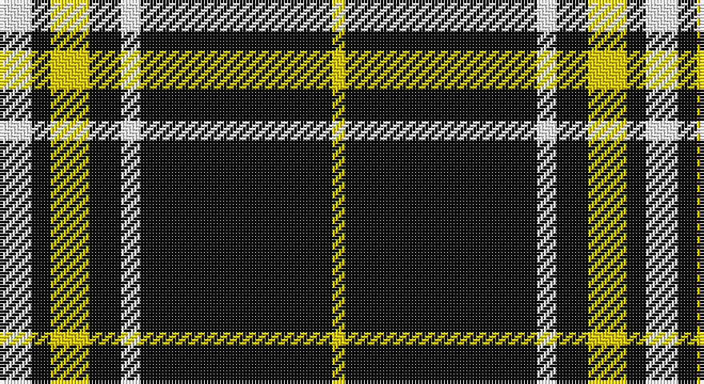

This page is one **sett** — a single exact thread-count. It belongs to the [tartan](/setts/w5k3ly6k5w3k30ly2/)
(the same proportion at any scale), whose colour order is pattern [WKYKWKY](/stripes/wkykwky/).

Sourced from register-of-tartans.  It is a [7 stripe tartan](/stripes/stripes7/).

Original link https://www.tartanregister.gov.uk/tartanDetails.aspx?ref=11610

## Register references

External register numbers recorded for this tartan.

- Scottish Register of Tartans: [11610](https://www.tartanregister.gov.uk/tartanDetails.aspx?ref=11610)

## Thread count
W/10 K6 Y12 K10 W6 K60 Y/4

One full sett is **202 threads**.

## Palette

Palette: <strong>Tartan Register</strong>
<table><thead><tr><th>Colour</th><th>Threads</th><th>Shade</th><th>Base</th><th>OKLCh</th></tr></thead><tbody><tr><td>W/</td><td style="text-align:right;font-variant-numeric:tabular-nums">10</td><td><code style="background-color:#FFFFFF;">#FFFFFF</code> <small style="color:#888">#FFFFFF</small></td><td>W <code style="background-color:#F7F7F7;">#F7F7F7</code></td><td><small style="color:#888">oklch(100.0% 0.000 89.9)</small></td></tr><tr><td>K</td><td style="text-align:right;font-variant-numeric:tabular-nums">6</td><td><code style="background-color:#101010;">#101010</code> <small style="color:#888">#101010</small></td><td>K <code style="background-color:#000000;">#000000</code></td><td><small style="color:#888">oklch(17.3% 0.000 89.9)</small></td></tr><tr><td>Y</td><td style="text-align:right;font-variant-numeric:tabular-nums">12</td><td><code style="background-color:#FCCC00;">#FCCC00</code> <small style="color:#888">#FCCC00</small></td><td>Y <code style="background-color:#F2BF00;">#F2BF00</code></td><td><small style="color:#888">oklch(86.2% 0.176 91.5)</small></td></tr><tr><td>K</td><td style="text-align:right;font-variant-numeric:tabular-nums">10</td><td><code style="background-color:#101010;">#101010</code> <small style="color:#888">#101010</small></td><td>K <code style="background-color:#000000;">#000000</code></td><td><small style="color:#888">oklch(17.3% 0.000 89.9)</small></td></tr><tr><td>W</td><td style="text-align:right;font-variant-numeric:tabular-nums">6</td><td><code style="background-color:#FFFFFF;">#FFFFFF</code> <small style="color:#888">#FFFFFF</small></td><td>W <code style="background-color:#F7F7F7;">#F7F7F7</code></td><td><small style="color:#888">oklch(100.0% 0.000 89.9)</small></td></tr><tr><td>K</td><td style="text-align:right;font-variant-numeric:tabular-nums">60</td><td><code style="background-color:#101010;">#101010</code> <small style="color:#888">#101010</small></td><td>K <code style="background-color:#000000;">#000000</code></td><td><small style="color:#888">oklch(17.3% 0.000 89.9)</small></td></tr><tr><td>Y/</td><td style="text-align:right;font-variant-numeric:tabular-nums">4</td><td><code style="background-color:#FCCC00;">#FCCC00</code> <small style="color:#888">#FCCC00</small></td><td>Y <code style="background-color:#F2BF00;">#F2BF00</code></td><td><small style="color:#888">oklch(86.2% 0.176 91.5)</small></td></tr></tbody></table>

# Sample pattern

## Nearest tartans

The nearest existing variants by ΔTartan distance, with this tartan at the top so the swatches line up against it.

ΔTartan

Tartan

Sett

—

<a href="/ttd/edit/#slug=w5k3ly6k5w3k30ly2~x2">Northern Kentucky University</a> <a class="nn-out" href="/variants/s7/w5k3ly6k5w3k30ly2~x2/" title="open its dictionary page">↗</a>

0.99

<a href="/ttd/edit/#slug=k2lb5k1lb1k10r1k1~x4&amp;base=w5k3ly6k5w3k30ly2~x2">Lundy Reform</a> <a class="nn-out" href="/variants/s7/k2lb5k1lb1k10r1k1~x4/" title="open its dictionary page">↗</a>

1.15

<a href="/ttd/edit/#slug=k37w9k3g9w3~x2&amp;base=w5k3ly6k5w3k30ly2~x2">Glen Coe #1 (Fashion)</a> <a class="nn-out" href="/variants/s5/k37w9k3g9w3~x2/" title="open its dictionary page">↗</a>

1.28

<a href="/ttd/edit/#slug=k1o2k7o11k18ly2k1~x2&amp;base=w5k3ly6k5w3k30ly2~x2">DDB Canada (Fashion)</a> <a class="nn-out" href="/variants/s7/k1o2k7o11k18ly2k1~x2/" title="open its dictionary page">↗</a>

1.30

<a href="/ttd/edit/#slug=k37w9k3dg9w3~x2&amp;base=w5k3ly6k5w3k30ly2~x2">Glen Coe Trade Tartan</a> <a class="nn-out" href="/variants/s5/k37w9k3dg9w3~x2/" title="open its dictionary page">↗</a>

1.32

<a href="/ttd/edit/#slug=ly9k4ly4k45r4~x2&amp;base=w5k3ly6k5w3k30ly2~x2">Gwynn (Name)</a> <a class="nn-out" href="/variants/s5/ly9k4ly4k45r4~x2/" title="open its dictionary page">↗</a>

1.32

<a href="/ttd/edit/#slug=r2k1r2k14w1k1w1~x8&amp;base=w5k3ly6k5w3k30ly2~x2">White Stripes Hunting</a> <a class="nn-out" href="/variants/s7/r2k1r2k14w1k1w1~x8/" title="open its dictionary page">↗</a>

1.34

<a href="/ttd/edit/#slug=t50k4t12k23lo4k4~x2&amp;base=w5k3ly6k5w3k30ly2~x2">Sligo Irish County Tartan</a> <a class="nn-out" href="/variants/s6/t50k4t12k23lo4k4~x2/" title="open its dictionary page">↗</a>

1.39

<a href="/ttd/edit/#slug=ly2k3w3k44ly4k22lb22w3k3ly2&amp;base=w5k3ly6k5w3k30ly2~x2">Ashers of Nairn</a> <a class="nn-out" href="/variants/s10/ly2k3w3k44ly4k22lb22w3k3ly2/" title="open its dictionary page">↗</a>

1.40

<a href="/ttd/edit/#slug=ly7k4ly4k39r4~x2&amp;base=w5k3ly6k5w3k30ly2~x2">Welsh National #3</a> <a class="nn-out" href="/variants/s5/ly7k4ly4k39r4~x2/" title="open its dictionary page">↗</a>

1.40

<a href="/ttd/edit/#slug=k27w2k2w2k2w2k2w2k4r5~x4&amp;base=w5k3ly6k5w3k30ly2~x2">Reiver Check</a> <a class="nn-out" href="/variants/s10/k27w2k2w2k2w2k2w2k4r5~x4/" title="open its dictionary page">↗</a>

## Neighbour map

Every grey dot is one of 14360 variants placed by the first two principal components of the ΔTartan feature space (44% of its variance). Red is this tartan; blue dots are its nearest — click one to open its page.

<svg viewBox="0 0 640 380" role="img" style="max-width:100%;height:auto;border:1px solid #e0e0e0;border-radius:4px;display:block" xmlns="http://www.w3.org/2000/svg"><image href="/nn/cloud.v1.png" width="640" height="380"/><a href="/variants/s7/k2lb5k1lb1k10r1k1~x4/"><circle cx="376.1" cy="196.2" r="4" fill="#3465a4"><title>Lundy Reform</title></circle></a><a href="/variants/s5/k37w9k3g9w3~x2/"><circle cx="363.1" cy="202.8" r="4" fill="#3465a4"><title>Glen Coe #1 (Fashion)</title></circle></a><a href="/variants/s7/k1o2k7o11k18ly2k1~x2/"><circle cx="394.7" cy="188.2" r="4" fill="#3465a4"><title>DDB Canada (Fashion)</title></circle></a><a href="/variants/s5/k37w9k3dg9w3~x2/"><circle cx="372.6" cy="208.0" r="4" fill="#3465a4"><title>Glen Coe Trade Tartan</title></circle></a><a href="/variants/s5/ly9k4ly4k45r4~x2/"><circle cx="452.2" cy="202.0" r="4" fill="#3465a4"><title>Gwynn (Name)</title></circle></a><a href="/variants/s7/r2k1r2k14w1k1w1~x8/"><circle cx="455.3" cy="167.9" r="4" fill="#3465a4"><title>White Stripes Hunting</title></circle></a><a href="/variants/s6/t50k4t12k23lo4k4~x2/"><circle cx="369.2" cy="198.3" r="4" fill="#3465a4"><title>Sligo Irish County Tartan</title></circle></a><a href="/variants/s10/ly2k3w3k44ly4k22lb22w3k3ly2/"><circle cx="371.4" cy="122.1" r="4" fill="#3465a4"><title>Ashers of Nairn</title></circle></a><a href="/variants/s5/ly7k4ly4k39r4~x2/"><circle cx="444.0" cy="208.1" r="4" fill="#3465a4"><title>Welsh National #3</title></circle></a><a href="/variants/s10/k27w2k2w2k2w2k2w2k4r5~x4/"><circle cx="452.0" cy="151.3" r="4" fill="#3465a4"><title>Reiver Check</title></circle></a><circle cx="404.3" cy="168.4" r="5" fill="#c00000"/></svg>

ID: /variants/s7/w5k3ly6k5w3k30ly2~x2/
