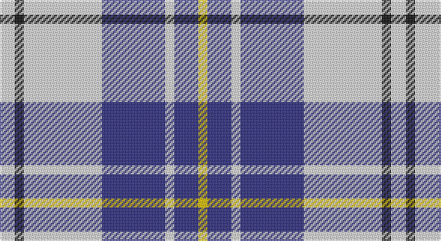

This page is one **sett** — a single exact thread-count. It belongs to the [tartan](/setts/w5k3w26db21w3db8ly3/)
(the same proportion at any scale), whose colour order is pattern [WKWBWBY](/stripes/wkwbwby/).

Part of the [MacPherson Dress](/tartans/macpherson-dress/) tartan — the named design grouping this sett with its other cloths.

Sourced from register-of-tartans.  It is a [7 stripe tartan](/stripes/stripes7/).

Original link https://www.tartanregister.gov.uk/tartanDetails.aspx?ref=2715

## Also known as

This cloth is also recorded under:

- MacPherson Dress Blue
- MacPherson Dress Blue #2
- MacPherson Dress Green
- MacPherson Dress Purple
- MacPherson Dress Red
- MacPherson Dress, Blue
- MacPherson Dress, Green
- MacPherson Dress, Purple
- MacPherson Dress, Red
- MacPherson Dress, Royal Blue
- MacPherson Red Dress
- MacPherson, Red
- MacPherson, dress
- MacPherson, dress green
- MacPherson, dress red

2 attestations — the source records this cloth was collapsed from (oldest owns this page)

<ul>
<li>01/01/1980 — MacPherson Dress Blue (Dance) (register-of-tartans, <a href="https://www.tartanregister.gov.uk/tartanDetails.aspx?ref=2715">record</a>)</li>
<li>1980 — MacPherson Dress, Royal Blue (Dance) (tartans-authority, <a href="http://www.tartansauthority.com/tartan-ferret/display/1868/">record</a>)</li>
</ul>

## Register references

External register numbers recorded for this tartan.

- Scottish Register of Tartans: [2715](https://www.tartanregister.gov.uk/tartanDetails.aspx?ref=2715)
- Scottish Tartans Authority (ITI): 1868
- Scottish Tartans World Register: 1868

## Thread count
LN/10 K6 LN52 DB42 LN6 DB16 Y/6

One full sett is **260 threads**.

## Palette

Palette: <strong>Tartan Register</strong>
<table><thead><tr><th>Colour</th><th>Threads</th><th>Shade</th><th>Base</th><th>OKLCh</th></tr></thead><tbody><tr><td>LN/</td><td style="text-align:right;font-variant-numeric:tabular-nums">10</td><td><code style="background-color:#E0E0E0;">#E0E0E0</code> <small style="color:#888">#E0E0E0</small></td><td>W <code style="background-color:#F7F7F7;">#F7F7F7</code></td><td><small style="color:#888">oklch(90.7% 0.000 89.9)</small></td></tr><tr><td>K</td><td style="text-align:right;font-variant-numeric:tabular-nums">6</td><td><code style="background-color:#101010;">#101010</code> <small style="color:#888">#101010</small></td><td>K <code style="background-color:#000000;">#000000</code></td><td><small style="color:#888">oklch(17.3% 0.000 89.9)</small></td></tr><tr><td>LN</td><td style="text-align:right;font-variant-numeric:tabular-nums">52</td><td><code style="background-color:#E0E0E0;">#E0E0E0</code> <small style="color:#888">#E0E0E0</small></td><td>W <code style="background-color:#F7F7F7;">#F7F7F7</code></td><td><small style="color:#888">oklch(90.7% 0.000 89.9)</small></td></tr><tr><td>DB</td><td style="text-align:right;font-variant-numeric:tabular-nums">42</td><td><code style="background-color:#2C2C80;">#2C2C80</code> <small style="color:#888">#2C2C80</small></td><td>B <code style="background-color:#2A418A;">#2A418A</code></td><td><small style="color:#888">oklch(35.0% 0.138 276.6)</small></td></tr><tr><td>LN</td><td style="text-align:right;font-variant-numeric:tabular-nums">6</td><td><code style="background-color:#E0E0E0;">#E0E0E0</code> <small style="color:#888">#E0E0E0</small></td><td>W <code style="background-color:#F7F7F7;">#F7F7F7</code></td><td><small style="color:#888">oklch(90.7% 0.000 89.9)</small></td></tr><tr><td>DB</td><td style="text-align:right;font-variant-numeric:tabular-nums">16</td><td><code style="background-color:#2C2C80;">#2C2C80</code> <small style="color:#888">#2C2C80</small></td><td>B <code style="background-color:#2A418A;">#2A418A</code></td><td><small style="color:#888">oklch(35.0% 0.138 276.6)</small></td></tr><tr><td>Y/</td><td style="text-align:right;font-variant-numeric:tabular-nums">6</td><td><code style="background-color:#E8C000;">#E8C000</code> <small style="color:#888">#E8C000</small></td><td>Y <code style="background-color:#F2BF00;">#F2BF00</code></td><td><small style="color:#888">oklch(81.9% 0.168 93.7)</small></td></tr></tbody></table>

# Sample pattern

## Compared to the master

This cloth is one sett of its design; the master sett (the exemplar the design is anchored on) is below for comparison.

<figure style="margin:0"><figcaption style="color:#888;font-size:smaller">this sett</figcaption></figure>
<figure style="margin:0"><figcaption style="color:#888;font-size:smaller"><a href="/setts/w5dp3w26r20w3r8ly3/">master sett →</a></figcaption></figure>

## Nearest tartans

The nearest existing variants by ΔTartan distance, with this tartan at the top so the swatches line up against it.

ΔTartan

Tartan

Sett

—

<a href="/ttd/edit/#slug=w5k3w26db21w3db8ly3~x2">MacPherson Dress Blue (Dance)</a> <a class="nn-out" href="/variants/s7/w5k3w26db21w3db8ly3~x2/" title="open its dictionary page">↗</a>

0.51

<a href="/ttd/edit/#slug=w5r3w26db21w3db8ly3~x2&amp;base=w5k3w26db21w3db8ly3~x2">MacPherson, Blue &amp; White</a> <a class="nn-out" href="/variants/s7/w5r3w26db21w3db8ly3~x2/" title="open its dictionary page">↗</a>

0.54

<a href="/ttd/edit/#slug=db8t3db28w32dt3w4~x2&amp;base=w5k3w26db21w3db8ly3~x2">Ailsa, Royal Blue (Dance)</a> <a class="nn-out" href="/variants/s6/db8t3db28w32dt3w4~x2/" title="open its dictionary page">↗</a>

1.17

<a href="/ttd/edit/#slug=db8w3db28w32k3w4~x2&amp;base=w5k3w26db21w3db8ly3~x2">Ailsa, Navy (Dance)</a> <a class="nn-out" href="/variants/s6/db8w3db28w32k3w4~x2/" title="open its dictionary page">↗</a>

1.19

<a href="/ttd/edit/#slug=w16db3w2db3w2db3r5db6w2~x4&amp;base=w5k3w26db21w3db8ly3~x2">Jeux Canada Games '87 (Corporate)</a> <a class="nn-out" href="/variants/s9/w16db3w2db3w2db3r5db6w2~x4/" title="open its dictionary page">↗</a>

1.20

<a href="/ttd/edit/#slug=db20w3db3w3db3w3k5ly10~x2&amp;base=w5k3w26db21w3db8ly3~x2">Kile (No red line) (Personal)</a> <a class="nn-out" href="/variants/s8/db20w3db3w3db3w3k5ly10~x2/" title="open its dictionary page">↗</a>

1.26

<a href="/ttd/edit/#slug=w3p3w30k20w3k9ly3~x2&amp;base=w5k3w26db21w3db8ly3~x2">MacPherson Dress (1951)</a> <a class="nn-out" href="/variants/s7/w3p3w30k20w3k9ly3~x2/" title="open its dictionary page">↗</a>

1.27

<a href="/variants/s8/wi32db3r4db3r8db32w3db4~x2/">Clemens and August (Personal)</a>

1.28

<a href="/ttd/edit/#slug=db19ly2db3w7db3w7db9w3db2w19~x2&amp;base=w5k3w26db21w3db8ly3~x2">Yorkshire, The Spirit of</a> <a class="nn-out" href="/variants/s10/db19ly2db3w7db3w7db9w3db2w19~x2/" title="open its dictionary page">↗</a>

1.31

<a href="/ttd/edit/#slug=w5db16w5db16w33r3~x2&amp;base=w5k3w26db21w3db8ly3~x2">Buchanan Dress Blue (Dance)</a> <a class="nn-out" href="/variants/s6/w5db16w5db16w33r3~x2/" title="open its dictionary page">↗</a>

1.33

<a href="/ttd/edit/#slug=k2b2w11b5k5w2k1b2~x2&amp;base=w5k3w26db21w3db8ly3~x2">Conquergood</a> <a class="nn-out" href="/variants/s8/k2b2w11b5k5w2k1b2~x2/" title="open its dictionary page">↗</a>

## Neighbour map

Every grey dot is one of 14360 variants placed by the first two principal components of the ΔTartan feature space (44% of its variance). Red is this tartan; blue dots are its nearest — click one to open its page.

<svg viewBox="0 0 640 380" role="img" style="max-width:100%;height:auto;border:1px solid #e0e0e0;border-radius:4px;display:block" xmlns="http://www.w3.org/2000/svg"><image href="/nn/cloud.v1.png" width="640" height="380"/><a href="/variants/s7/w5r3w26db21w3db8ly3~x2/"><circle cx="240.9" cy="178.8" r="4" fill="#3465a4"><title>MacPherson, Blue &amp; White</title></circle></a><a href="/variants/s6/db8t3db28w32dt3w4~x2/"><circle cx="242.4" cy="176.5" r="4" fill="#3465a4"><title>Ailsa, Royal Blue (Dance)</title></circle></a><a href="/variants/s6/db8w3db28w32k3w4~x2/"><circle cx="278.4" cy="190.9" r="4" fill="#3465a4"><title>Ailsa, Navy (Dance)</title></circle></a><a href="/variants/s9/w16db3w2db3w2db3r5db6w2~x4/"><circle cx="255.4" cy="181.8" r="4" fill="#3465a4"><title>Jeux Canada Games '87 (Corporate)</title></circle></a><a href="/variants/s8/db20w3db3w3db3w3k5ly10~x2/"><circle cx="205.8" cy="183.1" r="4" fill="#3465a4"><title>Kile (No red line) (Personal)</title></circle></a><a href="/variants/s7/w3p3w30k20w3k9ly3~x2/"><circle cx="246.6" cy="164.5" r="4" fill="#3465a4"><title>MacPherson Dress (1951)</title></circle></a><a href="/variants/s8/wi32db3r4db3r8db32w3db4~x2/"><circle cx="227.9" cy="149.0" r="4" fill="#3465a4"><title>Clemens and August (Personal)</title></circle></a><a href="/variants/s10/db19ly2db3w7db3w7db9w3db2w19~x2/"><circle cx="264.3" cy="184.9" r="4" fill="#3465a4"><title>Yorkshire, The Spirit of</title></circle></a><a href="/variants/s6/w5db16w5db16w33r3~x2/"><circle cx="282.6" cy="195.7" r="4" fill="#3465a4"><title>Buchanan Dress Blue (Dance)</title></circle></a><a href="/variants/s8/k2b2w11b5k5w2k1b2~x2/"><circle cx="200.7" cy="183.8" r="4" fill="#3465a4"><title>Conquergood</title></circle></a><circle cx="234.0" cy="178.1" r="5" fill="#c00000"/></svg>

ID: /variants/s7/w5k3w26db21w3db8ly3~x2/
